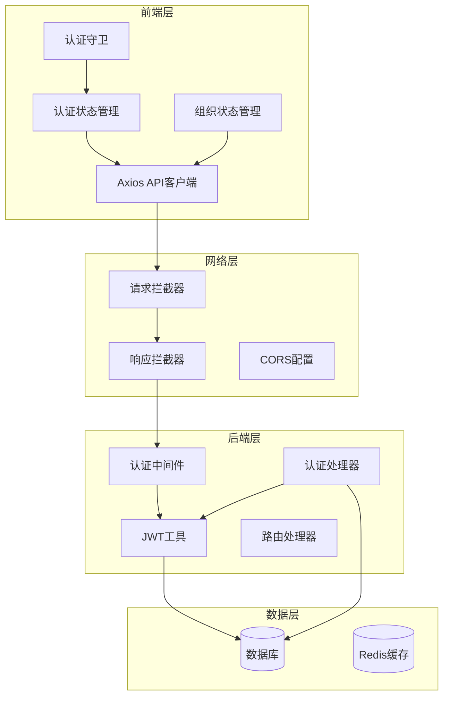
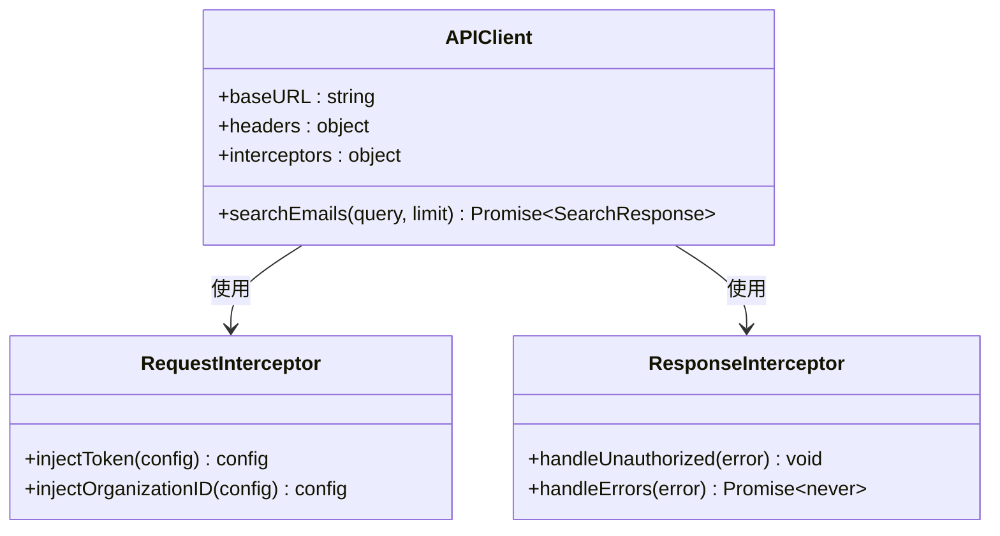
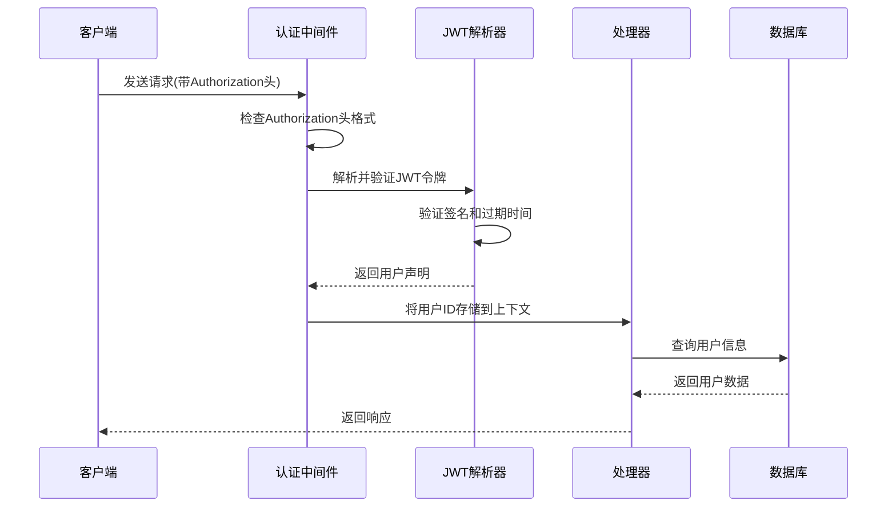
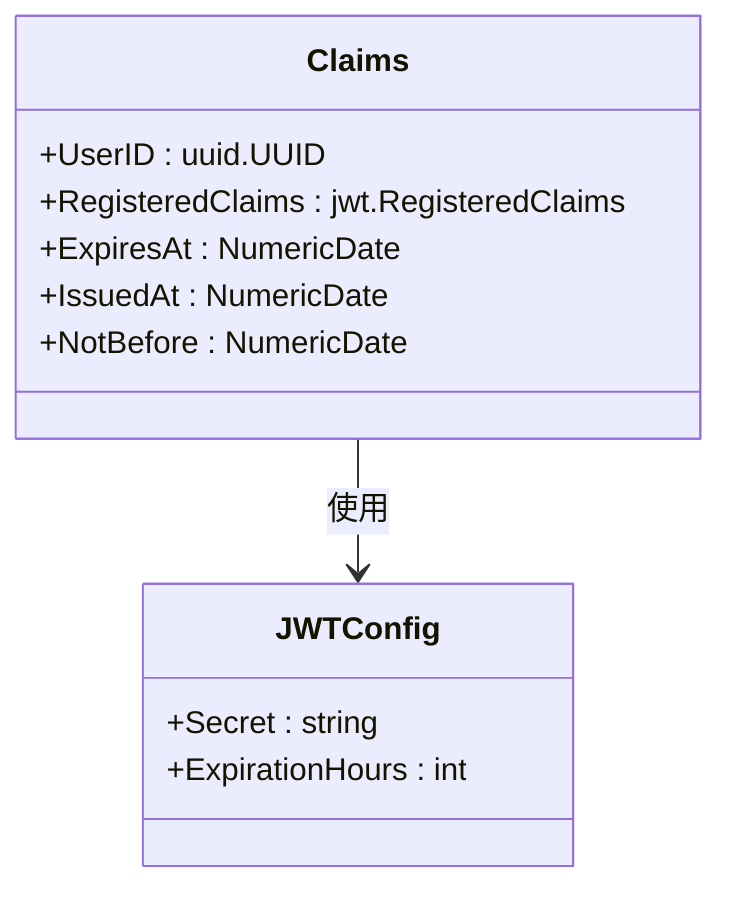
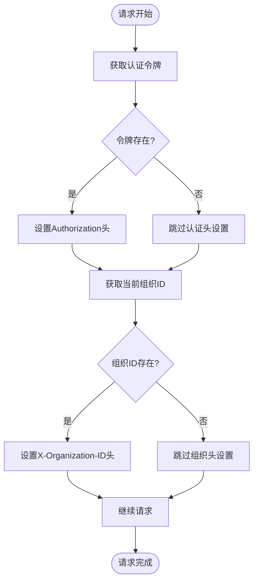
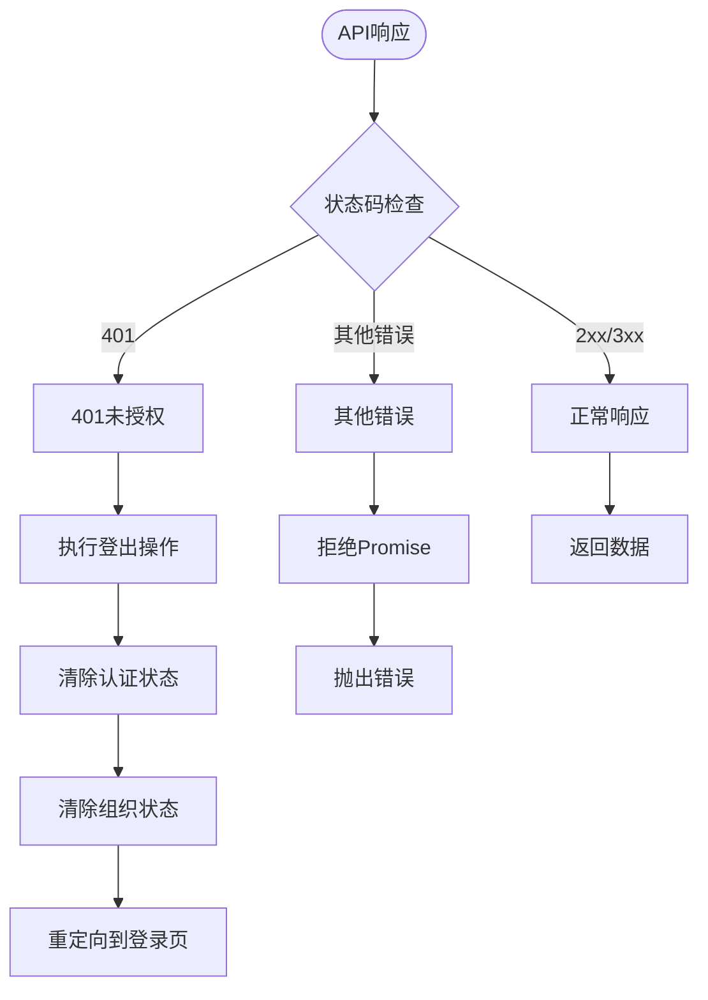
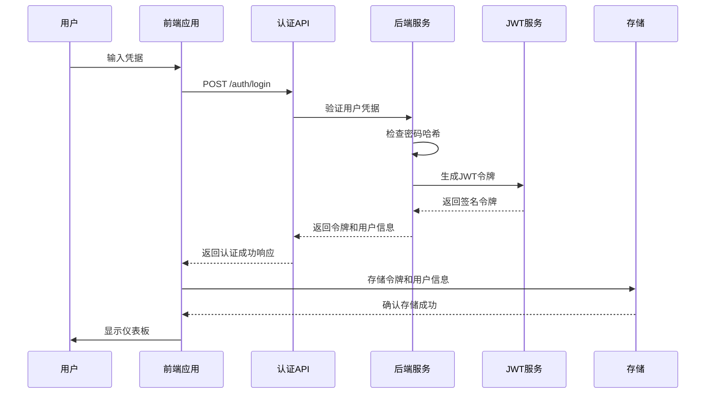
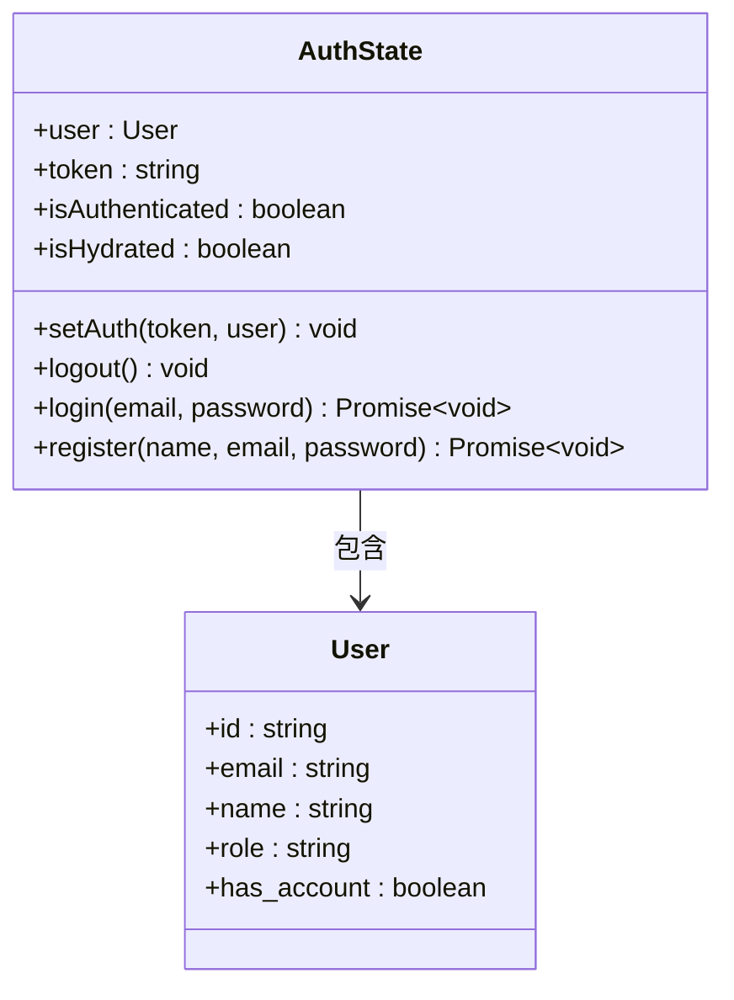
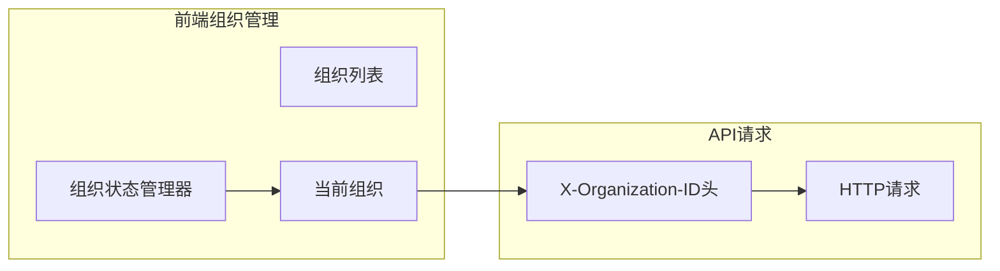

# 前后端API集成文档

<cite>
**本文档引用的文件**
- [api.ts](file://frontend/src/lib/api.ts)
- [auth.ts](file://frontend/src/store/auth.ts)
- [organization.ts](file://frontend/src/lib/store/organization.ts)
- [auth.go](file://backend/internal/middleware/auth.go)
- [jwt.go](file://backend/pkg/utils/jwt.go)
- [auth.go](file://backend/internal/handler/auth.go)
- [routes.go](file://backend/internal/router/routes.go)
- [middleware.go](file://backend/internal/router/middleware.go)
- [app_config.go](file://backend/configs/app_config.go)
- [AuthGuard.tsx](file://frontend/src/components/auth/AuthGuard.tsx)
- [AuthPageClient.tsx](file://frontend/src/app/auth/AuthPageClient.tsx)
- [actions.ts](file://frontend/src/lib/api/actions.ts)
</cite>

## 目录
1. [简介](#简介)
2. [系统架构概览](#系统架构概览)
3. [前端API客户端配置](#前端api客户端配置)
4. [后端认证中间件](#后端认证中间件)
5. [JWT令牌管理](#jwt令牌管理)
6. [API请求拦截器](#api请求拦截器)
7. [错误处理机制](#错误处理机制)
8. [认证流程详解](#认证流程详解)
9. [组织ID传递机制](#组织id传递机制)
10. [API集成最佳实践](#api集成最佳实践)
11. [故障排除指南](#故障排除指南)
12. [总结](#总结)

## 简介

本文档详细描述了EchoMind项目中前后端API集成的完整解决方案，重点介绍前端应用如何通过Axios客户端安全地与后端RESTful API进行通信。该系统采用JWT（JSON Web Token）认证机制，确保用户身份验证的安全性和可靠性。

## 系统架构概览

整个API集成系统由以下核心组件构成：



**图表来源**
- [api.ts](file://frontend/src/lib/api.ts#L1-L72)
- [auth.go](file://backend/internal/middleware/auth.go#L1-L60)
- [routes.go](file://backend/internal/router/routes.go#L1-L99)

## 前端API客户端配置

### Axios实例初始化

前端API客户端基于Axios库构建，提供了统一的HTTP请求接口。客户端配置包括基础URL设置、默认请求头和拦截器配置。



**图表来源**
- [api.ts](file://frontend/src/lib/api.ts#L5-L44)

### 基础URL配置

API客户端使用环境变量配置基础URL，支持开发和生产环境的不同配置：

- **开发环境**: `/api/v1`（本地代理）
- **生产环境**: `process.env.NEXT_PUBLIC_API_URL`（部署时配置）

### 请求头配置

客户端默认设置以下请求头：
- `Content-Type`: `application/json`
- `Authorization`: 自动注入的JWT令牌
- `X-Organization-ID`: 当前选中的组织ID

**章节来源**
- [api.ts](file://frontend/src/lib/api.ts#L5-L10)

## 后端认证中间件

### 中间件架构设计

后端认证中间件采用Gin框架的中间件模式，负责验证每个受保护请求的JWT令牌有效性。



**图表来源**
- [auth.go](file://backend/internal/middleware/auth.go#L18-L46)

### 令牌验证流程

认证中间件执行严格的令牌验证流程：

1. **头部检查**: 验证是否存在`Authorization`头
2. **格式验证**: 确认是`Bearer TOKEN`格式
3. **签名验证**: 使用密钥验证JWT签名
4. **过期检查**: 验证令牌是否已过期
5. **上下文注入**: 将用户ID存储到Gin上下文中

### 用户ID提取

中间件提供专门的函数从Gin上下文中提取用户ID：

```typescript
// Go语言实现
func GetUserIDFromContext(c *gin.Context) (uuid.UUID, bool)
```

**章节来源**
- [auth.go](file://backend/internal/middleware/auth.go#L18-L60)

## JWT令牌管理

### 令牌结构设计

JWT令牌包含以下关键信息：



**图表来源**
- [jwt.go](file://backend/pkg/utils/jwt.go#L10-L13)
- [app_config.go](file://backend/configs/app_config.go#L22-L25)

### 令牌生成过程

令牌生成过程包括以下步骤：

1. **用户ID绑定**: 将用户UUID绑定到Claims
2. **过期时间计算**: 基于配置的过期小时数计算
3. **签名生成**: 使用HS256算法和密钥签名
4. **字符串编码**: 将JWT转换为Base64字符串

### 令牌解析验证

令牌解析过程验证以下内容：

- **签名有效性**: 确保令牌未被篡改
- **时间有效性**: 检查令牌是否在有效期内
- **格式正确性**: 验证JWT格式的正确性

**章节来源**
- [jwt.go](file://backend/pkg/utils/jwt.go#L15-L51)

## API请求拦截器

### 请求拦截器配置

前端API客户端配置了两个拦截器：请求拦截器和响应拦截器。



**图表来源**
- [api.ts](file://frontend/src/lib/api.ts#L12-L25)

### 令牌自动注入

请求拦截器从认证状态管理器中获取JWT令牌，并自动将其添加到请求头中：

- **头部格式**: `Authorization: Bearer <token>`
- **状态来源**: `useAuthStore.getState().token`
- **自动刷新**: 每次请求都会重新获取最新令牌

### 组织ID传递

除了JWT令牌，请求拦截器还会自动传递当前选中的组织ID：

- **头部名称**: `X-Organization-ID`
- **状态来源**: `useOrganizationStore.getState().currentOrgId`
- **用途**: 支持多组织场景下的数据隔离

**章节来源**
- [api.ts](file://frontend/src/lib/api.ts#L12-L25)

## 错误处理机制

### 响应拦截器配置

响应拦截器专门处理API调用中的错误情况，特别是401未授权错误。



**图表来源**
- [api.ts](file://frontend/src/lib/api.ts#L29-L39)

### 401自动登出

当API返回401状态码时，响应拦截器会自动执行以下操作：

1. **调用登出函数**: `useAuthStore.getState().logout()`
2. **清除组织状态**: `useOrganizationStore.getState().clearOrganizations()`
3. **可选重定向**: 可以选择重定向到登录页面

### 错误传播

对于非401错误，拦截器会重新抛出错误，允许上层组件进行自定义错误处理。

**章节来源**
- [api.ts](file://frontend/src/lib/api.ts#L29-L39)

## 认证流程详解

### 登录流程

完整的登录流程涉及前端和后端的协作：



**图表来源**
- [AuthPageClient.tsx](file://frontend/src/app/auth/AuthPageClient.tsx#L39-L57)
- [auth.go](file://backend/internal/handler/auth.go#L71-L99)

### 注册流程

注册流程与登录类似，但包含额外的用户创建步骤：

1. **前端验证**: 验证输入数据的有效性
2. **后端创建**: 在数据库中创建新用户记录
3. **自动登录**: 注册成功后自动登录用户
4. **令牌返回**: 返回JWT令牌和用户信息

### 认证状态管理

前端使用Zustand状态管理库维护认证状态：



**图表来源**
- [auth.ts](file://frontend/src/store/auth.ts#L13-L24)

**章节来源**
- [auth.ts](file://frontend/src/store/auth.ts#L39-L67)
- [auth.go](file://backend/internal/handler/auth.go#L28-L63)

## 组织ID传递机制

### 多组织支持

系统支持多组织场景，通过组织ID实现数据隔离：



**图表来源**
- [organization.ts](file://frontend/src/lib/store/organization.ts#L13-L20)

### 组织状态管理

组织状态管理器维护以下信息：

- **组织列表**: 用户所属的所有组织
- **当前组织**: 当前选中的组织ID
- **状态持久化**: 使用localStorage持久化组织状态

### 后端组织验证

后端路由处理器可以根据组织ID过滤数据，确保用户只能访问其所属组织的数据。

**章节来源**
- [organization.ts](file://frontend/src/lib/store/organization.ts#L1-L38)

## API集成最佳实践

### 请求设计原则

1. **RESTful风格**: 使用标准HTTP方法和URL结构
2. **一致的响应格式**: 所有API返回统一格式的响应
3. **适当的HTTP状态码**: 正确使用状态码表示不同情况
4. **错误信息标准化**: 提供清晰的错误消息

### 安全考虑

1. **HTTPS强制**: 生产环境中必须使用HTTPS
2. **CORS配置**: 正确配置跨域资源共享策略
3. **令牌刷新**: 实现令牌自动刷新机制
4. **敏感数据保护**: 不在日志中记录敏感信息

### 性能优化

1. **请求合并**: 减少不必要的API调用
2. **缓存策略**: 合理使用浏览器和服务器缓存
3. **分页处理**: 对大量数据实施分页加载
4. **并发控制**: 控制同时进行的API请求数量

### 错误处理策略

1. **优雅降级**: 在API不可用时提供备用方案
2. **用户友好的错误提示**: 显示易于理解的错误信息
3. **错误上报**: 记录错误以便后续分析
4. **重试机制**: 对临时性错误实施重试

## 故障排除指南

### 常见问题及解决方案

#### 1. 401未授权错误

**症状**: API调用返回401状态码，自动登出

**可能原因**:
- JWT令牌过期
- 令牌格式不正确
- 后端JWT密钥不匹配

**解决方案**:
- 检查令牌是否在有效期内
- 验证令牌格式是否为`Bearer <token>`
- 确认前后端使用相同的JWT密钥

#### 2. CORS跨域问题

**症状**: 浏览器控制台显示CORS错误

**解决方案**:
- 检查后端CORS配置
- 确认前端请求的域名在允许列表中
- 验证预检请求是否通过

#### 3. 组织ID无效

**症状**: API调用返回403或找不到资源

**解决方案**:
- 确认当前组织ID是否有效
- 检查用户是否有权限访问该组织
- 验证组织ID格式是否正确

#### 4. 认证状态不一致

**症状**: 登录后仍然显示未认证状态

**解决方案**:
- 检查本地存储中的令牌
- 确认认证状态管理器是否正确更新
- 验证路由守卫是否正常工作

### 调试技巧

1. **浏览器开发者工具**: 查看网络请求和响应
2. **后端日志**: 检查认证中间件的日志输出
3. **状态检查**: 使用React DevTools检查状态管理器
4. **API测试**: 使用Postman等工具单独测试API

**章节来源**
- [api.ts](file://frontend/src/lib/api.ts#L29-L39)
- [AuthGuard.tsx](file://frontend/src/components/auth/AuthGuard.tsx#L77-L81)

## 总结

EchoMind项目的前后端API集成为现代Web应用提供了完整的认证和授权解决方案。通过JWT令牌机制、请求拦截器、响应拦截器和状态管理的协同工作，系统实现了：

1. **安全性**: 强大的JWT认证机制确保用户身份验证的安全性
2. **可靠性**: 完善的错误处理和自动登出机制提高系统稳定性
3. **易用性**: 统一的API接口简化了前端开发复杂度
4. **扩展性**: 模块化的架构设计便于功能扩展和维护

该集成方案不仅满足了当前的功能需求，还为未来的功能扩展奠定了坚实的基础。开发者可以基于现有的架构快速添加新的API端点和认证功能，确保系统的持续演进和发展。