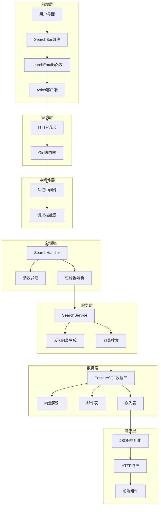

# 同步请求流

<cite>
**本文档中引用的文件**
- [frontend/src/lib/api.ts](file://frontend/src/lib/api.ts)
- [backend/internal/router/routes.go](file://backend/internal/router/routes.go)
- [backend/internal/handler/search.go](file://backend/internal/handler/search.go)
- [backend/internal/service/search.go](file://backend/internal/service/search.go)
- [backend/internal/middleware/auth.go](file://backend/internal/middleware/auth.go)
- [backend/internal/app/container.go](file://backend/internal/app/container.go)
- [backend/internal/model/email.go](file://backend/internal/model/email.go)
- [backend/internal/model/embedding.go](file://backend/internal/model/embedding.go)
- [frontend/tests/e2e/search.spec.ts](file://frontend/tests/e2e/search.spec.ts)
</cite>

## 目录
1. [简介](#简介)
2. [系统架构概览](#系统架构概览)
3. [前端请求发起](#前端请求发起)
4. [后端路由处理](#后端路由处理)
5. [认证中间件验证](#认证中间件验证)
6. [搜索处理器逻辑](#搜索处理器逻辑)
7. [搜索服务执行](#搜索服务执行)
8. [数据库查询与向量搜索](#数据库查询与向量搜索)
9. [响应序列化与返回](#响应序列化与返回)
10. [错误处理机制](#错误处理机制)
11. [性能优化考虑](#性能优化考虑)
12. [总结](#总结)

## 简介

本文档详细描述了从前端用户发起搜索请求到后端处理并返回结果的完整同步请求流程。该流程涉及前端API客户端、Gin路由器、认证中间件、搜索处理器、搜索服务以及数据库层的协同工作，实现了基于向量相似度的智能邮件搜索功能。

## 系统架构概览

整个搜索请求流程遵循RESTful API设计原则，采用分层架构模式，确保了系统的可维护性和扩展性。

**图表来源**
- [frontend/src/lib/api.ts](file://frontend/src/lib/api.ts#L63-L70)
- [backend/internal/router/routes.go](file://backend/internal/router/routes.go#L69)
- [backend/internal/handler/search.go](file://backend/internal/handler/search.go#L32-L127)
- [backend/internal/service/search.go](file://backend/internal/service/search.go#L45-L105)

## 前端请求发起

前端通过专门的API模块发起搜索请求，该模块基于Axios客户端构建，提供了类型安全的接口和统一的错误处理机制。

### Axios客户端配置

前端API客户端配置了基础URL、内容类型头以及认证令牌自动注入功能。客户端还包含了全局的请求拦截器和响应拦截器，用于处理认证状态和错误重定向。

### searchEmails函数实现

搜索函数接收查询字符串和可选的限制参数，通过GET请求发送到后端API。该函数返回Promise，包含标准化的搜索响应格式。

**章节来源**
- [frontend/src/lib/api.ts](file://frontend/src/lib/api.ts#L1-L72)

## 后端路由处理

Gin路由器负责将传入的HTTP请求路由到相应的处理器。搜索请求通过"/api/v1/search"端点进行处理，该端点受到认证中间件的保护。

### 路由注册机制

路由系统采用分组方式组织API端点，公共路由和受保护路由分别处理不同的访问级别。搜索端点位于受保护路由组中，需要有效的认证令牌才能访问。

### 请求参数提取

路由处理器从查询字符串中提取必要的参数，包括搜索查询、限制数量以及各种过滤条件。这些参数经过验证后传递给处理函数。

**章节来源**
- [backend/internal/router/routes.go](file://backend/internal/router/routes.go#L69)

## 认证中间件验证

认证中间件是系统安全的第一道防线，负责验证请求的合法性并提取用户身份信息。

### JWT令牌验证

中间件检查Authorization头部，验证Bearer令牌的有效性。令牌包含用户标识符，该信息存储在Gin上下文中供后续处理使用。

### 用户身份提取

通过预定义的上下文键名，中间件将用户UUID存储在请求上下文中。这个用户标识符在整个处理流程中被用来确保请求的合法性和数据隔离。

**章节来源**
- [backend/internal/middleware/auth.go](file://backend/internal/middleware/auth.go#L18-L60)

## 搜索处理器逻辑

SearchHandler是搜索功能的核心控制器，负责协调整个搜索过程的各个阶段。

### 请求验证与准备

处理器首先验证用户认证状态，然后从上下文中提取用户ID。接着解析查询参数，包括必需的搜索查询和可选的过滤条件。

### 参数解析与验证

处理器支持多种过滤条件，包括发件人、时间范围和上下文ID。每个参数都经过适当的验证和转换，确保数据的完整性和安全性。

### 错误处理机制

如果任何验证步骤失败，处理器立即返回相应的HTTP状态码和错误信息，终止处理流程。

**章节来源**
- [backend/internal/handler/search.go](file://backend/internal/handler/search.go#L32-L127)

## 搜索服务执行

SearchService是搜索功能的核心业务逻辑实现，负责将自然语言查询转换为向量表示并执行相似度搜索。

### 查询向量化

服务首先使用嵌入提供者将用户查询转换为高维向量表示。这个向量捕获了查询的语义含义，使得后续的相似度计算成为可能。

### 动态SQL构建

为了支持灵活的搜索条件，服务动态构建SQL查询。根据提供的过滤器，查询会自动添加相应的JOIN和WHERE子句。

### 向量相似度计算

利用PostgreSQL的向量扩展，服务执行高效的向量相似度搜索。使用余弦距离计算邮件内容与查询向量之间的相似度。

**章节来源**
- [backend/internal/service/search.go](file://backend/internal/service/search.go#L45-L105)

## 数据库查询与向量搜索

数据库层实现了高性能的向量搜索功能，利用PostgreSQL的向量扩展和HNSW索引提供快速的相似度匹配。

### 表结构设计

邮件和嵌入数据分别存储在独立的表中，通过外键关联。嵌入表包含文本块内容和对应的向量表示，支持多维度的语义搜索。

### 索引优化

数据库创建了专门的HNSW向量索引，支持高效的近似最近邻搜索。这种索引结构在保持搜索精度的同时显著提升了查询性能。

### 查询执行

最终的查询结合了向量相似度和各种业务过滤条件，返回最相关的搜索结果。查询结果按照相似度得分排序，确保最佳的用户体验。

**章节来源**
- [backend/internal/model/email.go](file://backend/internal/model/email.go#L1-L37)
- [backend/internal/model/embedding.go](file://backend/internal/model/embedding.go#L1-L25)

## 响应序列化与返回

处理器将搜索结果序列化为标准化的JSON格式，包含查询信息、结果列表和统计信息。

### 结果格式化

每个搜索结果包含邮件ID、主题、摘要、发件人、日期和相似度得分。这些字段经过精心选择，既保证了信息的完整性又控制了响应大小。

### 性能监控

处理器记录搜索操作的执行时间和性能指标，便于后续的性能分析和优化。

### HTTP状态码

根据处理结果的不同，返回相应的HTTP状态码：成功时返回200 OK，缺少必要参数时返回400 Bad Request，认证失败时返回401 Unauthorized。

**章节来源**
- [backend/internal/handler/search.go](file://backend/internal/handler/search.go#L122-L127)

## 错误处理机制

系统实现了多层次的错误处理机制，确保异常情况得到妥善处理并向用户提供清晰的反馈。

### 分层错误处理

前端、中间件、处理器和服务层各自负责不同层次的错误处理。前端处理网络错误和解析错误，后端处理业务逻辑错误和数据库错误。

### 日志记录

所有错误都会被记录到日志系统中，包含详细的上下文信息和堆栈跟踪，便于问题诊断和系统监控。

### 安全考虑

敏感信息不会在错误消息中暴露，防止潜在的安全风险。同时，认证失败的情况会触发自动登出机制。

**章节来源**
- [frontend/src/lib/api.ts](file://frontend/src/lib/api.ts#L29-L39)
- [backend/internal/handler/search.go](file://backend/internal/handler/search.go#L38-L47)

## 性能优化考虑

整个搜索流程在多个层面进行了性能优化，确保系统能够处理大量并发请求和大规模数据集。

### 并发控制

系统使用连接池管理数据库连接，避免频繁的连接建立和销毁开销。同时，嵌入向量生成操作设置了合理的超时时间。

### 缓存策略

虽然当前实现没有显式的缓存层，但向量索引的存在大大减少了重复计算的需求。未来可以考虑引入查询结果缓存来进一步提升性能。

### 扩展性设计

系统采用微服务架构风格，各组件职责明确，便于独立扩展和优化。数据库层面的向量索引支持水平扩展，适应不断增长的数据规模。

## 总结

整个同步请求流展示了现代Web应用中复杂搜索功能的完整实现。从前端的用户交互到后端的向量搜索，每个环节都经过精心设计和优化。该系统不仅提供了强大的搜索能力，还具备良好的可维护性、可扩展性和安全性。

通过这种分层架构和模块化设计，系统能够轻松应对业务需求的变化和技术演进的要求。同时，完善的错误处理和性能监控机制确保了系统的稳定运行和优秀的用户体验。