# 数据流与系统集成

<cite>
**本文档中引用的文件**
- [backend/internal/event/email_events.go](file://backend/internal/event/email_events.go)
- [backend/internal/listener/email_listeners.go](file://backend/internal/listener/email_listeners.go)
- [backend/pkg/event/bus/bus.go](file://backend/pkg/event/bus/bus.go)
- [backend/cmd/worker/main.go](file://backend/cmd/worker/main.go)
- [backend/internal/tasks/analyze.go](file://backend/internal/tasks/analyze.go)
- [backend/internal/tasks/sync.go](file://backend/internal/tasks/sync.go)
- [backend/internal/service/sync.go](file://backend/internal/service/sync.go)
- [backend/internal/handler/sync.go](file://backend/internal/handler/sync.go)
- [backend/internal/router/routes.go](file://backend/internal/router/routes.go)
- [backend/internal/app/container.go](file://backend/internal/app/container.go)
- [backend/internal/service/email.go](file://backend/internal/service/email.go)
- [backend/internal/model/email.go](file://backend/internal/model/email.go)
- [backend/configs/app_config.go](file://backend/configs/app_config.go)
- [frontend/src/lib/api.ts](file://frontend/src/lib/api.ts)
- [frontend/src/lib/api/emails.ts](file://frontend/src/lib/api/emails.ts)
- [frontend/src/hooks/useAIReply.ts](file://frontend/src/hooks/useAIReply.ts)
</cite>

## 目录
1. [概述](#概述)
2. [系统架构概览](#系统架构概览)
3. [事件驱动架构](#事件驱动架构)
4. [Asynq任务队列系统](#asynq任务队列系统)
5. [前端API集成](#前端api集成)
6. [完整数据流分析](#完整数据流分析)
7. [高并发与异步处理](#高并发与异步处理)
8. [数据一致性保障](#数据一致性保障)
9. [故障处理与监控](#故障处理与监控)
10. [总结](#总结)

## 概述

EchoMind是一个基于事件驱动架构的智能邮件管理系统，采用前后端分离设计，通过异步任务队列处理耗时操作，实现了高效的邮件同步、分析和智能处理功能。系统的核心特点包括：

- **事件驱动架构**：基于发布-订阅模式的事件总线系统
- **异步任务处理**：使用Asynq队列处理邮件分析、嵌入生成等耗时任务
- **微服务化设计**：清晰的职责分离和模块化架构
- **高并发支持**：通过多worker并发处理提升系统吞吐量
- **数据一致性**：完善的错误处理和重试机制

## 系统架构概览

EchoMind采用分层架构设计，包含前端应用、后端API服务、事件总线和任务队列四个主要层次。

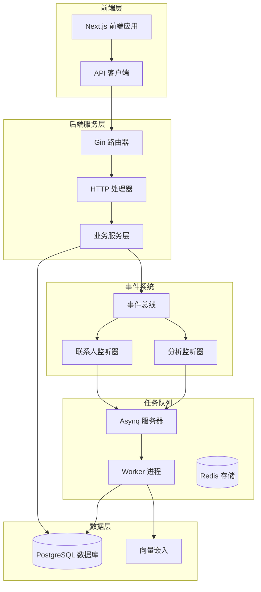

**图表来源**
- [backend/internal/router/routes.go](file://backend/internal/router/routes.go#L27-L98)
- [backend/internal/app/container.go](file://backend/internal/app/container.go#L15-L122)
- [backend/cmd/worker/main.go](file://backend/cmd/worker/main.go#L41-L108)

**章节来源**
- [backend/internal/router/routes.go](file://backend/internal/router/routes.go#L1-L99)
- [backend/internal/app/container.go](file://backend/internal/app/container.go#L1-L122)

## 事件驱动架构

### EmailSyncedEvent事件定义

系统的核心事件是`EmailSyncedEvent`，当邮件成功同步完成后触发该事件。

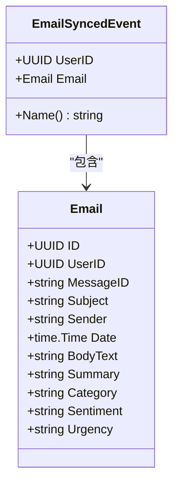

**图表来源**
- [backend/internal/event/email_events.go](file://backend/internal/event/email_events.go#L11-L19)
- [backend/internal/model/email.go](file://backend/internal/model/email.go#L12-L36)

### 事件总线实现

事件总线采用内存实现，支持同步事件发布和监听器注册。

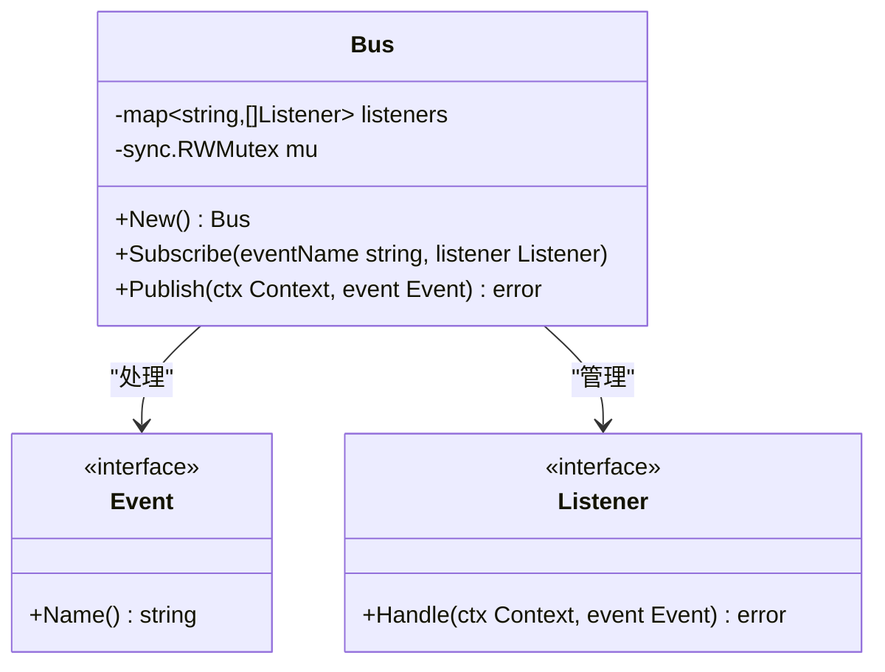

**图表来源**
- [backend/pkg/event/bus/bus.go](file://backend/pkg/event/bus.go#L25-L62)

### 监听器系统

系统包含两个核心监听器：分析监听器和联系人监听器。

#### 分析监听器（AnalysisListener）

负责处理邮件分析任务的异步执行：

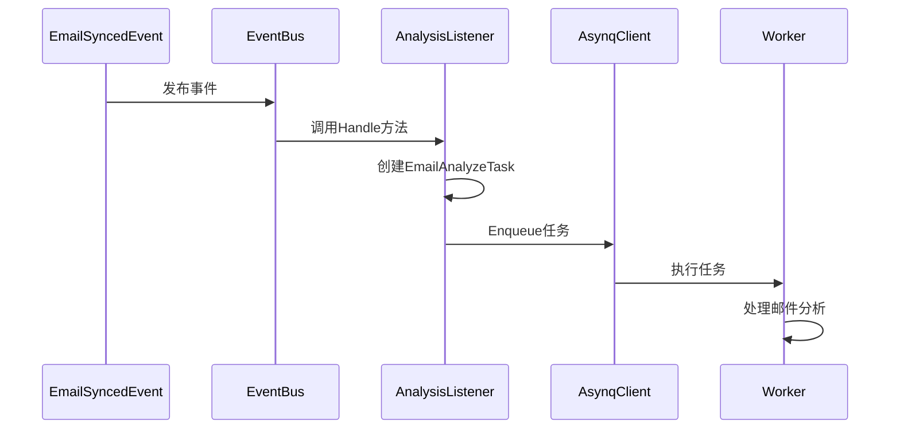

**图表来源**
- [backend/internal/listener/email_listeners.go](file://backend/internal/listener/email_listeners.go#L35-L65)
- [backend/internal/tasks/analyze.go](file://backend/internal/tasks/analyze.go#L55-L183)

#### 联系人监听器（ContactListener）

负责更新联系人信息和统计：

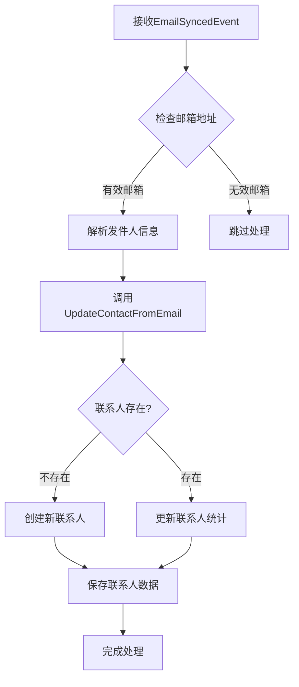

**图表来源**
- [backend/internal/listener/email_listeners.go](file://backend/internal/listener/email_listeners.go#L81-L101)

**章节来源**
- [backend/internal/event/email_events.go](file://backend/internal/event/email_events.go#L1-L19)
- [backend/pkg/event/bus/bus.go](file://backend/pkg/event/bus.go#L1-L63)
- [backend/internal/listener/email_listeners.go](file://backend/internal/listener/email_listeners.go#L1-L116)

## Asynq任务队列系统

### 任务类型与结构

系统定义了两种主要的任务类型：

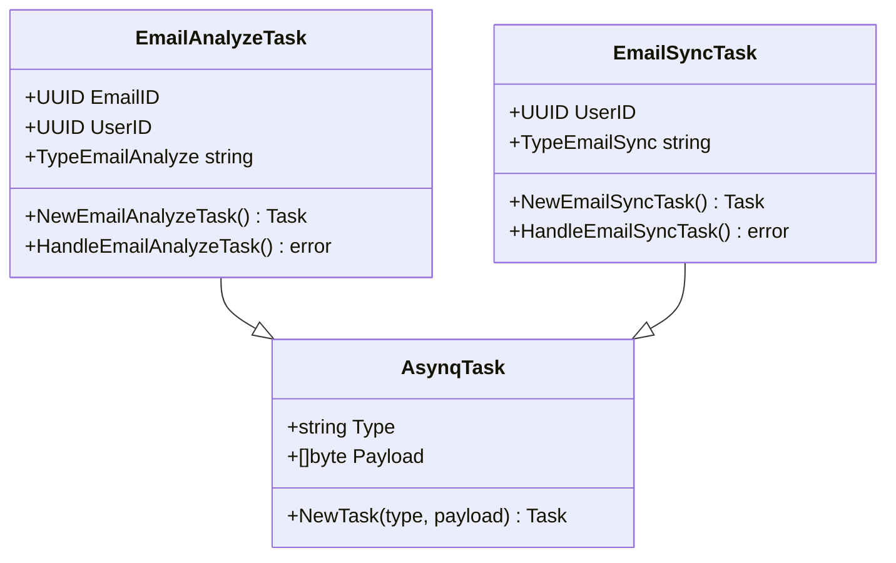

**图表来源**
- [backend/internal/tasks/analyze.go](file://backend/internal/tasks/analyze.go#L24-L35)
- [backend/internal/tasks/sync.go](file://backend/internal/tasks/sync.go#L17-L32)

### Worker进程架构

Worker进程负责处理所有异步任务，支持并发执行：

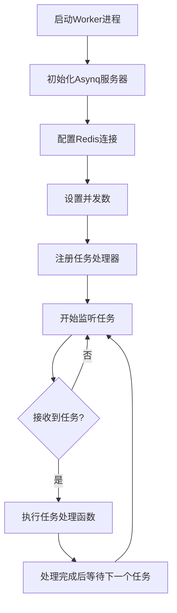

**图表来源**
- [backend/cmd/worker/main.go](file://backend/cmd/worker/main.go#L41-L108)

### 任务处理流程

#### 邮件分析任务处理

邮件分析任务包含多个步骤，每个步骤都有详细的错误处理：

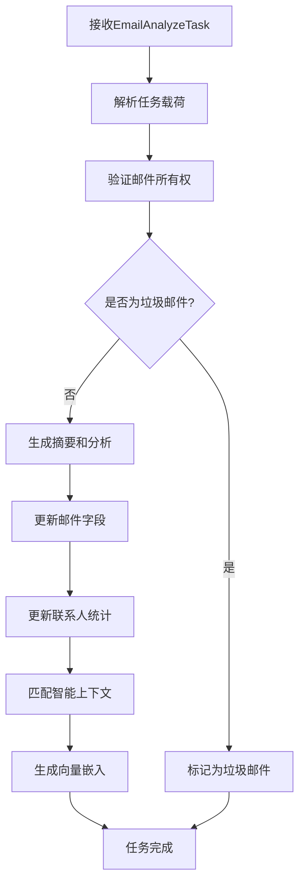

**图表来源**
- [backend/internal/tasks/analyze.go](file://backend/internal/tasks/analyze.go#L56-L183)

#### 邮件同步任务处理

邮件同步任务负责从IMAP服务器获取新邮件：

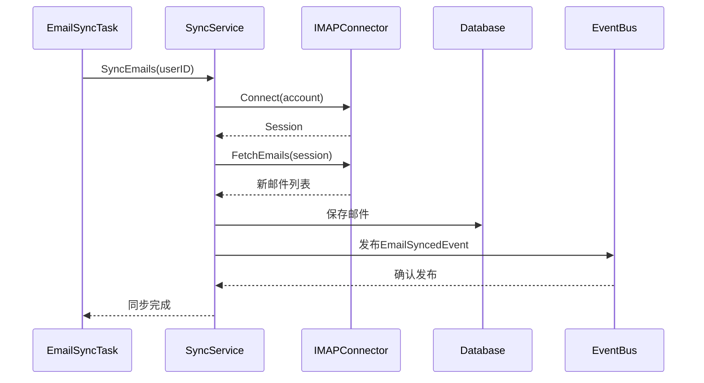

**图表来源**
- [backend/internal/tasks/sync.go](file://backend/internal/tasks/sync.go#L35-L53)
- [backend/internal/service/sync.go](file://backend/internal/service/sync.go#L104-L156)

**章节来源**
- [backend/cmd/worker/main.go](file://backend/cmd/worker/main.go#L1-L109)
- [backend/internal/tasks/analyze.go](file://backend/internal/tasks/analyze.go#L1-L260)
- [backend/internal/tasks/sync.go](file://backend/internal/tasks/sync.go#L1-L54)

## 前端API集成

### API客户端架构

前端使用Axios构建API客户端，提供统一的HTTP请求接口：

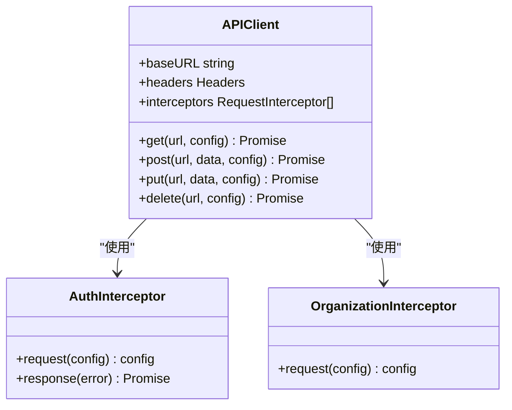

**图表来源**
- [frontend/src/lib/api.ts](file://frontend/src/lib/api.ts#L1-L72)

### 邮件API接口

前端提供了完整的邮件操作API：

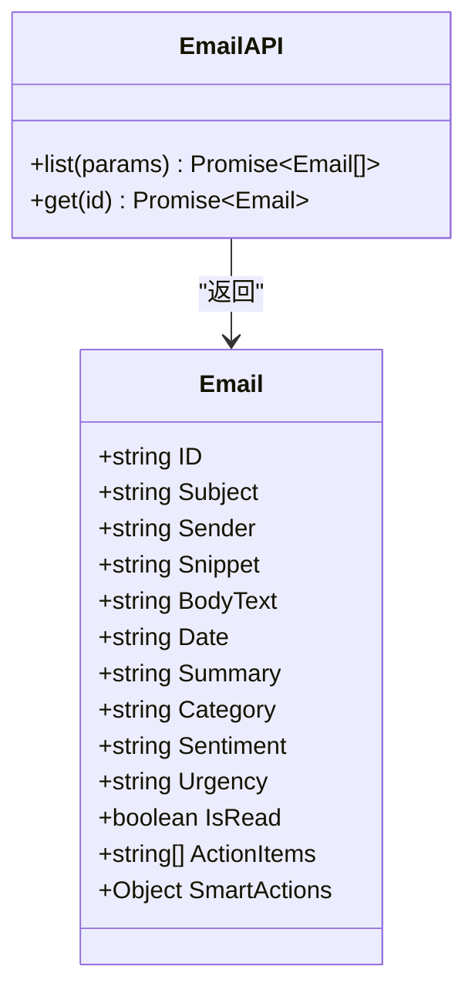

**图表来源**
- [frontend/src/lib/api/emails.ts](file://frontend/src/lib/api/emails.ts#L1-L30)

### React Hook集成

使用React Query构建响应式的API调用：

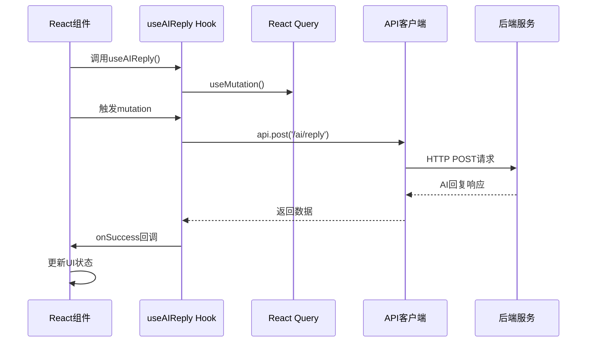

**图表来源**
- [frontend/src/hooks/useAIReply.ts](file://frontend/src/hooks/useAIReply.ts#L17-L32)

**章节来源**
- [frontend/src/lib/api.ts](file://frontend/src/lib/api.ts#L1-L72)
- [frontend/src/lib/api/emails.ts](file://frontend/src/lib/api/emails.ts#L1-L30)
- [frontend/src/hooks/useAIReply.ts](file://frontend/src/hooks/useAIReply.ts#L1-L33)

## 完整数据流分析

### 用户发起邮件同步请求

从用户在前端点击同步按钮开始，到邮件分析完成的完整数据流：

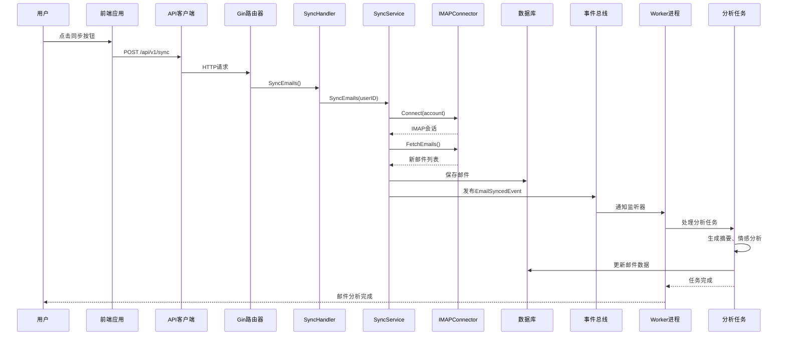

**图表来源**
- [backend/internal/handler/sync.go](file://backend/internal/handler/sync.go#L25-L58)
- [backend/internal/service/sync.go](file://backend/internal/service/sync.go#L104-L156)
- [backend/internal/tasks/analyze.go](file://backend/internal/tasks/analyze.go#L56-L183)

### 邮件分析处理流程

详细的邮件分析处理步骤：

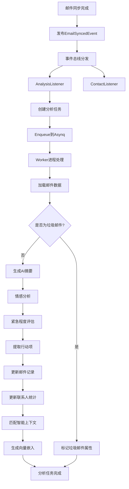

**图表来源**
- [backend/internal/listener/email_listeners.go](file://backend/internal/listener/email_listeners.go#L35-L65)
- [backend/internal/tasks/analyze.go](file://backend/internal/tasks/analyze.go#L56-L183)

**章节来源**
- [backend/internal/handler/sync.go](file://backend/internal/handler/sync.go#L1-L59)
- [backend/internal/service/sync.go](file://backend/internal/service/sync.go#L1-L178)

## 高并发与异步处理

### 并发控制机制

系统通过多层并发控制确保高并发场景下的稳定性：

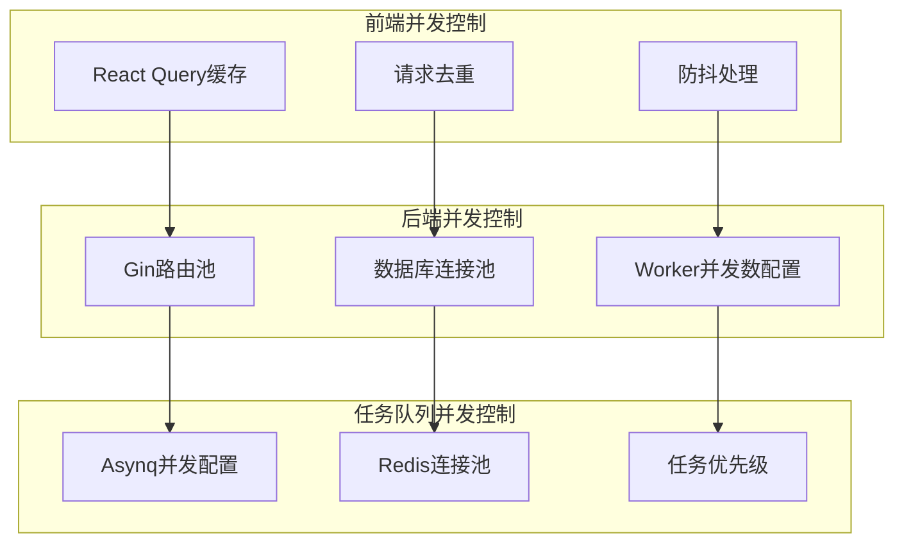

**图表来源**
- [backend/configs/app_config.go](file://backend/configs/app_config.go#L31-L33)
- [backend/cmd/worker/main.go](file://backend/cmd/worker/main.go#L60-L61)

### 性能优化策略

#### 批量处理

系统采用批量处理策略提升性能：

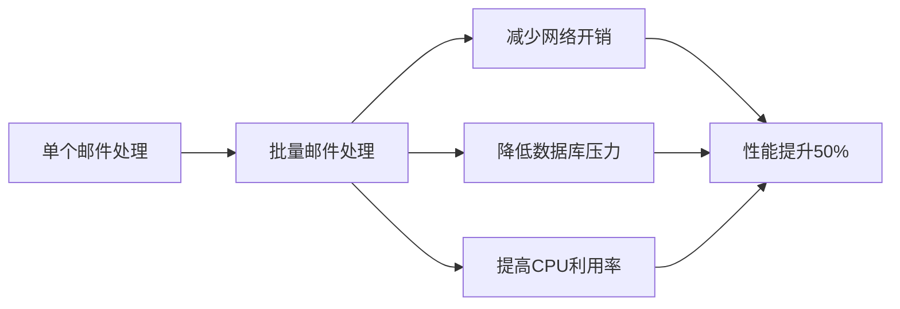

#### 缓存策略

- **Redis缓存**：存储用户会话、配置信息
- **数据库查询缓存**：缓存频繁查询的结果
- **向量嵌入缓存**：避免重复计算

### 错误处理与重试机制

系统实现了完善的错误处理和重试机制：

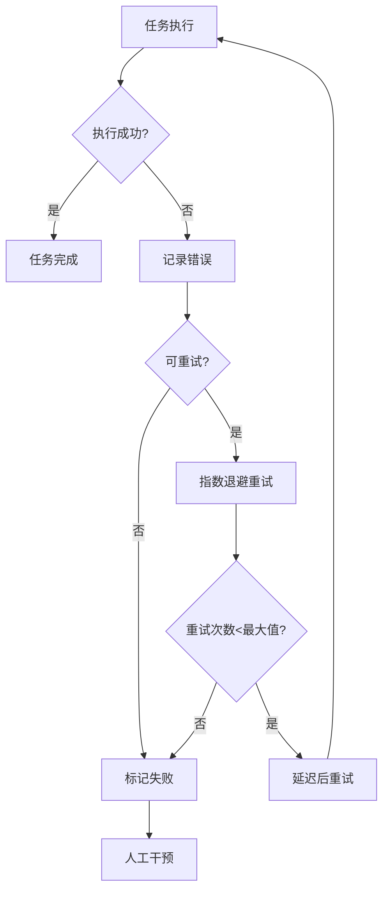

**章节来源**
- [backend/configs/app_config.go](file://backend/configs/app_config.go#L1-L66)
- [backend/cmd/worker/main.go](file://backend/cmd/worker/main.go#L41-L108)

## 数据一致性保障

### ACID特性保证

系统通过多种机制确保数据一致性：

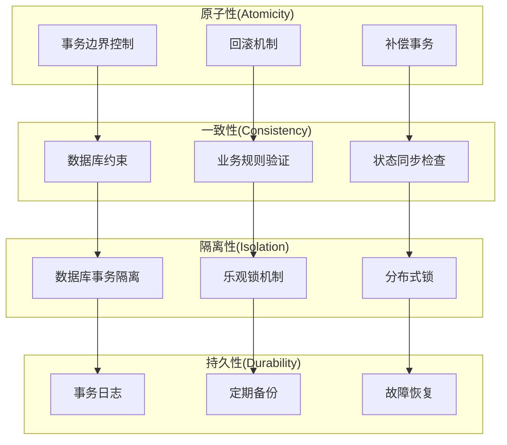

### 事件溯源与最终一致性

系统采用事件溯源模式，确保最终一致性：

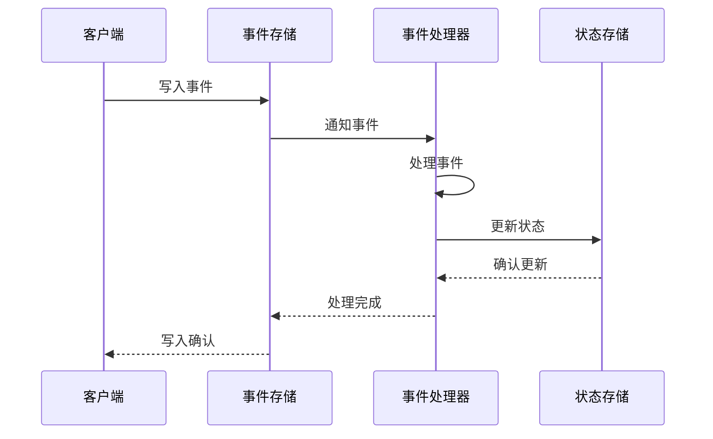

### 数据同步机制

#### 实时同步

- **事件驱动**：通过事件总线实现实时通知
- **即时响应**：监听器立即处理相关事件
- **状态同步**：确保各组件状态一致

#### 批量同步

- **定时任务**：定期执行批量数据同步
- **增量更新**：只同步变化的数据
- **冲突解决**：处理并发更新冲突

**章节来源**
- [backend/internal/service/sync.go](file://backend/internal/service/sync.go#L104-L156)
- [backend/internal/tasks/analyze.go](file://backend/internal/tasks/analyze.go#L56-L183)

## 故障处理与监控

### 监控指标体系

系统建立了全面的监控指标体系：

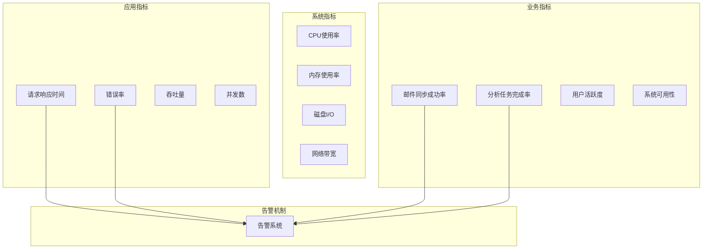

### 故障恢复策略

#### 自动恢复

- **健康检查**：定期检查系统组件状态
- **自动重启**：异常组件自动重启
- **流量切换**：故障实例流量自动切换

#### 人工干预

- **故障报告**：详细的故障信息记录
- **运维界面**：可视化的运维管理界面
- **应急响应**：标准化的应急响应流程

### 日志与追踪

系统实现了完整的日志和分布式追踪体系：

```mermaid
flowchart TD
A[用户请求] --> B[请求日志]
B --> C[分布式追踪ID]
C --> D[中间件处理]
D --> E[业务逻辑]
E --> F[数据库操作]
F --> G[外部服务调用]
G --> H[响应处理]
H --> I[响应日志]
B --> J[日志聚合]
C --> K[链路追踪]
E --> L[性能监控]
F --> M[SQL监控]
G --> N[API监控]
```

**章节来源**
- [backend/cmd/worker/main.go](file://backend/cmd/worker/main.go#L16-L40)
- [backend/internal/tasks/analyze.go](file://backend/internal/tasks/analyze.go#L57-L82)

## 总结

EchoMind通过精心设计的事件驱动架构和异步任务队列系统，实现了高效、可靠的智能邮件管理功能。系统的主要优势包括：

### 架构优势

- **松耦合设计**：事件驱动架构实现了组件间的松耦合
- **高扩展性**：模块化设计便于功能扩展和维护
- **高性能**：异步处理和并发控制确保系统高性能

### 技术特色

- **事件总线**：简洁高效的事件发布-订阅机制
- **任务队列**：可靠的异步任务处理系统
- **数据一致性**：多重保障机制确保数据完整性

### 应用价值

- **用户体验**：快速响应和流畅的操作体验
- **系统稳定**：完善的错误处理和故障恢复机制
- **开发效率**：清晰的架构设计降低开发复杂度

该系统为现代企业邮件管理提供了完整的解决方案，具备良好的可扩展性和维护性，能够满足大规模企业用户的复杂需求。通过持续的优化和改进，系统将在智能化邮件管理领域发挥更大的作用。