# 架构设计

<cite>
**本文档中引用的文件**
- [main.go](file://backend/cmd/main.go)
- [container.go](file://backend/internal/app/container.go)
- [app.go](file://backend/internal/bootstrap/app.go)
- [routes.go](file://backend/internal/router/routes.go)
- [middleware.go](file://backend/internal/router/middleware.go)
- [email_events.go](file://backend/internal/event/email_events.go)
- [bus.go](file://backend/pkg/event/bus/bus.go)
- [email_listeners.go](file://backend/internal/listener/email_listeners.go)
- [worker_main.go](file://backend/cmd/worker/main.go)
- [sync.go](file://backend/internal/service/sync.go)
- [email.go](file://backend/internal/model/email.go)
- [analyze.go](file://backend/internal/tasks/analyze.go)
- [api.ts](file://frontend/src/lib/api.ts)
- [layout.tsx](file://frontend/src/app/layout.tsx)
- [QueryClientProvider.tsx](file://frontend/src/components/providers/QueryClientProvider.tsx)
</cite>

## 目录
1. [项目概述](#项目概述)
2. [系统架构总览](#系统架构总览)
3. [分层架构设计](#分层架构设计)
4. [依赖注入容器](#依赖注入容器)
5. [应用启动流程](#应用启动流程)
6. [事件驱动架构](#事件驱动架构)
7. [任务队列系统](#任务队列系统)
8. [前后端交互机制](#前后端交互机制)
9. [数据流和控制流](#数据流和控制流)
10. [性能优化策略](#性能优化策略)
11. [总结](#总结)

## 项目概述

EchoMind是一个基于人工智能的企业邮箱管理平台，采用现代化的微服务架构设计。系统通过Go语言构建后端服务，使用Next.js开发前端应用，实现了智能邮件分析、上下文管理、任务自动化等核心功能。

### 核心特性
- **智能邮件分析**：基于AI的邮件内容分析、情感识别、紧急程度评估
- **上下文管理**：智能上下文匹配和邮件分类
- **任务自动化**：异步任务处理和事件驱动架构
- **实时交互**：支持实时聊天和搜索功能
- **多租户支持**：组织和团队级别的权限管理

## 系统架构总览

EchoMind采用分层架构设计，结合事件驱动和微服务模式，确保系统的可扩展性和可维护性。

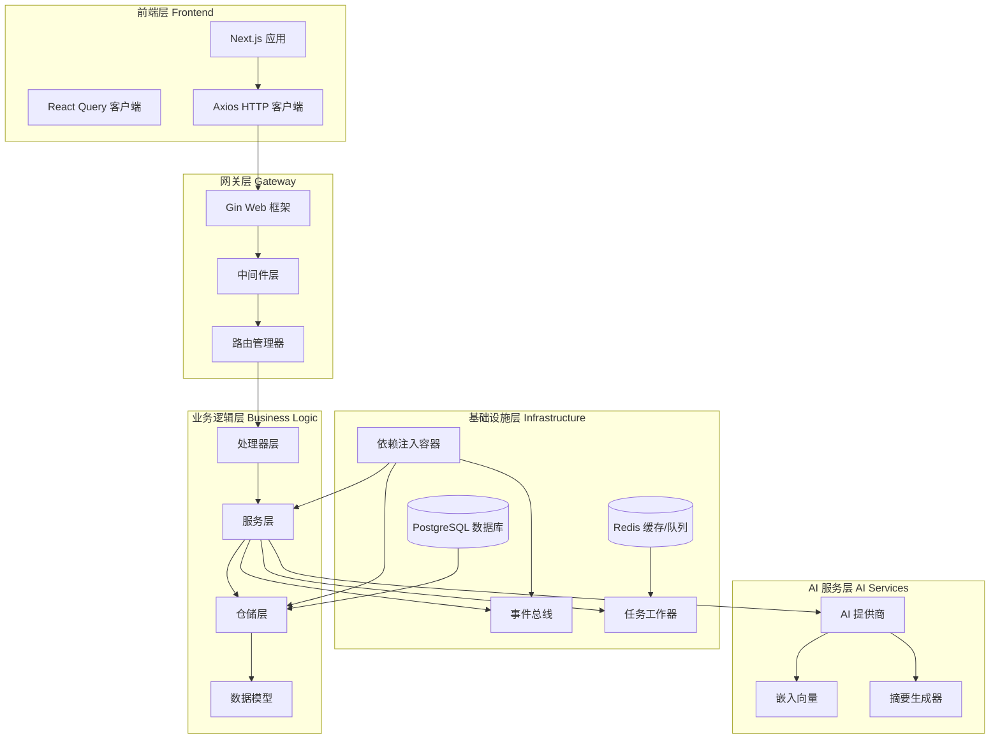

**图表来源**
- [main.go](file://backend/cmd/main.go#L22-L137)
- [container.go](file://backend/internal/app/container.go#L31-L122)
- [routes.go](file://backend/internal/router/routes.go#L26-L99)

## 分层架构设计

EchoMind采用经典的分层架构模式，每层都有明确的职责和边界。

### 处理器层 (Handler Layer)

处理器层负责HTTP请求的接收和响应，是系统的入口点。

```mermaid
classDiagram
class HealthHandler {
+HealthCheck(c *gin.Context)
}
class AuthHandler {
+Register(c *gin.Context)
+Login(c *gin.Context)
+UpdateUserProfile(c *gin.Context)
}
class EmailHandler {
+ListEmails(c *gin.Context)
+GetEmail(c *gin.Context)
+DeleteAllEmails(c *gin.Context)
}
class ChatHandler {
+StreamChat(c *gin.Context)
}
class TaskHandler {
+CreateTask(c *gin.Context)
+ListTasks(c *gin.Context)
+UpdateTask(c *gin.Context)
}
HandlerBase[处理器基类]
HealthHandler --|> HandlerBase
AuthHandler --|> HandlerBase
EmailHandler --|> HandlerBase
ChatHandler --|> HandlerBase
TaskHandler --|> HandlerBase
```

**图表来源**
- [routes.go](file://backend/internal/router/routes.go#L8-L24)

### 服务层 (Service Layer)

服务层包含业务逻辑的核心实现，负责协调各个组件的工作。

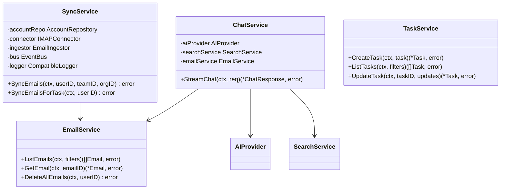

**图表来源**
- [sync.go](file://backend/internal/service/sync.go#L78-L178)

### 仓储层 (Repository Layer)

仓储层负责数据访问，提供抽象的数据操作接口。

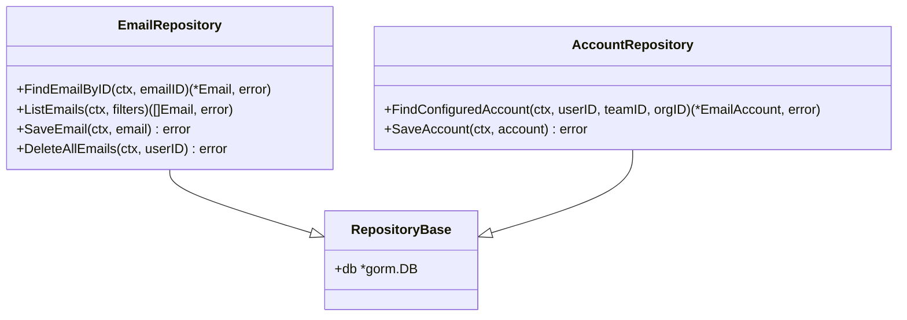

### 模型层 (Model Layer)

模型层定义了数据结构和数据库映射关系。

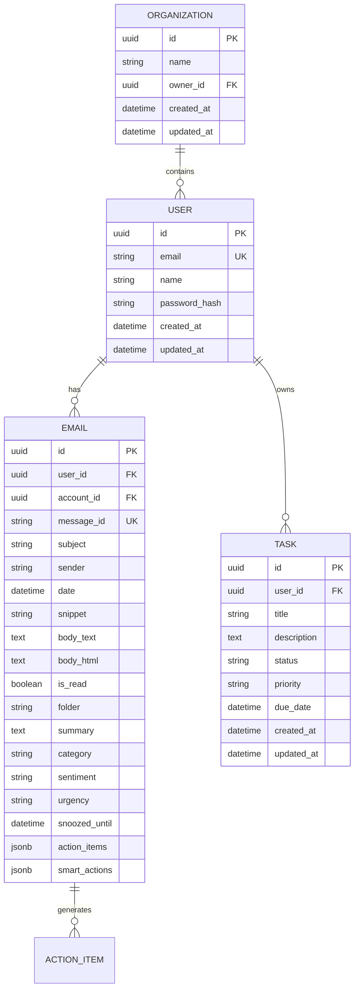

**图表来源**
- [email.go](file://backend/internal/model/email.go#L11-L37)

**章节来源**
- [main.go](file://backend/cmd/main.go#L40-L84)
- [sync.go](file://backend/internal/service/sync.go#L78-L102)

## 依赖注入容器

EchoMind使用自定义的依赖注入容器来管理组件间的依赖关系，确保松耦合和高可测试性。

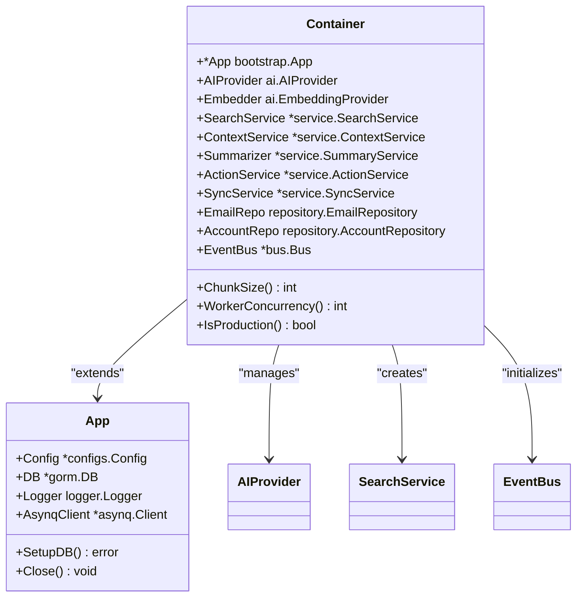

**图表来源**
- [container.go](file://backend/internal/app/container.go#L15-L29)
- [app.go](file://backend/internal/bootstrap/app.go#L17-L22)

### 容器初始化流程

容器的初始化过程遵循依赖倒置原则，确保高层模块不依赖低层模块的具体实现。

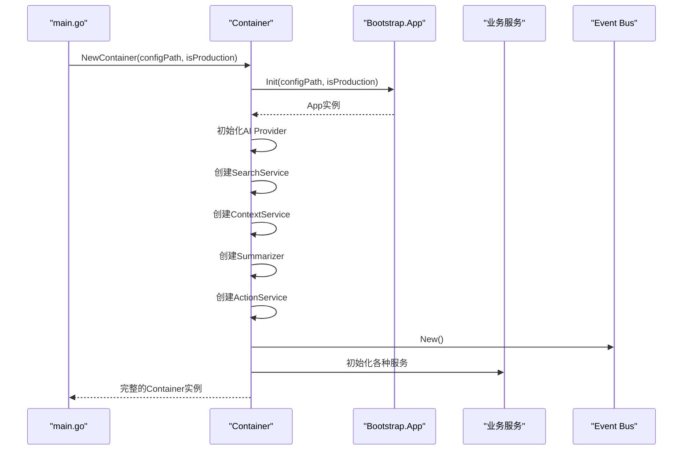

**图表来源**
- [main.go](file://backend/cmd/main.go#L26-L108)
- [container.go](file://backend/internal/app/container.go#L31-L100)

**章节来源**
- [container.go](file://backend/internal/app/container.go#L31-L122)
- [app.go](file://backend/internal/bootstrap/app.go#L24-L148)

## 应用启动流程

EchoMind的应用启动遵循严格的顺序，确保所有组件按正确的依赖关系初始化。

### 主程序启动序列

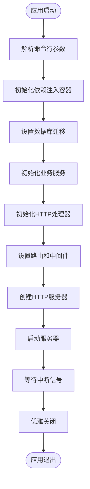

**图表来源**
- [main.go](file://backend/cmd/main.go#L22-L137)

### 关键启动步骤详解

1. **CLI参数解析**：读取配置文件路径和运行环境标识
2. **容器初始化**：建立完整的依赖注入体系
3. **数据库准备**：执行迁移和索引创建
4. **服务注册**：创建所有业务服务实例
5. **路由配置**：设置API端点和认证中间件
6. **服务器启动**：监听指定端口并处理请求

**章节来源**
- [main.go](file://backend/cmd/main.go#L22-L137)

## 事件驱动架构

EchoMind采用事件驱动架构来处理异步操作和解耦组件间的通信。

### 事件总线设计

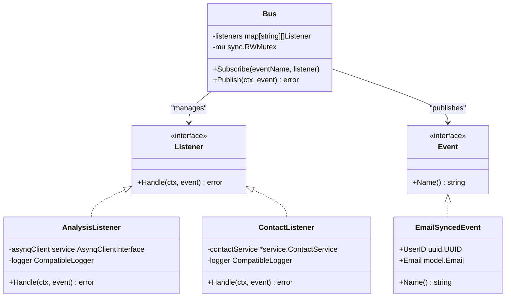

**图表来源**
- [bus.go](file://backend/pkg/event/bus/bus.go#L8-L63)
- [email_events.go](file://backend/internal/event/email_events.go#L8-L19)
- [email_listeners.go](file://backend/internal/listener/email_listeners.go#L22-L116)

### 事件发布流程

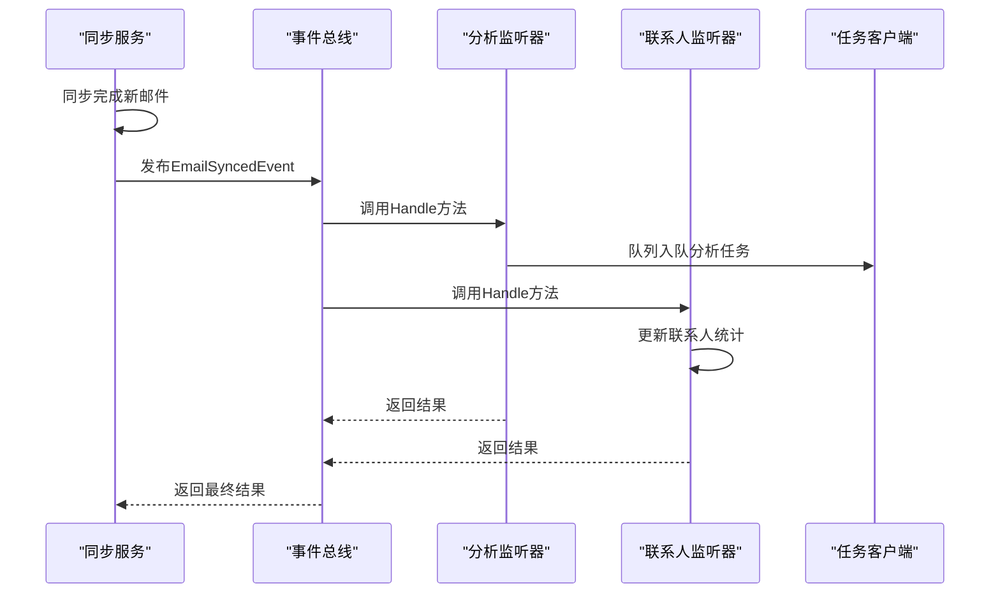

**图表来源**
- [sync.go](file://backend/internal/service/sync.go#L141-L154)
- [email_listeners.go](file://backend/internal/listener/email_listeners.go#L35-L66)

**章节来源**
- [bus.go](file://backend/pkg/event/bus/bus.go#L25-L63)
- [email_events.go](file://backend/internal/event/email_events.go#L8-L19)
- [email_listeners.go](file://backend/internal/listener/email_listeners.go#L22-L116)

## 任务队列系统

EchoMind使用Asynq作为任务队列系统，处理耗时的后台任务。

### 工作器架构

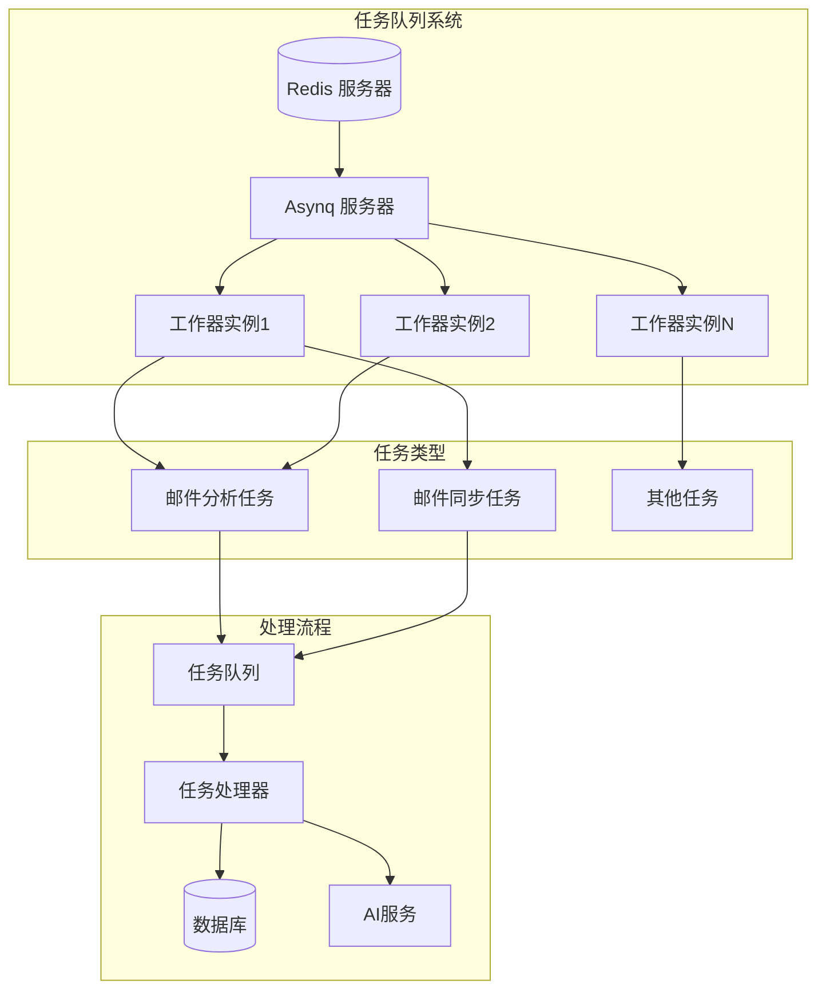

**图表来源**
- [worker_main.go](file://backend/cmd/worker/main.go#L41-L109)
- [analyze.go](file://backend/internal/tasks/analyze.go#L29-L36)

### 任务处理流程

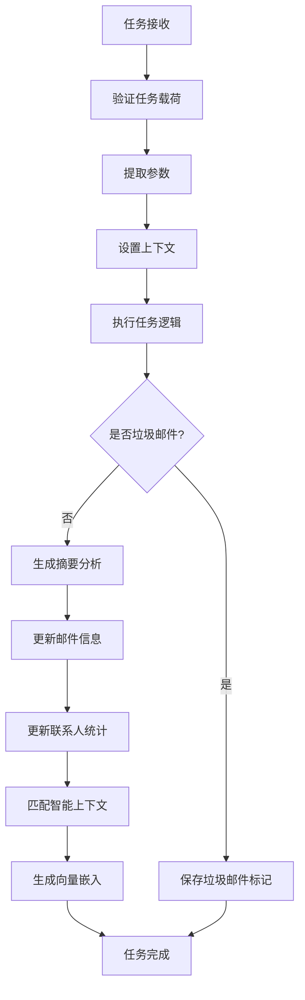

**图表来源**
- [analyze.go](file://backend/internal/tasks/analyze.go#L55-L200)

**章节来源**
- [worker_main.go](file://backend/cmd/worker/main.go#L41-L109)
- [analyze.go](file://backend/internal/tasks/analyze.go#L29-L200)

## 前后端交互机制

EchoMind采用RESTful API设计，前后端分离架构，通过HTTP协议进行通信。

### 前端架构

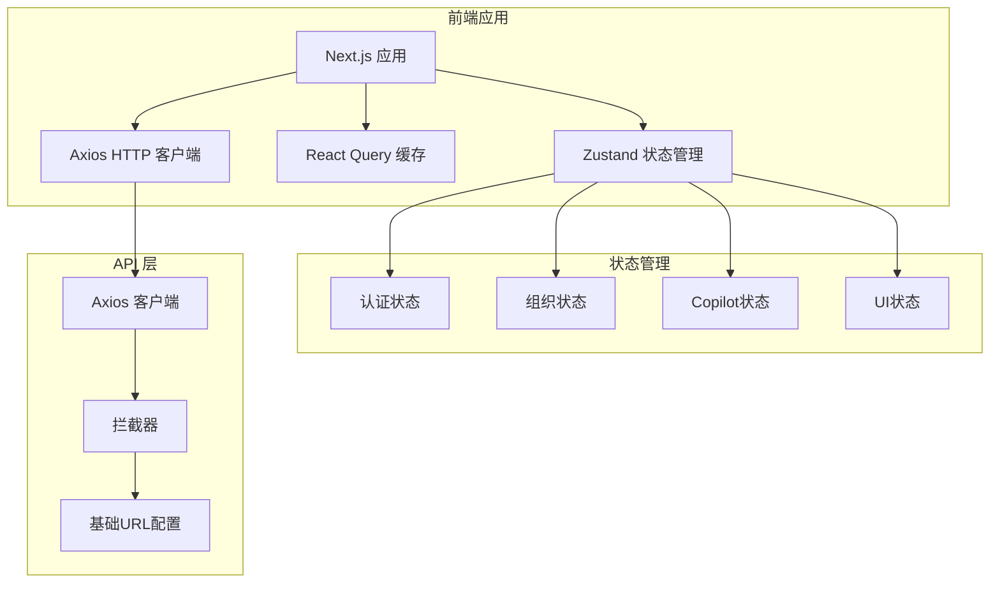

**图表来源**
- [layout.tsx](file://frontend/src/app/layout.tsx#L14-L42)
- [QueryClientProvider.tsx](file://frontend/src/components/providers/QueryClientProvider.tsx#L6-L29)

### API 通信流程

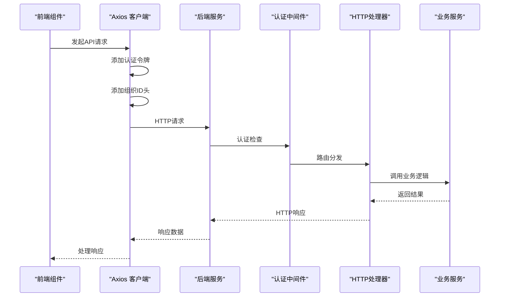

**图表来源**
- [api.ts](file://frontend/src/lib/api.ts#L12-L44)

### 中间件栈

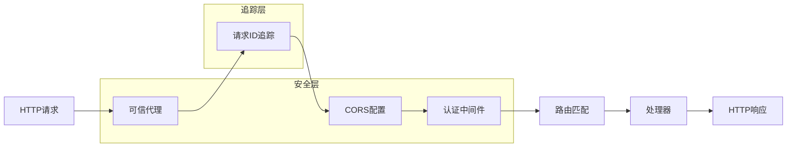

**图表来源**
- [middleware.go](file://backend/internal/router/middleware.go#L14-L44)

**章节来源**
- [api.ts](file://frontend/src/lib/api.ts#L12-L44)
- [layout.tsx](file://frontend/src/app/layout.tsx#L14-L42)
- [middleware.go](file://backend/internal/router/middleware.go#L14-L44)

## 数据流和控制流

EchoMind的系统数据流和控制流体现了现代Web应用的最佳实践。

### 核心数据流

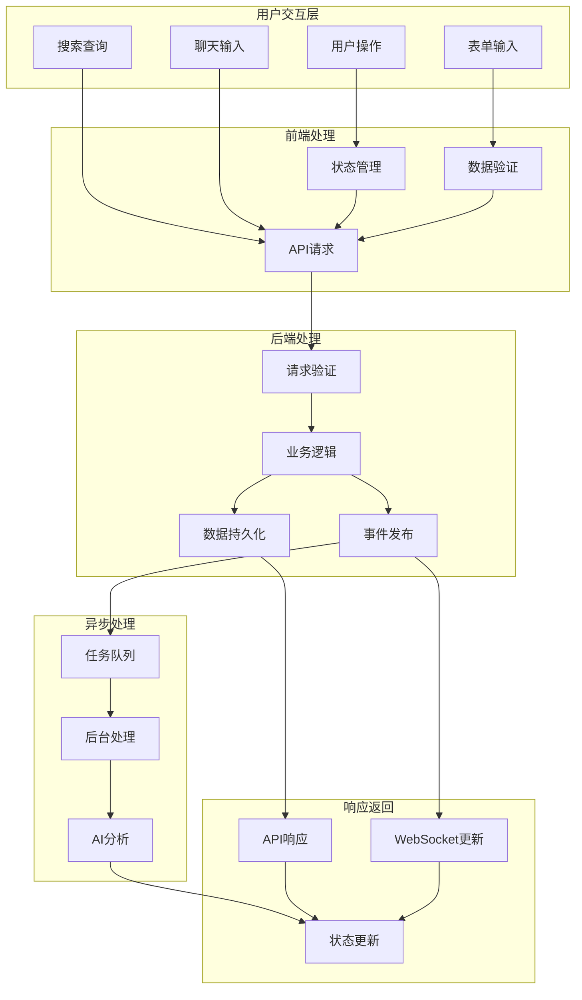

### 控制流示例：邮件同步流程

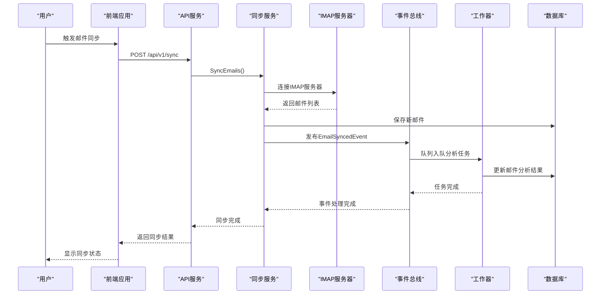

**图表来源**
- [sync.go](file://backend/internal/service/sync.go#L104-L157)
- [worker_main.go](file://backend/cmd/worker/main.go#L66-L84)

### 错误处理和重试机制

系统在多个层面实现了错误处理和重试机制：

1. **前端层**：React Query的自动重试和错误边界
2. **网络层**：Axios拦截器的统一错误处理
3. **后端层**：Gin中间件的全局错误捕获
4. **业务层**：服务级别的异常处理和日志记录
5. **任务层**：Asynq的任务重试机制

**章节来源**
- [sync.go](file://backend/internal/service/sync.go#L104-L178)
- [worker_main.go](file://backend/cmd/worker/main.go#L66-L84)

## 性能优化策略

EchoMind采用了多种性能优化策略来确保系统的高效运行。

### 缓存策略

- **数据库连接池**：优化数据库连接复用
- **Redis缓存**：缓存频繁访问的数据
- **HTTP缓存**：浏览器和CDN缓存策略
- **查询优化**：索引优化和查询计划分析

### 异步处理

- **任务队列**：将耗时操作移至后台处理
- **事件驱动**：减少同步等待时间
- **并发控制**：合理设置工作器并发数

### 数据库优化

- **向量索引**：使用HNSW算法加速相似度搜索
- **批量操作**：减少数据库往返次数
- **事务管理**：合理使用事务边界

### 前端优化

- **代码分割**：按需加载组件
- **状态缓存**：React Query本地缓存
- **请求去重**：避免重复API调用

## 总结

EchoMind展现了现代Web应用架构的最佳实践，通过以下关键设计实现了高性能、可扩展和可维护的系统：

### 架构优势

1. **分层清晰**：严格的分层架构确保了代码的可维护性和可测试性
2. **依赖注入**：灵活的DI容器简化了组件管理和测试
3. **事件驱动**：异步事件处理提高了系统的响应性和可扩展性
4. **任务队列**：后台任务处理确保了用户体验的流畅性
5. **前后端分离**：现代化的前端技术栈提供了优秀的用户体验

### 技术特色

- **AI集成**：深度集成了自然语言处理和机器学习能力
- **实时交互**：支持实时聊天和搜索功能
- **智能分析**：基于上下文的邮件分类和优先级排序
- **多租户支持**：灵活的组织和团队管理机制

### 扩展性考虑

系统设计充分考虑了未来的扩展需求：
- 微服务架构的可扩展性
- 插件化的AI提供商支持
- 可配置的事件处理器
- 水平扩展的负载均衡能力

EchoMind的架构设计不仅满足了当前的功能需求，更为未来的业务增长和技术演进奠定了坚实的基础。