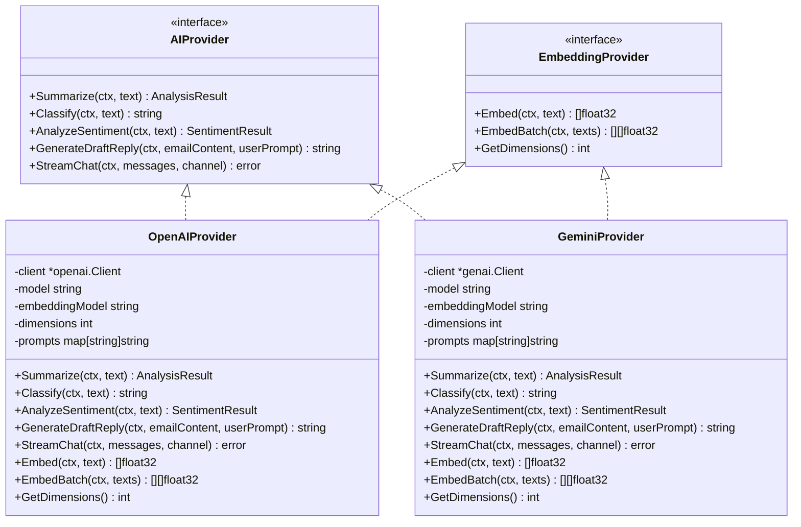

# AI服务抽象与工厂模式架构文档

<cite>
**本文档引用的文件**
- [provider.go](file://backend/pkg/ai/provider.go)
- [ai_factory.go](file://backend/internal/service/ai_factory.go)
- [registry.go](file://backend/pkg/ai/registry/registry.go)
- [openai/provider.go](file://backend/pkg/ai/openai/provider.go)
- [gemini/provider.go](file://backend/pkg/ai/gemini/provider.go)
- [mock/provider.go](file://backend/pkg/ai/mock/provider.go)
- [config.example.yaml](file://backend/configs/config.example.yaml)
- [app_config.go](file://backend/configs/app_config.go)
</cite>

## 目录
1. [引言](#引言)
2. [系统架构概览](#系统架构概览)
3. [AIProvider接口设计](#aiprovider接口设计)
4. [工厂模式实现](#工厂模式实现)
5. [注册机制](#注册机制)
6. [CompositeProvider组合模式](#compositeprovider组合模式)
7. [配置驱动的提供商切换](#配置驱动的提供商切换)
8. [插件化架构优势](#插件化架构优势)
9. [扩展新AI服务](#扩展新ai服务)
10. [总结](#总结)

## 引言

本文档详细阐述了EchoMind项目中AI服务抽象与工厂模式的设计架构。该架构通过统一的接口抽象、灵活的工厂模式和自动注册机制，实现了高度可扩展和可维护的AI服务集成框架。核心设计理念是通过松耦合的方式支持多种AI提供商的无缝切换，同时保持业务逻辑的一致性。

## 系统架构概览

整个AI服务架构采用分层设计，从上到下包括应用层、服务层、抽象层和具体实现层：


**图表来源**
- [ai_factory.go](file://backend/internal/service/ai_factory.go#L23-L107)
- [provider.go](file://backend/pkg/ai/provider.go#L6-L34)
- [registry.go](file://backend/pkg/ai/registry/registry.go#L12-L48)

## AIProvider接口设计

### 统一能力契约

`AIProvider`接口定义了AI服务的核心能力契约，确保所有AI提供商实现一致的行为规范：



**图表来源**
- [provider.go](file://backend/pkg/ai/provider.go#L6-L34)
- [openai/provider.go](file://backend/pkg/ai/openai/provider.go#L21-L273)
- [gemini/provider.go](file://backend/pkg/ai/gemini/provider.go#L23-L313)

### 核心方法详解

#### GenerateDraftReply方法
该方法负责生成智能邮件回复，接受原始邮件内容和用户提示，返回结构化的回复文本。

#### Summarize方法  
该方法对文本内容进行结构化分析，返回包含摘要、分类、情感、紧急程度和行动项的结果。

#### StreamChat方法
支持流式聊天响应，通过channel逐块传输AI生成的内容，实现实时交互体验。

**章节来源**
- [provider.go](file://backend/pkg/ai/provider.go#L7-L21)

## 工厂模式实现

### NewAIProvider函数架构

工厂函数`NewAIProvider`是整个架构的核心，负责根据配置动态创建AI提供商实例：


**图表来源**
- [ai_factory.go](file://backend/internal/service/ai_factory.go#L31-L47)

### 多提供商支持策略

工厂模式支持多种提供商的创建策略：

1. **单一提供商模式**：Chat和Embedding使用同一个提供商
2. **分离提供商模式**：Chat和Embedding使用不同的提供商
3. **优化重用模式**：当Chat和Embedding提供商相同时，重用实例

**章节来源**
- [ai_factory.go](file://backend/internal/service/ai_factory.go#L24-L107)

## 注册机制

### 自动注册流程

注册机制通过Go语言的`init()`函数实现自动注册，确保提供商在导入时自动注册到全局注册表：


**图表来源**
- [registry.go](file://backend/pkg/ai/registry/registry.go#L22-L31)
- [openai/provider.go](file://backend/pkg/ai/openai/provider.go#L17-L18)
- [gemini/provider.go](file://backend/pkg/ai/gemini/provider.go#L19-L20)

### 注册表数据结构

注册表使用线程安全的map存储工厂函数，支持并发访问：

| 组件 | 类型 | 描述 |
|------|------|------|
| providersMu | sync.RWMutex | 读写锁，保证并发安全 |
| providers | map[string]FactoryFunc | 协议到工厂函数的映射 |
| FactoryFunc | 函数类型 | 创建AIProvider的工厂函数 |

**章节来源**
- [registry.go](file://backend/pkg/ai/registry/registry.go#L15-L18)

## CompositeProvider组合模式

### 结构设计

`CompositeProvider`采用组合模式，将AIProvider和EmbeddingProvider的能力组合在一起：


**图表来源**
- [ai_factory.go](file://backend/internal/service/ai_factory.go#L17-L21)

### 功能特性

1. **能力聚合**：同时提供文本处理和向量嵌入能力
2. **透明代理**：对外暴露统一的接口
3. **性能优化**：支持同一提供商实例的双重实现

**章节来源**
- [ai_factory.go](file://backend/internal/service/ai_factory.go#L17-L21)

## 配置驱动的提供商切换

### 配置文件结构

配置系统支持灵活的提供商配置，通过YAML文件定义：

| 配置项 | 类型 | 描述 |
|--------|------|------|
| active_services.chat | string | 指定负责聊天功能的提供商 |
| active_services.embedding | string | 指定负责嵌入功能的提供商 |
| providers.[name] | ProviderConfig | 各提供商的具体配置 |
| prompts | PromptConfig | 提示词模板配置 |

### 多提供商配置示例

配置文件展示了多种提供商的配置方式：

```yaml
ai:
  active_services:
    chat: "deepseek"
    embedding: "siliconflow"
  
  providers:
    deepseek:
      protocol: "openai"
      settings:
        base_url: "https://api.deepseek.com/v1"
        api_key: "your-deepseek-api-key"
        model: "deepseek-chat"
    
    siliconflow:
      protocol: "openai"
      settings:
        base_url: "https://api.siliconflow.cn/v1"
        api_key: "your-siliconflow-api-key"
        model: "Qwen/Qwen3-235B-A22B"
        embedding_model: "Pro/BAAI/bge-m3"
        embedding_dimensions: 1024
```

**章节来源**
- [config.example.yaml](file://backend/configs/config.example.yaml#L31-L110)

## 插件化架构优势

### 松耦合设计

1. **接口隔离**：AIProvider和EmbeddingProvider分离关注点
2. **协议抽象**：通过protocol字段支持不同AI服务协议
3. **配置驱动**：运行时决定使用哪个提供商

### 可扩展性

1. **新提供商添加**：只需实现接口并注册工厂函数
2. **功能增强**：可以在现有提供商基础上添加新功能
3. **测试友好**：Mock提供商便于单元测试

### 运维灵活性

1. **热切换**：通过配置文件即可切换提供商
2. **成本控制**：支持不同成本效益的提供商组合
3. **故障隔离**：单个提供商故障不影响整体服务

## 扩展新AI服务

### 实现步骤

1. **创建提供商包**：在`pkg/ai/`目录下创建新包
2. **实现接口**：实现AIProvider和EmbeddingProvider接口
3. **注册工厂**：在`init()`函数中注册工厂函数
4. **配置支持**：在配置文件中添加对应配置

### 示例代码结构

```go
// 包初始化时注册工厂函数
func init() {
    registry.Register("custom", NewProvider)
}

// 实现提供商接口
type CustomProvider struct {
    // 私有字段
}

func NewProvider(ctx context.Context, settings configs.ProviderSettings, prompts map[string]string) (ai.AIProvider, error) {
    // 创建和配置提供商实例
    return &CustomProvider{}, nil
}
```

### 配置示例

```yaml
ai:
  providers:
    custom_provider:
      protocol: "custom"
      settings:
        api_key: "your-custom-api-key"
        endpoint: "https://api.custom.com/v1"
        model: "custom-model"
```

**章节来源**
- [registry.go](file://backend/pkg/ai/registry/registry.go#L22-L31)
- [openai/provider.go](file://backend/pkg/ai/openai/provider.go#L17-L18)

## 总结

EchoMind项目的AI服务抽象与工厂模式架构展现了优秀的软件设计原则：

1. **接口优先**：通过统一接口定义AI能力契约
2. **工厂模式**：实现灵活的实例创建和管理
3. **自动注册**：通过Go语言特性实现零配置扩展
4. **组合模式**：提供灵活的功能组合方案
5. **配置驱动**：支持运行时的提供商切换

这种设计不仅实现了高度的可扩展性和可维护性，还为未来的功能扩展和提供商集成提供了坚实的基础。开发者可以轻松添加新的AI服务提供商，而无需修改核心业务逻辑，真正实现了插件化架构的优势。