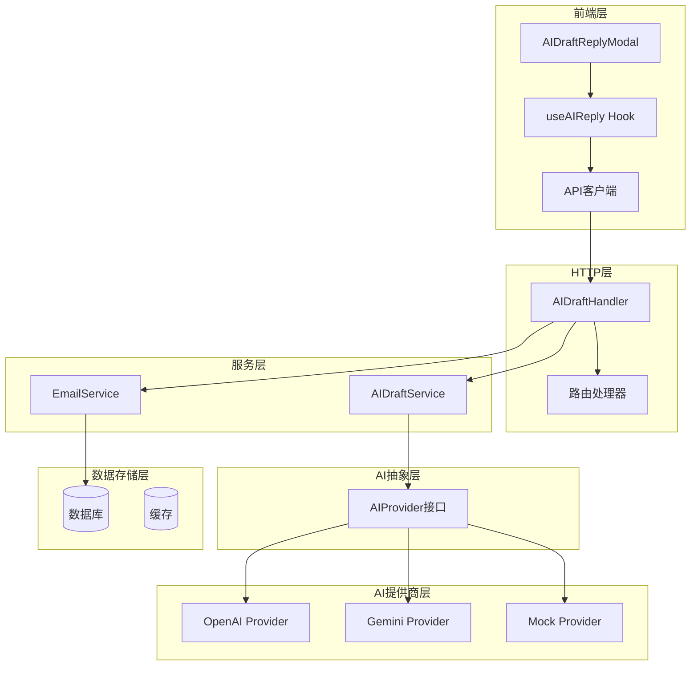
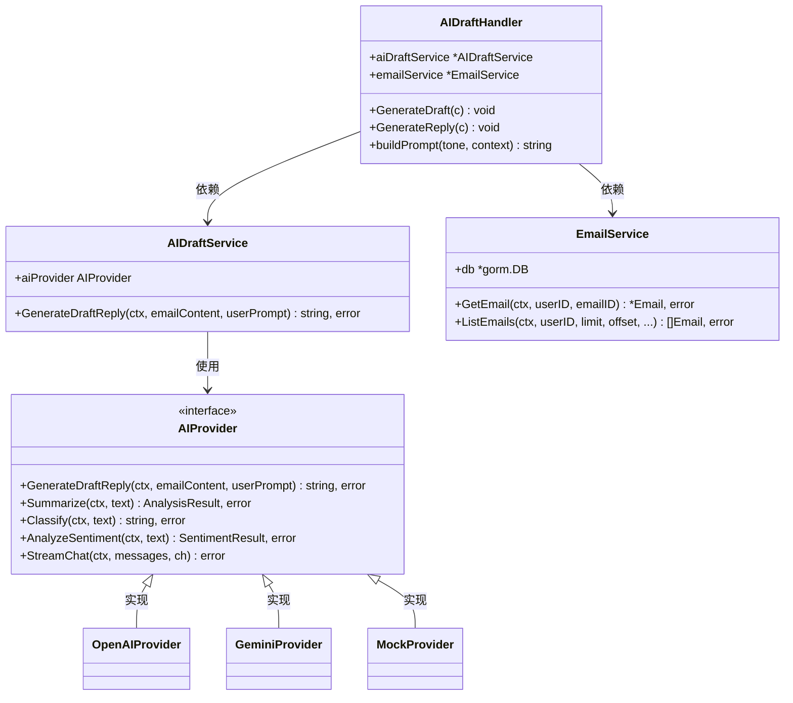
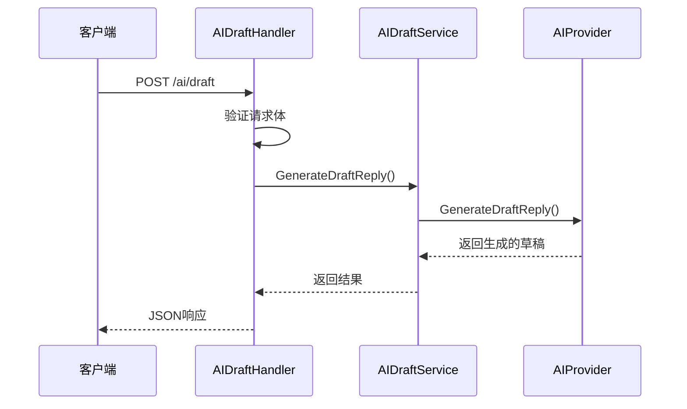
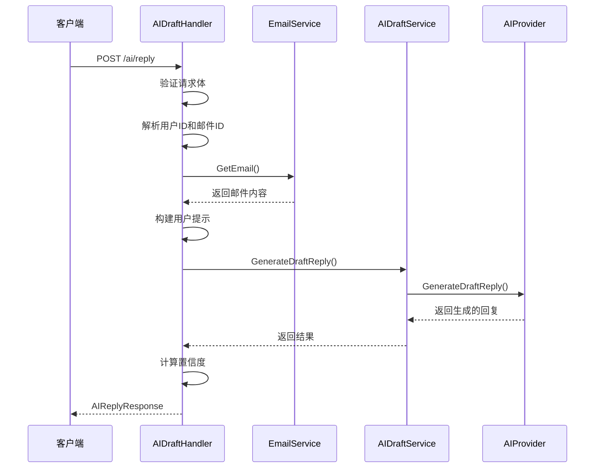
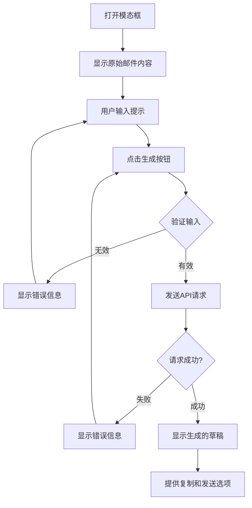

# AI草稿生成功能详细文档

<cite>
**本文档引用的文件**
- [backend/internal/service/ai_draft.go](file://backend/internal/service/ai_draft.go)
- [backend/internal/handler/ai_draft.go](file://backend/internal/handler/ai_draft.go)
- [frontend/src/components/email/AIDraftReplyModal.tsx](file://frontend/src/components/email/AIDraftReplyModal.tsx)
- [backend/pkg/ai/provider.go](file://backend/pkg/ai/provider.go)
- [backend/pkg/ai/gemini/provider.go](file://backend/pkg/ai/gemini/provider.go)
- [backend/pkg/ai/openai/provider.go](file://backend/pkg/ai/openai/provider.go)
- [backend/internal/service/email.go](file://backend/internal/service/email.go)
- [backend/internal/service/ai_factory.go](file://backend/internal/service/ai_factory.go)
- [backend/internal/app/container.go](file://backend/internal/app/container.go)
- [backend/cmd/main.go](file://backend/cmd/main.go)
- [backend/configs/app_config.go](file://backend/configs/app_config.go)
- [frontend/src/lib/api.ts](file://frontend/src/lib/api.ts)
- [frontend/src/hooks/useAIReply.ts](file://frontend/src/hooks/useAIReply.ts)
</cite>

## 目录
1. [简介](#简介)
2. [系统架构概览](#系统架构概览)
3. [核心组件分析](#核心组件分析)
4. [服务层实现](#服务层实现)
5. [HTTP处理器详解](#http处理器详解)
6. [前端组件实现](#前端组件实现)
7. [AI提供商集成](#ai提供商集成)
8. [依赖注入与配置](#依赖注入与配置)
9. [错误处理与超时机制](#错误处理与超时机制)
10. [使用示例](#使用示例)
11. [故障排除指南](#故障排除指南)

## 简介

AI草稿生成功能是EchoMind系统中的核心智能功能之一，它允许用户基于现有邮件内容和自定义提示生成专业的电子邮件回复草稿。该功能通过集成多种AI提供商（如OpenAI和Google Gemini），为用户提供智能化的邮件回复辅助。

### 主要特性

- **多AI提供商支持**：支持OpenAI和Google Gemini等主流AI服务
- **灵活的提示定制**：用户可以自定义回复语气和上下文要求
- **实时响应**：采用异步处理和流式传输技术
- **错误恢复**：完善的错误处理和超时机制
- **类型安全**：完整的TypeScript和Go类型定义

## 系统架构概览

AI草稿生成功能采用分层架构设计，确保了良好的可维护性和扩展性：



**图表来源**
- [backend/internal/handler/ai_draft.go](file://backend/internal/handler/ai_draft.go#L27-L36)
- [backend/internal/service/ai_draft.go](file://backend/internal/service/ai_draft.go#L9-L15)
- [frontend/src/components/email/AIDraftReplyModal.tsx](file://frontend/src/components/email/AIDraftReplyModal.tsx#L15-L21)

## 核心组件分析

### AI草稿服务架构

AI草稿生成功能的核心由以下关键组件构成：



**图表来源**
- [backend/internal/service/ai_draft.go](file://backend/internal/service/ai_draft.go#L9-L19)
- [backend/internal/handler/ai_draft.go](file://backend/internal/handler/ai_draft.go#L27-L36)
- [backend/pkg/ai/provider.go](file://backend/pkg/ai/provider.go#L6-L19)

**章节来源**
- [backend/internal/service/ai_draft.go](file://backend/internal/service/ai_draft.go#L1-L20)
- [backend/internal/handler/ai_draft.go](file://backend/internal/handler/ai_draft.go#L1-L136)

## 服务层实现

### AIDraftService服务

AIDraftService是AI草稿生成功能的核心服务，负责协调AI提供商和业务逻辑：

#### 服务初始化

服务通过依赖注入模式创建，接收AI提供商作为参数：

```go
func NewAIDraftService(aiProvider ai.AIProvider) *AIDraftService {
    return &AIDraftService{aiProvider: aiProvider}
}
```

#### 草稿生成方法

主要的`GenerateDraftReply`方法将邮件内容和用户提示传递给底层AI提供商：

```go
func (s *AIDraftService) GenerateDraftReply(ctx context.Context, emailContent, userPrompt string) (string, error) {
    return s.aiProvider.GenerateDraftReply(ctx, emailContent, userPrompt)
}
```

该方法的设计遵循单一职责原则，只负责调用AI提供商的相应方法，不包含任何业务逻辑。

**章节来源**
- [backend/internal/service/ai_draft.go](file://backend/internal/service/ai_draft.go#L13-L19)

## HTTP处理器详解

### AIDraftHandler处理器

AIDraftHandler处理来自客户端的HTTP请求，验证输入并调用相应的服务方法：

#### 请求结构定义

```go
type AIDraftRequest struct {
    EmailContent string `json:"emailContent" binding:"required"`
    UserPrompt   string `json:"userPrompt" binding:"required"`
}

type AIReplyRequest struct {
    EmailID string `json:"emailId" binding:"required"`
    Tone    string `json:"tone,omitempty"`    // "professional", "casual", "friendly", etc.
    Context string `json:"context,omitempty"` // "brief", "detailed", etc.
}

type AIReplyResponse struct {
    Reply      string  `json:"reply"`
    Confidence float64 `json:"confidence"`
}
```

#### 草稿生成端点

`GenerateDraft`方法处理直接的草稿生成请求：



**图表来源**
- [backend/internal/handler/ai_draft.go](file://backend/internal/handler/ai_draft.go#L40-L53)

#### 回复生成端点

`GenerateReply`方法处理基于现有邮件的回复生成：



**图表来源**
- [backend/internal/handler/ai_draft.go](file://backend/internal/handler/ai_draft.go#L56-L102)

#### 提示构建逻辑

`buildPrompt`方法根据用户选择的语气和上下文构建优化的提示：

```go
func (h *AIDraftHandler) buildPrompt(tone, context string) string {
    prompt := "Generate a professional email reply"
    
    if tone != "" {
        switch tone {
        case "professional":
            prompt = "Generate a professional and formal email reply"
        case "casual":
            prompt = "Generate a casual and friendly email reply"
        case "friendly":
            prompt = "Generate a warm and friendly email reply"
        case "concise":
            prompt = "Generate a concise and brief email reply"
        }
    }
    
    if context != "" {
        switch context {
        case "brief":
            prompt += " with brief context"
        case "detailed":
            prompt += " with detailed explanation"
        case "urgent":
            prompt += " with urgent and clear action items"
        }
    }
    
    prompt += ". Include appropriate greeting and closing. Keep it natural and human-like."
    return prompt
}
```

**章节来源**
- [backend/internal/handler/ai_draft.go](file://backend/internal/handler/ai_draft.go#L1-L136)

## 前端组件实现

### AIDraftReplyModal组件

前端组件提供了直观的用户界面，支持用户输入提示并查看AI生成的结果：

#### 组件状态管理

```typescript
interface AIDraftReplyModalProps {
    emailContent: string;
    isOpen: boolean;
    onClose: () => void;
}

export default function AIDraftReplyModal({ emailContent, isOpen, onClose }: AIDraftReplyModalProps) {
    const [userPrompt, setUserPrompt] = useState('Generate a professional email reply to this message.');
    const [draftReply, setDraftReply] = useState('');
    const [loading, setLoading] = useState(false);
    const [error, setError] = useState<string | null>(null);
    const [copied, setCopied] = useState(false);
}
```

#### 用户交互流程



**图表来源**
- [frontend/src/components/email/AIDraftReplyModal.tsx](file://frontend/src/components/email/AIDraftReplyModal.tsx#L22-L46)

#### API调用实现

组件通过React Query的`useMutation`钩子进行异步API调用：

```typescript
const handleGenerateDraft = async () => {
    if (!emailContent.trim()) {
        setError('Email content is required.');
        return;
    }
    if (!userPrompt.trim()) {
        setError('User prompt is required.');
        return;
    }

    setLoading(true);
    setError(null);
    setDraftReply('');
    try {
        const response = await api.post('/ai/draft', {
            emailContent: emailContent.trim(),
            userPrompt: userPrompt.trim()
        });
        setDraftReply(response.data.draft);
    } catch (err: any) {
        setError(err.response?.data?.error || err.message || 'Failed to generate draft reply.');
    } finally {
        setLoading(false);
    }
};
```

#### 按钮预设功能

组件提供了多个预设按钮帮助用户快速设置常见的回复风格：

- **专业回复**：适合正式商务沟通
- **随意回复**：适合非正式场合
- **简洁回复**：适合时间紧迫的情况
- **详细回复**：适合需要充分解释的场景

**章节来源**
- [frontend/src/components/email/AIDraftReplyModal.tsx](file://frontend/src/components/email/AIDraftReplyModal.tsx#L1-L230)

## AI提供商集成

### AIProvider接口设计

AIProvider接口定义了所有AI提供商必须实现的标准方法：

```go
type AIProvider interface {
    Summarize(ctx context.Context, text string) (AnalysisResult, error)
    Classify(ctx context.Context, text string) (string, error)
    AnalyzeSentiment(ctx context.Context, text string) (SentimentResult, error)
    GenerateDraftReply(ctx context.Context, emailContent, userPrompt string) (string, error)
    StreamChat(ctx context.Context, messages []Message, ch chan<- ChatCompletionChunk) error
}
```

### OpenAI提供商实现

OpenAI提供商实现了完整的AI功能，包括聊天完成和嵌入生成：

#### 草稿生成实现

```go
func (p *Provider) GenerateDraftReply(ctx context.Context, emailContent, userPrompt string) (string, error) {
    systemPrompt := p.prompts["draft_reply"]
    if systemPrompt == "" {
        systemPrompt = "You are an email assistant. Generate a professional email reply based on the provided email content and user instructions."
    }

    // 确保有有效的内容
    if emailContent == "" {
        emailContent = "No email content provided."
    }
    if userPrompt == "" {
        userPrompt = "Generate a brief, professional email reply."
    }

    fullUserPrompt := fmt.Sprintf("Original Email:\n%s\n\nUser Instructions:\n%s", emailContent, userPrompt)
    return p.chatCompletion(ctx, systemPrompt, fullUserPrompt, false)
}
```

### Gemini提供商实现

Gemini提供商使用Google的Generative AI SDK，支持更复杂的对话管理和流式传输：

#### 流式聊天支持

```go
func (p *Provider) StreamChat(ctx context.Context, messages []ai.Message, ch chan<- ai.ChatCompletionChunk) error {
    defer close(ch)

    model := p.client.GenerativeModel(p.model)
    cs := model.StartChat()

    // 处理历史消息
    if len(messages) > 1 {
        var history []*genai.Content
        for _, msg := range messages[:len(messages)-1] {
            role := "user"
            if msg.Role == "assistant" {
                role = "model"
            }
            history = append(history, &genai.Content{
                Parts: []genai.Part{genai.Text(msg.Content)},
                Role:  role,
            })
        }
        cs.History = history
    }

    lastMsg := messages[len(messages)-1]
    iter := cs.SendMessageStream(ctx, genai.Text(lastMsg.Content))

    for i := 0; ; i++ {
        resp, err := iter.Next()
        if errors.Is(err, iterator.Done) {
            return nil
        }
        if err != nil {
            return err
        }

        content, widgetData := extractContentAndWidget(resp)
        if content != "" || widgetData != nil {
            chunk := ai.ChatCompletionChunk{
                ID: fmt.Sprintf("chatcmpl-%d", i),
                Choices: []ai.Choice{
                    {
                        Index: 0,
                        Delta: ai.DeltaContent{
                            Content: content,
                            Widget:  widgetData,
                        },
                    },
                },
            }
            ch <- chunk
        }
    }
}
```

**章节来源**
- [backend/pkg/ai/provider.go](file://backend/pkg/ai/provider.go#L1-L81)
- [backend/pkg/ai/openai/provider.go](file://backend/pkg/ai/openai/provider.go#L120-L135)
- [backend/pkg/ai/gemini/provider.go](file://backend/pkg/ai/gemini/provider.go#L126-L142)

## 依赖注入与配置

### 服务工厂模式

系统使用服务工厂模式创建AI提供商实例：

```go
func NewAIProvider(cfg *configs.AIConfig) (ai.AIProvider, error) {
    prompts := toPromptMap(cfg.Prompts)
    var mainProvider ai.AIProvider
    var embeddingProvider ai.EmbeddingProvider
    
    // 创建提供商实例
    createProvider := func(name string) (interface{}, error) {
        if name == "mock" {
            return mock.NewProvider(), nil
        }
        
        pConfig, ok := cfg.Providers[name]
        if !ok {
            return nil, fmt.Errorf("provider configuration not found: %s", name)
        }
        
        factory, err := registry.Get(pConfig.Protocol)
        if err != nil {
            return nil, err
        }
        
        return factory(context.Background(), pConfig.Settings, prompts)
    }
    
    // 初始化聊天提供商
    chatProviderName := cfg.ActiveServices.Chat
    if chatProviderName == "" {
        chatProviderName = "mock" // 默认回退
    }
    
    chatP, err := createProvider(chatProviderName)
    if err != nil {
        return nil, fmt.Errorf("failed to create chat provider '%s': %w", chatProviderName, err)
    }
    
    if p, ok := chatP.(ai.AIProvider); ok {
        mainProvider = p
    }
    
    // 初始化嵌入提供商
    embedProviderName := cfg.ActiveServices.Embedding
    if embedProviderName == "" {
        embedProviderName = chatProviderName // 回退到相同提供商
    }
    
    // 优化：如果聊天和嵌入使用相同的提供商，重用实例
    if embedProviderName == chatProviderName {
        if p, ok := chatP.(ai.EmbeddingProvider); ok {
            embeddingProvider = p
        }
    }
    
    return &CompositeProvider{
        AIProvider:        mainProvider,
        EmbeddingProvider: embeddingProvider,
    }, nil
}
```

### 配置结构

AI配置通过YAML文件进行管理：

```yaml
ai:
  active_services:
    chat: "openai"
    embedding: "openai"
  providers:
    openai:
      protocol: "openai"
      settings:
        api_key: "${OPENAI_API_KEY}"
        model: "gpt-4"
        base_url: "${OPENAI_BASE_URL}"
        embedding_model: "text-embedding-3-small"
        embedding_dimensions: 1024
  prompts:
    draft_reply: "你是一个电子邮件助手。根据提供的电子邮件内容和用户指令生成专业的电子邮件回复。"
    summary: "你是一个文本摘要专家。请对以下文本进行专业摘要。"
    classify: "你是一个电子邮件分类器。将以下电子邮件分类为：工作、个人、促销、垃圾邮件等。"
    sentiment: "你是一个情感分析专家。分析以下电子邮件的情感和紧急程度。"
```

**章节来源**
- [backend/internal/service/ai_factory.go](file://backend/internal/service/ai_factory.go#L24-L95)
- [backend/configs/app_config.go](file://backend/configs/app_config.go#L41-L66)

## 错误处理与超时机制

### 后端错误处理

系统在多个层面实现了完善的错误处理：

#### HTTP处理器错误处理

```go
// GenerateDraft 方法的错误处理
func (h *AIDraftHandler) GenerateDraft(c *gin.Context) {
    var req AIDraftRequest
    if err := c.ShouldBindJSON(&req); err != nil {
        c.JSON(http.StatusBadRequest, gin.H{"error": err.Error()})
        return
    }

    draft, err := h.aiDraftService.GenerateDraftReply(c.Request.Context(), req.EmailContent, req.UserPrompt)
    if err != nil {
        c.JSON(http.StatusInternalServerError, gin.H{"error": err.Error()})
        return
    }

    c.JSON(http.StatusOK, gin.H{"draft": draft})
}
```

#### AI提供商错误处理

每个AI提供商都实现了自己的错误处理逻辑：

```go
// OpenAI提供商的错误处理
func (p *Provider) chatCompletion(ctx context.Context, systemPrompt, userContent string, jsonMode bool) (string, error) {
    req := openai.ChatCompletionRequest{
        Model: p.model,
        Messages: []openai.ChatCompletionMessage{
            {Role: openai.ChatMessageRoleSystem, Content: systemPrompt},
            {Role: openai.ChatMessageRoleUser, Content: userContent},
        },
    }

    if jsonMode {
        req.ResponseFormat = &openai.ChatCompletionResponseFormat{
            Type: openai.ChatCompletionResponseFormatTypeJSONObject,
        }
    }

    resp, err := p.client.CreateChatCompletion(ctx, req)
    if err != nil {
        return "", err
    }

    if len(resp.Choices) == 0 {
        return "", errors.New("no choices returned from OpenAI API")
    }

    return resp.Choices[0].Message.Content, nil
}
```

### 前端错误处理

前端组件也实现了全面的错误处理：

```typescript
const handleGenerateDraft = async () => {
    setLoading(true);
    setError(null);
    setDraftReply('');
    try {
        const response = await api.post('/ai/draft', {
            emailContent: emailContent.trim(),
            userPrompt: userPrompt.trim()
        });
        setDraftReply(response.data.draft);
    } catch (err: any) {
        setError(err.response?.data?.error || err.message || 'Failed to generate draft reply.');
    } finally {
        setLoading(false);
    }
};
```

### 超时机制

系统通过多种方式实现超时控制：

1. **HTTP请求超时**：Axios客户端配置
2. **AI提供商超时**：各提供商SDK内置超时
3. **上下文取消**：Go语言的context包支持

**章节来源**
- [backend/internal/handler/ai_draft.go](file://backend/internal/handler/ai_draft.go#L41-L53)
- [backend/pkg/ai/openai/provider.go](file://backend/pkg/ai/openai/provider.go#L137-L162)
- [frontend/src/components/email/AIDraftReplyModal.tsx](file://frontend/src/components/email/AIDraftReplyModal.tsx#L22-L46)

## 使用示例

### 基本草稿生成

```typescript
// 前端调用示例
const handleGenerateBasicDraft = async () => {
    try {
        const response = await api.post('/ai/draft', {
            emailContent: '客户询问关于产品价格的信息。',
            userPrompt: '生成一个专业的报价回复。'
        });
        console.log('生成的草稿:', response.data.draft);
    } catch (error) {
        console.error('生成失败:', error);
    }
};
```

### 基于邮件的回复生成

```typescript
// 使用useAIReply Hook的示例
const { mutate: generateAIReply, isLoading, isError, error } = useAIReply();

const handleGenerateReply = () => {
    generateAIReply({
        emailId: '123e4567-e89b-12d3-a456-426614174000',
        tone: 'professional',
        context: 'detailed'
    }, {
        onSuccess: (data) => {
            console.log('回复生成成功:', {
                reply: data.reply,
                confidence: data.confidence
            });
        },
        onError: (error) => {
            console.error('回复生成失败:', error);
        }
    });
};
```

### 后端服务调用

```go
// Go后端服务调用示例
func processEmailReply(ctx context.Context, emailID, userID string) (string, error) {
    // 获取邮件内容
    email, err := emailService.GetEmail(ctx, userID, emailID)
    if err != nil {
        return "", fmt.Errorf("获取邮件失败: %w", err)
    }

    // 构建回复提示
    prompt := handler.buildPrompt("professional", "detailed")

    // 生成AI回复
    reply, err := aiDraftService.GenerateDraftReply(ctx, email.BodyText, prompt)
    if err != nil {
        return "", fmt.Errorf("生成回复失败: %w", err)
    }

    return reply, nil
}
```

## 故障排除指南

### 常见问题及解决方案

#### 1. AI提供商连接失败

**症状**：API返回500错误，提示连接超时或认证失败

**解决方案**：
- 检查API密钥是否正确配置
- 验证网络连接和防火墙设置
- 确认AI提供商的服务状态

#### 2. 生成的回复质量不佳

**症状**：AI生成的回复不符合预期，内容不相关或格式错误

**解决方案**：
- 优化用户提示语句
- 调整AI模型参数
- 检查邮件内容的清晰度

#### 3. 前端组件加载缓慢

**症状**：模态框打开后长时间无响应

**解决方案**：
- 检查网络连接速度
- 减少邮件内容长度
- 优化AI提供商的响应时间

#### 4. 类型安全问题

**症状**：TypeScript编译错误或运行时类型错误

**解决方案**：
- 确保所有接口定义完整
- 使用严格类型检查
- 添加适当的类型断言

### 性能优化建议

1. **缓存策略**：对频繁使用的提示进行缓存
2. **批量处理**：对于大量邮件，考虑批量处理
3. **异步处理**：使用后台任务处理耗时操作
4. **资源限制**：设置合理的请求频率限制

### 监控和日志

系统提供了完整的监控和日志记录：

```go
// 日志记录示例
logger.Info("AI草稿生成请求",
    "emailID", emailID,
    "promptLength", len(userPrompt),
    "responseLength", len(response),
    "durationMs", duration.Milliseconds())
```

通过这些监控指标，可以及时发现和解决性能问题。