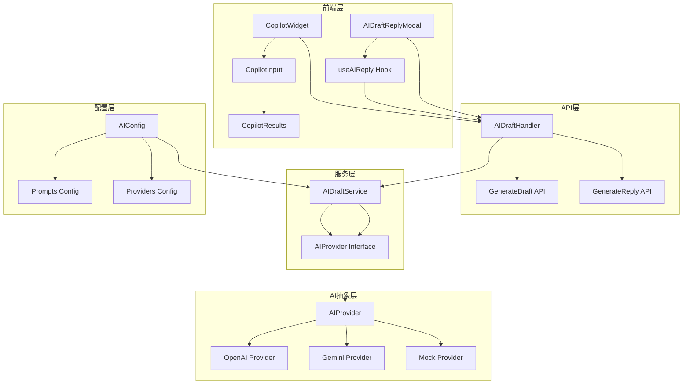
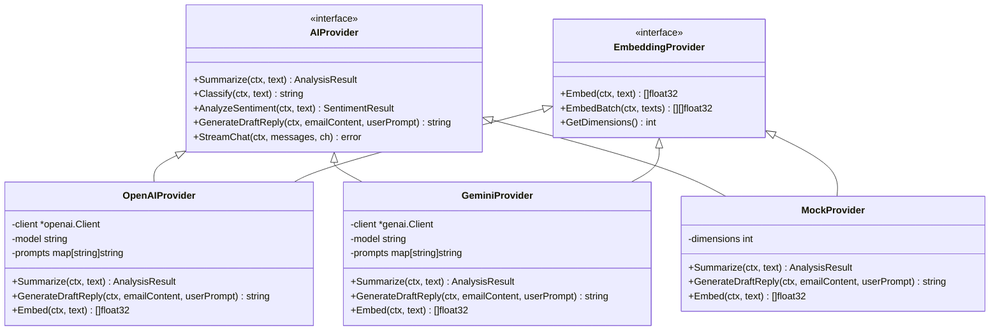
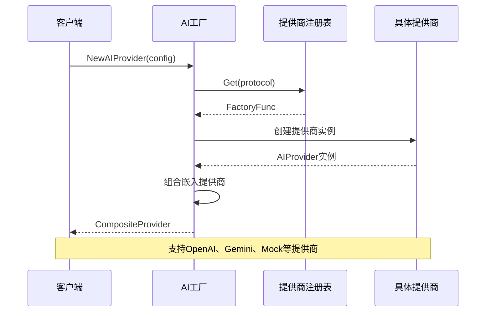
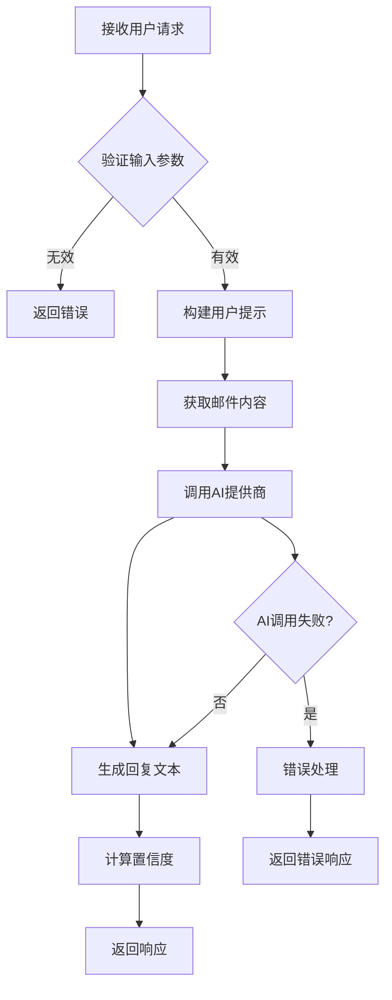
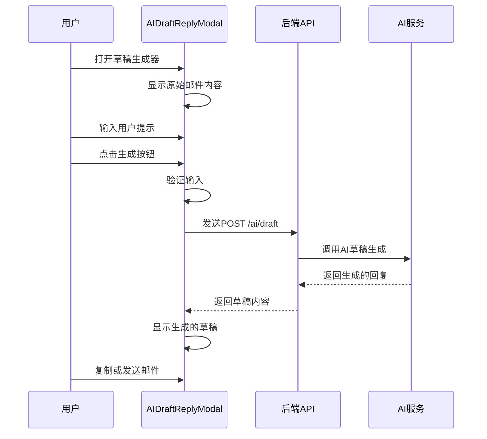
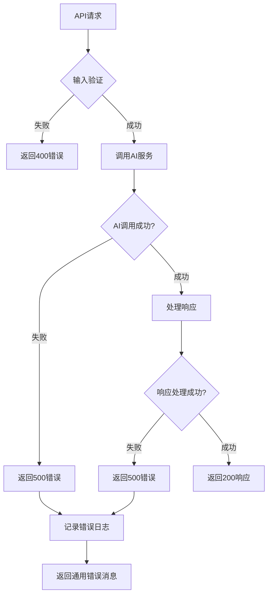

# AI驱动功能

<cite>
**本文档中引用的文件**
- [backend/internal/service/ai_draft.go](file://backend/internal/service/ai_draft.go)
- [backend/internal/service/ai_factory.go](file://backend/internal/service/ai_factory.go)
- [backend/internal/handler/ai_draft.go](file://backend/internal/handler/ai_draft.go)
- [backend/pkg/ai/provider.go](file://backend/pkg/ai/provider.go)
- [backend/pkg/ai/openai/provider.go](file://backend/pkg/ai/openai/provider.go)
- [backend/pkg/ai/gemini/provider.go](file://backend/pkg/ai/gemini/provider.go)
- [backend/pkg/ai/mock/provider.go](file://backend/pkg/ai/mock/provider.go)
- [backend/pkg/ai/registry/registry.go](file://backend/pkg/ai/registry/registry.go)
- [frontend/src/components/email/AIDraftReplyModal.tsx](file://frontend/src/components/email/AIDraftReplyModal.tsx)
- [frontend/src/hooks/useAIReply.ts](file://frontend/src/hooks/useAIReply.ts)
- [frontend/src/components/copilot/CopilotWidget.tsx](file://frontend/src/components/copilot/CopilotWidget.tsx)
- [backend/configs/app_config.go](file://backend/configs/app_config.go)
</cite>

## 目录
1. [简介](#简介)
2. [系统架构概览](#系统架构概览)
3. [核心组件分析](#核心组件分析)
4. [AI提供商工厂模式](#ai提供商工厂模式)
5. [AI草稿生成功能](#ai草稿生成功能)
6. [前端用户交互](#前端用户交互)
7. [配置与扩展](#配置与扩展)
8. [错误处理与优化](#错误处理与优化)
9. [最佳实践指南](#最佳实践指南)
10. [总结](#总结)

## 简介

EchoMind的AI驱动功能是一个高度模块化和可扩展的智能邮件处理系统，专注于通过AI技术提供智能邮件回复和草稿生成功能。该系统采用工厂模式设计，支持多种AI提供商（如OpenAI、Gemini），并通过统一的接口抽象实现灵活的AI能力集成。

核心功能包括：
- **智能邮件草稿生成**：基于用户提示和邮件内容生成专业邮件回复
- **多AI提供商支持**：支持OpenAI、Google Gemini等主流AI服务
- **灵活的提示模板**：可配置的系统提示和用户指令模板
- **流式响应支持**：实时显示AI生成内容
- **语义分析**：邮件分类、情感分析和智能摘要

## 系统架构概览

EchoMind的AI驱动功能采用分层架构设计，确保了良好的可维护性和扩展性：



**图表来源**
- [backend/internal/handler/ai_draft.go](file://backend/internal/handler/ai_draft.go#L27-L37)
- [backend/internal/service/ai_draft.go](file://backend/internal/service/ai_draft.go#L9-L15)
- [backend/pkg/ai/provider.go](file://backend/pkg/ai/provider.go#L6-L22)

## 核心组件分析

### AIProvider接口设计

AIProvider接口是整个AI驱动系统的核心抽象，定义了所有AI能力的标准契约：



**图表来源**
- [backend/pkg/ai/provider.go](file://backend/pkg/ai/provider.go#L6-L22)
- [backend/pkg/ai/openai/provider.go](file://backend/pkg/ai/openai/provider.go#L21-L28)
- [backend/pkg/ai/gemini/provider.go](file://backend/pkg/ai/gemini/provider.go#L23-L29)

### AIDraftService服务层

AIDraftService作为业务逻辑的核心，提供了简洁的服务接口：

**节来源**
- [backend/internal/service/ai_draft.go](file://backend/internal/service/ai_draft.go#L9-L20)

该服务封装了AIProvider的复杂性，为上层调用者提供统一的API接口。其核心方法`GenerateDraftReply`直接委托给底层的AIProvider实现。

### AIDraftHandler控制器层

AIDraftHandler负责处理HTTP请求，实现了RESTful API接口：

**节来源**
- [backend/internal/handler/ai_draft.go](file://backend/internal/handler/ai_draft.go#L27-L136)

该处理器支持两种主要API端点：
1. **/ai/draft**：直接生成邮件草稿
2. **/ai/reply**：基于现有邮件ID生成回复

## AI提供商工厂模式

### 工厂模式设计原理

EchoMind采用工厂模式来动态创建AI提供商实例，这种设计模式具有以下优势：



**图表来源**
- [backend/internal/service/ai_factory.go](file://backend/internal/service/ai_factory.go#L24-L96)
- [backend/pkg/ai/registry/registry.go](file://backend/pkg/ai/registry/registry.go#L35-L42)

### 动态提供商创建

**节来源**
- [backend/internal/service/ai_factory.go](file://backend/internal/service/ai_factory.go#L30-L48)

工厂方法通过以下步骤创建AI提供商：
1. **协议解析**：根据配置确定使用的AI服务协议
2. **工厂查找**：从注册表中获取对应的工厂函数
3. **实例创建**：调用工厂函数创建具体提供商实例
4. **配置注入**：传递配置参数和提示模板

### 提供商注册机制

每个AI提供商在初始化时都会向注册表注册自己的工厂函数：

**节来源**
- [backend/pkg/ai/openai/provider.go](file://backend/pkg/ai/openai/provider.go#L17-L19)
- [backend/pkg/ai/gemini/provider.go](file://backend/pkg/ai/gemini/provider.go#L19-L21)

这种设计允许系统在不修改核心代码的情况下添加新的AI提供商。

## AI草稿生成功能

### 草稿生成流程

AI草稿生成是系统的核心功能，通过以下流程实现：



**图表来源**
- [backend/internal/handler/ai_draft.go](file://backend/internal/handler/ai_draft.go#L56-L102)

### 用户提示构建

**节来源**
- [backend/internal/handler/ai_draft.go](file://backend/internal/handler/ai_draft.go#L104-L135)

`buildPrompt`方法根据用户选择的语气和上下文偏好动态构建提示：

| 参数组合 | 生成的提示模板 |
|---------|---------------|
| tone="professional" | "Generate a professional and formal email reply" |
| context="detailed" | "with detailed explanation" |
| tone="friendly" + context="urgent" | "Generate a warm and friendly email reply with urgent and clear action items" |

### 提示模板管理

系统通过配置文件管理各种提示模板：

**节来源**
- [backend/configs/app_config.go](file://backend/configs/app_config.go#L60-L65)

| 模板类型 | 描述 | 示例用途 |
|---------|------|----------|
| summary | 邮件摘要生成 | 分析邮件内容并生成简洁总结 |
| classify | 邮件分类 | 将邮件归类为Work、Newsletter等类别 |
| sentiment | 情感分析 | 分析邮件的情感倾向和紧急程度 |
| draft_reply | 草稿回复生成 | 基于原始邮件和用户提示生成回复 |

### OpenAI提供商实现

**节来源**
- [backend/pkg/ai/openai/provider.go](file://backend/pkg/ai/openai/provider.go#L119-L135)

OpenAI提供商的草稿生成方法展示了标准的AI调用模式：
1. **提示准备**：使用配置的系统提示
2. **内容构建**：组合原始邮件和用户指令
3. **API调用**：通过ChatCompletion接口生成回复
4. **结果处理**：清理Markdown格式并返回纯文本

### Gemini提供商实现

**节来源**
- [backend/pkg/ai/gemini/provider.go](file://backend/pkg/ai/gemini/provider.go#L126-L142)

Gemini提供商采用了不同的实现方式：
1. **模型配置**：设置响应MIME类型为JSON
2. **系统指令**：通过SystemInstruction设置系统提示
3. **内容生成**：使用GenerateContent方法
4. **结果提取**：专门的extractText函数处理响应

## 前端用户交互

### AIDraftReplyModal组件

AIDraftReplyModal是用户生成邮件草稿的主要界面组件：



**图表来源**
- [frontend/src/components/email/AIDraftReplyModal.tsx](file://frontend/src/components/email/AIDraftReplyModal.tsx#L22-L47)

**节来源**
- [frontend/src/components/email/AIDraftReplyModal.tsx](file://frontend/src/components/email/AIDraftReplyModal.tsx#L15-L230)

该组件提供了直观的用户界面：
- **邮件预览**：显示原始邮件内容
- **提示输入**：用户可以自定义生成要求
- **预设选项**：提供常用语气和上下文模板
- **生成控制**：一键生成和状态反馈
- **操作按钮**：复制到剪贴板和直接发送

### useAIReply Hook

**节来源**
- [frontend/src/hooks/useAIReply.ts](file://frontend/src/hooks/useAIReply.ts#L17-L33)

React Query Hook提供了强大的状态管理和错误处理：
- **异步调用**：自动处理API请求生命周期
- **缓存机制**：避免重复请求相同数据
- **错误恢复**：提供重试和错误边界
- **状态同步**：与UI组件的状态保持同步

### CopilotWidget智能助手

CopilotWidget提供了更高级的AI交互体验：

**节来源**
- [frontend/src/components/copilot/CopilotWidget.tsx](file://frontend/src/components/copilot/CopilotWidget.tsx#L10-L56)

该组件支持：
- **浮动交互**：随时可用的AI助手
- **多种模式**：搜索、聊天等多种交互模式
- **智能响应**：支持流式响应和智能动作
- **上下文感知**：根据当前场景提供建议

## 配置与扩展

### AI配置结构

系统通过YAML配置文件管理AI服务配置：

**节来源**
- [backend/configs/app_config.go](file://backend/configs/app_config.go#L41-L66)

配置结构包括：
- **活跃服务**：指定聊天和嵌入服务的提供商
- **提供商配置**：每个提供商的协议和设置
- **提示模板**：各种AI任务的系统提示
- **处理参数**：如分块大小等优化参数

### 添加新AI提供商

要添加新的AI提供商，需要遵循以下步骤：

1. **实现AIProvider接口**：
```go
type NewProvider struct {
    // 实现所有AIProvider方法
}

func NewProvider(ctx context.Context, settings configs.ProviderSettings, prompts map[string]string) (ai.AIProvider, error) {
    // 创建提供商实例
}

// 实现所有接口方法
```

2. **注册提供商**：
```go
func init() {
    registry.Register("new_provider", NewProvider)
}
```

3. **更新配置**：
```yaml
ai:
  active_services:
    chat: "new_provider"
    embedding: "new_provider"
  providers:
    new_provider:
      protocol: "new_provider"
      settings:
        api_key: "your_api_key"
        model: "default_model"
  prompts:
    summary: "Your custom prompt"
    draft_reply: "Your custom prompt"
```

### 自定义提示模板

系统支持灵活的提示模板定制：

**节来源**
- [backend/pkg/ai/openai/provider.go](file://backend/pkg/ai/openai/provider.go#L61-L135)
- [backend/pkg/ai/gemini/provider.go](file://backend/pkg/ai/gemini/provider.go#L57-L142)

提示模板的最佳实践：
- **明确性**：确保提示清晰具体
- **格式化**：支持JSON输出格式
- **上下文**：包含足够的背景信息
- **约束**：限制输出长度和格式

## 错误处理与优化

### 错误处理策略

系统实现了多层次的错误处理机制：



**图表来源**
- [backend/internal/handler/ai_draft.go](file://backend/internal/handler/ai_draft.go#L41-L51)
- [backend/internal/handler/ai_draft.go](file://backend/internal/handler/ai_draft.go#L76-L88)

### 性能优化措施

1. **并发处理**：支持多个AI请求同时处理
2. **连接池**：复用HTTP连接减少延迟
3. **缓存机制**：缓存常用的AI响应
4. **流式响应**：实时显示生成内容
5. **超时控制**：防止长时间等待

### Mock提供商

**节来源**
- [backend/pkg/ai/mock/provider.go](file://backend/pkg/ai/mock/provider.go#L14-L114)

Mock提供商用于测试和开发环境：
- **快速响应**：立即返回模拟结果
- **调试支持**：便于开发和测试
- **一致性保证**：提供可预测的行为
- **维度配置**：支持不同向量维度

## 最佳实践指南

### 开发者集成指南

1. **接口使用**：
```go
// 创建AI服务实例
aiService := service.NewAIDraftService(aiProvider)

// 生成邮件草稿
reply, err := aiService.GenerateDraftReply(ctx, emailContent, userPrompt)
```

2. **配置管理**：
```yaml
ai:
  active_services:
    chat: "openai"
    embedding: "openai"
  providers:
    openai:
      protocol: "openai"
      settings:
        api_key: "${OPENAI_API_KEY}"
        model: "gpt-4"
        embedding_model: "text-embedding-3-small"
```

3. **错误处理**：
```go
reply, err := aiService.GenerateDraftReply(ctx, emailContent, userPrompt)
if err != nil {
    log.Printf("AI generation failed: %v", err)
    return defaultReply, err
}
```

### 性能优化建议

1. **批量处理**：对于大量邮件，使用批量API
2. **缓存策略**：缓存相似内容的回复
3. **资源管理**：合理配置并发数和超时时间
4. **监控指标**：跟踪响应时间和成功率

### 安全考虑

1. **API密钥管理**：使用环境变量存储敏感信息
2. **输入验证**：严格验证用户输入
3. **速率限制**：防止API滥用
4. **审计日志**：记录重要操作

## 总结

EchoMind的AI驱动功能展现了现代软件架构的最佳实践，通过以下关键特性实现了高性能和高可扩展性的AI集成：

### 核心优势

1. **模块化设计**：清晰的分层架构确保了代码的可维护性
2. **接口抽象**：统一的AIProvider接口支持多种提供商
3. **工厂模式**：动态创建和配置AI提供商实例
4. **配置驱动**：灵活的配置系统支持多种部署场景
5. **前后端协作**：完整的用户交互体验

### 技术亮点

- **多AI提供商支持**：OpenAI、Gemini等主流服务的无缝集成
- **智能提示管理**：可配置的提示模板系统
- **流式响应**：实时显示AI生成内容
- **错误处理**：完善的异常处理和恢复机制
- **性能优化**：并发处理和缓存策略

### 扩展能力

该系统设计充分考虑了未来的扩展需求：
- 新AI提供商的轻松集成
- 自定义提示模板的灵活配置
- 不同部署环境的适配
- 企业级安全和监控需求的支持

通过这套完整的AI驱动功能，EchoMind为用户提供了智能化的邮件处理体验，显著提升了工作效率和沟通质量。开发者可以基于现有的架构快速扩展功能，满足特定的业务需求。