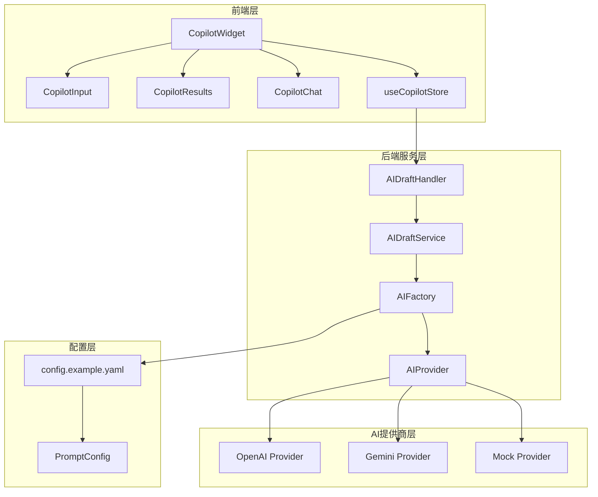
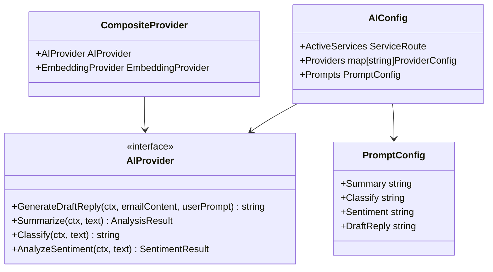
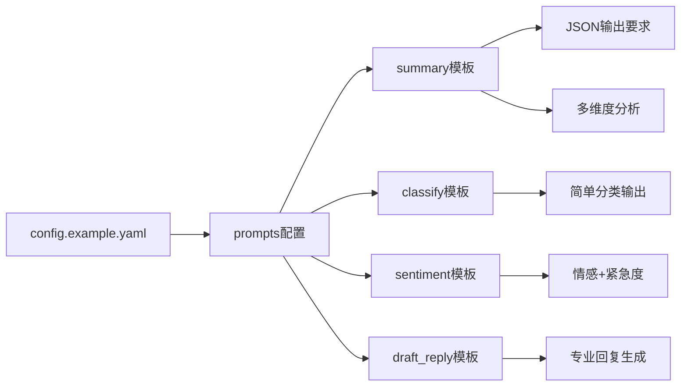
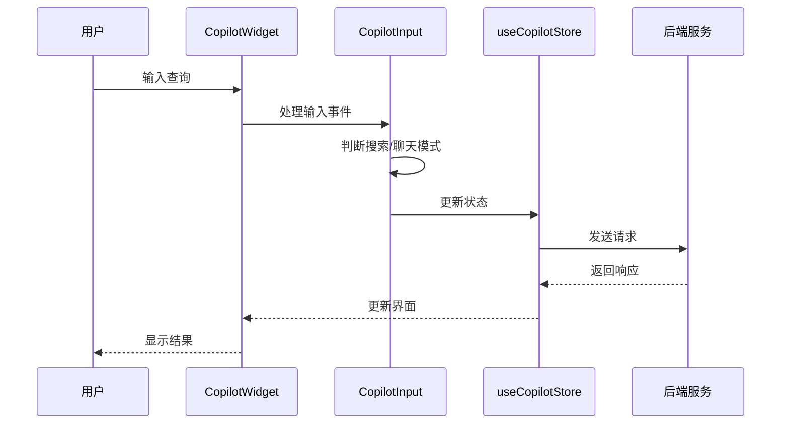
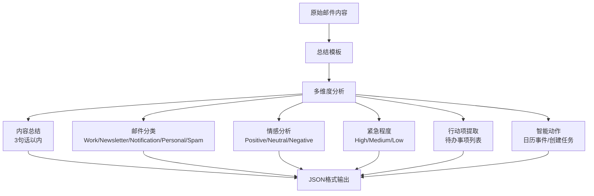

# 智能回复与提示工程

<cite>
**本文档引用的文件**
- [ai_factory.go](file://backend/internal/service/ai_factory.go)
- [config.example.yaml](file://backend/configs/config.example.yaml)
- [CopilotWidget.tsx](file://frontend/src/components/copilot/CopilotWidget.tsx)
- [CopilotInput.tsx](file://frontend/src/components/copilot/CopilotInput.tsx)
- [CopilotResults.tsx](file://frontend/src/components/copilot/CopilotResults.tsx)
- [CopilotChat.tsx](file://frontend/src/components/copilot/CopilotChat.tsx)
- [CopilotResults.tsx](file://frontend/src/components/copilot/CopilotResults.tsx)
- [useCopilotStore.ts](file://frontend/src/store/useCopilotStore.ts)
- [ai_draft.go](file://backend/internal/service/ai_draft.go)
- [ai_draft.go](file://backend/internal/handler/ai_draft.go)
- [app_config.go](file://backend/configs/app_config.go)
</cite>

## 目录
1. [简介](#简介)
2. [系统架构概览](#系统架构概览)
3. [核心组件分析](#核心组件分析)
4. [提示工程原理](#提示工程原理)
5. [配置文件解析](#配置文件解析)
6. [前端交互界面](#前端交互界面)
7. [提示模板设计](#提示模板设计)
8. [自定义与优化指南](#自定义与优化指南)
9. [最佳实践](#最佳实践)
10. [故障排除](#故障排除)

## 简介

智能回复与提示工程是EchoMind系统的核心功能模块，通过精心设计的提示模板和AI提供商集成，为用户提供智能化的邮件回复生成、内容分析和智能搜索等能力。该系统采用模块化架构，支持多种AI提供商，并提供了灵活的提示工程框架。

## 系统架构概览

系统采用前后端分离架构，后端负责AI服务集成和业务逻辑处理，前端提供用户交互界面。



**图表来源**
- [CopilotWidget.tsx](file://frontend/src/components/copilot/CopilotWidget.tsx#L1-L56)
- [ai_factory.go](file://backend/internal/service/ai_factory.go#L1-L107)
- [ai_draft.go](file://backend/internal/handler/ai_draft.go#L1-L136)

## 核心组件分析

### AI工厂组件 (AI Factory)

AI工厂是系统的核心组件，负责管理多个AI提供商并协调它们的服务。



**图表来源**
- [ai_factory.go](file://backend/internal/service/ai_factory.go#L18-L21)
- [app_config.go](file://backend/configs/app_config.go#L48-L65)

**章节来源**
- [ai_factory.go](file://backend/internal/service/ai_factory.go#L24-L95)

### 提示映射函数 (toPromptMap)

`toPromptMap`函数是提示工程的核心转换器，负责将配置文件中的提示模板转换为AI提供商可识别的映射格式。

```mermaid
flowchart TD
A[PromptConfig] --> B[toPromptMap函数]
B --> C[映射转换]
C --> D[返回map[string]string]
E[Summary模板] --> C
F[Classify模板] --> C
G[Sentiment模板] --> C
H[DraftReply模板] --> C
D --> I[AI Provider使用]
I --> J[不同AI服务调用]
```

**图表来源**
- [ai_factory.go](file://backend/internal/service/ai_factory.go#L98-L106)

**章节来源**
- [ai_factory.go](file://backend/internal/service/ai_factory.go#L98-L106)

## 提示工程原理

### 提示工程的核心作用

提示工程在AI系统中扮演着至关重要的角色，它直接影响AI输出的质量、风格和准确性。在EchoMind系统中，提示工程主要体现在以下几个方面：

1. **输出格式控制**：确保AI返回符合预期的数据结构
2. **风格一致性**：维持系统输出的专业性和一致性
3. **功能特化**：针对不同场景定制专门的提示模板
4. **错误处理**：提供备用提示以应对异常情况

### 提示模板的分类

系统中的提示模板按功能可分为四大类：

| 模板类型 | 功能描述 | 输出格式 | 应用场景 |
|---------|---------|---------|---------|
| summary | 邮件内容摘要分析 | JSON结构 | 邮件分类、情感分析、行动项提取 |
| classify | 邮件类型分类 | 字符串类别 | 邮件自动分类和过滤 |
| sentiment | 情感和紧急度分析 | JSON结构 | 邮件优先级判断 |
| draft_reply | 邮件回复生成 | 自然语言文本 | 智能邮件回复 |

**章节来源**
- [config.example.yaml](file://backend/configs/config.example.yaml#L118-L179)

## 配置文件解析

### 配置文件结构

`config.example.yaml`文件包含了系统的完整配置信息，其中`prompts`部分定义了所有提示模板。



**图表来源**
- [config.example.yaml](file://backend/configs/config.example.yaml#L118-L179)

### 默认提示词设计分析

#### draft_reply模板设计特点

`draft_reply`模板体现了现代提示工程的最佳实践：

1. **角色定位明确**：将用户定位为"高效的职业经理人"
2. **输出要求具体**：强调专业、友好、切中要点的回复风格
3. **上下文处理**：要求保持语气专业的同时根据上下文补充信息
4. **简洁性原则**：避免冗余表达，注重实际效果

**章节来源**
- [config.example.yaml](file://backend/configs/config.example.yaml#L176-L179)

## 前端交互界面

### CopilotWidget组件架构

前端的CopilotWidget作为用户与AI系统交互的主要入口，提供了直观的用户体验。



**图表来源**
- [CopilotWidget.tsx](file://frontend/src/components/copilot/CopilotWidget.tsx#L1-L56)
- [CopilotInput.tsx](file://frontend/src/components/copilot/CopilotInput.tsx#L24-L83)

### 交互模式设计

系统支持两种主要的交互模式：

1. **搜索模式**：用于查找邮件和相关信息
2. **聊天模式**：用于直接的AI对话和智能回复

**章节来源**
- [CopilotWidget.tsx](file://frontend/src/components/copilot/CopilotWidget.tsx#L10-L56)
- [CopilotInput.tsx](file://frontend/src/components/copilot/CopilotInput.tsx#L24-L83)

## 提示模板设计

### 总结模板 (Summary Template)

总结模板是最复杂的提示模板，要求AI完成多项分析任务：



**图表来源**
- [config.example.yaml](file://backend/configs/config.example.yaml#L120-L166)

### 回复生成模板 (Draft Reply Template)

回复生成模板专注于创造高质量的邮件回复：

1. **角色设定**：职业经理人的专业形象
2. **风格控制**：专业、友好、切中要点
3. **上下文处理**：根据原始邮件内容生成合适的回复
4. **用户指令**：支持用户提供的简短提示

**章节来源**
- [config.example.yaml](file://backend/configs/config.example.yaml#L176-L179)

## 自定义与优化指南

### 提示模板自定义步骤

1. **修改配置文件**：编辑`config.example.yaml`中的`prompts`部分
2. **遵循格式规范**：确保输出格式符合预期要求
3. **测试验证**：通过系统测试验证新模板的效果
4. **性能监控**：观察AI响应时间和质量指标

### 优化策略

#### 输出格式优化

- **JSON严格模式**：对于需要结构化输出的功能，严格要求JSON格式
- **键名稳定性**：保持JSON键名不变，确保后端解析正确
- **错误恢复机制**：提供备用提示以应对解析失败

#### 内容质量优化

- **角色明确**：清晰的角色定位提升输出质量
- **约束条件**：设置合理的输出长度和风格约束
- **示例引导**：提供具体的输出示例帮助AI理解要求

**章节来源**
- [config.example.yaml](file://backend/configs/config.example.yaml#L115-L118)

## 最佳实践

### 提示工程最佳实践

1. **渐进式复杂度**：从简单的提示开始，逐步增加复杂度
2. **测试驱动开发**：每次修改后都进行充分测试
3. **用户反馈循环**：收集用户反馈持续优化提示
4. **多场景验证**：在不同场景下测试提示效果

### 性能优化建议

1. **缓存机制**：对常用提示进行缓存
2. **批量处理**：合并相似的请求减少API调用
3. **超时控制**：设置合理的请求超时时间
4. **错误重试**：实现智能的错误重试机制

### 安全考虑

1. **输入验证**：严格验证用户输入防止恶意提示
2. **输出过滤**：对AI输出进行安全检查
3. **访问控制**：限制敏感功能的访问权限
4. **审计日志**：记录所有AI交互便于追踪

## 故障排除

### 常见问题及解决方案

#### 提示模板不生效

**症状**：修改提示模板后AI仍然使用默认行为

**原因分析**：
- 配置文件未正确加载
- 提示映射函数未更新
- AI提供商不支持自定义提示

**解决方案**：
1. 检查配置文件语法
2. 重启服务使配置生效
3. 验证AI提供商支持情况

#### 输出格式错误

**症状**：AI返回非预期的输出格式

**原因分析**：
- 提示模板要求不明确
- JSON格式验证失败
- AI理解偏差

**解决方案**：
1. 明确输出格式要求
2. 添加格式验证示例
3. 实现错误恢复机制

#### 性能问题

**症状**：AI响应速度慢或超时

**原因分析**：
- 提示模板过于复杂
- AI提供商负载过高
- 网络连接不稳定

**解决方案**：
1. 简化提示模板
2. 实现请求队列
3. 添加本地缓存

**章节来源**
- [ai_factory.go](file://backend/internal/service/ai_factory.go#L98-L106)
- [ai_draft.go](file://backend/internal/handler/ai_draft.go#L104-L135)

## 结论

智能回复与提示工程是EchoMind系统的核心竞争力，通过精心设计的提示模板和灵活的AI提供商集成，为用户提供了高质量的智能服务。系统的模块化架构使得提示工程具有良好的可扩展性和可维护性，而完善的配置管理和错误处理机制确保了系统的稳定运行。

随着AI技术的不断发展，提示工程将继续演进，为用户提供更加智能、个性化的交互体验。开发者应该持续关注最新的提示工程技术和最佳实践，不断优化和完善系统的提示模板，以保持技术领先优势。