# 同步流程

<cite>
**本文档中引用的文件**
- [sync.go](file://backend/internal/service/sync.go)
- [container.go](file://backend/internal/app/container.go)
- [account_repository.go](file://backend/internal/repository/account_repository.go)
- [email_ingestor.go](file://backend/internal/service/email_ingestor.go)
- [imap_connector.go](file://backend/internal/service/imap_connector.go)
- [email_repository.go](file://backend/internal/repository/email_repository.go)
- [fetch.go](file://backend/pkg/imap/fetch.go)
- [email_account.go](file://backend/internal/model/email_account.go)
- [email.go](file://backend/internal/model/email.go)
- [email_events.go](file://backend/internal/event/email_events.go)
- [sync_test.go](file://backend/internal/service/sync_test.go)
- [sync.go](file://backend/internal/handler/sync.go)
</cite>

## 目录
1. [概述](#概述)
2. [系统架构](#系统架构)
3. [SyncService 核心流程](#syncservice-核心流程)
4. [依赖注入与组件解耦](#依赖注入与组件解耦)
5. [数据流分析](#数据流分析)
6. [增量同步机制](#增量同步机制)
7. [幂等性保证](#幂等性保证)
8. [错误处理与重试](#错误处理与重试)
9. [性能优化策略](#性能优化策略)
10. [总结](#总结)

## 概述

EchoMind的同步流程是一个完整的电子邮件数据获取、处理和存储的生命周期管理机制。该系统通过`SyncService.SyncEmails`方法实现了从IMAP服务器获取邮件到数据库持久化的完整流程，确保数据的增量性和幂等性。

同步流程的核心价值在于：
- **自动化数据获取**：定期从IMAP服务器拉取新邮件
- **智能数据处理**：过滤重复邮件，提取关键信息
- **事件驱动架构**：通过事件总线触发后续处理任务
- **可扩展设计**：支持用户、团队和组织级别的账户管理

## 系统架构

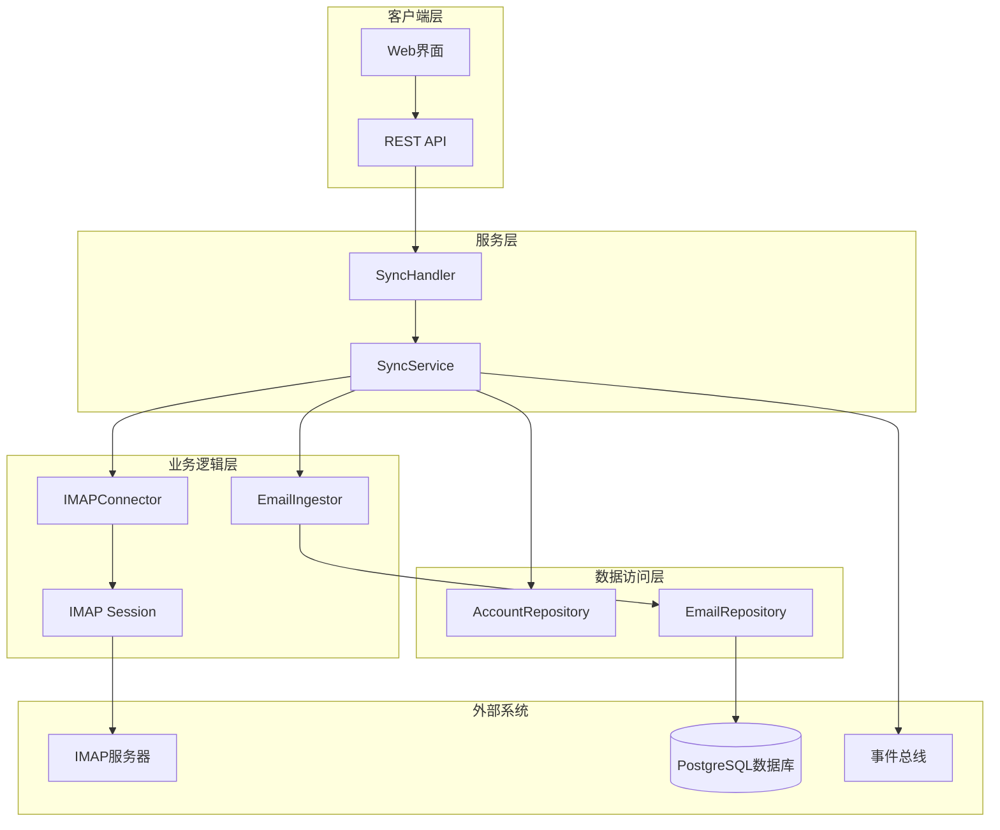

**图表来源**
- [sync.go](file://backend/internal/service/sync.go#L78-L102)
- [container.go](file://backend/internal/app/container.go#L15-L29)

## SyncService 核心流程

`SyncService.SyncEmails`方法是整个同步流程的核心入口，包含四个关键步骤：

### 步骤1：查询账户配置

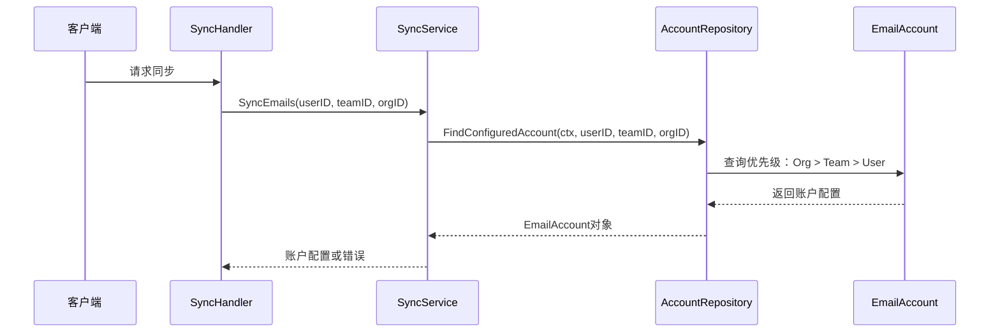

**图表来源**
- [sync.go](file://backend/internal/service/sync.go#L105-L118)
- [account_repository.go](file://backend/internal/repository/account_repository.go#L28-L46)

账户查询遵循以下优先级顺序：
1. **组织级别**：如果提供了`organizationID`，优先使用组织账户
2. **团队级别**：如果提供了`teamID`但没有`organizationID`，使用团队账户
3. **用户级别**：默认使用用户个人账户

**节来源**
- [sync.go](file://backend/internal/service/sync.go#L105-L118)
- [account_repository.go](file://backend/internal/repository/account_repository.go#L28-L46)

### 步骤2：建立IMAP连接

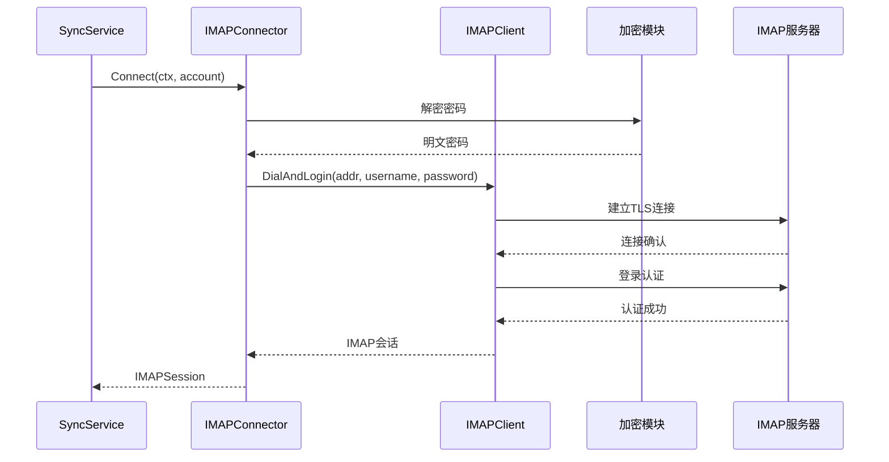

**图表来源**
- [sync.go](file://backend/internal/service/sync.go#L120-L126)
- [imap_connector.go](file://backend/internal/service/imap_connector.go#L52-L73)

连接过程包括：
- **密码解密**：使用配置的安全密钥解密存储的加密密码
- **TLS连接**：建立安全的SSL/TLS连接
- **身份验证**：使用用户名和密码进行IMAP认证
- **会话管理**：维护IMAP会话状态

**节来源**
- [imap_connector.go](file://backend/internal/service/imap_connector.go#L52-L73)

### 步骤3：拉取新邮件

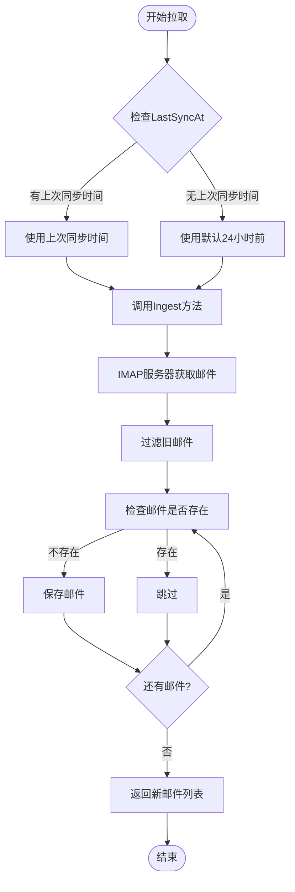

**图表来源**
- [sync.go](file://backend/internal/service/sync.go#L128-L139)
- [email_ingestor.go](file://backend/internal/service/email_ingestor.go#L27-L82)

**节来源**
- [sync.go](file://backend/internal/service/sync.go#L128-L139)
- [email_ingestor.go](file://backend/internal/service/email_ingestor.go#L27-L82)

### 步骤4：发布同步事件

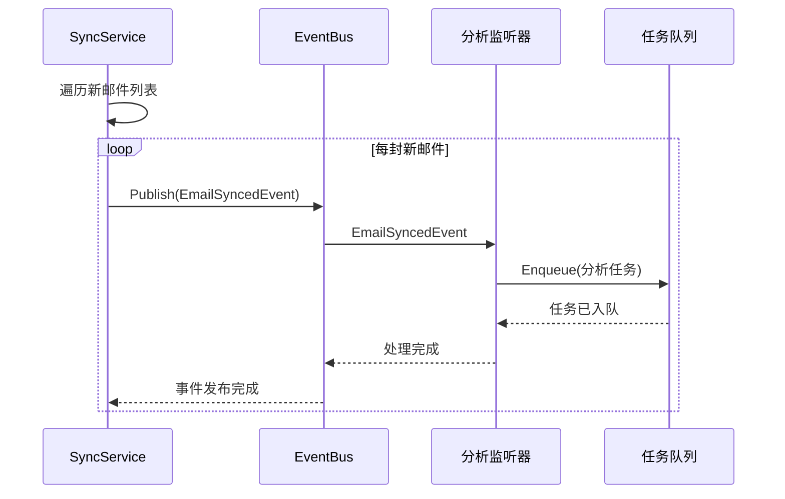

**图表来源**
- [sync.go](file://backend/internal/service/sync.go#L141-L154)
- [email_events.go](file://backend/internal/event/email_events.go#L10-L18)

**节来源**
- [sync.go](file://backend/internal/service/sync.go#L141-L154)
- [email_events.go](file://backend/internal/event/email_events.go#L10-L18)

## 依赖注入与组件解耦

EchoMind采用依赖注入模式实现组件间的松耦合设计：

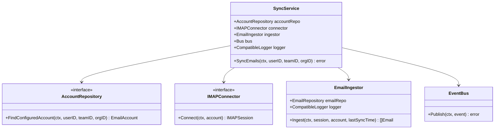

**图表来源**
- [sync.go](file://backend/internal/service/sync.go#L78-L102)
- [container.go](file://backend/internal/app/container.go#L69-L85)

**节来源**
- [sync.go](file://backend/internal/service/sync.go#L78-L102)
- [container.go](file://backend/internal/app/container.go#L69-L85)

## 数据流分析

### IMAP会话到数据库的完整数据流

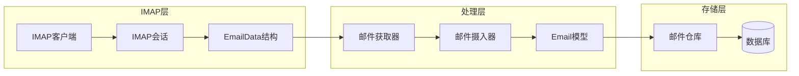

**图表来源**
- [fetch.go](file://backend/pkg/imap/fetch.go#L19-L100)
- [email_ingestor.go](file://backend/internal/service/email_ingestor.go#L27-L82)
- [email_repository.go](file://backend/internal/repository/email_repository.go#L11-L21)

### 数据转换映射关系

| IMAP层字段 | EmailData结构 | Email模型字段 | 描述 |
|------------|---------------|---------------|------|
| Subject | Subject | Subject | 邮件主题 |
| From | Sender | Sender | 发件人信息 |
| Date | Date | Date | 邮件发送时间 |
| Message-ID | MessageID | MessageID | 唯一消息标识 |
| Body | BodyText | BodyText | 纯文本正文 |
| Body | BodyHTML | BodyHTML | HTML格式正文 |

**节来源**
- [fetch.go](file://backend/pkg/imap/fetch.go#L10-L17)
- [email.go](file://backend/internal/model/email.go#L11-L36)

## 增量同步机制

### LastSyncAt 时间戳管理

EchoMind通过`EmailAccount.LastSyncAt`字段实现增量同步：

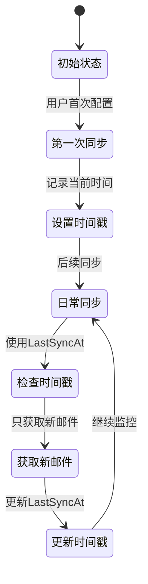

**图表来源**
- [sync.go](file://backend/internal/service/sync.go#L129-L133)
- [email_account.go](file://backend/internal/model/email_account.go#L32)

### 增量同步逻辑实现

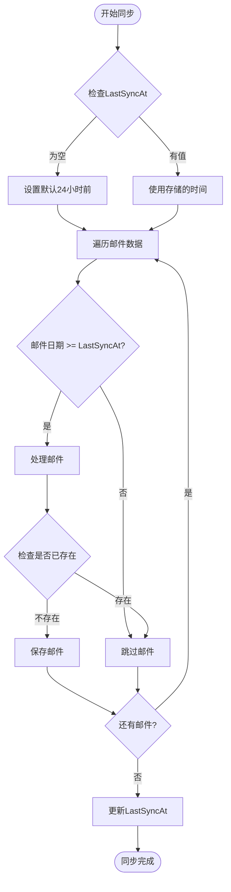

**图表来源**
- [email_ingestor.go](file://backend/internal/service/email_ingestor.go#L42-L56)

**节来源**
- [sync.go](file://backend/internal/service/sync.go#L129-L133)
- [email_ingestor.go](file://backend/internal/service/email_ingestor.go#L42-L56)

## 幂等性保证

### 防止重复处理机制

EchoMind通过多重检查确保同步操作的幂等性：

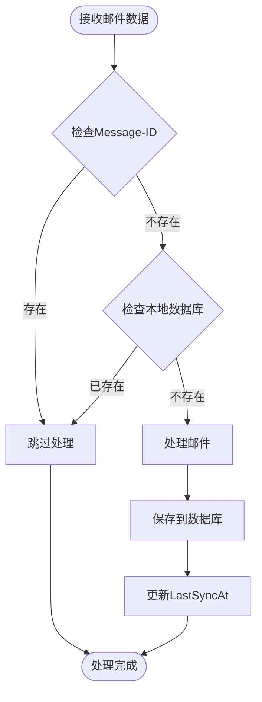

**图表来源**
- [email_ingestor.go](file://backend/internal/service/email_ingestor.go#L48-L56)
- [email_repository.go](file://backend/internal/repository/email_repository.go#L56-L66)

### 幂等性检查点

1. **Message-ID唯一性检查**：防止同一邮件被多次处理
2. **本地数据库查询**：确保不会重复保存相同邮件
3. **事务控制**：保证数据一致性
4. **事件去重**：避免重复发布同步事件

**节来源**
- [email_ingestor.go](file://backend/internal/service/email_ingestor.go#L48-L56)
- [email_repository.go](file://backend/internal/repository/email_repository.go#L56-L66)

## 错误处理与重试

### 异常处理层次结构

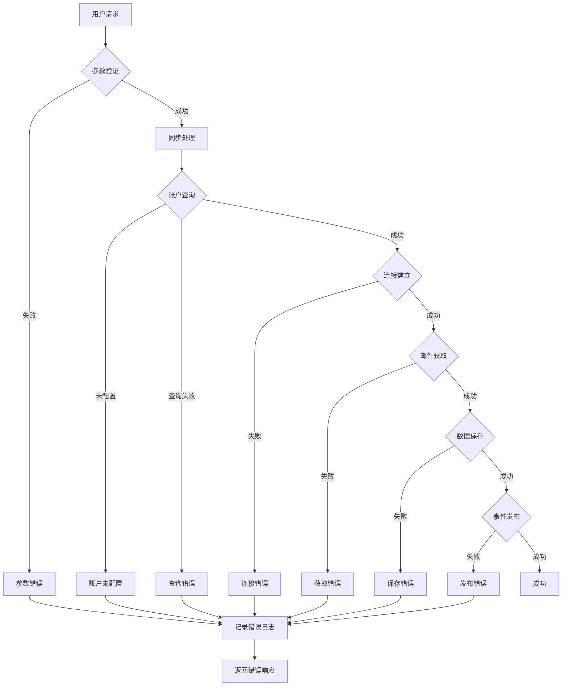

**图表来源**
- [sync.go](file://backend/internal/service/sync.go#L105-L156)

### 错误分类与处理策略

| 错误类型 | 处理策略 | 示例场景 |
|----------|----------|----------|
| 账户未配置 | 返回400错误 | 用户未配置邮箱账户 |
| 连接失败 | 记录错误状态 | IMAP服务器不可达 |
| 认证失败 | 更新错误状态 | 密码错误或权限不足 |
| 数据库错误 | 重试机制 | 数据库连接超时 |
| 网络超时 | 指数退避重试 | 网络不稳定 |

**节来源**
- [sync.go](file://backend/internal/service/sync.go#L105-L156)

## 性能优化策略

### 批量处理优化

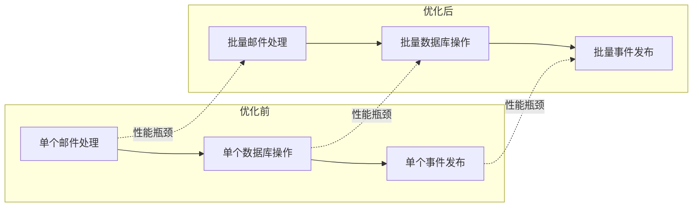

### 关键优化点

1. **连接池管理**：复用IMAP连接减少握手开销
2. **批量数据库操作**：使用事务批量插入邮件数据
3. **异步事件处理**：事件发布不阻塞主流程
4. **内存管理**：及时释放大对象占用的内存

**节来源**
- [imap_connector.go](file://backend/internal/service/imap_connector.go#L52-L73)
- [email_ingestor.go](file://backend/internal/service/email_ingestor.go#L27-L82)

## 总结

EchoMind的同步流程展现了现代应用程序中数据同步的最佳实践：

### 核心优势

1. **模块化设计**：清晰的职责分离和依赖注入
2. **增量同步**：基于时间戳的高效增量处理
3. **幂等性保证**：多重检查防止重复处理
4. **事件驱动**：松耦合的后续处理机制
5. **错误恢复**：完善的异常处理和状态管理

### 技术亮点

- **安全连接**：TLS加密和密码解密保护
- **智能过滤**：基于Message-ID的重复检测
- **状态跟踪**：LastSyncAt确保增量同步
- **异步处理**：事件总线实现解耦

### 扩展性考虑

该同步流程为未来的功能扩展奠定了良好基础：
- 支持多账户并发同步
- 可插拔的邮件处理引擎
- 可配置的同步策略
- 分布式任务调度支持

通过这种精心设计的同步流程，EchoMind能够可靠、高效地处理大量电子邮件数据，为用户提供智能化的邮件管理体验。