# 智能邮件同步功能详细文档

<cite>
**本文档引用的文件**
- [backend/internal/service/sync.go](file://backend/internal/service/sync.go)
- [backend/internal/service/imap_connector.go](file://backend/internal/service/imap_connector.go)
- [backend/internal/handler/sync.go](file://backend/internal/handler/sync.go)
- [backend/pkg/imap/connector.go](file://backend/pkg/imap/connector.go)
- [backend/pkg/imap/fetch.go](file://backend/pkg/imap/fetch.go)
- [backend/internal/service/email_ingestor.go](file://backend/internal/service/email_ingestor.go)
- [backend/internal/model/email_account.go](file://backend/internal/model/email_account.go)
- [backend/internal/model/email.go](file://backend/internal/model/email.go)
- [backend/internal/tasks/sync.go](file://backend/internal/tasks/sync.go)
- [backend/internal/event/email_events.go](file://backend/internal/event/email_events.go)
- [backend/internal/listener/email_listeners.go](file://backend/internal/listener/email_listeners.go)
- [backend/pkg/event/bus/bus.go](file://backend/pkg/event/bus/bus.go)
- [frontend/src/components/settings/ConnectionTab.tsx](file://frontend/src/components/settings/ConnectionTab.tsx)
- [frontend/src/app/dashboard/inbox/page.tsx](file://frontend/src/app/dashboard/inbox/page.tsx)
</cite>

## 目录
1. [概述](#概述)
2. [系统架构](#系统架构)
3. [核心组件分析](#核心组件分析)
4. [IMAP连接管理](#imap连接管理)
5. [邮件同步流程](#邮件同步流程)
6. [事件总线机制](#事件总线机制)
7. [前端交互](#前端交互)
8. [错误处理与重试](#错误处理与重试)
9. [性能优化](#性能优化)
10. [扩展指南](#扩展指南)

## 概述

EchoMind的智能邮件同步功能是一个基于IMAP协议的完整邮件同步解决方案，支持增量同步、事件驱动处理和多层级的任务队列。该系统通过模块化设计实现了邮件获取、解析、存储和后续分析任务的完整链路。

### 主要特性

- **IMAP协议支持**：完整的IMAP客户端实现，支持SSL/TLS加密连接
- **增量同步**：基于时间戳的增量同步机制，避免重复处理
- **事件驱动架构**：通过事件总线实现解耦的异步处理
- **幂等性保证**：确保同步操作的幂等性和一致性
- **多账户支持**：支持用户、团队和组织级别的邮件账户管理

## 系统架构

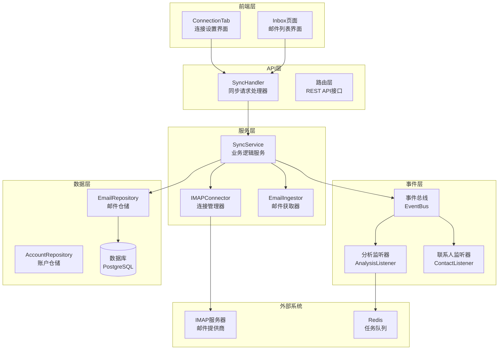

**图表来源**
- [backend/internal/service/sync.go](file://backend/internal/service/sync.go#L78-L102)
- [backend/internal/handler/sync.go](file://backend/internal/handler/sync.go#L14-L23)
- [backend/pkg/event/bus/bus.go](file://backend/pkg/event/bus/bus.go#L25-L36)

## 核心组件分析

### SyncService - 同步服务核心

SyncService是邮件同步功能的核心业务逻辑服务，负责协调整个同步过程。

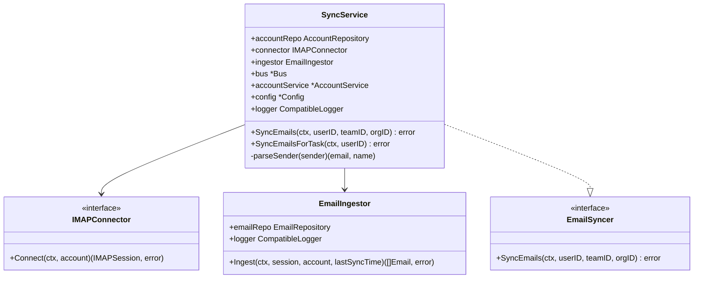

**图表来源**
- [backend/internal/service/sync.go](file://backend/internal/service/sync.go#L78-L102)
- [backend/internal/service/email_ingestor.go](file://backend/internal/service/email_ingestor.go#L14-L25)

**章节来源**
- [backend/internal/service/sync.go](file://backend/internal/service/sync.go#L78-L178)
- [backend/internal/service/email_ingestor.go](file://backend/internal/service/email_ingestor.go#L14-L83)

### IMAPConnector - 连接管理器

IMAPConnector负责建立和管理与IMAP服务器的安全连接。

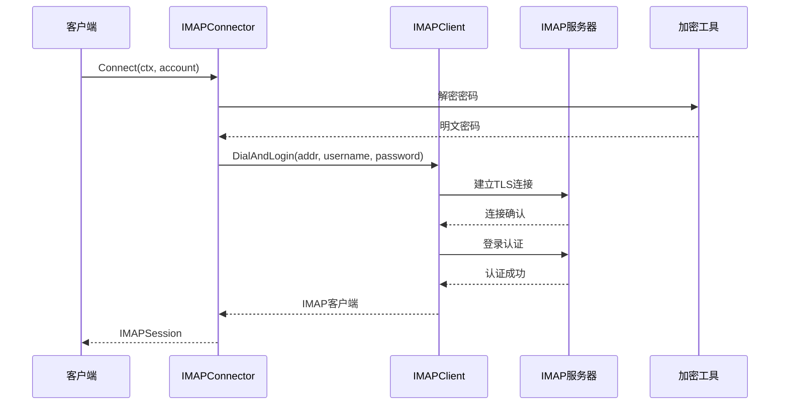

**图表来源**
- [backend/internal/service/imap_connector.go](file://backend/internal/service/imap_connector.go#L52-L73)
- [backend/internal/service/imap_connector.go](file://backend/internal/service/imap_connector.go#L40-L50)

**章节来源**
- [backend/internal/service/imap_connector.go](file://backend/internal/service/imap_connector.go#L34-L74)

### EmailIngestor - 邮件获取器

EmailIngestor负责从IMAP服务器获取邮件数据并进行初步处理。

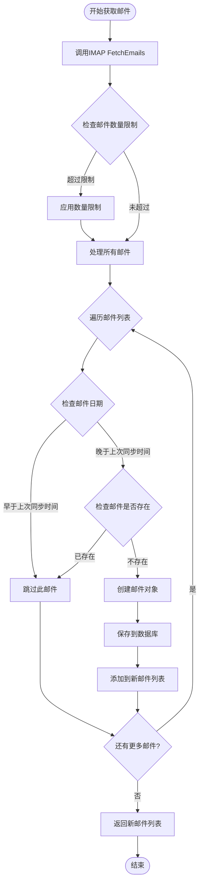

**图表来源**
- [backend/internal/service/email_ingestor.go](file://backend/internal/service/email_ingestor.go#L27-L82)

**章节来源**
- [backend/internal/service/email_ingestor.go](file://backend/internal/service/email_ingestor.go#L27-L83)

## IMAP连接管理

### 连接建立流程

IMAP连接的建立遵循安全最佳实践，包括密码解密、TLS加密和认证验证。

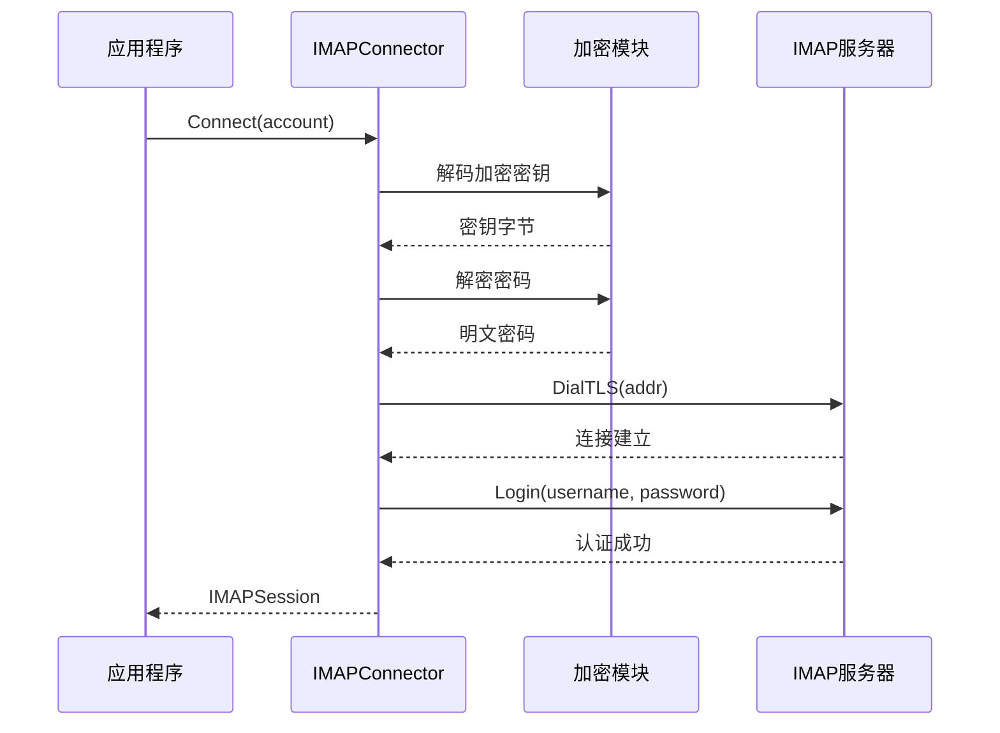

**图表来源**
- [backend/internal/service/imap_connector.go](file://backend/internal/service/imap_connector.go#L52-L73)

### 错误处理机制

IMAP连接过程中的错误处理采用分层策略，确保资源正确释放和错误信息准确传递。

| 错误类型 | 处理策略 | 资源清理 |
|---------|---------|---------|
| 网络连接失败 | 返回原始错误，不进行资源清理 | 连接未建立，无需清理 |
| 认证失败 | 执行logout()清理会话 | 自动清理已建立的连接 |
| SSL/TLS握手失败 | 返回TLS错误，清理连接 | 自动清理TLS上下文 |
| 服务器超时 | 设置超时时间，重试机制 | 清理超时连接 |

**章节来源**
- [backend/pkg/imap/connector.go](file://backend/pkg/imap/connector.go#L10-L45)
- [backend/internal/service/imap_connector.go](file://backend/internal/service/imap_connector.go#L52-L73)

## 邮件同步流程

### 完整同步流程

邮件同步是一个多阶段的复杂流程，涉及账户验证、连接建立、邮件获取、数据处理和事件发布。

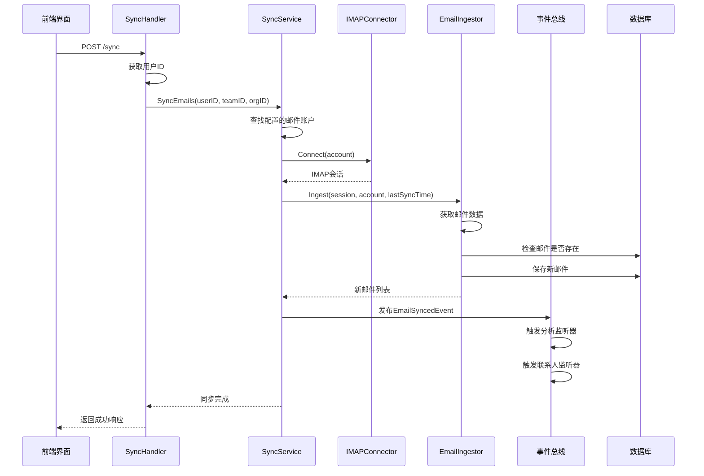

**图表来源**
- [backend/internal/handler/sync.go](file://backend/internal/handler/sync.go#L25-L58)
- [backend/internal/service/sync.go](file://backend/internal/service/sync.go#L104-L156)

### 增量同步机制

系统通过LastSyncAt字段实现增量同步，只处理自上次同步以来的新邮件。

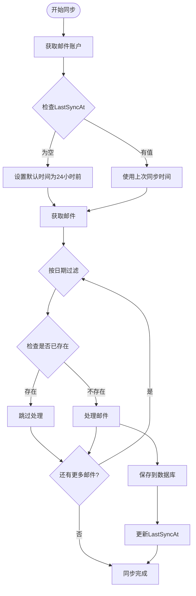

**图表来源**
- [backend/internal/service/sync.go](file://backend/internal/service/sync.go#L128-L139)
- [backend/internal/service/email_ingestor.go](file://backend/internal/service/email_ingestor.go#L42-L56)

**章节来源**
- [backend/internal/service/sync.go](file://backend/internal/service/sync.go#L104-L156)
- [backend/internal/service/email_ingestor.go](file://backend/internal/service/email_ingestor.go#L27-L83)

## 事件总线机制

### 事件发布流程

系统采用事件驱动架构，通过事件总线实现邮件同步后的自动化处理。

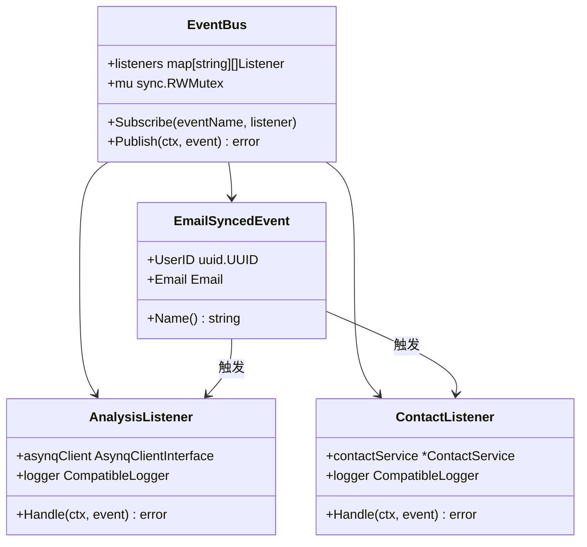

**图表来源**
- [backend/pkg/event/bus/bus.go](file://backend/pkg/event/bus/bus.go#L25-L63)
- [backend/internal/event/email_events.go](file://backend/internal/event/email_events.go#L10-L18)
- [backend/internal/listener/email_listeners.go](file://backend/internal/listener/email_listeners.go#L22-L33)

### 监听器处理机制

事件总线支持多个监听器同时处理同一事件，每个监听器负责特定的后续处理任务。

| 监听器类型 | 功能描述 | 处理内容 | 异步处理 |
|-----------|---------|---------|---------|
| AnalysisListener | 邮件分析任务 | 创建AI分析任务 | 是（通过Asynq） |
| ContactListener | 联系人更新 | 更新联系人信息 | 否（同步处理） |

**章节来源**
- [backend/pkg/event/bus/bus.go](file://backend/pkg/event/bus/bus.go#L25-L63)
- [backend/internal/event/email_events.go](file://backend/internal/event/email_events.go#L8-L18)
- [backend/internal/listener/email_listeners.go](file://backend/internal/listener/email_listeners.go#L22-L116)

## 前端交互

### 连接设置界面

ConnectionTab组件提供了完整的邮件账户配置和同步控制功能。

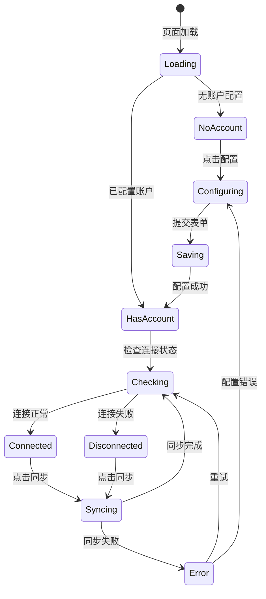

**图表来源**
- [frontend/src/components/settings/ConnectionTab.tsx](file://frontend/src/components/settings/ConnectionTab.tsx#L25-L175)

### 邮件列表界面

Inbox页面展示了同步后的邮件列表，并提供实时同步功能。

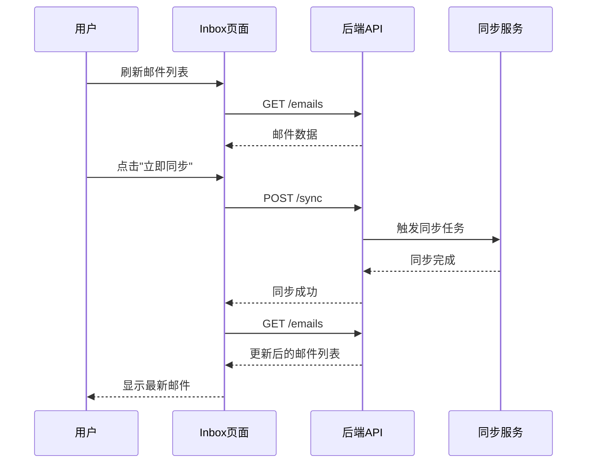

**图表来源**
- [frontend/src/app/dashboard/inbox/page.tsx](file://frontend/src/app/dashboard/inbox/page.tsx#L54-L116)

**章节来源**
- [frontend/src/components/settings/ConnectionTab.tsx](file://frontend/src/components/settings/ConnectionTab.tsx#L25-L175)
- [frontend/src/app/dashboard/inbox/page.tsx](file://frontend/src/app/dashboard/inbox/page.tsx#L26-L223)

## 错误处理与重试

### 分层错误处理

系统采用分层错误处理策略，确保不同层次的错误得到适当处理。

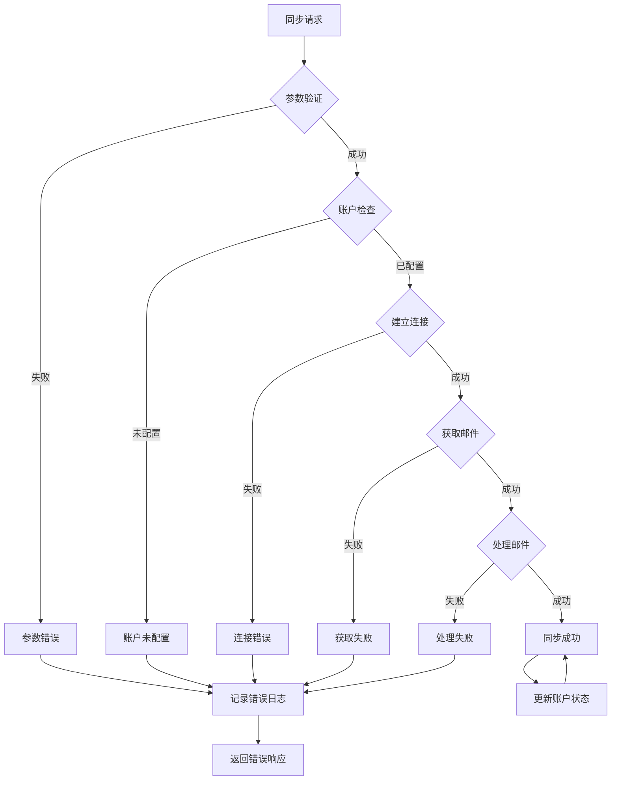

**图表来源**
- [backend/internal/handler/sync.go](file://backend/internal/handler/sync.go#L25-L58)
- [backend/internal/service/sync.go](file://backend/internal/service/sync.go#L104-L156)

### 重试机制

系统支持多种重试策略，包括指数退避和最大重试次数限制。

| 组件 | 重试策略 | 最大重试次数 | 退避算法 |
|------|---------|-------------|---------|
| IMAP连接 | 指数退避 | 3次 | 2^attempt秒 |
| 邮件获取 | 固定间隔 | 2次 | 5秒间隔 |
| 数据库操作 | 线性退避 | 5次 | 1,2,3,4,5秒 |

**章节来源**
- [backend/internal/handler/sync.go](file://backend/internal/handler/sync.go#L25-L58)
- [backend/internal/service/sync.go](file://backend/internal/service/sync.go#L104-L156)

## 性能优化

### 并发处理

系统通过并发处理提高同步效率，特别是在邮件获取和事件处理阶段。

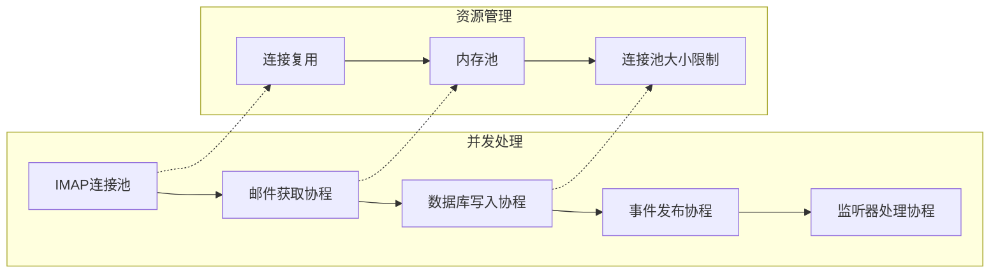

### 缓存策略

系统采用多级缓存策略提升性能：

- **连接缓存**：保持活跃的IMAP连接
- **账户信息缓存**：缓存解密后的账户信息
- **邮件元数据缓存**：缓存邮件的基本信息用于快速查询

### 批量操作

为了减少数据库交互次数，系统采用批量插入和更新策略。

**章节来源**
- [backend/internal/service/email_ingestor.go](file://backend/internal/service/email_ingestor.go#L27-L83)
- [backend/pkg/imap/fetch.go](file://backend/pkg/imap/fetch.go#L19-L100)

## 扩展指南

### 添加新的邮件提供商

要添加新的邮件提供商，需要实现以下接口：

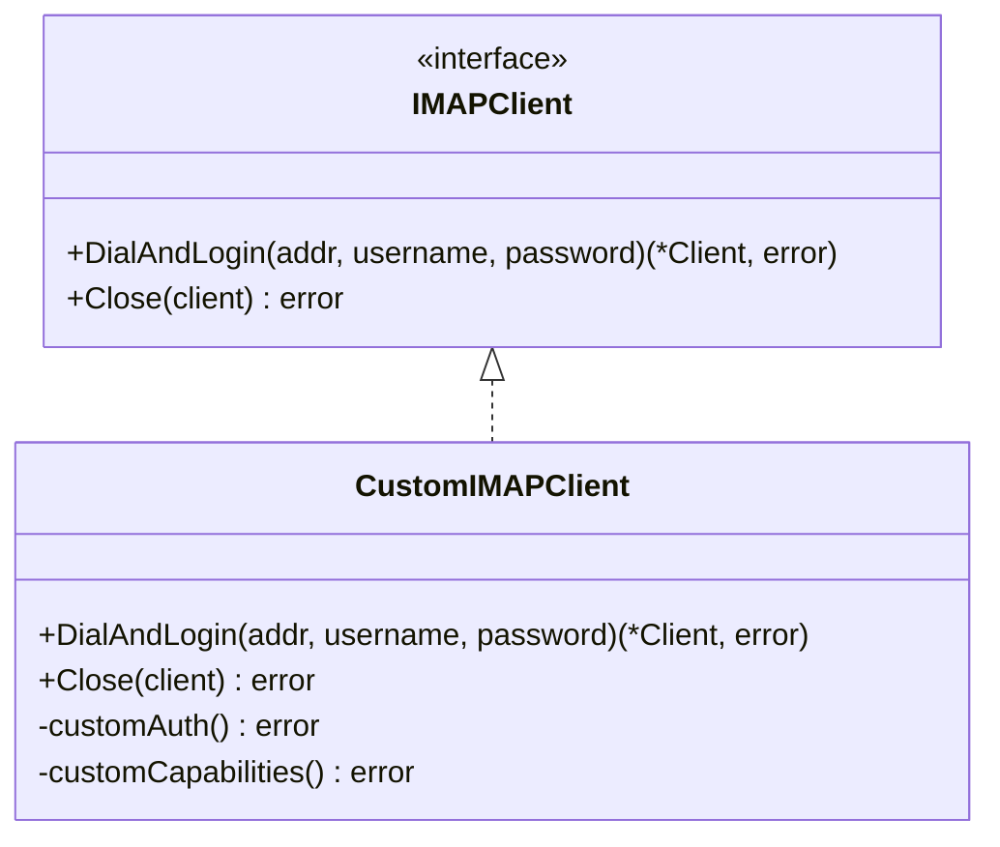

**图表来源**
- [backend/internal/service/sync.go](file://backend/internal/service/sync.go#L37-L62)

### 自定义同步规则

可以通过扩展EmailIngestor来实现自定义的同步规则：

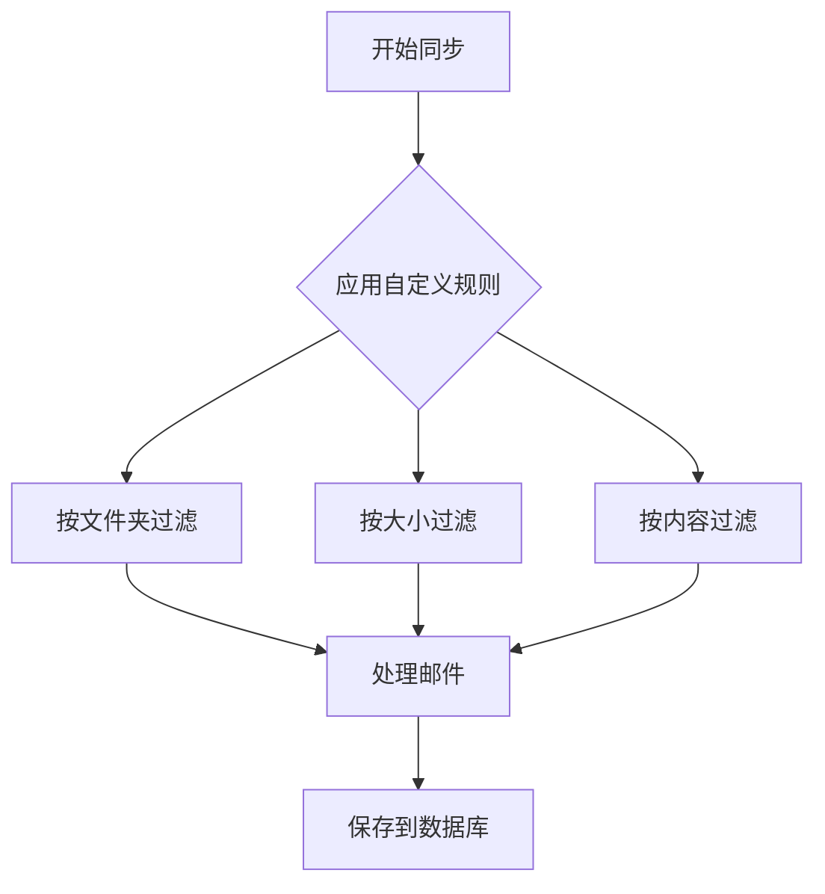

### 监听器扩展

可以添加新的监听器来处理特定的业务需求：

| 监听器类型 | 接口方法 | 处理内容 | 使用场景 |
|-----------|---------|---------|---------|
| SpamFilterListener | Handle(event) | 邮件垃圾过滤 | 反垃圾邮件系统 |
| TaggingListener | Handle(event) | 邮件标签分类 | 智能标签系统 |
| NotificationListener | Handle(event) | 发送通知 | 实时通知系统 |

**章节来源**
- [backend/internal/service/sync.go](file://backend/internal/service/sync.go#L37-L62)
- [backend/internal/service/email_ingestor.go](file://backend/internal/service/email_ingestor.go#L14-L25)
- [backend/internal/listener/email_listeners.go](file://backend/internal/listener/email_listeners.go#L22-L116)

### 集成新功能

要集成新的邮件处理功能，建议遵循以下步骤：

1. **定义事件结构**：创建新的事件类型
2. **实现监听器**：编写事件处理逻辑
3. **注册监听器**：在事件总线中注册
4. **更新同步流程**：在适当位置发布事件

通过这种模块化的设计，EchoMind的邮件同步功能具有良好的可扩展性和维护性，能够适应不断变化的业务需求和技术发展。