# 连接与认证

<cite>
**本文档引用的文件**
- [sync.go](file://backend/internal/service/sync.go)
- [imap_connector.go](file://backend/internal/service/imap_connector.go)
- [email_account.go](file://backend/internal/model/email_account.go)
- [crypto.go](file://backend/pkg/utils/crypto.go)
- [app_config.go](file://backend/configs/app_config.go)
- [account.go](file://backend/internal/service/account.go)
- [connector.go](file://backend/pkg/imap/connector.go)
- [sync_test.go](file://backend/internal/service/sync_test.go)
- [config.example.yaml](file://backend/configs/config.example.yaml)
</cite>

## 目录
1. [简介](#简介)
2. [系统架构概览](#系统架构概览)
3. [核心组件分析](#核心组件分析)
4. [密码加密与解密机制](#密码加密与解密机制)
5. [IMAP连接流程](#imap连接流程)
6. [安全最佳实践](#安全最佳实践)
7. [错误处理与故障排除](#错误处理与故障排除)
8. [扩展OAuth2认证](#扩展oauth2认证)
9. [总结](#总结)

## 简介

EchoMind通过IMAP协议实现了安全的电子邮件账户连接功能，为用户提供无缝的邮件同步体验。该系统采用多层安全架构，确保用户凭据的安全存储和传输，同时支持多种邮件提供商的连接需求。

核心特性包括：
- 基于AES-256-GCM的密码加密存储
- TLS加密的IMAP连接
- 可扩展的认证机制
- 完善的错误处理和状态管理
- 支持团队和组织级别的账户管理

## 系统架构概览

EchoMind的连接与认证系统采用分层架构设计，确保职责分离和可维护性：

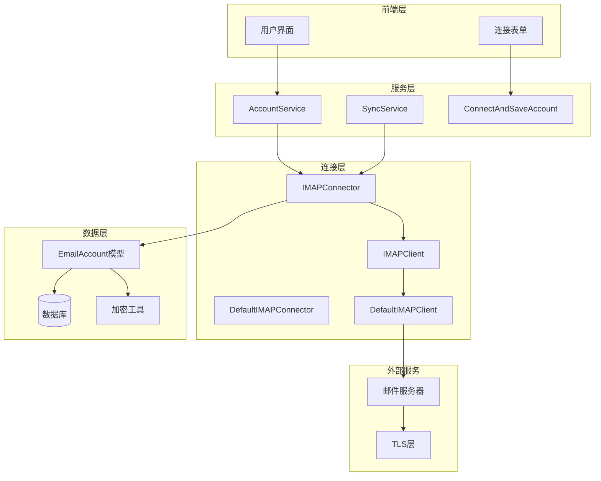

**图表来源**
- [sync.go](file://backend/internal/service/sync.go#L78-L101)
- [imap_connector.go](file://backend/internal/service/imap_connector.go#L39-L49)
- [account.go](file://backend/internal/service/account.go#L18-L28)

## 核心组件分析

### SyncService - 同步服务

SyncService是整个连接流程的核心协调者，负责管理邮件同步的完整生命周期：

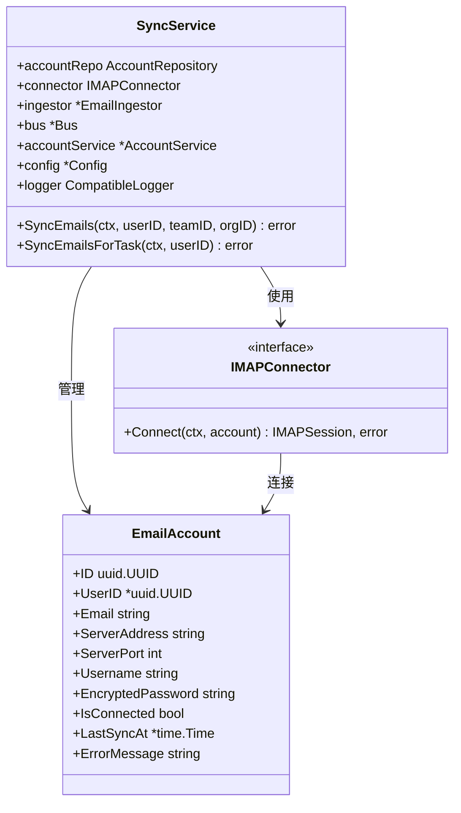

**图表来源**
- [sync.go](file://backend/internal/service/sync.go#L78-L101)
- [imap_connector.go](file://backend/internal/service/imap_connector.go#L34-L36)
- [email_account.go](file://backend/internal/model/email_account.go#L11-L34)

### IMAPConnector - 连接器接口

IMAPConnector定义了标准的IMAP连接接口，支持多种实现方式：

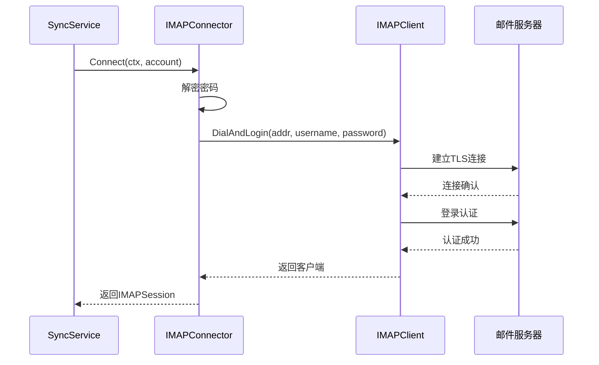

**图表来源**
- [imap_connector.go](file://backend/internal/service/imap_connector.go#L52-L72)
- [sync.go](file://backend/internal/service/sync.go#L120-L126)

**章节来源**
- [sync.go](file://backend/internal/service/sync.go#L78-L101)
- [imap_connector.go](file://backend/internal/service/imap_connector.go#L34-L73)

## 密码加密与解密机制

### 加密架构

EchoMind采用AES-256-GCM对称加密算法保护用户密码，确保即使数据库泄露也无法直接获取明文密码：

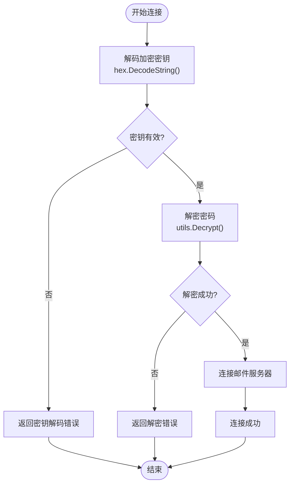

**图表来源**
- [imap_connector.go](file://backend/internal/service/imap_connector.go#L54-L71)
- [crypto.go](file://backend/pkg/utils/crypto.go#L36-L67)

### 加密密钥管理

加密密钥通过配置文件管理，确保密钥的安全性和可替换性：

| 配置项 | 类型 | 描述 | 示例值 |
|--------|------|------|--------|
| security.EncryptionKey | string | 64字符十六进制密钥 | `d2f4e23a4b5016b994844b91c48a92c1439bbf17b91a37e4a49ab39c3dbee75f` |
| 密钥长度 | 字节 | 必须为32字节(256位) | 32字节 |
| 编码格式 | 字符串 | 十六进制编码 | 64个十六进制字符 |

### 密码存储结构

EmailAccount模型中的EncryptedPassword字段存储加密后的密码：

| 字段名 | 类型 | 长度限制 | 描述 |
|--------|------|----------|------|
| EncryptedPassword | string | TEXT类型 | Base64编码的加密密码 |
| 存储格式 | Base64 | 可变长度 | (nonce + ciphertext)的Base64表示 |
| 解密要求 | 字节数组 | 32字节 | AES-256密钥 |

**章节来源**
- [email_account.go](file://backend/internal/model/email_account.go#L29)
- [crypto.go](file://backend/pkg/utils/crypto.go#L13-L77)
- [app_config.go](file://backend/configs/app_config.go#L18-L20)

## IMAP连接流程

### 连接建立步骤

EchoMind的IMAP连接遵循严格的安全流程，确保每个步骤都经过验证：

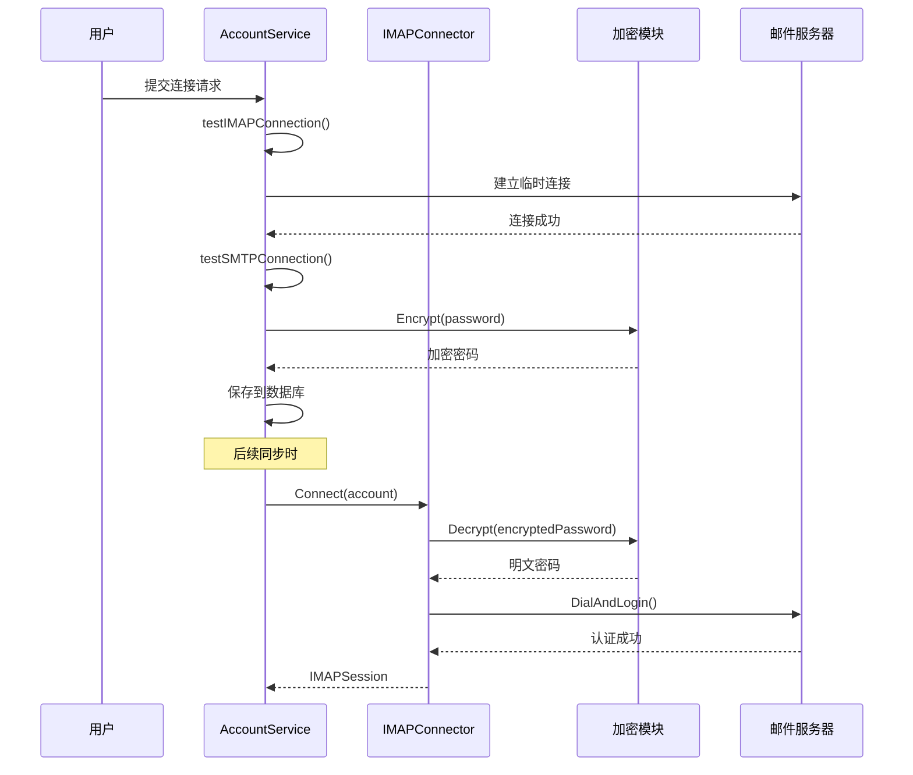

**图表来源**
- [account.go](file://backend/internal/service/account.go#L31-L111)
- [imap_connector.go](file://backend/internal/service/imap_connector.go#L52-L72)

### DefaultIMAPConnector实现

DefaultIMAPConnector提供了完整的IMAP连接实现，包括错误处理和资源清理：

| 方法 | 参数 | 返回值 | 功能描述 |
|------|------|--------|----------|
| Connect | ctx, account | IMAPSession, error | 建立认证连接 |
| DialAndLogin | addr, username, password | *client.Client, error | 建立并登录连接 |
| Logout | - | error | 注销会话 |

### TLS安全连接

系统默认使用TLS加密连接，确保数据传输安全：

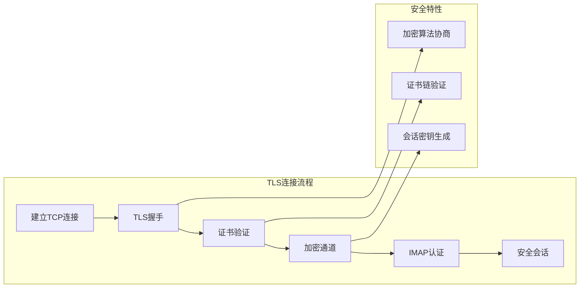

**图表来源**
- [connector.go](file://backend/pkg/imap/connector.go#L13-L36)
- [sync.go](file://backend/internal/service/sync.go#L46-L57)

**章节来源**
- [imap_connector.go](file://backend/internal/service/imap_connector.go#L52-L72)
- [connector.go](file://backend/pkg/imap/connector.go#L13-L36)
- [account.go](file://backend/internal/service/account.go#L147-L164)

## 安全最佳实践

### 错误信息脱敏

系统实现了智能的错误信息处理，避免敏感信息泄露：

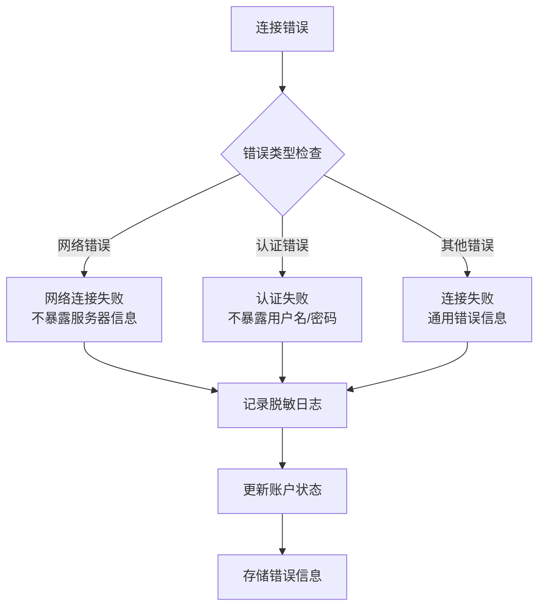

**图表来源**
- [sync.go](file://backend/internal/service/sync.go#L122-L125)
- [account.go](file://backend/internal/service/account.go#L124-L131)

### 资源管理

系统实现了完善的资源管理机制，确保连接资源的正确释放：

| 资源类型 | 管理策略 | 实现方式 | 错误处理 |
|----------|----------|----------|----------|
| IMAP连接 | 自动关闭 | defer Logout() | 最终化清理 |
| 数据库连接 | 上下文绑定 | WithContext() | 超时控制 |
| 内存资源 | 垃圾回收 | Go运行时 | 弱引用 |

### 连接状态监控

系统跟踪连接状态，提供实时的状态反馈：

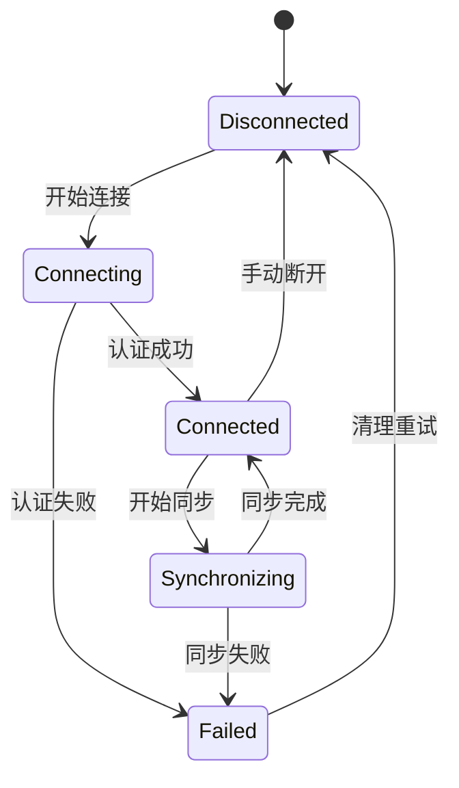

**图表来源**
- [email_account.go](file://backend/internal/model/email_account.go#L31-L34)

**章节来源**
- [sync.go](file://backend/internal/service/sync.go#L122-L125)
- [email_account.go](file://backend/internal/model/email_account.go#L31-L34)

## 错误处理与故障排除

### 常见连接错误

系统识别并处理多种连接场景：

| 错误类型 | 原因 | 处理策略 | 用户提示 |
|----------|------|----------|----------|
| 网络超时 | 服务器无响应 | 重试机制 | "无法连接到邮件服务器，请检查网络" |
| 认证失败 | 密码错误 | 更新状态 | "用户名或密码不正确" |
| 证书错误 | 服务器证书无效 | TLS配置 | "服务器证书验证失败" |
| 权限不足 | 账户权限受限 | 权限检查 | "账户权限不足，请联系管理员" |

### 故障恢复机制

系统实现了多层次的故障恢复策略：

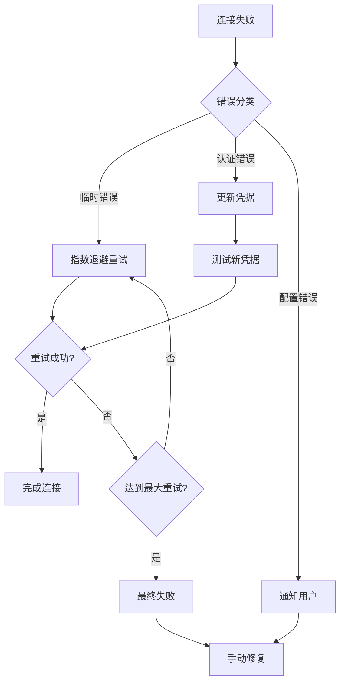

**图表来源**
- [sync.go](file://backend/internal/service/sync.go#L122-L125)

### 日志记录策略

系统采用分级日志记录，平衡信息完整性和安全性：

| 日志级别 | 记录内容 | 安全措施 |
|----------|----------|----------|
| ERROR | 连接失败详情 | 脱敏处理 |
| WARN | 性能警告 | 关键指标 |
| INFO | 状态变更 | 基本信息 |
| DEBUG | 详细调试 | 开发环境 |

**章节来源**
- [sync.go](file://backend/internal/service/sync.go#L122-L125)
- [account.go](file://backend/internal/service/account.go#L124-L131)

## 扩展OAuth2认证

### OAuth2集成架构

虽然当前版本主要支持密码认证，但系统设计已为OAuth2认证预留扩展空间：

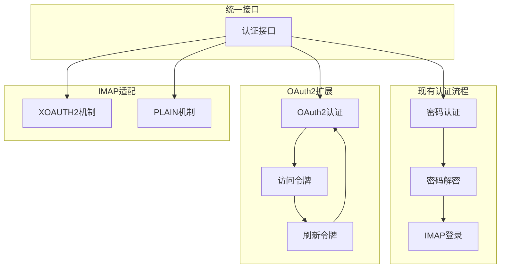

**图表来源**
- [imap_connector.go](file://backend/internal/service/imap_connector.go#L52-L72)

### OAuth2实现规划

为了支持OAuth2认证，需要扩展以下组件：

| 组件 | 扩展点 | 实现方案 | 预期收益 |
|------|--------|----------|----------|
| AccountService | 新增OAuth2支持 | 添加令牌管理 | 支持现代邮件提供商 |
| IMAPConnector | 认证机制扩展 | 实现XOAUTH2 | 增强安全性 |
| 配置管理 | OAuth2配置 | 新增授权端点 | 灵活的提供商支持 |
| 前端界面 | OAuth2流程 | 添加授权按钮 | 用户体验优化 |

### 安全考虑

OAuth2认证需要特别注意的安全事项：

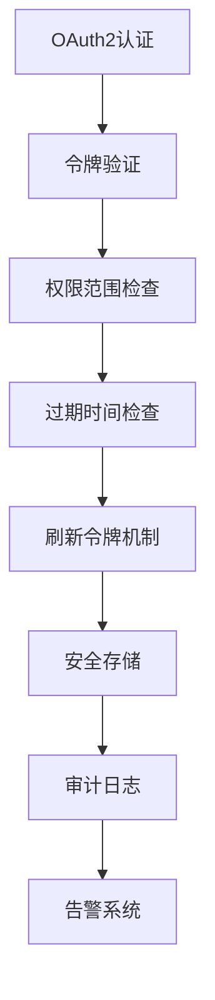

**图表来源**
- [account.go](file://backend/internal/service/account.go#L184)

**章节来源**
- [imap_connector.go](file://backend/internal/service/imap_connector.go#L52-L72)
- [account.go](file://backend/internal/service/account.go#L184)

## 总结

EchoMind的连接与认证系统通过精心设计的多层架构，实现了安全、可靠、可扩展的IMAP连接功能。系统的主要优势包括：

### 技术优势
- **安全性**：采用AES-256-GCM加密，TLS传输，完善的错误脱敏
- **可靠性**：多层次错误处理，自动重试机制，状态监控
- **可扩展性**：模块化设计，支持OAuth2等新认证机制
- **易维护性**：清晰的接口定义，完善的测试覆盖

### 安全特性
- 密码加密存储，防止数据泄露
- TLS加密传输，保护数据隐私
- 智能错误处理，避免信息泄露
- 完善的资源管理，防止资源泄漏

### 未来发展方向
- 支持OAuth2认证机制
- 增强多因素认证支持
- 优化连接性能和稳定性
- 扩展更多邮件提供商支持

该系统为EchoMind提供了坚实的基础设施，支撑着整个应用的邮件同步和智能分析功能，是系统安全性和用户体验的重要保障。