# 错误处理与重试

<cite>
**本文档引用的文件**
- [sync.go](file://backend/internal/service/sync.go)
- [sync.go](file://backend/internal/handler/sync.go)
- [email_listeners.go](file://backend/internal/listener/email_listeners.go)
- [bus.go](file://backend/pkg/event/bus/bus.go)
- [main.go](file://backend/cmd/worker/main.go)
- [sync.go](file://backend/internal/tasks/sync.go)
- [email.go](file://backend/internal/service/email.go)
- [logger.go](file://backend/pkg/logger/logger.go)
- [imap_connector.go](file://backend/internal/service/imap_connector.go)
- [email_events.go](file://backend/internal/event/email_events.go)
- [app_config.go](file://backend/configs/app_config.go)
</cite>

## 目录
1. [概述](#概述)
2. [系统架构](#系统架构)
3. [核心错误处理组件](#核心错误处理组件)
4. [SyncService中的错误处理](#syncservice中的错误处理)
5. [异步任务重试机制](#异步任务重试机制)
6. [事件总线错误处理](#事件总线错误处理)
7. [日志记录与监控](#日志记录与监控)
8. [最佳实践与配置](#最佳实践与配置)
9. [故障排除指南](#故障排除指南)

## 概述

EchoMind采用多层次的错误处理与重试机制来确保邮件同步服务的可靠性。该系统包含以下关键特性：

- **分层错误处理**：从服务层到传输层的完整错误传播链
- **智能重试策略**：基于错误类型的差异化重试策略
- **事件驱动恢复**：通过事件总线实现故障检测和恢复
- **结构化日志记录**：完整的错误追踪和监控支持

## 系统架构

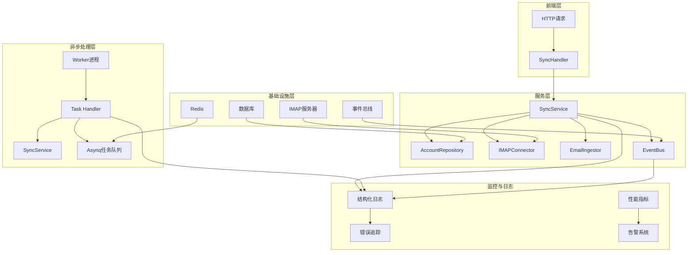

**图表来源**
- [sync.go](file://backend/internal/service/sync.go#L105-L156)
- [sync.go](file://backend/internal/handler/sync.go#L26-L57)
- [main.go](file://backend/cmd/worker/main.go#L41-L108)

## 核心错误处理组件

### 1. 错误类型分类

EchoMind将错误分为以下几类：

| 错误类型 | 描述 | 处理策略 |
|---------|------|----------|
| `gorm.ErrRecordNotFound` | 数据库记录未找到 | 返回用户友好错误，不重试 |
| 网络连接错误 | IMAP连接失败 | 指数退避重试 |
| 认证错误 | 凭据无效 | 不重试，标记账户问题 |
| 数据库错误 | 查询执行失败 | 延迟重试 |
| 业务逻辑错误 | 账户未配置 | 返回HTTP 400 |

### 2. 日志接口抽象

系统使用兼容性日志接口来统一错误记录：

```mermaid
classDiagram
class CompatibleLogger {
<<interface>>
+Errorw(msg string, keysAndValues ...interface{})
+Errorf(template string, args ...interface{})
+Debugw(msg string, keysAndValues ...interface{})
+Warnw(msg string, keysAndValues ...interface{})
}
class zapSugaredWrapper {
-logger Logger
+Errorw(msg string, keysAndValues ...interface{})
+Errorf(template string, args ...interface{})
+Debugw(msg string, keysAndValues ...interface{})
+Warnw(msg string, keysAndValues ...interface{})
}
class Logger {
+Error(msg string, fields ...Field)
+Info(msg string, fields ...Field)
+Warn(msg string, fields ...Field)
+Debug(msg string, fields ...Field)
}
CompatibleLogger <|.. zapSugaredWrapper
zapSugaredWrapper --> Logger
```

**图表来源**
- [sync.go](file://backend/internal/service/sync.go#L70-L76)
- [logger.go](file://backend/pkg/logger/logger.go#L118-L202)

**章节来源**
- [sync.go](file://backend/internal/service/sync.go#L70-L76)
- [logger.go](file://backend/pkg/logger/logger.go#L118-L202)

## SyncService中的错误处理

### 主要错误处理流程

`SyncService.SyncEmails`方法实现了完整的错误处理逻辑：

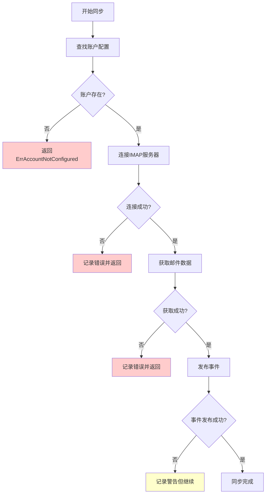

**图表来源**
- [sync.go](file://backend/internal/service/sync.go#L105-L156)

### 特定错误处理逻辑

#### 1. 账户配置错误处理

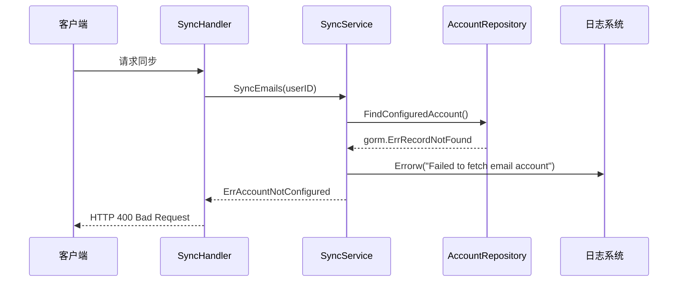

**图表来源**
- [sync.go](file://backend/internal/service/sync.go#L107-L118)
- [sync.go](file://backend/internal/handler/sync.go#L49-L51)

#### 2. IMAP连接错误处理

系统对IMAP连接错误有专门的处理逻辑：

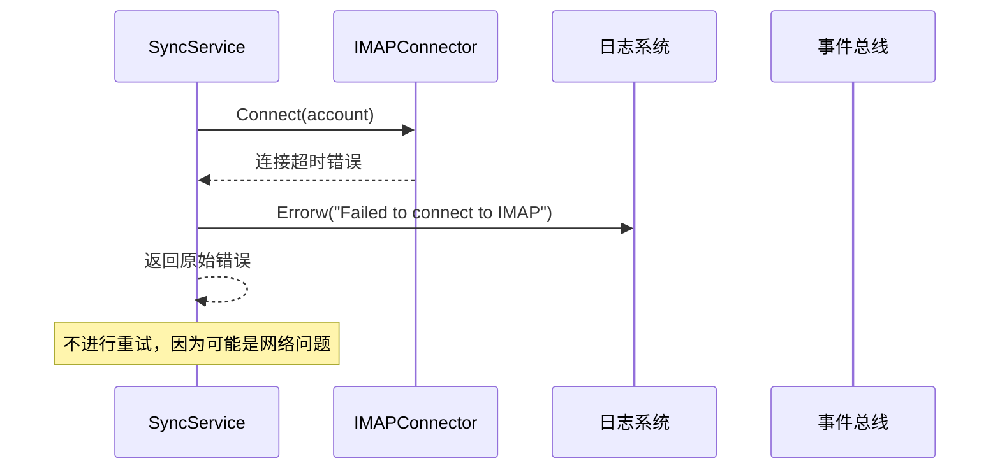

**图表来源**
- [sync.go](file://backend/internal/service/sync.go#L121-L125)
- [imap_connector.go](file://backend/internal/service/imap_connector.go#L66-L70)

**章节来源**
- [sync.go](file://backend/internal/service/sync.go#L105-L156)
- [imap_connector.go](file://backend/internal/service/imap_connector.go#L53-L73)

## 异步任务重试机制

### Asynq任务重试配置

EchoMind使用Asynq作为异步任务队列，提供了强大的重试机制：

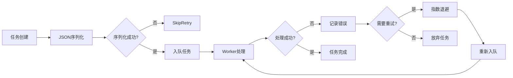

**图表来源**
- [sync.go](file://backend/internal/tasks/sync.go#L36-L53)
- [main.go](file://backend/cmd/worker/main.go#L41-L108)

### 任务处理中的错误处理

#### 1. JSON反序列化错误

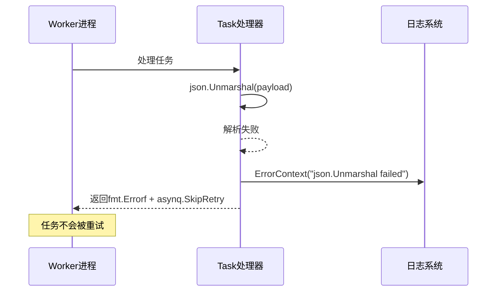

**图表来源**
- [sync.go](file://backend/internal/tasks/sync.go#L38-L40)

#### 2. 同步任务错误处理

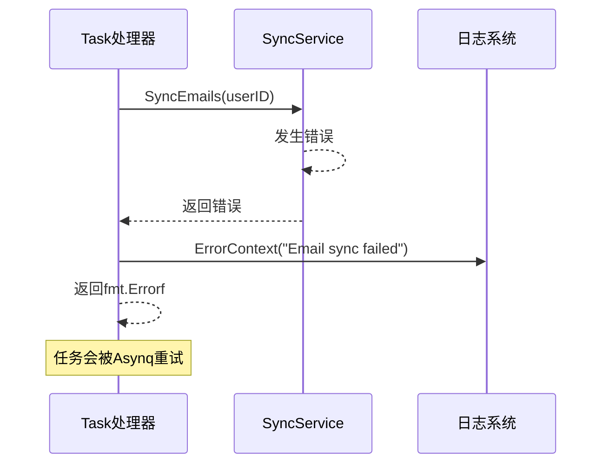

**图表来源**
- [sync.go](file://backend/internal/tasks/sync.go#L44-L49)

### 重试策略配置

虽然当前代码没有显式的重试配置，但Asynq提供了灵活的重试策略：

| 配置项 | 默认值 | 描述 |
|--------|--------|------|
| 最大重试次数 | 25次 | 默认最大重试次数 |
| 初始延迟 | 5秒 | 第一次重试延迟 |
| 指数退避因子 | 2.0 | 重试间隔倍增因子 |
| 最大延迟 | 1小时 | 最大重试间隔 |

**章节来源**
- [sync.go](file://backend/internal/tasks/sync.go#L36-L53)
- [main.go](file://backend/cmd/worker/main.go#L41-L108)

## 事件总线错误处理

### 事件发布错误处理

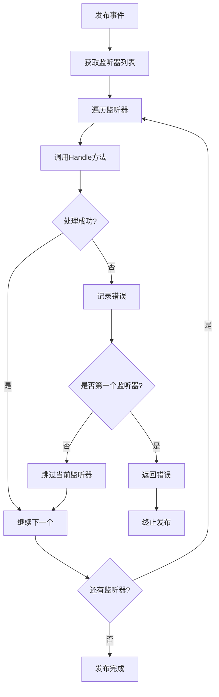

**图表来源**
- [bus.go](file://backend/pkg/event/bus/bus.go#L46-L62)

### 监听器错误处理

#### 1. 分析监听器错误处理

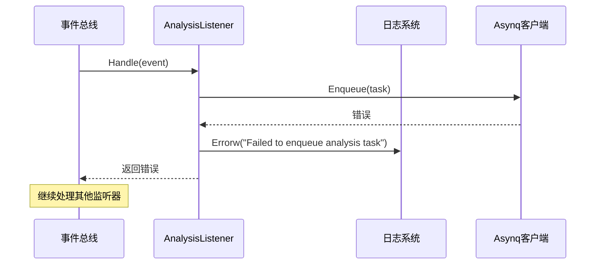

**图表来源**
- [email_listeners.go](file://backend/internal/listener/email_listeners.go#L45-L59)

#### 2. 联系人监听器错误处理

联系人更新监听器采用更宽松的错误处理策略：

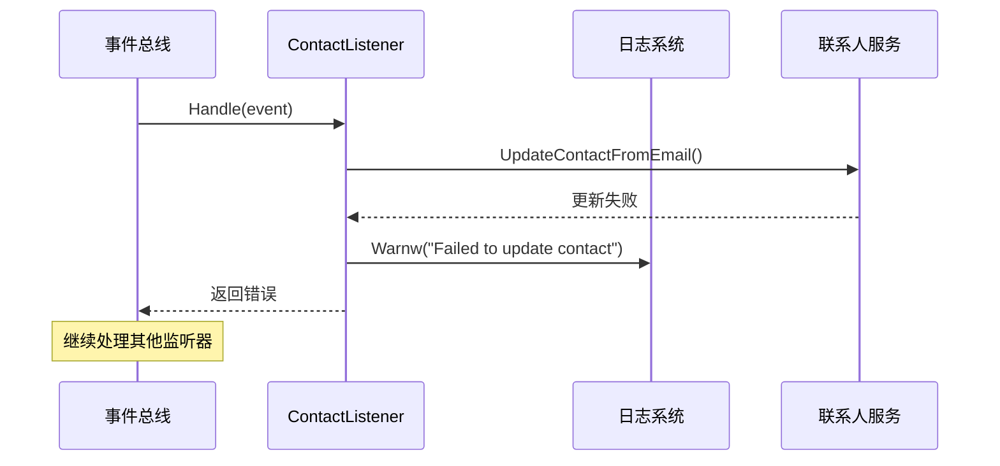

**图表来源**
- [email_listeners.go](file://backend/internal/listener/email_listeners.go#L91-L99)

**章节来源**
- [bus.go](file://backend/pkg/event/bus/bus.go#L46-L62)
- [email_listeners.go](file://backend/internal/listener/email_listeners.go#L45-L99)

## 日志记录与监控

### 结构化日志记录

EchoMind使用结构化日志记录来跟踪错误和调试信息：

```mermaid
classDiagram
class Logger {
+Error(msg string, fields ...Field)
+Info(msg string, fields ...Field)
+Warn(msg string, fields ...Field)
+Debug(msg string, fields ...Field)
+ErrorContext(ctx context.Context, msg string, fields ...Field)
+InfoContext(ctx context.Context, msg string, fields ...Field)
}
class zapSugaredWrapper {
-logger Logger
+Errorw(msg string, keysAndValues ...interface{})
+Errorf(template string, args ...interface{})
+Debugw(msg string, keysAndValues ...interface{})
+Warnw(msg string, keysAndValues ...interface{})
}
class CompatibleLogger {
<<interface>>
+Errorw(msg string, keysAndValues ...interface{})
+Errorf(template string, args ...interface{})
+Debugw(msg string, keysAndValues ...interface{})
+Warnw(msg string, keysAndValues ...interface{})
}
Logger <-- zapSugaredWrapper
CompatibleLogger <|.. zapSugaredWrapper
```

**图表来源**
- [logger.go](file://backend/pkg/logger/logger.go#L118-L202)
- [sync.go](file://backend/internal/service/sync.go#L70-L76)

### 关键错误字段

系统在记录错误时包含以下关键字段：

| 字段名 | 类型 | 描述 |
|--------|------|------|
| `user_id` | UUID | 用户标识符 |
| `team_id` | UUID | 团队标识符 |
| `org_id` | UUID | 组织标识符 |
| `error` | string | 错误消息 |
| `email_id` | UUID | 邮件标识符 |
| `task_id` | string | 任务标识符 |

### 监控指标

系统收集以下监控指标：

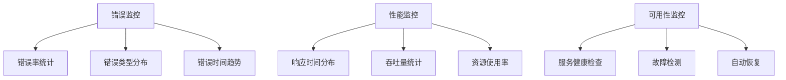

**章节来源**
- [logger.go](file://backend/pkg/logger/logger.go#L118-L202)
- [sync.go](file://backend/internal/service/sync.go#L112-L153)

## 最佳实践与配置

### 错误处理最佳实践

#### 1. 错误分类与处理策略

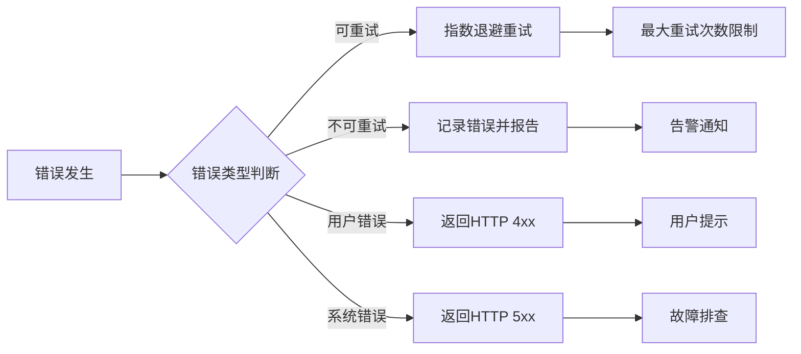

#### 2. 配置建议

##### Asynq重试配置

```yaml
worker:
  concurrency: 10  # 并发worker数量
  retry_policy:
    max_attempts: 25
    initial_delay: 5s
    max_delay: 1h
    backoff_factor: 2.0
```

##### 日志级别配置

```yaml
logging:
  level: info        # 生产环境推荐info
  development: false
  encoding: json
  output_paths: [stdout]
  error_output_paths: [stderr]
```

### 监控配置

#### 1. Prometheus指标

```yaml
metrics:
  enabled: true
  port: 9090
  path: /metrics
  
  email_sync:
    success_rate: counter
    failure_rate: counter
    duration_histogram: histogram
    retry_count: histogram
```

#### 2. 告警规则

```yaml
groups:
- name: email-sync-alerts
  rules:
  - alert: EmailSyncFailureRate
    expr: rate(email_sync_failures[5m]) > 0.1
    for: 2m
    labels:
      severity: critical
    annotations:
      summary: "邮件同步失败率过高"
      
  - alert: EmailSyncLatencyHigh
    expr: histogram_quantile(0.95, email_sync_duration) > 30
    for: 5m
    labels:
      severity: warning
    annotations:
      summary: "邮件同步延迟过高"
```

**章节来源**
- [app_config.go](file://backend/configs/app_config.go#L31-L33)
- [main.go](file://backend/cmd/worker/main.go#L53-L62)

## 故障排除指南

### 常见错误场景

#### 1. 账户配置错误

**症状**：收到HTTP 400错误，提示"请先在设置中配置您的邮箱账户"

**排查步骤**：
1. 检查用户是否有有效的邮箱账户配置
2. 验证账户状态是否正常
3. 确认账户凭据是否正确

**解决方案**：
```sql
-- 检查账户配置
SELECT * FROM email_accounts 
WHERE user_id = ? AND deleted_at IS NULL;
```

#### 2. IMAP连接失败

**症状**：日志中出现"Failed to connect to IMAP"错误

**排查步骤**：
1. 检查网络连接
2. 验证IMAP服务器地址和端口
3. 确认认证凭据
4. 检查防火墙设置

**解决方案**：
```bash
# 测试IMAP连接
telnet imap.example.com 993
openssl s_client -connect imap.example.com:993
```

#### 3. 数据库查询失败

**症状**：出现"gorm.ErrRecordNotFound"或数据库连接错误

**排查步骤**：
1. 检查数据库连接状态
2. 验证表结构完整性
3. 检查索引性能

**解决方案**：
```sql
-- 检查表状态
EXPLAIN SELECT * FROM email_accounts WHERE id = ?;

-- 检查索引
SHOW INDEX FROM email_accounts;
```

#### 4. 任务重试失败

**症状**：异步任务持续失败且无法重试

**排查步骤**：
1. 检查Asynq队列状态
2. 验证任务序列化
3. 检查Worker进程状态

**解决方案**：
```bash
# 检查队列状态
redis-cli llen asynq:tasks

# 查看失败任务
redis-cli lrange asynq:failed 0 -1
```

### 性能优化建议

#### 1. 数据库优化

```sql
-- 添加必要的索引
CREATE INDEX idx_email_user_id ON emails(user_id);
CREATE INDEX idx_email_message_id ON emails(message_id);

-- 优化查询计划
EXPLAIN ANALYZE SELECT * FROM emails WHERE user_id = ? ORDER BY date DESC LIMIT 100;
```

#### 2. 缓存策略

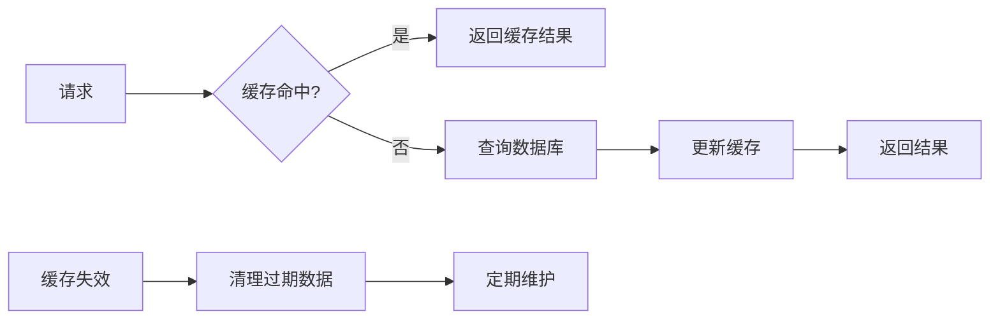

#### 3. 监控告警

建立完善的监控告警体系：

| 监控指标 | 告警阈值 | 处理建议 |
|----------|----------|----------|
| 同步失败率 | >10% | 检查IMAP连接和账户状态 |
| 响应时间 | >30秒 | 优化查询和索引 |
| 内存使用率 | >80% | 增加内存或优化GC |
| CPU使用率 | >90% | 扩展并发或优化算法 |

**章节来源**
- [sync.go](file://backend/internal/service/sync.go#L107-L118)
- [imap_connector.go](file://backend/internal/service/imap_connector.go#L66-L70)
- [email.go](file://backend/internal/service/email.go#L72-L74)

## 总结

EchoMind的错误处理与重试机制设计体现了现代分布式系统的设计原则：

1. **分层处理**：从服务层到传输层的完整错误处理链
2. **智能重试**：基于错误类型的差异化重试策略
3. **事件驱动**：通过事件总线实现故障检测和恢复
4. **可观测性**：完整的日志记录和监控支持

这套机制确保了系统在面对各种故障时能够保持稳定运行，并为运维人员提供了足够的诊断信息。通过合理的配置和监控，可以进一步提升系统的可靠性和可维护性。