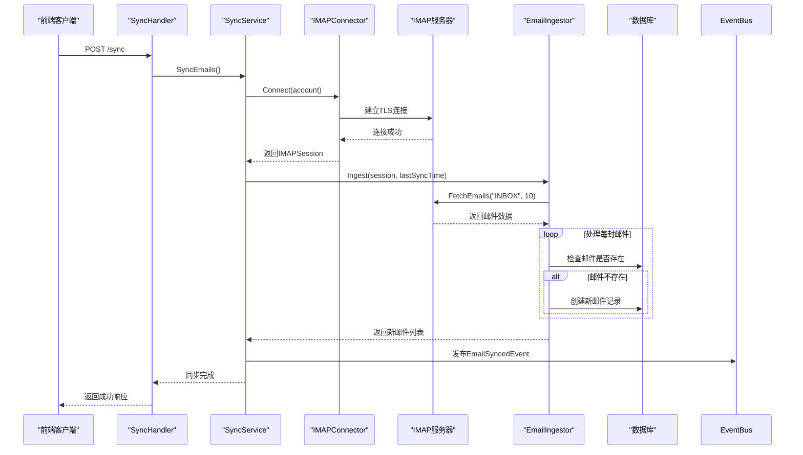
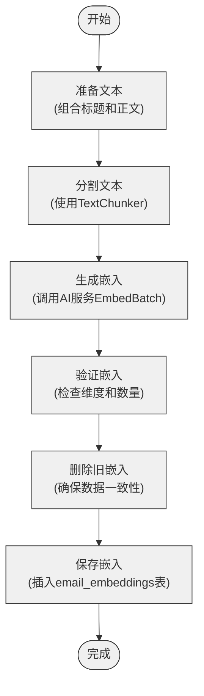
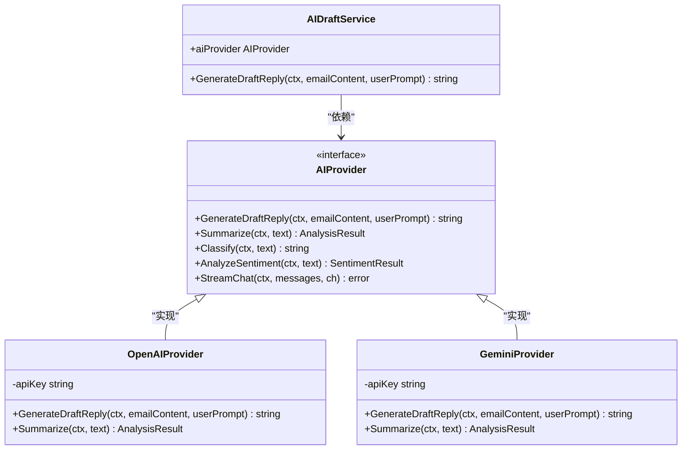

# 核心功能

<cite>
**本文档引用的文件**
- [sync.go](file://backend/internal/service/sync.go)
- [imap_connector.go](file://backend/internal/service/imap_connector.go)
- [email_ingestor.go](file://backend/internal/service/email_ingestor.go)
- [search.go](file://backend/internal/service/search.go)
- [embedding.go](file://backend/internal/model/embedding.go)
- [email.go](file://backend/internal/model/email.go)
- [ai_draft.go](file://backend/internal/service/ai_draft.go)
- [provider.go](file://backend/pkg/ai/provider.go)
- [insight.go](file://backend/internal/service/insight.go)
- [sync.go](file://backend/internal/handler/sync.go)
- [search.go](file://backend/internal/handler/search.go)
- [ai_draft.go](file://backend/internal/handler/ai_draft.go)
- [insight.go](file://backend/internal/handler/insight.go)
- [AIDraftReplyModal.tsx](file://frontend/src/components/email/AIDraftReplyModal.tsx)
</cite>

## 目录
1. [智能邮件同步](#智能邮件同步)
2. [语义搜索](#语义搜索)
3. [AI草稿生成](#ai草稿生成)
4. [数据洞察](#数据洞察)
5. [功能交互与依赖](#功能交互与依赖)

## 智能邮件同步

EchoMind的智能邮件同步功能通过IMAP协议与用户的邮箱服务器建立安全连接，实现邮件的自动化同步。该功能由`SyncService`、`IMAPConnector`和`EmailIngestor`三个核心组件协同工作。

`SyncService`是同步功能的业务逻辑核心，负责协调整个同步流程。它首先通过`accountRepo`获取用户的邮箱账户配置，然后调用`connector`建立IMAP连接，最后使用`ingestor`获取并保存新邮件。同步完成后，系统会发布`EmailSyncedEvent`事件，通知其他服务进行后续处理。

`IMAPConnector`负责建立和管理与IMAP服务器的连接。在建立连接前，它会使用配置中的加密密钥解密存储的邮箱密码，确保凭据的安全性。连接建立后，返回一个`DefaultIMAPSession`对象，该对象封装了IMAP客户端并提供了`FetchEmails`方法用于获取邮件。

`EmailIngestor`负责邮件的获取和持久化。它通过`IMAPSession`从INBOX邮箱获取邮件数据，对每封邮件进行存在性检查（避免重复同步），然后将其保存到数据库中。同步过程会跳过早于上次同步时间的邮件，实现增量同步。



**图示来源**
- [sync.go](file://backend/internal/service/sync.go#L104-L157)
- [imap_connector.go](file://backend/internal/service/imap_connector.go#L52-L72)
- [email_ingestor.go](file://backend/internal/service/email_ingor.go#L29-L82)

**本节来源**
- [sync.go](file://backend/internal/service/sync.go#L78-L163)
- [imap_connector.go](file://backend/internal/service/imap_connector.go#L34-L72)
- [email_ingestor.go](file://backend/internal/service/email_ingestor.go#L14-L82)

## 语义搜索

EchoMind的语义搜索功能基于向量嵌入技术，能够理解用户查询的语义而非简单的关键词匹配。该功能的核心是`SearchService`，它通过AI服务生成查询和邮件内容的向量嵌入，并在PostgreSQL数据库中使用向量相似度搜索来查找相关邮件。

`SearchService`的搜索流程分为三个主要步骤：首先，使用配置的AI提供商（如OpenAI或Gemini）将用户查询转换为向量嵌入；其次，通过原生SQL查询在`email_embeddings`表中执行向量相似度搜索，查找与查询向量最接近的邮件；最后，将搜索结果按相似度分数排序并返回给用户。

向量嵌入的生成和存储由`GenerateAndSaveEmbedding`方法处理。该方法会将邮件的标题和正文组合成完整文本，使用`TextChunker`将其分割成固定大小的块（默认1000字符），然后批量生成每个文本块的向量嵌入。这些嵌入连同原始文本块一起存储在`email_embeddings`表中，支持后续的语义搜索。



**图示来源**
- [search.go](file://backend/internal/service/search.go#L45-L105)
- [search.go](file://backend/internal/service/search.go#L109-L170)
- [embedding.go](file://backend/internal/model/embedding.go#L10-L20)

**本节来源**
- [search.go](file://backend/internal/service/search.go#L17-L170)
- [embedding.go](file://backend/internal/model/embedding.go#L10-L20)
- [email.go](file://backend/internal/model/email.go#L29-L35)

## AI草稿生成

AI草稿生成功能允许用户基于现有邮件内容和自定义提示生成回复草稿。该功能通过`AIDraftService`和`AIProvider`接口实现，采用工厂模式支持多种AI服务提供商。

`AIDraftService`是AI草稿生成的业务服务，它依赖于`AIProvider`接口来执行实际的AI操作。当收到生成草稿的请求时，`AIDraftService`会调用`AIProvider`的`GenerateDraftReply`方法，传入原始邮件内容和用户提示。这种设计实现了业务逻辑与AI服务实现的解耦，使得系统可以轻松集成不同的AI提供商。

`AIProvider`接口定义了AI功能的契约，包括`GenerateDraftReply`、`Summarize`、`Classify`等方法。具体的实现由`pkg/ai`包中的各个提供商提供，如`openai/provider.go`和`gemini/provider.go`。这种接口抽象使得前端可以统一调用AI功能，而无需关心底层实现细节。



**图示来源**
- [ai_draft.go](file://backend/internal/service/ai_draft.go#L9-L20)
- [provider.go](file://backend/pkg/ai/provider.go#L5-L80)
- [ai_draft.go](file://backend/internal/handler/ai_draft.go#L27-L36)

**本节来源**
- [ai_draft.go](file://backend/internal/service/ai_draft.go#L9-L20)
- [provider.go](file://backend/pkg/ai/provider.go#L5-L80)
- [ai_draft.go](file://backend/internal/handler/ai_draft.go#L11-L105)

## 数据洞察

数据洞察功能为用户提供关于邮件交互模式的可视化分析，包括联系人网络图、管理统计、高管概览等。该功能由`InsightService`和`InsightHandler`组成，通过分析邮件数据生成有价值的业务洞察。

`DefaultInsightService`是洞察功能的核心实现，它通过`GetNetworkGraph`方法生成联系人网络图。该方法从数据库中获取用户的所有联系人，并将其转换为`NetworkGraph`结构，包含节点（联系人）和链接（关系）。目前，节点包含联系人的ID、标签（邮箱）、互动次数和平均情感得分，而链接为空，未来可以扩展为基于邮件交互频率的关系强度。

`InsightHandler`是洞察功能的HTTP处理器，它将`DefaultInsightService`暴露为REST API。除了网络图，它还提供了`GetManagerStats`、`GetExecutiveOverview`、`GetDealmakerRadar`等多个端点，为不同角色的用户提供定制化的洞察数据。这些端点通过组合多个服务的数据（如邮件和任务服务）来计算复杂的业务指标。

```mermaid
graph TD
subgraph "前端"
NetworkGraphClient["NetworkGraphClient"]
ManagerStats["ManagerStats"]
ExecutiveView["ExecutiveView"]
end
subgraph "后端"
InsightHandler["InsightHandler"]
InsightService["DefaultInsightService"]
EmailService["EmailService"]
TaskService["TaskService"]
Database["数据库"]
end
NetworkGraphClient --> InsightHandler: GET /insights/network
ManagerStats --> InsightHandler: GET /insights/manager/stats
ExecutiveView --> InsightHandler: GET /insights/executive/overview
InsightHandler --> InsightService: 调用业务逻辑
InsightService --> EmailService: 获取邮件数据
InsightService --> TaskService: 获取任务数据
EmailService --> Database: 查询联系人
TaskService --> Database: 查询任务
Database -- 数据 --> EmailService
Database -- 数据 --> TaskService
```

**图示来源**
- [insight.go](file://backend/internal/service/insight.go#L39-L72)
- [insight.go](file://backend/internal/handler/insight.go#L12-L30)
- [insight.go](file://backend/internal/handler/insight.go#L109-L170)

**本节来源**
- [insight.go](file://backend/internal/service/insight.go#L11-L72)
- [insight.go](file://backend/internal/handler/insight.go#L12-L366)

## 功能交互与依赖

EchoMind的核心功能之间存在复杂的交互和依赖关系，形成了一个完整的智能邮件处理生态系统。这些功能通过事件总线、服务依赖和数据共享等方式紧密协作。

智能邮件同步是整个系统的基础，它为语义搜索和AI草稿生成提供原始邮件数据。每次同步完成后，系统会发布`EmailSyncedEvent`事件，触发后续的分析任务。这些任务可能包括生成邮件的向量嵌入（供搜索使用）和AI摘要（供洞察使用）。

语义搜索功能依赖于AI草稿生成所使用的相同AI服务来生成向量嵌入。`SearchService`和`AIDraftService`都通过`AIProvider`接口与AI服务交互，但使用不同的方法（`Embed` vs `GenerateDraftReply`）。这种设计确保了AI服务的复用性，同时保持了各功能的独立性。

数据洞察功能是多个功能的消费者，它依赖于同步的邮件数据、AI生成的摘要和情感分析结果。`InsightService`通过组合`EmailService`和`TaskService`的数据来计算复杂的业务指标，为用户提供全面的分析视图。

```mermaid
graph TD
Sync["智能邮件同步\n(SyncService)"] --> |提供邮件数据| Search["语义搜索\n(SearchService)"]
Sync --> |提供邮件内容| AIDraft["AI草稿生成\n(AIDraftService)"]
Sync --> |提供邮件数据| Insight["数据洞察\n(InsightService)"]
AIDraft --> |提供AI服务| Search
AIDraft --> |提供AI服务| Insight
Search --> |提供搜索结果| Frontend["前端界面"]
AIDraft --> |提供草稿回复| Frontend
Insight --> |提供洞察数据| Frontend
class Sync,AIDraft,Search,Insight fill:#e6f3ff,stroke:#1f77b4;
class Frontend fill:#fff2e6,stroke:#ff7f0e;
```

**图示来源**
- [sync.go](file://backend/internal/service/sync.go#L141-L153)
- [search.go](file://backend/internal/service/search.go#L19-L20)
- [ai_draft.go](file://backend/internal/service/ai_draft.go#L10-L11)
- [insight.go](file://backend/internal/service/insight.go#L41-L42)

**本节来源**
- [sync.go](file://backend/internal/service/sync.go#L78-L163)
- [search.go](file://backend/internal/service/search.go#L17-L170)
- [ai_draft.go](file://backend/internal/service/ai_draft.go#L9-L20)
- [insight.go](file://backend/internal/service/insight.go#L39-L72)