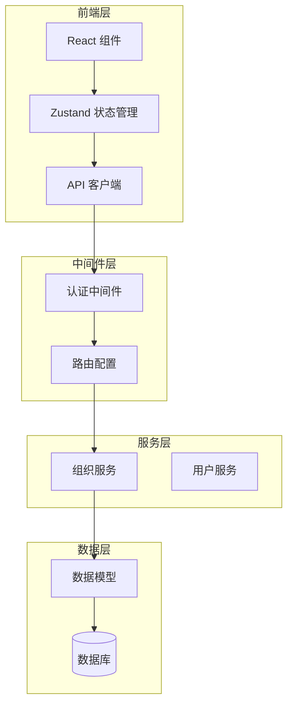
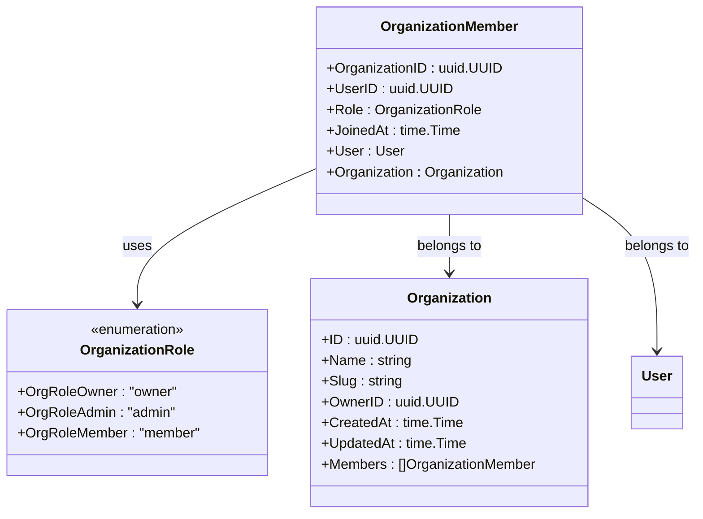
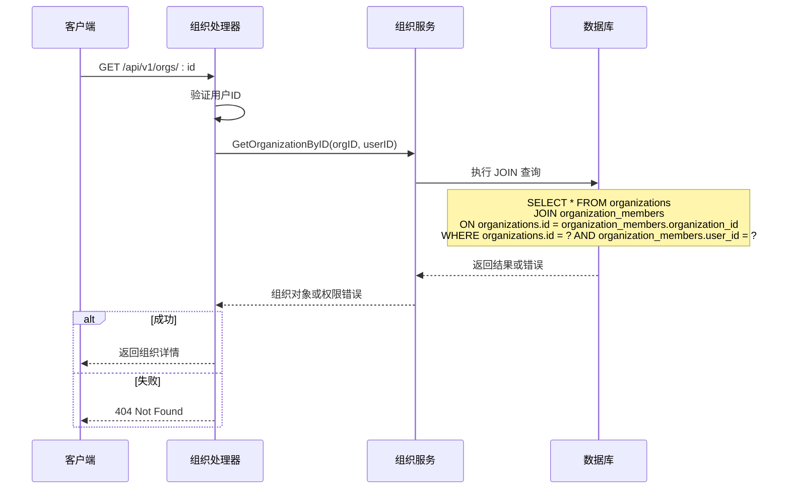
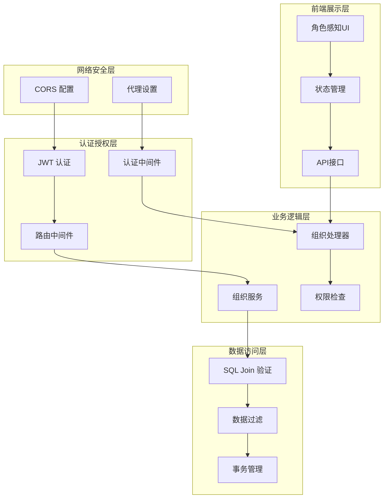
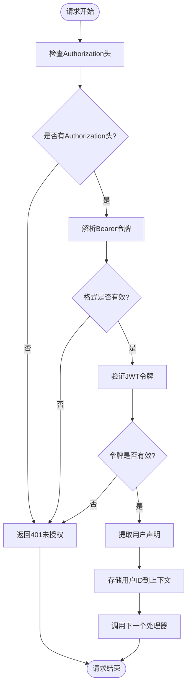
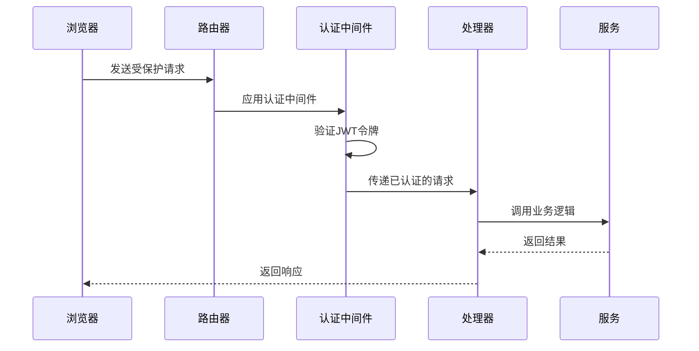
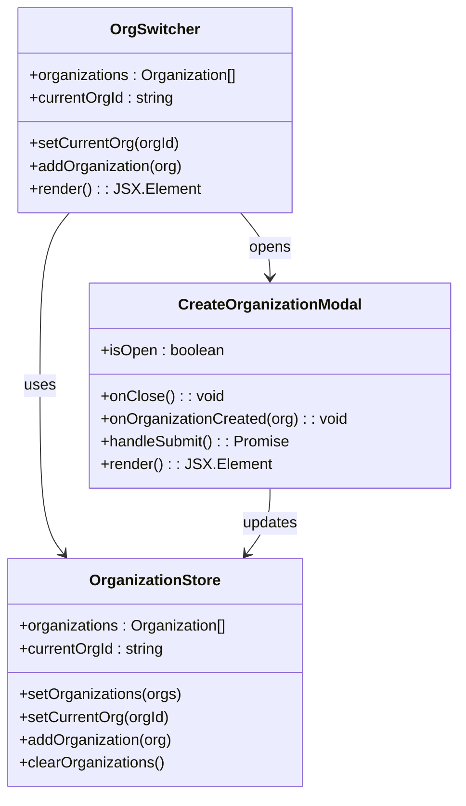
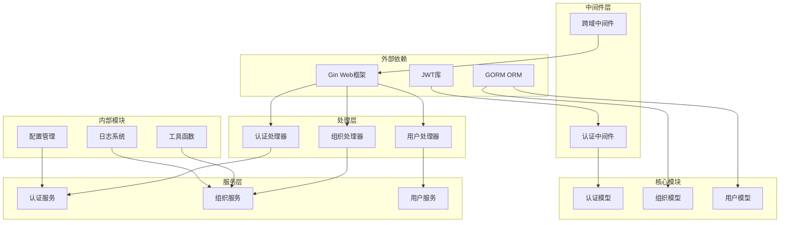

# 权限与角色控制

<cite>
**本文档中引用的文件**
- [member.go](file://backend/internal/model/member.go)
- [organization.go](file://backend/internal/model/organization.go)
- [organization.go](file://backend/internal/service/organization.go)
- [organization.go](file://backend/internal/handler/organization.go)
- [auth.go](file://backend/internal/middleware/auth.go)
- [routes.go](file://backend/internal/router/routes.go)
- [middleware.go](file://backend/internal/router/middleware.go)
- [organization.ts](file://frontend/src/lib/api/organization.ts)
- [OrgSwitcher.tsx](file://frontend/src/components/layout/OrgSwitcher.tsx)
- [CreateOrganizationModal.tsx](file://frontend/src/components/layout/CreateOrganizationModal.tsx)
- [organization.ts](file://frontend/src/lib/store/organization.ts)
</cite>

## 目录
1. [简介](#简介)
2. [项目结构概览](#项目结构概览)
3. [核心组件分析](#核心组件分析)
4. [架构概览](#架构概览)
5. [详细组件分析](#详细组件分析)
6. [依赖关系分析](#依赖关系分析)
7. [性能考虑](#性能考虑)
8. [故障排除指南](#故障排除指南)
9. [结论](#结论)

## 简介

EchoMind采用基于角色的访问控制（RBAC）系统来管理组织内的权限和角色。该系统通过严格的层次化权限控制确保数据安全性和操作的适当性。本文档深入分析了EchoMind的权限与角色控制系统，包括`OrganizationRole`枚举类型、`GetOrganizationByID`方法的数据层面权限验证、中间件的路由级别权限校验，以及前端UI的角色感知渲染机制。

## 项目结构概览

EchoMind的权限系统采用分层架构设计，主要分为以下几个层次：

**图表来源**
- [routes.go](file://backend/internal/router/routes.go#L1-L45)
- [auth.go](file://backend/internal/middleware/auth.go#L1-L60)
- [organization.go](file://backend/internal/service/organization.go#L1-L178)

## 核心组件分析

### OrganizationRole 枚举类型

EchoMind定义了三个核心角色常量，构成了基础的权限层次结构：

**图表来源**
- [member.go](file://backend/internal/model/member.go#L9-L26)
- [organization.go](file://backend/internal/model/organization.go#L10-L21)

**节来源**
- [member.go](file://backend/internal/model/member.go#L9-L26)

### GetOrganizationByID 方法的权限验证

该方法通过SQL Join实现了严格的数据层面权限控制：

**图表来源**
- [organization.go](file://backend/internal/service/organization.go#L136-L149)
- [organization.go](file://backend/internal/handler/organization.go#L54-L74)

**节来源**
- [organization.go](file://backend/internal/service/organization.go#L136-L149)

## 架构概览

EchoMind的权限系统采用多层防护架构，确保从网络到数据的全方位安全控制：

**图表来源**
- [middleware.go](file://backend/internal/router/middleware.go#L14-L43)
- [auth.go](file://backend/internal/middleware/auth.go#L18-L60)
- [routes.go](file://backend/internal/router/routes.go#L26-L45)

## 详细组件分析

### 认证中间件

认证中间件负责JWT令牌验证和用户身份识别：

**图表来源**
- [auth.go](file://backend/internal/middleware/auth.go#L19-L46)

**节来源**
- [auth.go](file://backend/internal/middleware/auth.go#L18-L60)

### 路由保护机制

所有受保护的路由都必须通过认证中间件：

**图表来源**
- [routes.go](file://backend/internal/router/routes.go#L35-L45)
- [middleware.go](file://backend/internal/router/middleware.go#L40-L43)

### 前端角色感知UI

前端组件根据用户角色动态渲染操作按钮：

**图表来源**
- [OrgSwitcher.tsx](file://frontend/src/components/layout/OrgSwitcher.tsx#L11-L66)
- [CreateOrganizationModal.tsx](file://frontend/src/components/layout/CreateOrganizationModal.tsx#L11-L69)
- [organization.ts](file://frontend/src/lib/store/organization.ts#L13-L38)

**节来源**
- [OrgSwitcher.tsx](file://frontend/src/components/layout/OrgSwitcher.tsx#L1-L66)
- [CreateOrganizationModal.tsx](file://frontend/src/components/layout/CreateOrganizationModal.tsx#L1-L69)

### 不同角色的操作权限差异

| 操作 | Owner | Admin | Member |
|------|-------|-------|--------|
| 创建组织 | ✓ | ✗ | ✓ |
| 删除组织 | ✓ | ✗ | ✗ |
| 邀请成员 | ✓ | ✓ | ✗ |
| 管理角色 | ✓ | ✓ | ✗ |
| 查看成员列表 | ✓ | ✓ | ✓ |
| 编辑组织信息 | ✓ | ✓ | ✗ |
| 删除成员 | ✓ | ✓ | ✗ |

**节来源**
- [member.go](file://backend/internal/model/member.go#L11-L15)
- [organization.go](file://backend/internal/service/organization.go#L21-L59)

## 依赖关系分析

EchoMind的权限系统具有清晰的依赖层次结构：

**图表来源**
- [routes.go](file://backend/internal/router/routes.go#L1-L25)
- [organization.go](file://backend/internal/service/organization.go#L1-L12)

**节来源**
- [routes.go](file://backend/internal/router/routes.go#L1-L45)
- [organization.go](file://backend/internal/service/organization.go#L1-L178)

## 性能考虑

EchoMind的权限系统在设计时充分考虑了性能优化：

1. **数据库查询优化**：使用JOIN查询减少数据库往返次数
2. **预加载策略**：通过GORM的Preload功能避免N+1查询问题
3. **事务管理**：关键操作使用数据库事务保证一致性
4. **缓存策略**：前端使用Zustand进行状态缓存
5. **连接池管理**：合理配置数据库连接池参数

## 故障排除指南

### 常见权限问题及解决方案

1. **404 Not Found vs 403 Forbidden**
   - 区分组织不存在和无访问权限的情况
   - 在GetOrganizationByID方法中实现精确的错误处理

2. **JWT令牌验证失败**
   - 检查令牌格式和签名
   - 验证令牌过期时间
   - 确认密钥配置正确

3. **前端角色感知失效**
   - 检查用户状态同步
   - 验证API响应中的角色信息
   - 确认状态管理更新逻辑

**节来源**
- [organization.go](file://backend/internal/handler/organization.go#L65-L70)
- [auth.go](file://backend/internal/middleware/auth.go#L36-L46)

## 结论

EchoMind的权限与角色控制系统展现了现代Web应用的最佳实践。通过分层架构、严格的数据验证、前端角色感知渲染和完善的错误处理机制，该系统提供了安全可靠的身份验证和授权解决方案。

### 主要优势

1. **安全性**：多层防护机制确保数据安全
2. **可扩展性**：清晰的模块划分便于功能扩展
3. **用户体验**：角色感知的UI提升操作便利性
4. **维护性**：良好的代码组织和文档支持

### 改进建议

1. **细粒度权限**：考虑引入基于资源的权限控制
2. **审计日志**：添加操作审计记录功能
3. **权限继承**：支持团队级别的权限继承
4. **多租户隔离**：增强多租户环境下的数据隔离

该权限系统为EchoMind提供了坚实的安全基础，支持其作为企业级协作平台的长期发展需求。