# 用户与组织管理

<cite>
**本文档中引用的文件**
- [backend/internal/model/user.go](file://backend/internal/model/user.go)
- [backend/internal/model/member.go](file://backend/internal/model/member.go)
- [backend/internal/model/organization.go](file://backend/internal/model/organization.go)
- [backend/internal/service/organization.go](file://backend/internal/service/organization.go)
- [backend/internal/service/user.go](file://backend/internal/service/user.go)
- [backend/internal/handler/organization.go](file://backend/internal/handler/organization.go)
- [backend/internal/middleware/auth.go](file://backend/internal/middleware/auth.go)
- [frontend/src/lib/store/organization.ts](file://frontend/src/lib/store/organization.ts)
- [frontend/src/components/layout/OrgSwitcher.tsx](file://frontend/src/components/layout/OrgSwitcher.tsx)
- [frontend/src/lib/api/organization.ts](file://frontend/src/lib/api/organization.ts)
- [backend/internal/router/routes.go](file://backend/internal/router/routes.go)
</cite>

## 目录
1. [简介](#简介)
2. [系统架构概览](#系统架构概览)
3. [核心数据模型](#核心数据模型)
4. [组织服务详解](#组织服务详解)
5. [用户认证与权限管理](#用户认证与权限管理)
6. [前端状态管理](#前端状态管理)
7. [API接口设计](#api接口设计)
8. [组织切换机制](#组织切换机制)
9. [权限控制实现](#权限控制实现)
10. [扩展指南](#扩展指南)
11. [总结](#总结)

## 简介

EchoMind的用户与组织管理系统是一个基于微服务架构的多租户解决方案，提供了完整的用户认证、角色管理和多组织支持功能。该系统采用前后端分离的设计模式，后端使用Go语言和Gin框架构建RESTful API，前端使用React和TypeScript开发单页应用。

系统的核心特性包括：
- 基于JWT的用户认证机制
- 多层级组织结构支持
- 细粒度的角色权限控制
- 实时的状态同步机制
- 完整的组织生命周期管理

## 系统架构概览

EchoMind的用户与组织管理系统采用分层架构设计，确保了系统的可维护性和扩展性。

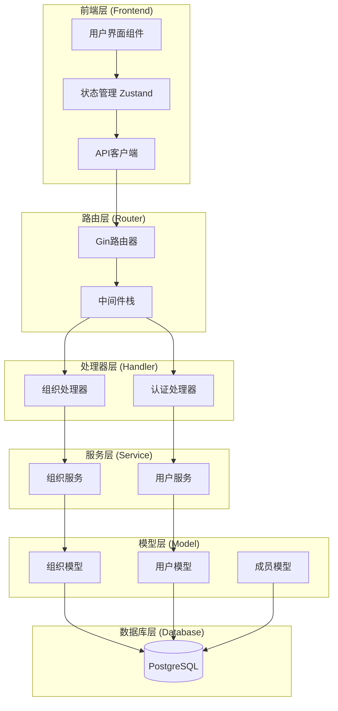

**图表来源**
- [backend/internal/router/routes.go](file://backend/internal/router/routes.go#L26-L45)
- [frontend/src/lib/store/organization.ts](file://frontend/src/lib/store/organization.ts#L1-L38)

**章节来源**
- [backend/internal/router/routes.go](file://backend/internal/router/routes.go#L1-L45)
- [backend/internal/handler/organization.go](file://backend/internal/handler/organization.go#L1-L115)

## 核心数据模型

EchoMind采用了三范式的关系型数据库设计，通过清晰的数据模型定义实现了完整的用户与组织管理功能。

### 用户模型 (User)

用户模型是整个系统的核心实体，包含了用户的基本信息和关联关系。

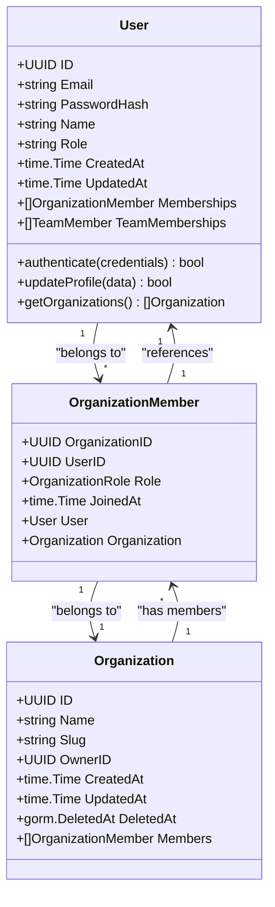

**图表来源**
- [backend/internal/model/user.go](file://backend/internal/model/user.go#L10-L22)
- [backend/internal/model/member.go](file://backend/internal/model/member.go#L17-L26)
- [backend/internal/model/organization.go](file://backend/internal/model/organization.go#L10-L21)

### 成员角色模型 (OrganizationRole)

系统定义了三种基本的组织角色，每种角色具有不同的权限级别：

| 角色类型 | 权限范围 | 描述 |
|---------|---------|------|
| `OrgRoleOwner` | 最高权限 | 组织的超级管理员，拥有所有操作权限 |
| `OrgRoleAdmin` | 管理权限 | 组织管理员，可以管理成员和配置 |
| `OrgRoleMember` | 基础权限 | 普通成员，只能访问分配的功能 |

### 组织模型 (Organization)

组织模型定义了多租户架构的基础结构，支持独立的业务空间隔离。

**章节来源**
- [backend/internal/model/user.go](file://backend/internal/model/user.go#L1-L23)
- [backend/internal/model/member.go](file://backend/internal/model/member.go#L1-L27)
- [backend/internal/model/organization.go](file://backend/internal/model/organization.go#L1-L22)

## 组织服务详解

`OrganizationService`是系统的核心业务逻辑层，负责处理组织相关的所有业务规则和数据操作。

### 主要服务方法

#### 创建个人组织 (CreatePersonalOrganization)

该方法为新注册用户自动创建默认的个人工作空间：

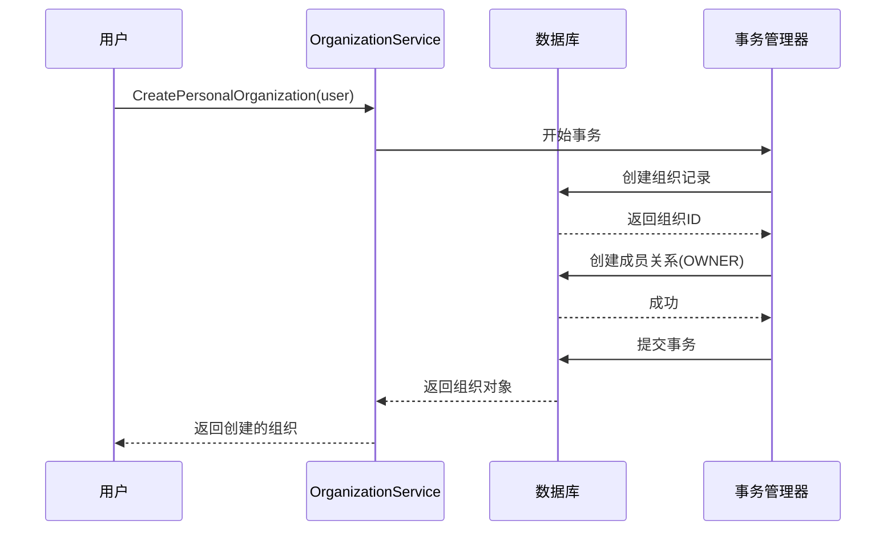

**图表来源**
- [backend/internal/service/organization.go](file://backend/internal/service/organization.go#L21-L58)

#### 获取用户组织列表 (GetUserOrganizations)

该方法查询用户所属的所有组织，支持多组织环境下的用户导航：

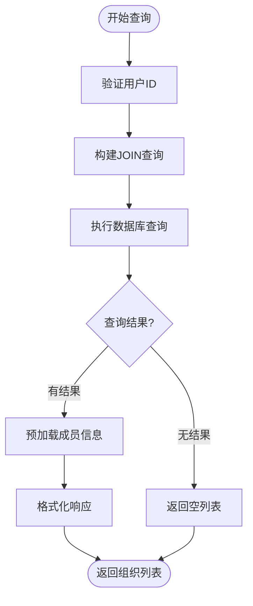

**图表来源**
- [backend/internal/service/organization.go](file://backend/internal/service/organization.go#L125-L134)

#### 添加组织成员 (AddMember)

该方法实现了组织成员的添加功能，支持指定角色权限：

| 参数 | 类型 | 描述 |
|------|------|------|
| `ctx` | `context.Context` | 请求上下文 |
| `orgID` | `uuid.UUID` | 组织ID |
| `userID` | `uuid.UUID` | 用户ID |
| `role` | `OrganizationRole` | 成员角色 |

#### 确保用户拥有组织 (EnsureAllUsersHaveOrganization)

这是一个数据迁移工具，用于确保系统中所有用户都至少有一个组织：

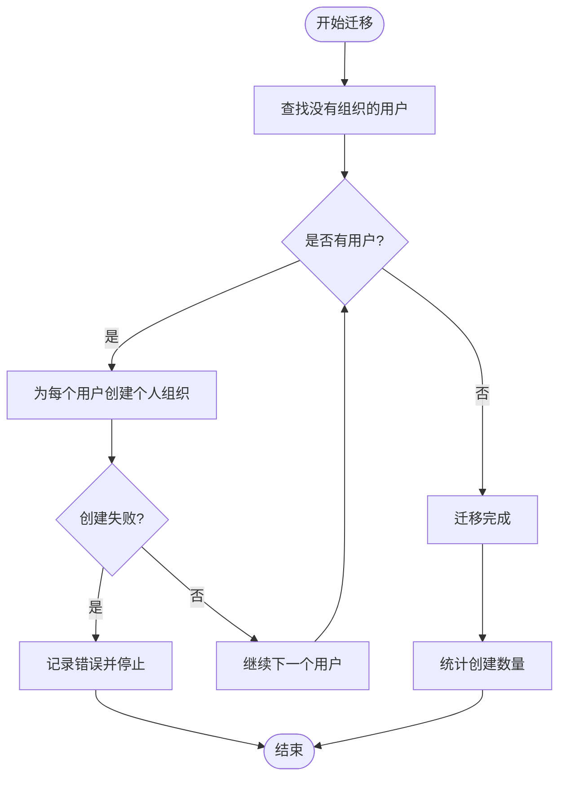

**图表来源**
- [backend/internal/service/organization.go](file://backend/internal/service/organization.go#L95-L122)

**章节来源**
- [backend/internal/service/organization.go](file://backend/internal/service/organization.go#L1-L178)

## 用户认证与权限管理

EchoMind实现了基于JWT的认证机制和细粒度的权限控制系统。

### 认证流程

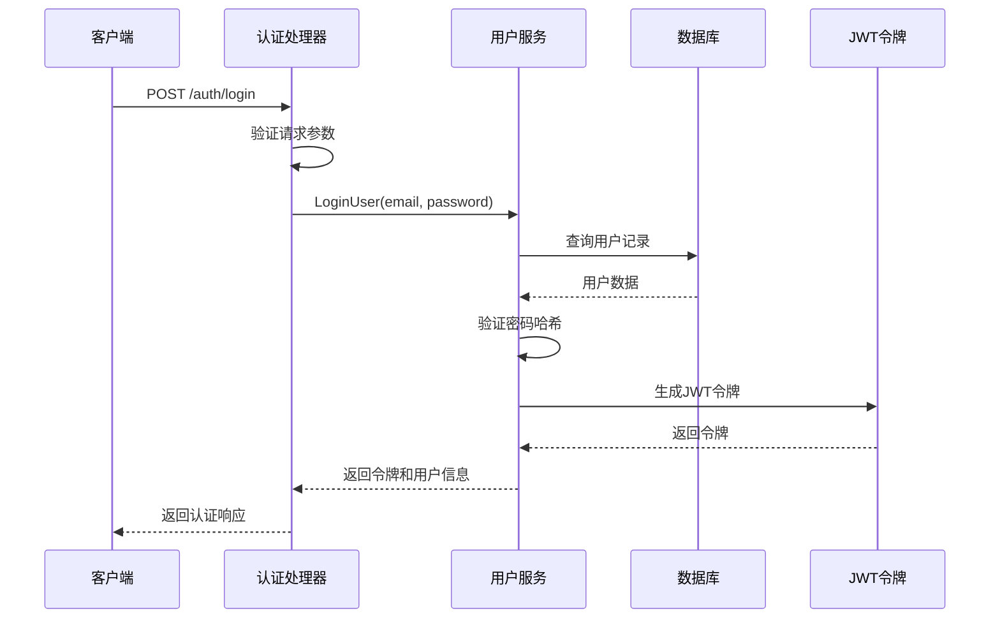

**图表来源**
- [backend/internal/handler/auth.go](file://backend/internal/handler/auth.go#L66-L126)
- [backend/internal/service/user.go](file://backend/internal/service/user.go#L81-L109)

### 中间件认证

系统使用Gin中间件实现统一的认证检查：

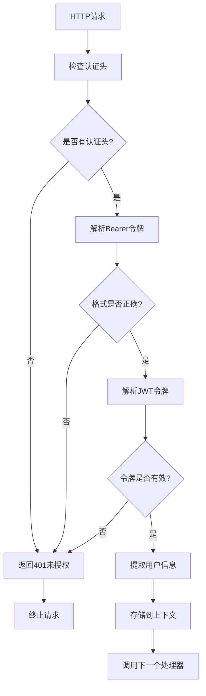

**图表来源**
- [backend/internal/middleware/auth.go](file://backend/internal/middleware/auth.go#L18-L46)

### 用户角色管理

系统支持动态的角色更新，允许管理员调整用户的业务角色：

| 角色类型 | 可访问功能 | 权限级别 |
|---------|-----------|---------|
| `executive` | 执行官仪表板、高级洞察 | 高级 |
| `manager` | 管理员面板、团队管理 | 管理级 |
| `dealmaker` | 商机管理、销售分析 | 销售级 |

**章节来源**
- [backend/internal/service/user.go](file://backend/internal/service/user.go#L1-L140)
- [backend/internal/middleware/auth.go](file://backend/internal/middleware/auth.go#L1-L60)

## 前端状态管理

前端使用Zustand作为状态管理库，实现了组织数据的本地缓存和实时同步。

### 状态结构设计

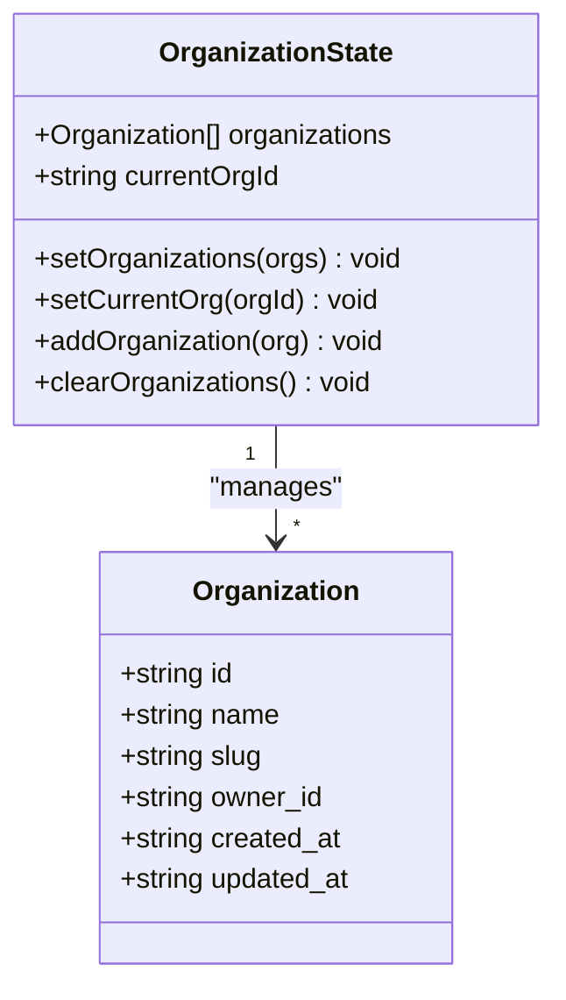

**图表来源**
- [frontend/src/lib/store/organization.ts](file://frontend/src/lib/store/organization.ts#L13-L20)

### 状态管理方法

| 方法名 | 参数 | 功能描述 |
|--------|------|----------|
| `setOrganizations` | `Organization[]` | 设置完整的组织列表，自动选择第一个组织 |
| `setCurrentOrg` | `string` | 切换当前活跃的组织 |
| `addOrganization` | `Organization` | 向列表中添加新的组织 |
| `clearOrganizations` | 无 | 清空所有组织数据 |

### API同步机制

前端通过拦截器实现与后端API的自动同步：

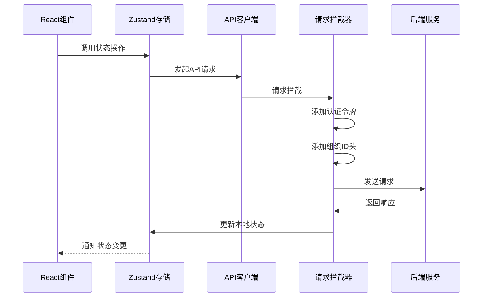

**图表来源**
- [frontend/src/lib/api.ts](file://frontend/src/lib/api.ts#L12-L43)

**章节来源**
- [frontend/src/lib/store/organization.ts](file://frontend/src/lib/store/organization.ts#L1-L38)
- [frontend/src/lib/api/organization.ts](file://frontend/src/lib/api/organization.ts#L1-L17)

## API接口设计

EchoMind提供了完整的RESTful API接口，支持组织管理的全生命周期操作。

### 组织管理API

| HTTP方法 | 端点 | 功能描述 | 认证要求 |
|---------|------|----------|----------|
| `POST` | `/api/v1/orgs` | 创建新组织 | 是 |
| `GET` | `/api/v1/orgs` | 获取用户组织列表 | 是 |
| `GET` | `/api/v1/orgs/:id` | 获取特定组织详情 | 是 |
| `GET` | `/api/v1/orgs/:id/members` | 获取组织成员列表 | 是 |

### 请求响应格式

#### 创建组织请求
```json
{
  "name": "新公司名称"
}
```

#### 创建组织响应
```json
{
  "id": "uuid-string",
  "name": "新公司名称",
  "slug": "new-company-slug-abc123",
  "owner_id": "user-uuid",
  "created_at": "2024-01-01T00:00:00Z",
  "updated_at": "2024-01-01T00:00:00Z"
}
```

### 错误处理策略

系统实现了统一的错误处理机制：

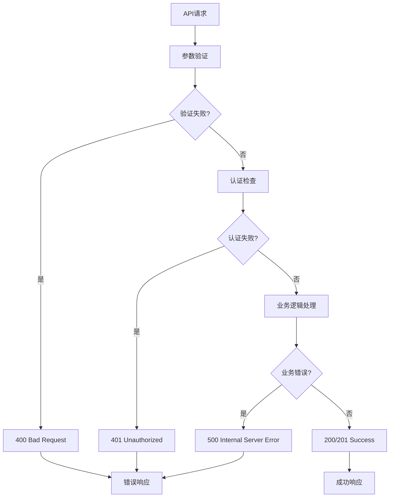

**图表来源**
- [backend/internal/handler/organization.go](file://backend/internal/handler/organization.go#L20-L114)

**章节来源**
- [backend/internal/handler/organization.go](file://backend/internal/handler/organization.go#L1-L115)
- [backend/internal/router/routes.go](file://backend/internal/router/routes.go#L36-L45)

## 组织切换机制

EchoMind实现了直观的组织切换界面，通过`OrgSwitcher`组件提供无缝的用户体验。

### 组件架构

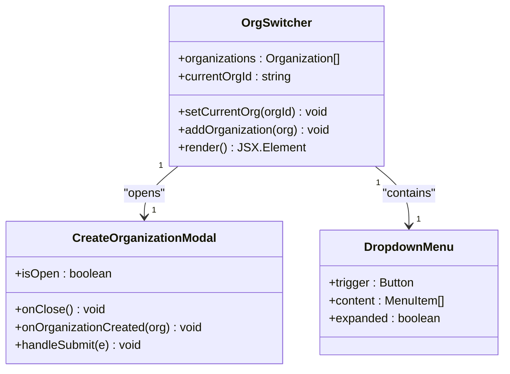

**图表来源**
- [frontend/src/components/layout/OrgSwitcher.tsx](file://frontend/src/components/layout/OrgSwitcher.tsx#L11-L65)

### 切换流程

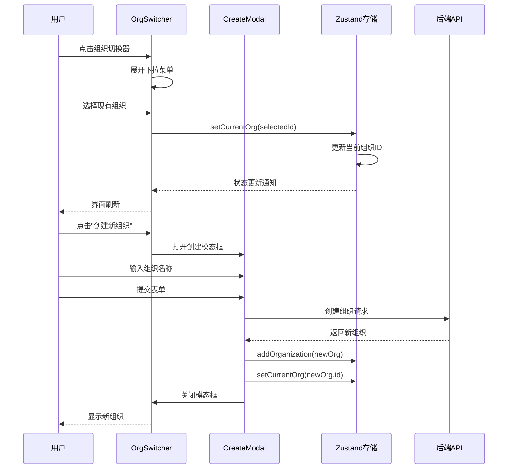

**图表来源**
- [frontend/src/components/layout/OrgSwitcher.tsx](file://frontend/src/components/layout/OrgSwitcher.tsx#L54-L62)

### 状态同步机制

组织切换不仅改变UI显示，还会触发以下同步操作：

1. **API请求头更新**: 自动添加`X-Organization-ID`头部
2. **本地状态更新**: 更新Zustand存储中的当前组织ID
3. **界面重新渲染**: 触发相关组件的重新渲染
4. **数据刷新**: 清除旧组织的数据缓存

**章节来源**
- [frontend/src/components/layout/OrgSwitcher.tsx](file://frontend/src/components/layout/OrgSwitcher.tsx#L1-L66)

## 权限控制实现

EchoMind实现了基于角色的访问控制(RBAC)系统，确保不同用户只能访问其权限范围内的资源。

### 权限层次结构

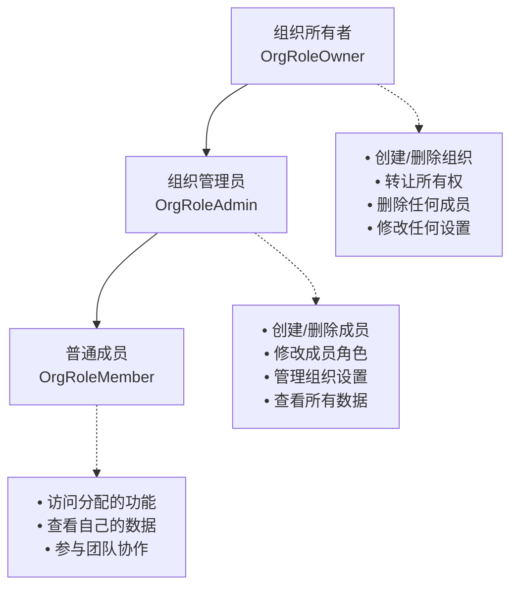

### 访问控制实现

#### 组织级别的权限验证

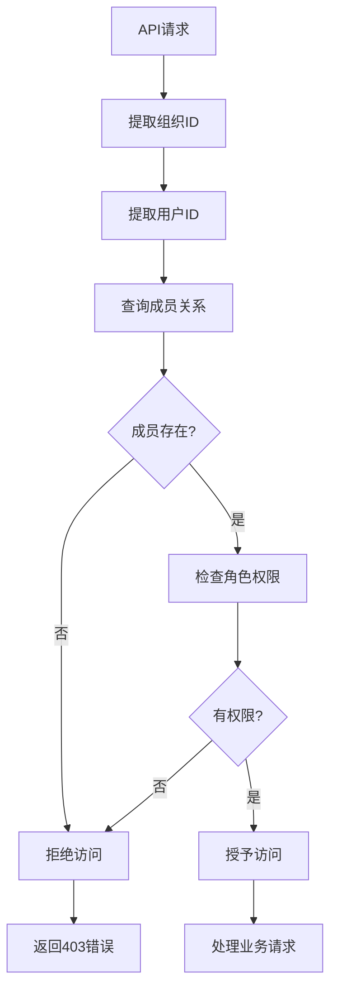

#### 成员角色常量定义

系统通过常量定义确保角色的一致性和安全性：

| 常量名 | 字符串值 | 权限级别 | 使用场景 |
|--------|---------|---------|----------|
| `OrgRoleOwner` | `"owner"` | 最高 | 组织创建者、超级管理员 |
| `OrgRoleAdmin` | `"admin"` | 管理 | 组织管理员、部门主管 |
| `OrgRoleMember` | `"member"` | 基础 | 普通员工、团队成员 |

### 安全最佳实践

1. **最小权限原则**: 默认只授予必要的最低权限
2. **权限继承**: 上级角色自动包含下级角色的所有权限
3. **审计日志**: 记录所有权限变更和访问行为
4. **定期审查**: 支持管理员定期审查成员权限

**章节来源**
- [backend/internal/model/member.go](file://backend/internal/model/member.go#L9-L15)
- [backend/internal/service/organization.go](file://backend/internal/service/organization.go#L61-L92)

## 扩展指南

### 添加新的用户角色

要向系统添加新的用户角色，需要进行以下步骤：

#### 1. 更新后端模型

在`backend/internal/model/user.go`中添加新的角色常量：

```go
const (
    UserRoleExecutive = "executive"
    UserRoleManager   = "manager"
    UserRoleDealMaker = "dealmaker"
    UserRoleMember    = "member"
)
```

#### 2. 更新前端类型定义

在`frontend/src/lib/store/organization.ts`中扩展接口：

```typescript
interface UpdateUserProfileRequest {
    role?: 'executive' | 'manager' | 'dealmaker' | 'member'
    name?: string
}
```

#### 3. 更新验证逻辑

在`backend/internal/handler/auth.go`中更新验证函数：

```go
if err := c.ShouldBindJSON(&req); err != nil {
    c.JSON(http.StatusBadRequest, gin.H{"error": err.Error()})
    return
}

// 验证角色的有效性
validRoles := []string{"executive", "manager", "dealmaker", "member"}
if req.Role != "" && !contains(validRoles, req.Role) {
    c.JSON(http.StatusBadRequest, gin.H{"error": "无效的角色"})
    return
}
```

### 修改组织权限模型

如果需要更复杂的权限控制，可以考虑以下扩展方案：

#### 1. 引入权限矩阵

```go
type PermissionMatrix struct {
    CanCreateOrganization bool
    CanManageMembers      bool
    CanEditSettings       bool
    CanViewReports        bool
    CanExportData         bool
}
```

#### 2. 实现细粒度权限检查

```go
func (s *OrganizationService) HasPermission(ctx context.Context, userID, orgID uuid.UUID, permission string) (bool, error) {
    var member OrganizationMember
    err := s.db.WithContext(ctx).
        Where("user_id = ? AND organization_id = ?", userID, orgID).
        First(&member).Error
    if err != nil {
        return false, err
    }
    
    // 基于角色和权限矩阵检查
    return s.checkPermissionMatrix(member.Role, permission), nil
}
```

### 性能优化建议

1. **缓存策略**: 对频繁访问的组织数据实施Redis缓存
2. **批量查询**: 在获取多个组织信息时使用批量查询
3. **索引优化**: 确保在用户ID和组织ID字段上建立适当的索引
4. **分页处理**: 对大型组织的成员列表实施分页查询

## 总结

EchoMind的用户与组织管理系统展现了现代Web应用的最佳实践，通过以下关键特性实现了高效的企业级用户管理：

### 技术优势

1. **模块化设计**: 清晰的分层架构确保了代码的可维护性
2. **类型安全**: Go语言的强类型系统和TypeScript的类型检查提供了编译时的安全保障
3. **状态同步**: 前后端的实时状态同步机制提升了用户体验
4. **权限控制**: 细粒度的角色权限系统确保了数据安全

### 架构特点

- **微服务友好**: 模块化的服务设计便于未来的微服务拆分
- **可扩展性**: 基于接口的设计支持灵活的功能扩展
- **测试友好**: 完善的单元测试和集成测试覆盖
- **文档完善**: 清晰的API文档和内部注释

### 应用价值

该系统不仅满足了当前的业务需求，还为未来的功能扩展奠定了坚实的基础。通过合理的架构设计和技术选型，系统具备了良好的性能表现和用户体验，能够支撑企业级应用的需求。

对于开发者而言，这套系统提供了一个完整的参考实现，展示了如何构建一个健壮、可扩展的用户与组织管理解决方案。无论是学习现代Web应用开发，还是作为实际项目的基础，这套系统都具有很高的参考价值。