# 用户模型与认证

<cite>
**本文档中引用的文件**
- [backend/internal/model/user.go](file://backend/internal/model/user.go)
- [backend/internal/handler/auth.go](file://backend/internal/handler/auth.go)
- [backend/pkg/utils/jwt.go](file://backend/pkg/utils/jwt.go)
- [backend/pkg/utils/password.go](file://backend/pkg/utils/password.go)
- [backend/internal/service/user.go](file://backend/internal/service/user.go)
- [backend/internal/middleware/auth.go](file://backend/internal/middleware/auth.go)
- [backend/configs/app_config.go](file://backend/configs/app_config.go)
- [frontend/src/store/auth.ts](file://frontend/src/store/auth.ts)
- [backend/internal/service/organization.go](file://backend/internal/service/organization.go)
- [backend/internal/router/routes.go](file://backend/internal/router/routes.go)
</cite>

## 目录
1. [简介](#简介)
2. [项目结构概览](#项目结构概览)
3. [用户实体设计](#用户实体设计)
4. [JWT认证系统](#jwt认证系统)
5. [密码安全机制](#密码安全机制)
6. [用户服务层](#用户服务层)
7. [认证中间件](#认证中间件)
8. [前端状态管理](#前端状态管理)
9. [组织关联机制](#组织关联机制)
10. [安全防护措施](#安全防护措施)
11. [扩展指南](#扩展指南)
12. [总结](#总结)

## 简介

EchoMind采用了一套完整的企业级用户模型与认证系统，支持用户生命周期管理、安全认证、会话管理和多租户架构。该系统基于现代Web安全标准，使用JWT令牌进行无状态认证，并集成了bcrypt密码哈希、GORM数据库操作和Zustand状态管理。

## 项目结构概览

EchoMind的用户认证系统采用分层架构设计，主要包含以下组件：

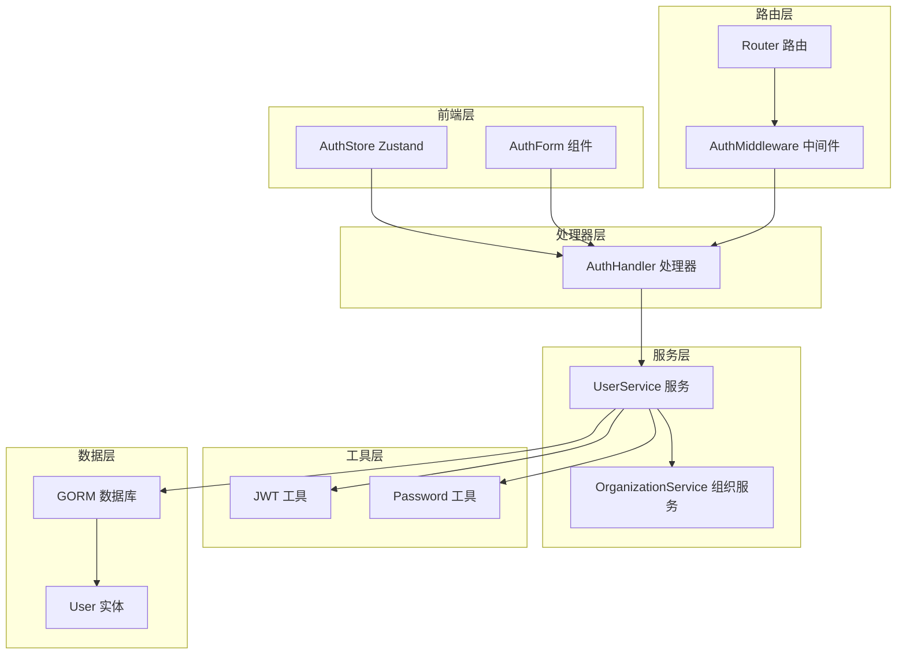

**图表来源**
- [backend/internal/router/routes.go](file://backend/internal/router/routes.go#L26-L45)
- [backend/internal/handler/auth.go](file://backend/internal/handler/auth.go#L11-L19)
- [backend/internal/service/user.go](file://backend/internal/service/user.go#L21-L26)

## 用户实体设计

### 核心字段结构

用户实体`User`是整个认证系统的核心数据模型，定义在`backend/internal/model/user.go`中：

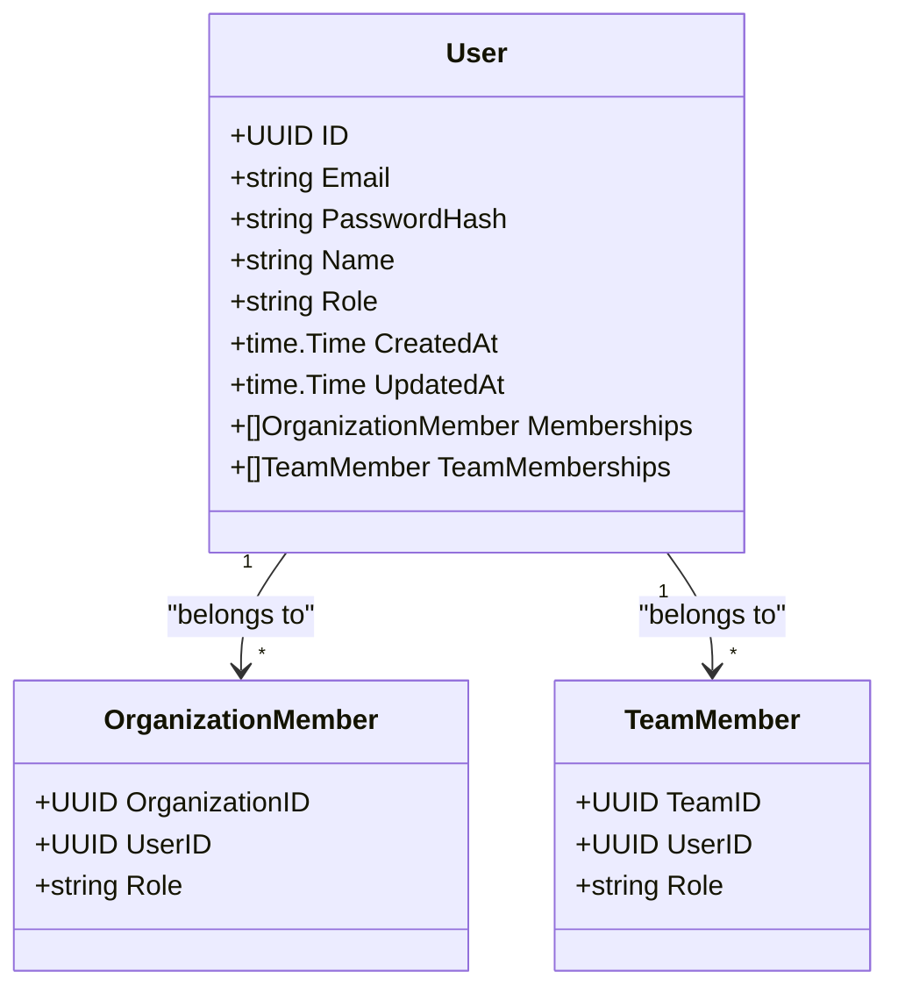

**图表来源**
- [backend/internal/model/user.go](file://backend/internal/model/user.go#L10-L22)

### 字段详细说明

| 字段名 | 类型 | GORM标签 | 描述 | 安全考虑 |
|--------|------|----------|------|----------|
| ID | uuid.UUID | `gorm:"type:uuid;primary_key"` | 唯一标识符，使用UUID确保分布式环境下的唯一性 | 隐藏真实用户ID，防止枚举攻击 |
| Email | string | `gorm:"type:varchar(255);uniqueIndex;not null"` | 用户邮箱地址，唯一索引约束 | 支持邮箱格式验证，防止重复注册 |
| PasswordHash | string | `gorm:"type:varchar(255);not null"` | bcrypt哈希后的密码 | 永远不存储明文密码 |
| Name | string | `gorm:"type:varchar(100)"` | 用户显示名称 | 可为空，允许匿名用户 |
| Role | string | `gorm:"type:varchar(50);default:'manager';not null"` | 用户角色：manager/executive/dealmaker | 角色控制访问权限 |
| CreatedAt | time.Time | - | 创建时间戳 | 自动管理，记录用户注册时间 |
| UpdatedAt | time.Time | - | 更新时间戳 | 自动更新，记录最后修改时间 |

**章节来源**
- [backend/internal/model/user.go](file://backend/internal/model/user.go#L10-L22)

### 关联关系设计

用户实体通过GORM关联定义了两个重要的多对多关系：

1. **Memberships**: 用户与组织的成员关系
2. **TeamMemberships**: 用户与团队的成员关系

这些关联关系支持复杂的多租户架构，允许用户在多个组织和团队中拥有不同的角色和权限。

## JWT认证系统

### JWT Claims结构

JWT认证系统的核心是`Claims`结构，定义了令牌中包含的用户信息：

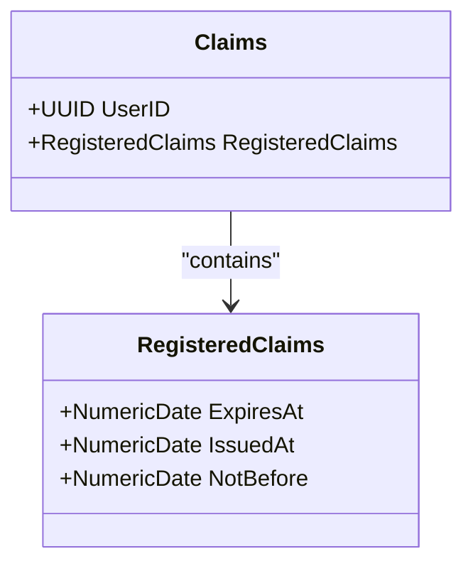

**图表来源**
- [backend/pkg/utils/jwt.go](file://backend/pkg/utils/jwt.go#L10-L13)

### 令牌生成流程

令牌生成过程包含以下关键步骤：

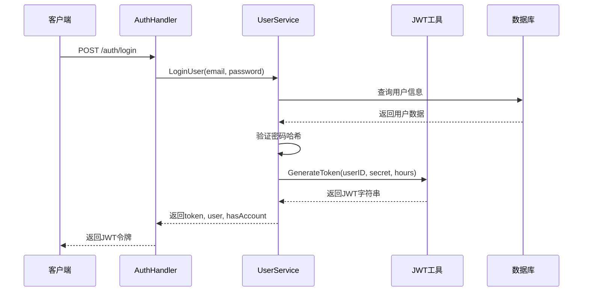

**图表来源**
- [backend/internal/handler/auth.go](file://backend/internal/handler/auth.go#L72-L98)
- [backend/internal/service/user.go](file://backend/internal/service/user.go#L81-L109)

### 令牌验证机制

JWT令牌验证通过专门的中间件实现，确保每个受保护的API请求都经过身份验证：

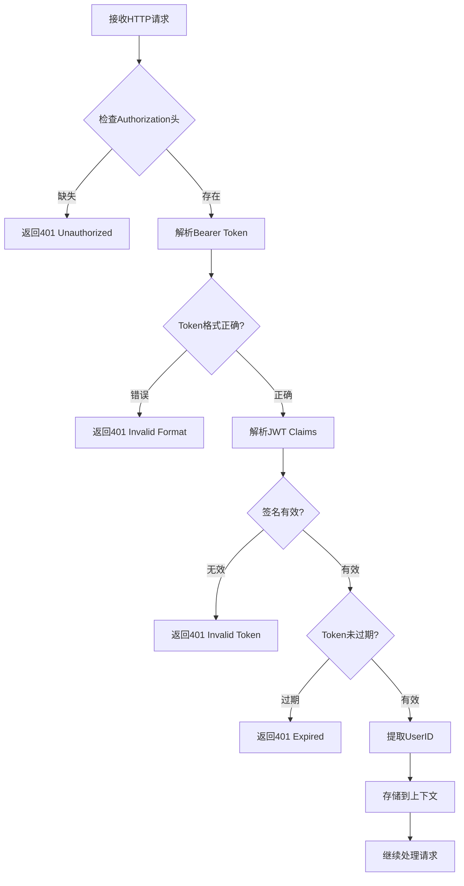

**图表来源**
- [backend/internal/middleware/auth.go](file://backend/internal/middleware/auth.go#L19-L47)

**章节来源**
- [backend/pkg/utils/jwt.go](file://backend/pkg/utils/jwt.go#L15-L51)
- [backend/internal/middleware/auth.go](file://backend/internal/middleware/auth.go#L19-L59)

## 密码安全机制

### bcrypt哈希实现

系统使用bcrypt算法对用户密码进行安全哈希，确保即使数据库泄露也无法直接获取用户密码：

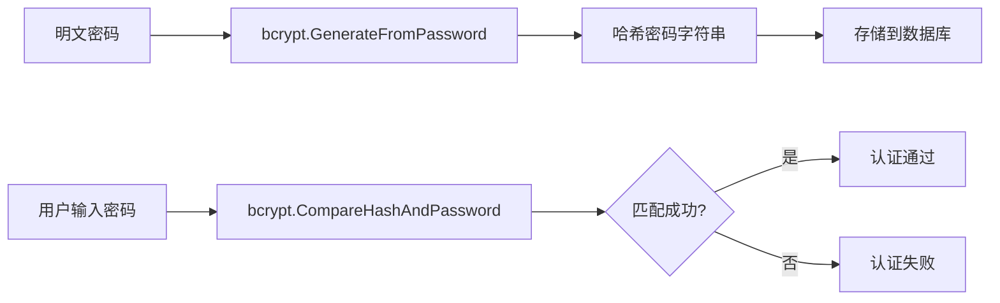

**图表来源**
- [backend/pkg/utils/password.go](file://backend/pkg/utils/password.go#L8-L20)

### 密码验证流程

密码验证采用安全的比较方式，防止时序攻击：

| 函数 | 功能 | 安全特性 |
|------|------|----------|
| `HashPassword()` | 生成密码哈希 | 使用默认成本因子，平衡安全性与性能 |
| `CheckPasswordHash()` | 验证密码 | 内部使用常量时间比较算法 |

**章节来源**
- [backend/pkg/utils/password.go](file://backend/pkg/utils/password.go#L8-L20)

## 用户服务层

### 注册流程

用户注册是一个事务性的操作，确保用户和默认组织同时创建成功：

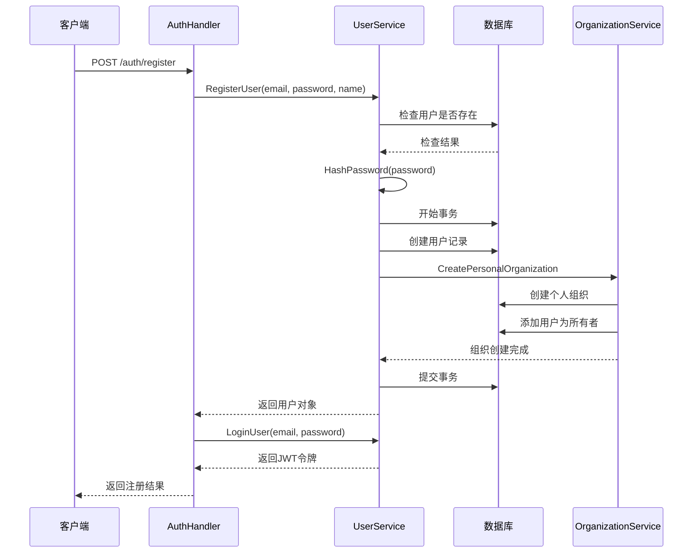

**图表来源**
- [backend/internal/handler/auth.go](file://backend/internal/handler/auth.go#L27-L63)
- [backend/internal/service/user.go](file://backend/internal/service/user.go#L37-L78)

### 登录流程

登录过程结合了密码验证和令牌生成：

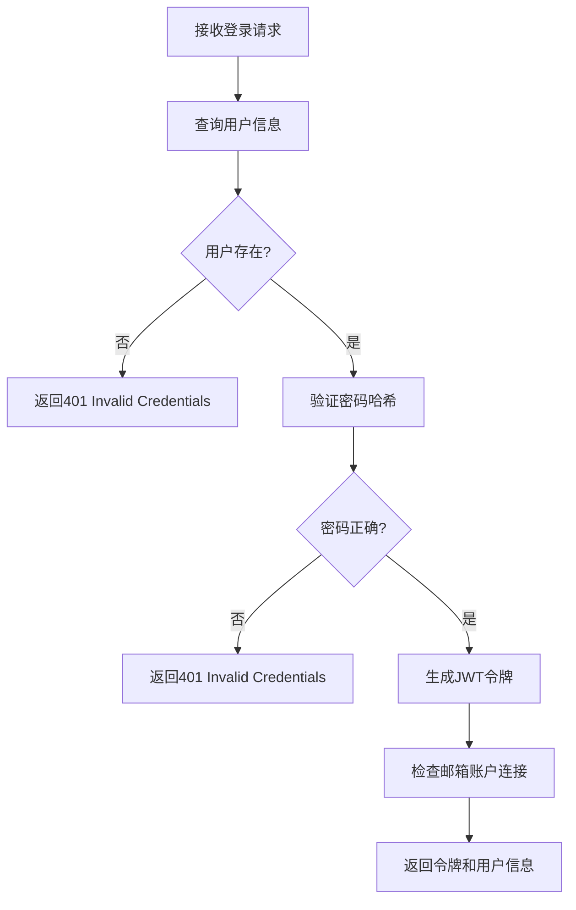

**图表来源**
- [backend/internal/service/user.go](file://backend/internal/service/user.go#L81-L109)

### 用户资料更新

用户可以更新自己的角色和名称信息：

| 方法 | 参数 | 功能 | 权限要求 |
|------|------|------|----------|
| `UpdateUserProfile` | userID, role, name | 更新用户角色和名称 | 用户本人或管理员 |
| `GetUserByID` | userID | 获取用户详细信息 | 认证用户 |

**章节来源**
- [backend/internal/service/user.go](file://backend/internal/service/user.go#L37-L140)

## 认证中间件

### 中间件架构

认证中间件负责拦截所有受保护的API请求，验证JWT令牌的有效性：

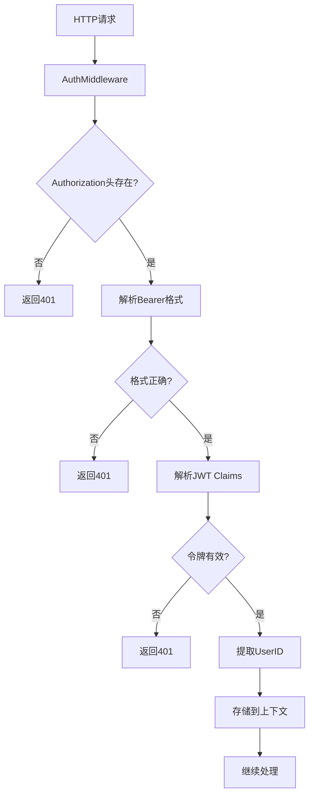

**图表来源**
- [backend/internal/middleware/auth.go](file://backend/internal/middleware/auth.go#L19-L47)

### 上下文传递

中间件通过Gin框架的上下文机制传递用户信息：

| 函数 | 功能 | 返回值 |
|------|------|--------|
| `AuthMiddleware()` | JWT验证中间件 | Gin.HandlerFunc |
| `GetUserIDFromContext()` | 从上下文中获取用户ID | UUID, bool |

**章节来源**
- [backend/internal/middleware/auth.go](file://backend/internal/middleware/auth.go#L19-L59)

## 前端状态管理

### Zustand Store设计

前端使用Zustand进行状态管理，集中处理认证相关的状态和操作：

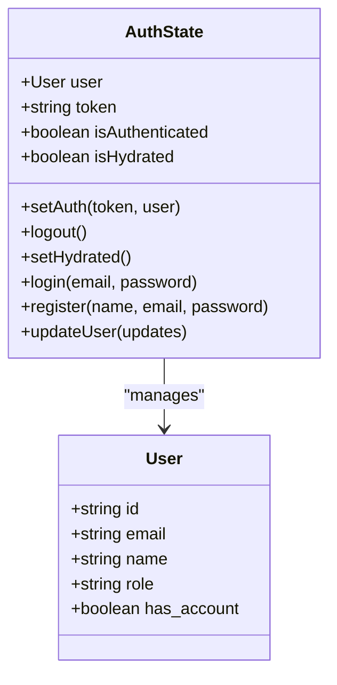

**图表来源**
- [frontend/src/store/auth.ts](file://frontend/src/store/auth.ts#L13-L24)

### API集成模式

前端认证API与后端保持一致的接口设计：

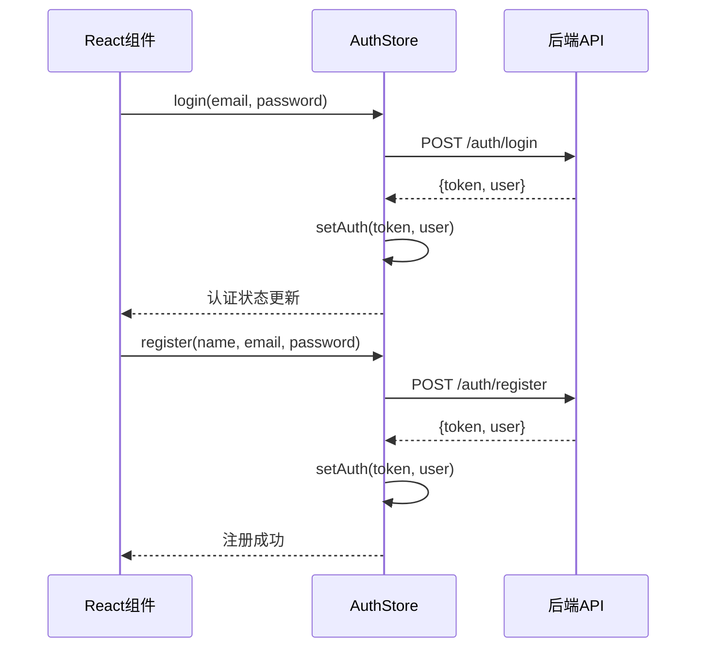

**图表来源**
- [frontend/src/store/auth.ts](file://frontend/src/store/auth.ts#L39-L57)

**章节来源**
- [frontend/src/store/auth.ts](file://frontend/src/store/auth.ts#L1-L68)

## 组织关联机制

### 默认组织创建

每次用户注册时，系统自动为其创建一个个人组织，确保用户始终属于某个组织：

```mermaid
flowchart TD
A[用户注册] --> B[创建用户记录]
B --> C[开始数据库事务]
C --> D[创建个人组织]
D --> E[设置组织名称："用户名's Workspace"]
E --> F[添加用户为组织所有者]
F --> G[提交事务]
G --> H[注册完成]
I[组织服务] --> J[CreatePersonalOrganization]
J --> K[生成唯一Slug]
K --> L[创建组织成员关系]
L --> M[设置所有者角色]
```

**图表来源**
- [backend/internal/service/organization.go](file://backend/internal/service/organization.go#L21-L58)

### 组织角色体系

系统支持灵活的组织角色体系：

| 角色 | 权限级别 | 描述 |
|------|----------|------|
| Owner | 最高 | 组织完全控制权 |
| Admin | 高 | 组织管理权限 |
| Member | 中等 | 基础成员权限 |
| Viewer | 低 | 查看权限 |

**章节来源**
- [backend/internal/service/organization.go](file://backend/internal/service/organization.go#L21-L58)

## 安全防护措施

### 密码策略

系统实施严格的密码安全策略：

| 安全措施 | 实现方式 | 目标 |
|----------|----------|------|
| 最小长度限制 | 前端表单验证 + 后端绑定验证 | 至少6个字符 |
| bcrypt哈希 | 密码存储前哈希处理 | 即使数据库泄露也安全 |
| 事务一致性 | 注册过程原子性 | 确保用户和组织同时创建 |
| 角色分离 | 不同角色不同权限 | 最小权限原则 |

### 请求安全

系统在多个层面实施安全防护：

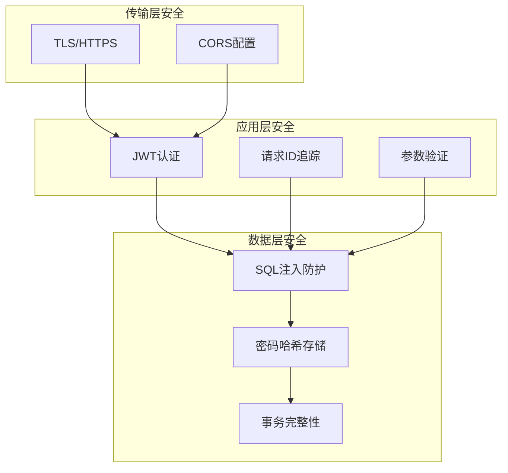

### 错误处理策略

系统采用安全的错误处理策略，避免信息泄露：

| 错误类型 | 返回信息 | 安全考虑 |
|----------|----------|----------|
| 用户不存在 | "Invalid credentials" | 不区分用户不存在和密码错误 |
| 密码错误 | "Invalid credentials" | 避免帮助攻击者枚举用户 |
| 数据库错误 | "Internal server error" | 不暴露内部错误详情 |

## 扩展指南

### 添加用户属性

要为用户添加新的属性，需要修改以下文件：

1. **用户实体** (`backend/internal/model/user.go`)
   - 添加新字段
   - 添加适当的GORM标签
   - 更新关联关系

2. **服务层** (`backend/internal/service/user.go`)
   - 更新`UpdateUserProfile`方法
   - 添加相应的验证逻辑

3. **处理器层** (`backend/internal/handler/auth.go`)
   - 更新请求结构体
   - 添加字段验证

### 集成第三方认证

集成OAuth或其他第三方认证需要：

1. **创建认证处理器** (`backend/internal/handler/oauth.go`)
2. **实现OAuth服务** (`backend/internal/service/oauth.go`)
3. **更新路由配置** (`backend/internal/router/routes.go`)
4. **前端状态管理** (`frontend/src/store/auth.ts`)

### 令牌刷新机制

实现令牌刷新功能：

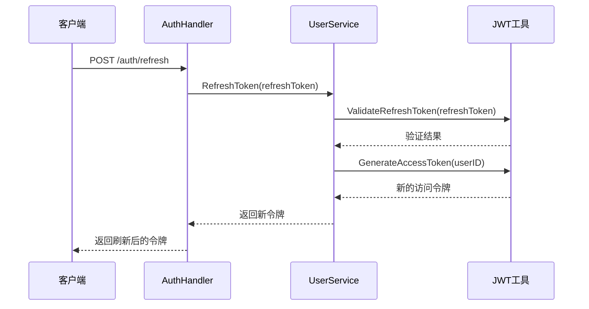

### 多因素认证

添加多因素认证支持：

1. **OTP模块** (`backend/pkg/utils/otp.go`)
2. **认证流程** (`backend/internal/service/mfa.go`)
3. **前端界面** (`frontend/src/components/auth/MFAForm.tsx`)

## 总结

EchoMind的用户模型与认证系统展现了现代Web应用的最佳实践：

### 核心优势

1. **安全性优先**：bcrypt密码哈希、JWT无状态认证、事务一致性保证
2. **可扩展性**：模块化设计，易于添加新功能
3. **用户体验**：自动化的组织创建、无缝的前后端集成
4. **企业级特性**：多租户架构、角色权限控制

### 技术亮点

- **分层架构**：清晰的职责分离，便于维护和测试
- **事务管理**：确保数据一致性，特别是在用户注册时
- **状态管理**：前后端统一的状态管理模式
- **错误处理**：安全的错误响应，避免信息泄露

### 最佳实践

该系统体现了以下安全最佳实践：
- 永远不存储明文密码
- 使用强加密算法（bcrypt）
- 实施最小权限原则
- 采用无状态认证
- 全面的错误处理策略

这套认证系统为企业级应用提供了坚实的基础，支持未来的功能扩展和安全增强。