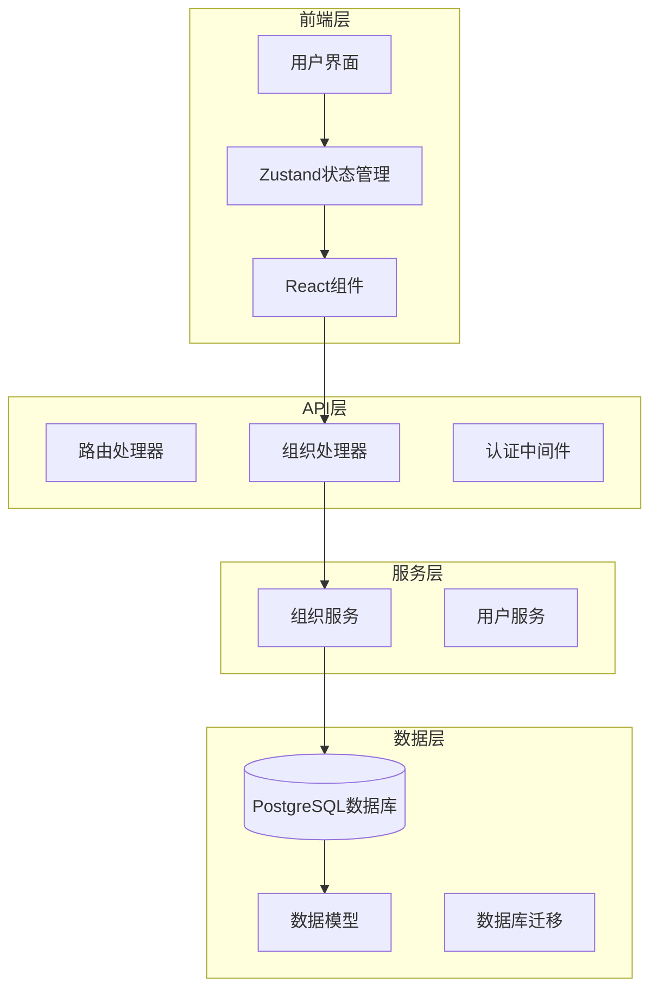
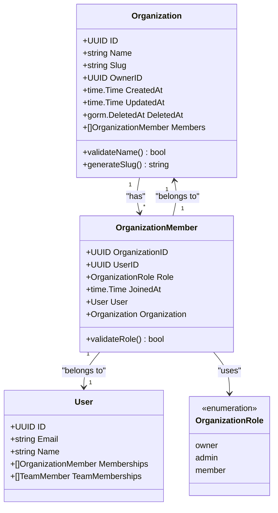
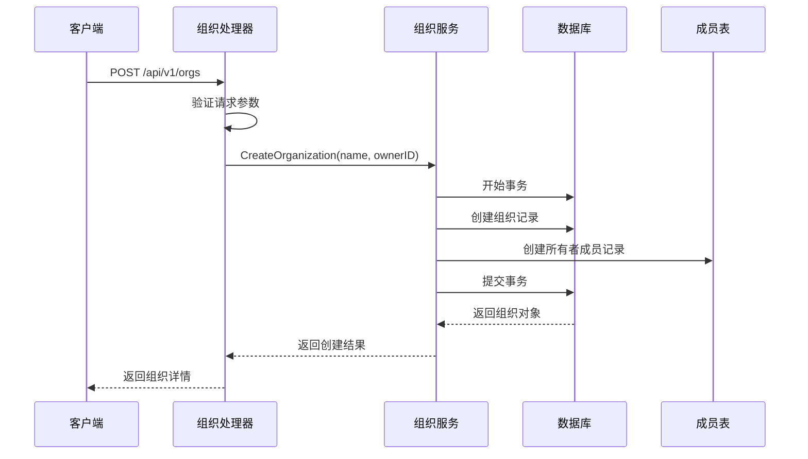
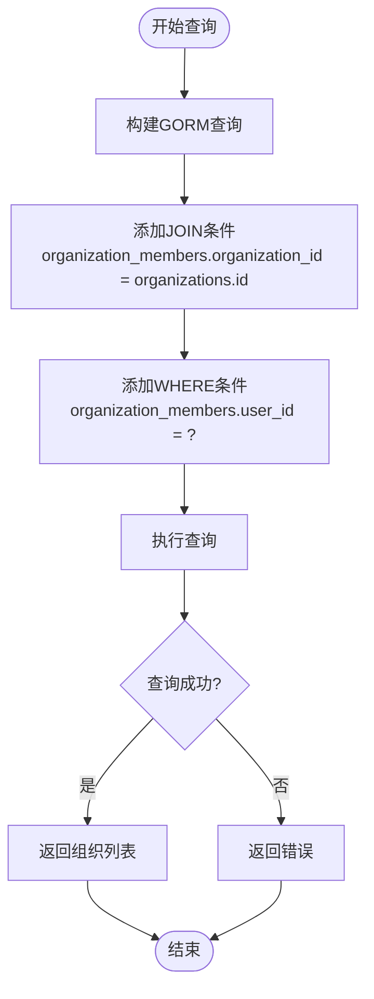
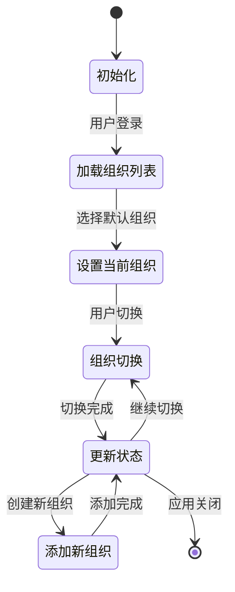
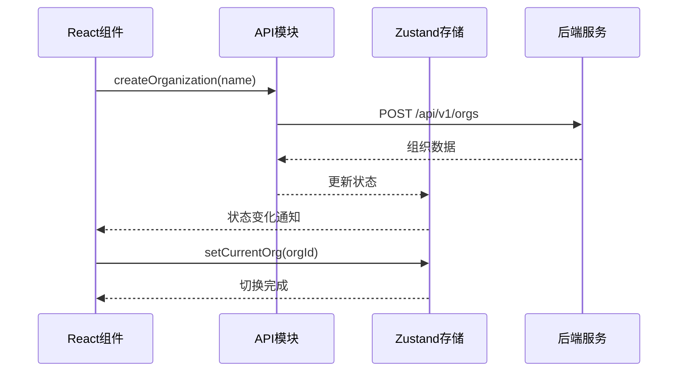
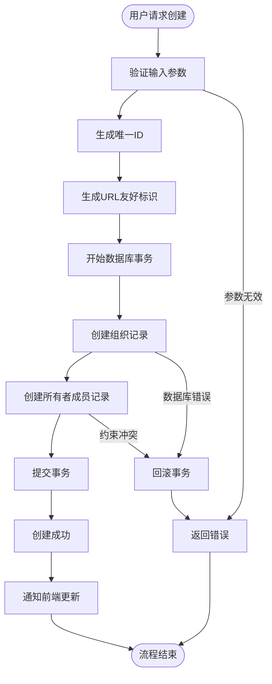
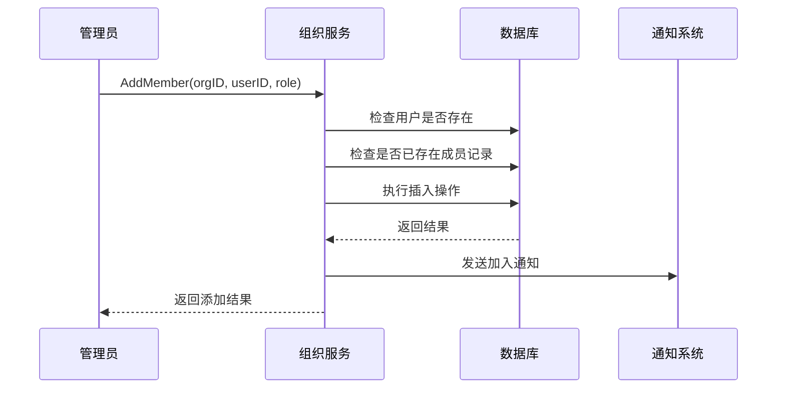
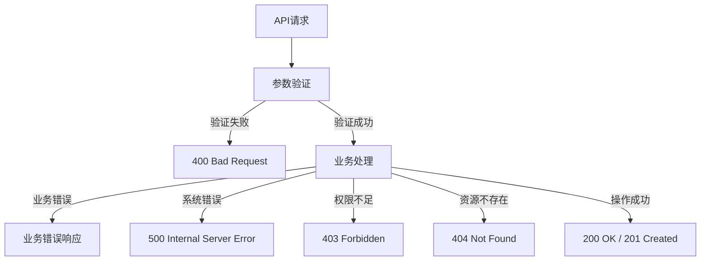

# 组织与成员管理

<cite>
**本文档中引用的文件**
- [organization.go](file://backend/internal/service/organization.go)
- [organization.go](file://backend/internal/model/organization.go)
- [member.go](file://backend/internal/model/member.go)
- [organization.ts](file://frontend/src/lib/store/organization.ts)
- [OrgSwitcher.tsx](file://frontend/src/components/layout/OrgSwitcher.tsx)
- [CreateOrganizationModal.tsx](file://frontend/src/components/layout/CreateOrganizationModal.tsx)
- [organization.ts](file://frontend/src/lib/api/organization.ts)
- [organization.go](file://backend/internal/handler/organization.go)
- [organization_test.go](file://backend/internal/service/organization_test.go)
- [routes.go](file://backend/internal/router/routes.go)
</cite>

## 目录
1. [简介](#简介)
2. [系统架构概览](#系统架构概览)
3. [核心数据模型](#核心数据模型)
4. [后端服务详解](#后端服务详解)
5. [前端状态管理](#前端状态管理)
6. [组织生命周期管理](#组织生命周期管理)
7. [成员管理功能](#成员管理功能)
8. [API接口设计](#api接口设计)
9. [最佳实践与扩展建议](#最佳实践与扩展建议)
10. [故障排除指南](#故障排除指南)

## 简介

EchoMind采用多组织架构设计，支持用户在不同组织间无缝切换和协作。该系统提供了完整的组织创建、成员管理和权限控制功能，确保团队协作的高效性和数据安全性。

核心特性包括：
- 多组织架构支持
- 组织所有权和角色管理
- 成员邀请和加入机制
- 组织间数据隔离
- 实时组织切换功能

## 系统架构概览

EchoMind的组织管理系统采用分层架构设计，包含数据访问层、业务逻辑层和表现层。



**图表来源**
- [routes.go](file://backend/internal/router/routes.go#L26-L98)
- [organization.go](file://backend/internal/handler/organization.go#L12-L18)
- [organization.ts](file://frontend/src/lib/store/organization.ts#L22-L36)

## 核心数据模型

### 组织模型 (Organization)

组织是系统的核心实体，代表一个独立的工作空间。



**图表来源**
- [organization.go](file://backend/internal/model/organization.go#L10-L21)
- [member.go](file://backend/internal/model/member.go#L17-L26)

### 角色权限体系

系统定义了三级组织角色，每级角色拥有不同的权限范围：

| 角色类型 | 权限范围 | 描述 |
|---------|---------|------|
| Owner | 完全控制权 | 组织的超级管理员，可管理所有设置和成员 |
| Admin | 管理权限 | 可以管理成员和部分组织设置 |
| Member | 基础权限 | 可以参与组织内的协作活动 |

**节来源**
- [member.go](file://backend/internal/model/member.go#L9-L15)

## 后端服务详解

### OrganizationService 核心方法

#### CreateOrganization 方法

创建新组织的核心方法，实现了完整的事务处理和所有权建立。



**图表来源**
- [organization.go](file://backend/internal/service/organization.go#L151-L177)
- [organization.go](file://backend/internal/handler/organization.go#L20-L39)

#### CreatePersonalOrganization 方法

为新用户自动创建个人组织，这是系统初始化的重要步骤。

关键特性：
- 自动生成唯一的组织名称和URL标识符
- 自动将创建者设为组织所有者
- 使用数据库事务确保数据一致性
- 支持可选的外部事务管理

**节来源**
- [organization.go](file://backend/internal/service/organization.go#L21-L58)

#### GetUserOrganizations 方法

通过GORM的Join操作实现高效的组织查询。



**图表来源**
- [organization.go](file://backend/internal/service/organization.go#L125-L134)

#### GetOrganizationMembers 方法

使用GORM的Preload功能预加载关联用户信息。

优势：
- 减少N+1查询问题
- 一次性获取完整的成员信息
- 包含用户的姓名和邮箱等详细信息

**节来源**
- [organization.go](file://backend/internal/service/organization.go#L61-L75)

#### AddMember 方法

安全地向组织添加新成员，确保数据完整性。

实现要点：
- 防止重复添加同一用户
- 默认分配成员角色
- 记录加入时间戳
- 支持角色变更

**节来源**
- [organization.go](file://backend/internal/service/organization.go#L78-L93)

### 数据库查询优化

系统在多个查询中采用了GORM的最佳实践：

| 查询类型 | 使用的技术 | 优化效果 |
|---------|-----------|---------|
| 关联查询 | Joins | 减少查询次数，提高性能 |
| 预加载 | Preload | 避免N+1查询问题 |
| 事务处理 | Transaction | 确保数据一致性 |
| 子查询 | Subquery | 复杂条件查询的优雅实现 |

**节来源**
- [organization.go](file://backend/internal/service/organization.go#L95-L123)

## 前端状态管理

### Zustand 组织状态存储

前端使用Zustand进行组织状态管理，实现了持久化存储和实时更新。



**图表来源**
- [organization.ts](file://frontend/src/lib/store/organization.ts#L22-L36)

### OrgSwitcher 组件

组织切换器提供了直观的用户界面，支持组织间的无缝切换。

主要功能：
- 下拉菜单显示可用组织
- 当前组织高亮显示
- 新组织创建入口
- 搜索和过滤功能

**节来源**
- [OrgSwitcher.tsx](file://frontend/src/components/layout/OrgSwitcher.tsx#L11-L66)

### API 调用封装

前端API模块封装了所有组织相关的HTTP请求：



**图表来源**
- [organization.ts](file://frontend/src/lib/api/organization.ts#L12-L15)
- [CreateOrganizationModal.tsx](file://frontend/src/components/layout/CreateOrganizationModal.tsx#L22-L35)

**节来源**
- [organization.ts](file://frontend/src/lib/api/organization.ts#L1-L17)

## 组织生命周期管理

### 创建阶段

组织的创建遵循严格的流程，确保数据的完整性和一致性。



**图表来源**
- [organization.go](file://backend/internal/service/organization.go#L151-L177)

### 迁移和维护

系统提供了自动化的用户组织迁移功能，确保所有用户都有对应的组织。

**节来源**
- [organization.go](file://backend/internal/service/organization.go#L95-L123)

## 成员管理功能

### 成员添加流程

成员添加是一个原子性操作，确保数据的一致性。



**图表来源**
- [organization.go](file://backend/internal/service/organization.go#L78-L93)

### 权限控制机制

系统通过角色权限模型实现细粒度的访问控制：

| 操作类型 | Owner | Admin | Member | 描述 |
|---------|-------|-------|--------|------|
| 查看组织成员 | ✓ | ✓ | ✓ | 所有成员可见 |
| 邀请新成员 | ✓ | ✓ | ✗ | 需要管理员权限 |
| 修改成员角色 | ✓ | ✓ | ✗ | 管理员可调整 |
| 删除成员 | ✓ | ✓ | ✗ | 管理员权限 |
| 修改组织设置 | ✓ | ✗ | ✗ | 仅所有者可操作 |

**节来源**
- [organization.go](file://backend/internal/handler/organization.go#L85-L86)

## API接口设计

### RESTful API规范

EchoMind的组织API遵循RESTful设计原则：

| HTTP方法 | 端点 | 功能 | 权限要求 |
|---------|------|------|---------|
| POST | `/api/v1/orgs` | 创建新组织 | 已认证用户 |
| GET | `/api/v1/orgs` | 获取用户组织列表 | 已认证用户 |
| GET | `/api/v1/orgs/:id` | 获取特定组织详情 | 组织成员 |
| GET | `/api/v1/orgs/:id/members` | 获取组织成员列表 | 组织成员 |
| POST | `/api/v1/orgs/:id/invites` | 邀请新成员 | 组织管理员 |

**节来源**
- [routes.go](file://backend/internal/router/routes.go#L41-L46)
- [organization.go](file://backend/internal/handler/organization.go#L20-L114)

### 错误处理策略

API层实现了统一的错误处理机制：



**图表来源**
- [organization.go](file://backend/internal/handler/organization.go#L25-L36)

## 最佳实践与扩展建议

### 性能优化建议

1. **数据库索引优化**
   - 在 `organization_members` 表上为 `user_id` 和 `organization_id` 创建复合索引
   - 对 `organizations.slug` 字段使用唯一索引

2. **缓存策略**
   - 缓存用户组织列表，减少数据库查询
   - 使用Redis缓存频繁访问的组织信息

3. **批量操作**
   - 实现批量成员添加功能
   - 支持CSV导入成员名单

### 安全加固措施

1. **权限验证**
   - 实现基于角色的访问控制（RBAC）
   - 添加审计日志记录敏感操作

2. **数据保护**
   - 对敏感字段进行加密存储
   - 实现数据脱敏功能

### 扩展功能建议

1. **组织模板**
   ```typescript
   interface OrganizationTemplate {
     id: string;
     name: string;
     description: string;
     defaultRoles: OrganizationRole[];
     permissions: PermissionSet;
   }
   ```

2. **组织层级**
   ```typescript
   interface OrganizationHierarchy {
     parentOrgId?: string;
     childOrgs: Organization[];
     path: string[];
   }
   ```

3. **团队集成**
   ```typescript
   interface TeamIntegration {
     teamId: string;
     organizationId: string;
     permissions: TeamPermission[];
   }
   ```

## 故障排除指南

### 常见问题及解决方案

#### 组织创建失败

**症状**: 创建组织时返回500错误
**可能原因**:
- 数据库连接问题
- 唯一约束冲突
- 事务超时

**解决步骤**:
1. 检查数据库连接状态
2. 验证组织名称的唯一性
3. 增加事务超时时间

#### 成员添加异常

**症状**: 成员无法添加到组织
**可能原因**:
- 用户不存在
- 已经是组织成员
- 权限不足

**诊断方法**:
```typescript
// 检查用户是否存在
const userExists = await userService.findById(userId);

// 检查是否已经是成员
const isMember = await organizationService.isMember(orgId, userId);

// 验证调用者权限
const hasPermission = await organizationService.hasAdminPermission(currentUserId, orgId);
```

#### 前端状态同步问题

**症状**: 组织切换后状态未更新
**解决方案**:
1. 检查Zustand存储配置
2. 验证API响应格式
3. 确认事件监听器正常工作

**节来源**
- [organization_test.go](file://backend/internal/service/organization_test.go#L20-L69)

### 监控和调试

建议实施以下监控指标：

| 指标类型 | 监控项目 | 告警阈值 |
|---------|---------|---------|
| 性能指标 | 组织创建响应时间 | >2秒 |
| 错误率 | API错误率 | >5% |
| 并发量 | 同时在线用户数 | >1000 |
| 资源使用 | 数据库连接池使用率 | >80% |

通过这些监控指标，可以及时发现和解决组织管理系统的性能瓶颈和潜在问题。