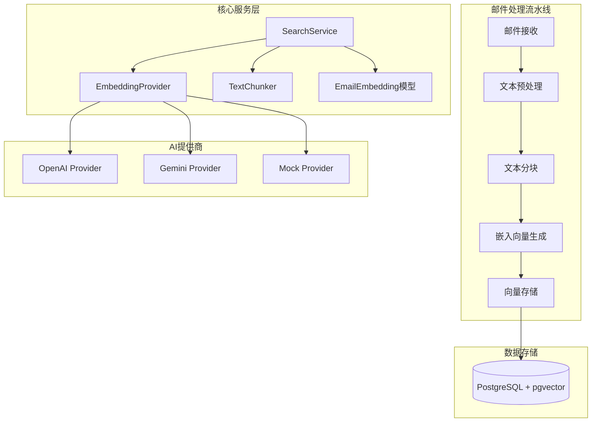
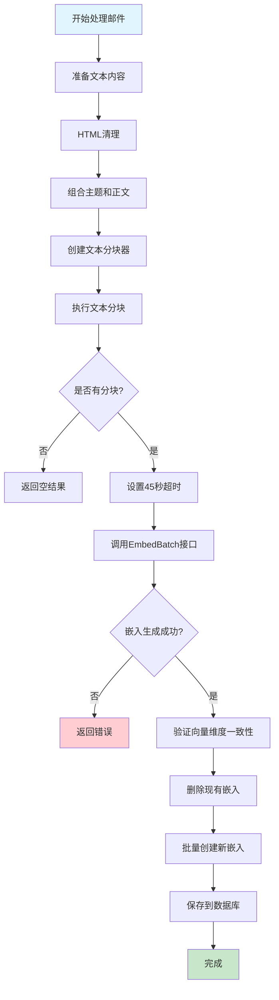
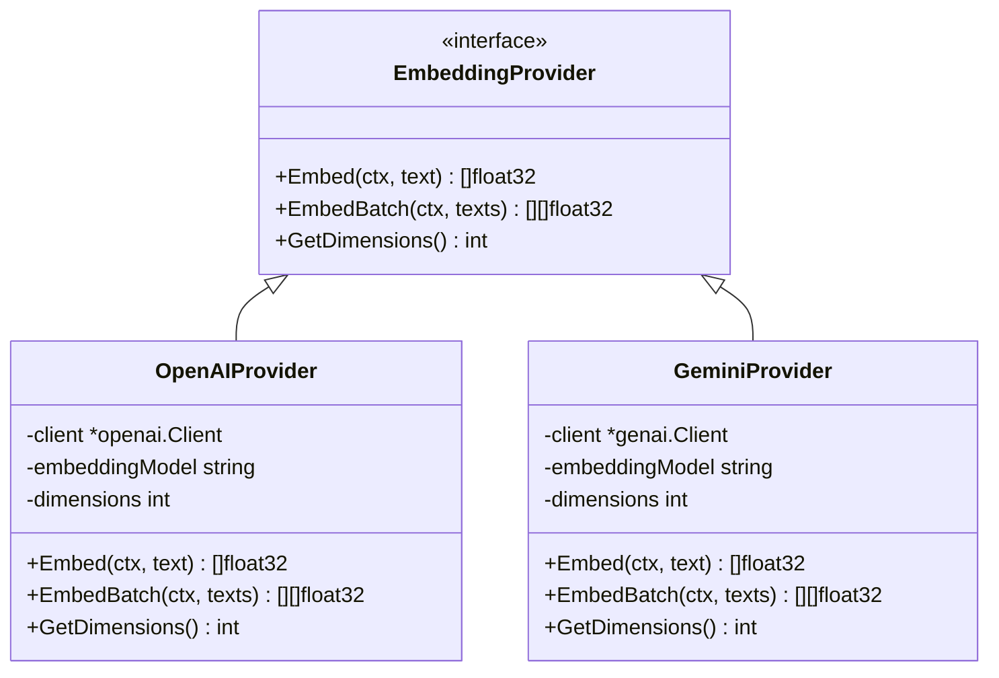
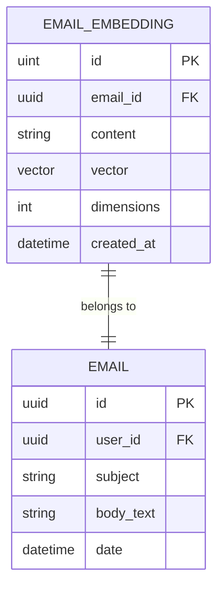
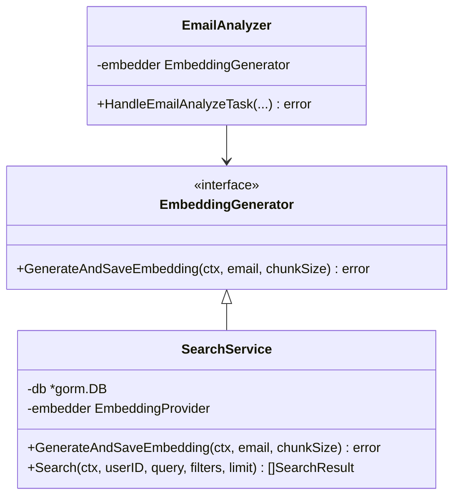
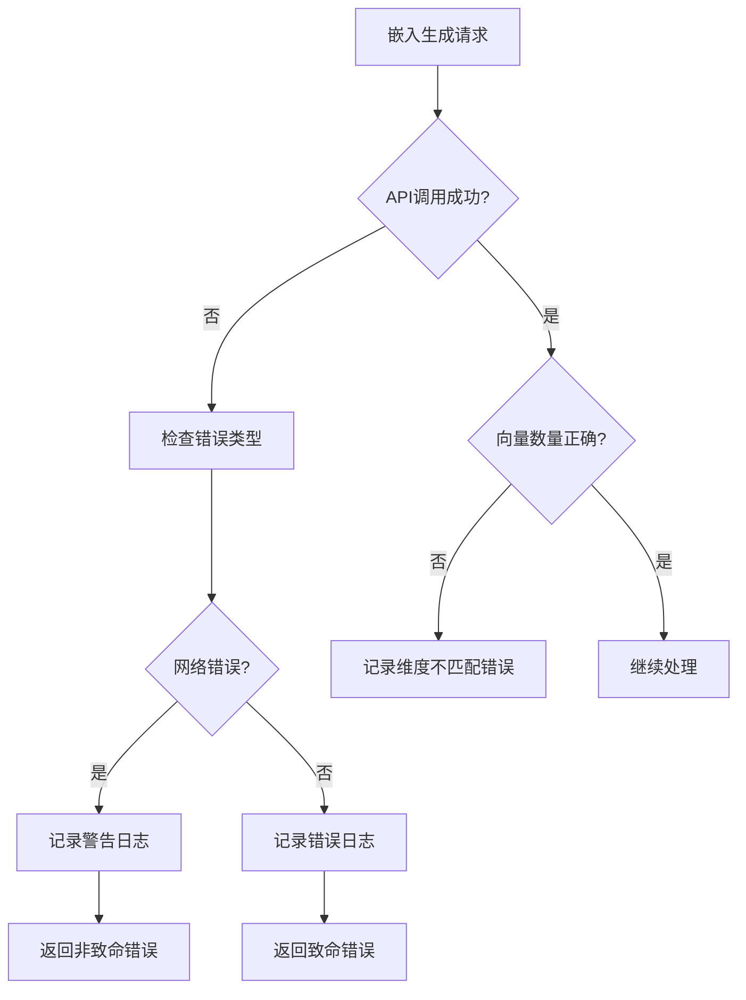

# 向量嵌入生成

<cite>
**本文档引用的文件**
- [search.go](file://backend/internal/service/search.go)
- [chunker.go](file://backend/pkg/utils/chunker.go)
- [embedding.go](file://backend/internal/model/embedding.go)
- [provider.go](file://backend/pkg/ai/provider.go)
- [openai/provider.go](file://backend/pkg/ai/openai/provider.go)
- [gemini/provider.go](file://backend/pkg/ai/gemini/provider.go)
- [html.go](file://backend/pkg/utils/html.go)
- [analyze.go](file://backend/internal/tasks/analyze.go)
- [search_test.go](file://backend/internal/service/search_test.go)
- [embedding_test.go](file://backend/internal/model/embedding_test.go)
</cite>

## 目录
1. [简介](#简介)
2. [核心架构概述](#核心架构概述)
3. [GenerateAndSaveEmbedding 方法详解](#generateandsaveembedding-方法详解)
4. [文本预处理与分块策略](#文本预处理与分块策略)
5. [嵌入向量生成](#嵌入向量生成)
6. [数据库存储机制](#数据库存储机制)
7. [接口设计与依赖注入](#接口设计与依赖注入)
8. [性能优化与错误处理](#性能优化与错误处理)
9. [配置与扩展指南](#配置与扩展指南)
10. [最佳实践建议](#最佳实践建议)

## 简介

EchoMind 的向量嵌入生成功能是其智能邮件分析系统的核心组件之一。该功能通过将邮件内容转换为高维向量表示，支持语义搜索、相似度匹配和智能分类等高级功能。本文档深入解析 `SearchService.GenerateAndSaveEmbedding` 方法的完整实现流程，涵盖从文本预处理到向量存储的各个环节。

## 核心架构概述

EchoMind 的向量嵌入生成系统采用模块化设计，主要包含以下核心组件：



**图表来源**
- [search.go](file://backend/internal/service/search.go#L17-L26)
- [provider.go](file://backend/pkg/ai/provider.go#L24-L34)
- [embedding.go](file://backend/internal/model/embedding.go#L10-L20)

**章节来源**
- [search.go](file://backend/internal/service/search.go#L17-L26)
- [provider.go](file://backend/pkg/ai/provider.go#L24-L34)

## GenerateAndSaveEmbedding 方法详解

`GenerateAndSaveEmbedding` 方法是向量嵌入生成的核心入口点，实现了完整的邮件内容向量化流程。

### 方法签名与职责

该方法接受三个参数：
- `ctx context.Context`: 上下文控制请求生命周期和取消操作
- `email *model.Email`: 要处理的邮件对象，包含主题和正文内容
- `chunkSize int`: 文本分块大小，默认值为 1000 tokens

### 执行流程图



**图表来源**
- [search.go](file://backend/internal/service/search.go#L108-L170)

### 关键实现细节

#### 1. 文本准备阶段
方法首先合并邮件的主题和正文内容，确保完整的语义信息被保留用于后续处理。

#### 2. 分块策略
使用 `utils.TextChunker` 实现智能分块，支持多种分块策略：
- 按段落分割的基础策略
- 超长段落的句子级分割
- 基于 token 数量的限制

#### 3. 超时控制
设置 45 秒的上下文超时，防止长时间阻塞影响系统响应性。

**章节来源**
- [search.go](file://backend/internal/service/search.go#L108-L170)

## 文本预处理与分块策略

### HTML 清理机制

系统使用专门的 HTML 清理工具去除邮件中的 HTML 标签，保留纯文本内容：

```mermaid
flowchart LR
A[原始HTML邮件] --> B[StripHTML函数]
B --> C[正则表达式移除标签]
C --> D[HTML实体解码]
D --> E[多余空格折叠]
E --> F[清理后的纯文本]
subgraph "HTML实体处理"
G[&nbsp; → 空格]
H[&amp; → &]
I[&lt; → <]
J[&gt; → >]
K[&quot; → "]
L[&#39; → ']
end
D --> G
D --> H
D --> I
D --> J
D --> K
D --> L
```

**图表来源**
- [html.go](file://backend/pkg/utils/html.go#L8-L33)

### 文本分块算法

`TextChunker` 实现了多层次的分块策略：

#### 分块策略层次
1. **段落级分块**：优先按自然段落分割
2. **句子级分块**：对过长段落进行句子级细化
3. **硬分割**：当无法找到合适的分割点时的最终手段

#### 分块参数配置
- **默认分块大小**：1000 tokens（约 4000 字符）
- **字符限制计算**：基于 4 字符/token 的估算，加上 10% 安全边际
- **分割点选择**：优先选择句号、感叹号、问号或换行符

**章节来源**
- [chunker.go](file://backend/pkg/utils/chunker.go#L20-L100)
- [html.go](file://backend/pkg/utils/html.go#L8-L33)

## 嵌入向量生成

### AI 提供商抽象层

系统支持多种 AI 提供商，通过统一的 `EmbeddingProvider` 接口实现：



**图表来源**
- [provider.go](file://backend/pkg/ai/provider.go#L24-L34)
- [openai/provider.go](file://backend/pkg/ai/openai/provider.go#L21-L273)
- [gemini/provider.go](file://backend/pkg/ai/gemini/provider.go#L23-L313)

### 批量嵌入生成

#### OpenAI 实现特点
- 支持自定义嵌入模型（如 text-embedding-3-small）
- 可配置向量维度
- 高效的批量 API 调用

#### Gemini 实现特点
- 使用 Google 的语义搜索优化模型
- 支持流式处理
- 内置批处理优化

### 错误处理与重试机制

系统实现了完善的错误处理机制：
- 嵌入生成失败时的优雅降级
- 向量维度不匹配的验证
- 网络超时和 API 限制的处理

**章节来源**
- [provider.go](file://backend/pkg/ai/provider.go#L24-L34)
- [openai/provider.go](file://backend/pkg/ai/openai/provider.go#L248-L267)
- [gemini/provider.go](file://backend/pkg/ai/gemini/provider.go#L291-L307)

## 数据库存储机制

### EmailEmbedding 模型设计



**图表来源**
- [embedding.go](file://backend/internal/model/embedding.go#L10-L20)

### 存储策略

#### 1. 去重机制
每次生成新嵌入前自动删除旧记录，避免数据冗余：

```sql
DELETE FROM email_embeddings WHERE email_id = ?
```

#### 2. 批量插入优化
使用 GORM 的批量创建功能提高写入效率：

```sql
INSERT INTO email_embeddings (email_id, content, vector, dimensions, created_at) 
VALUES (?, ?, ?, ?, ?), (?, ?, ?, ?, ?), ...
```

#### 3. 索引优化
- 主键索引：快速定位单条记录
- 外键索引：保证数据完整性
- 向量索引：支持高效的相似度搜索

**章节来源**
- [embedding.go](file://backend/internal/model/embedding.go#L10-L20)
- [search.go](file://backend/internal/service/search.go#L149-L170)

## 接口设计与依赖注入

### EmbeddingGenerator 接口

系统定义了清晰的接口层次结构：



**图表来源**
- [analyze.go](file://backend/internal/tasks/analyze.go#L44-L47)
- [search.go](file://backend/internal/service/search.go#L17-L26)

### 依赖注入模式

系统采用构造函数注入的方式管理依赖关系：
- `SearchService` 通过构造函数接收 `gorm.DB` 和 `EmbeddingProvider`
- 在任务处理中通过接口传递 `EmbeddingGenerator`
- 支持 Mock 对象用于单元测试

**章节来源**
- [analyze.go](file://backend/internal/tasks/analyze.go#L44-L47)
- [search.go](file://backend/internal/service/search.go#L22-L26)

## 性能优化与错误处理

### 超时控制机制

系统设置了多层级的超时控制：

#### 1. 嵌入生成超时
```go
embeddingCtx, cancel := context.WithTimeout(ctx, 45*time.Second)
defer cancel()
```

#### 2. 数据库操作超时
通过 GORM 的上下文传播自动应用超时设置

### 错误处理策略

#### 嵌入生成错误处理


**图表来源**
- [search.go](file://backend/internal/service/search.go#L130-L146)

### 性能监控指标

系统在任务处理中集成了性能监控：
- 任务执行时间统计
- 嵌入生成耗时跟踪
- 数据库操作延迟监控

**章节来源**
- [search.go](file://backend/internal/service/search.go#L130-L146)
- [analyze.go](file://backend/internal/tasks/analyze.go#L56-L82)

## 配置与扩展指南

### 分块大小调优

#### 默认配置
- **chunkSize**: 1000 tokens（约 4000 字符）

#### 调优建议
- **短邮件场景**：减少分块大小以获得更细粒度的语义表示
- **长邮件场景**：适当增加分块大小以平衡精度和性能
- **内存受限环境**：减小分块大小降低内存占用

### AI 提供商配置

#### OpenAI 配置选项
```yaml
providers:
  openai:
    api_key: "your-api-key"
    model: "gpt-4"
    embedding_model: "text-embedding-3-small"
    embedding_dimensions: 1024
    base_url: "https://api.openai.com/v1"
```

#### Gemini 配置选项
```yaml
providers:
  gemini:
    api_key: "your-api-key"
    model: "gemini-pro"
    embedding_model: "embedding-001"
    embedding_dimensions: 768
```

### 自定义提供商开发

开发者可以通过实现 `EmbeddingProvider` 接口添加新的 AI 提供商：

```go
type CustomProvider struct {
    // 自定义字段
}

func (p *CustomProvider) Embed(ctx context.Context, text string) ([]float32, error) {
    // 实现单文本嵌入生成
}

func (p *CustomProvider) EmbedBatch(ctx context.Context, texts []string) ([][]float32, error) {
    // 实现批量嵌入生成
}

func (p *CustomProvider) GetDimensions() int {
    // 返回向量维度
}
```

**章节来源**
- [openai/provider.go](file://backend/pkg/ai/openai/provider.go#L29-L46)
- [gemini/provider.go](file://backend/pkg/ai/gemini/provider.go#L31-L54)

## 最佳实践建议

### 开发者指导

#### 1. 分块大小优化
- **评估邮件长度分布**：分析用户邮件的平均长度
- **测试不同分块大小**：在生产环境中对比不同配置的效果
- **考虑内存限制**：确保分块大小不会导致内存溢出

#### 2. 错误处理最佳实践
- **区分致命与非致命错误**：嵌入生成失败不应中断邮件分析流程
- **实现重试机制**：对于临时性错误（如网络超时）应具备重试能力
- **监控错误率**：建立告警机制监控嵌入生成成功率

#### 3. 性能优化策略
- **批量处理**：尽可能利用批量 API 减少网络开销
- **缓存机制**：对重复内容的嵌入结果进行缓存
- **异步处理**：将嵌入生成作为独立任务异步执行

#### 4. 测试与验证
- **单元测试**：使用 Mock 提供商进行单元测试
- **集成测试**：验证完整的邮件处理流程
- **性能测试**：评估不同负载下的系统表现

### 生产环境部署建议

#### 1. 监控指标
- 嵌入生成成功率
- 平均处理时间
- 错误率统计
- API 调用频率

#### 2. 容错机制
- 多提供商备份
- 降级策略
- 故障转移机制

#### 3. 扩展性考虑
- 水平扩展能力
- 负载均衡策略
- 资源配额管理

通过遵循这些最佳实践，开发者可以充分利用 EchoMind 的向量嵌入生成功能，构建高性能、可扩展的邮件智能分析系统。