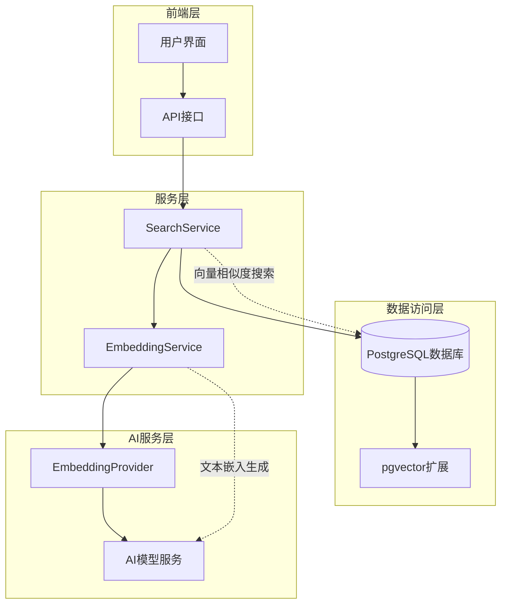
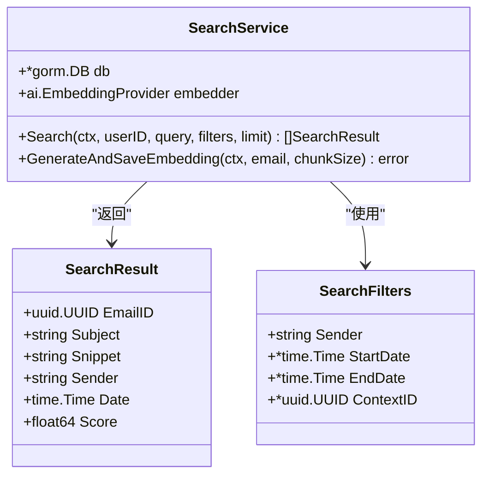
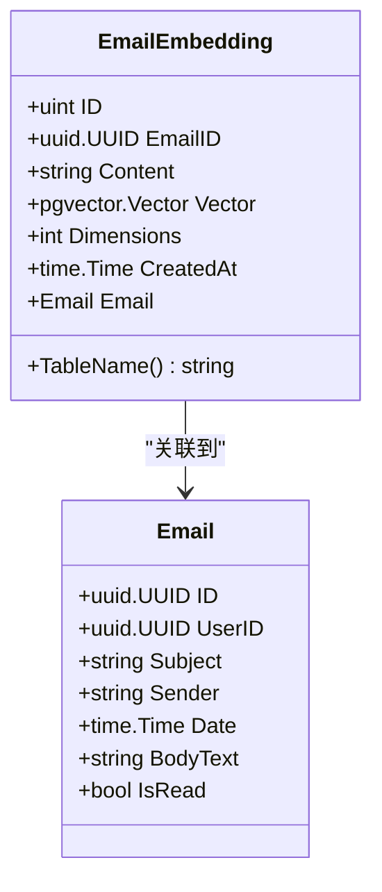
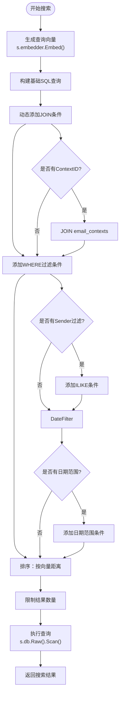
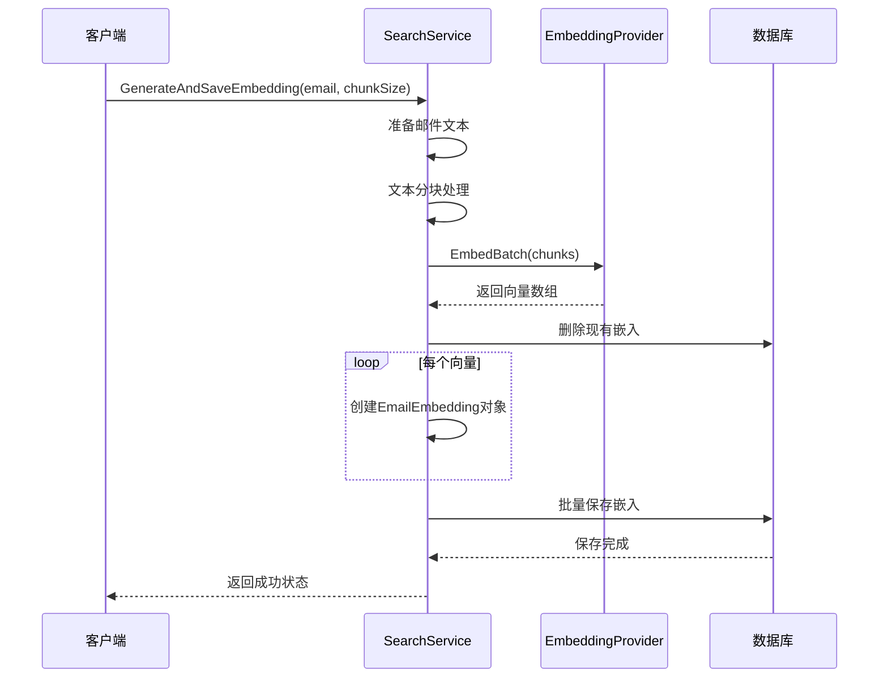
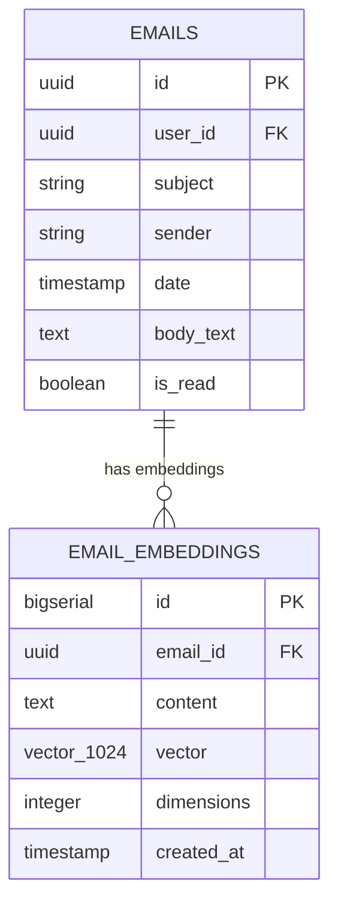
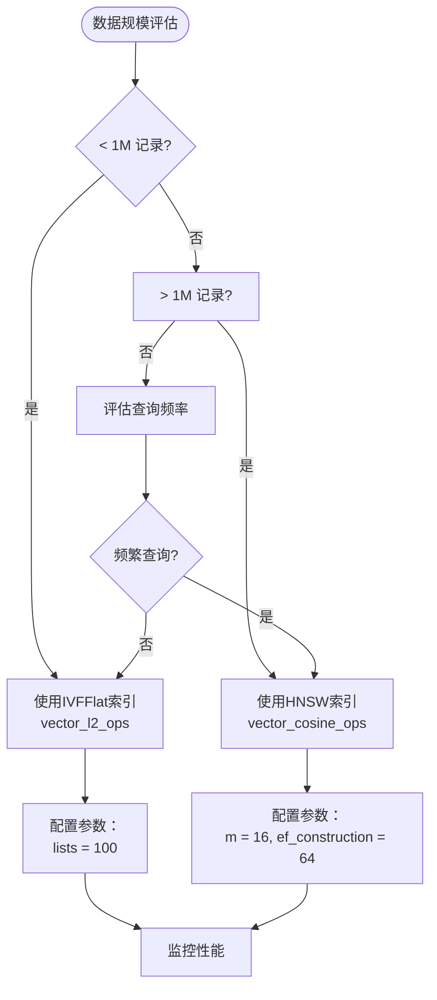
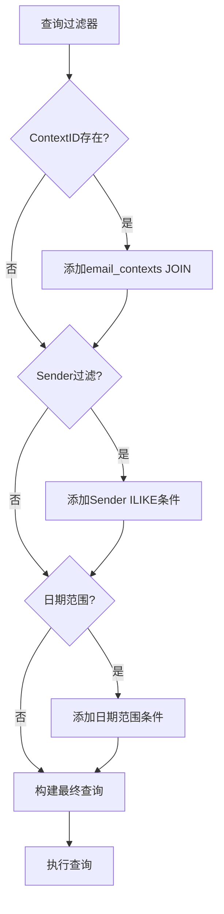
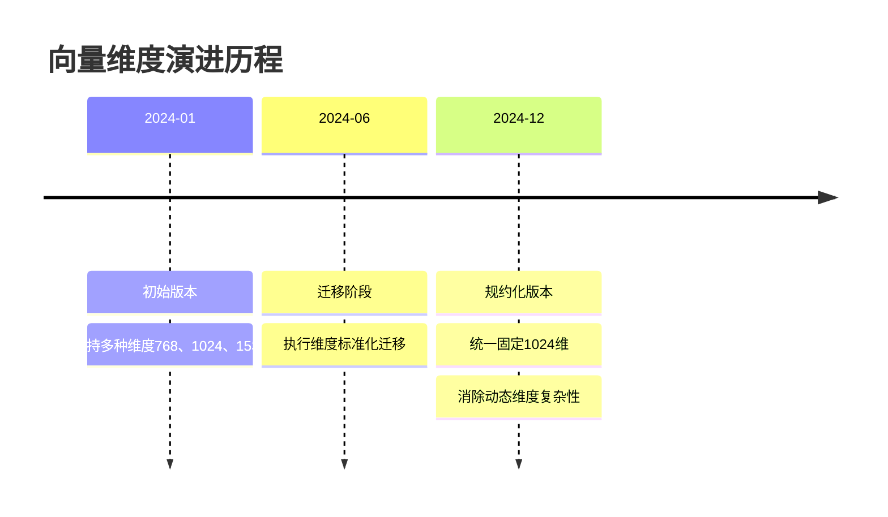

# 向量数据库查询

<cite>
**本文档引用的文件**
- [search.go](file://backend/internal/service/search.go)
- [embedding.go](file://backend/internal/model/embedding.go)
- [postgres.go](file://backend/pkg/database/postgres.go)
- [app.go](file://backend/internal/bootstrap/app.go)
- [001_update_vector_dimensions.sql](file://backend/migrations/001_update_vector_dimensions.sql)
- [email.go](file://backend/internal/model/email.go)
- [search_bench_test.go](file://backend/internal/service/search_bench_test.go)
- [health.go](file://backend/internal/handler/health.go)
</cite>

## 目录
1. [简介](#简介)
2. [系统架构概览](#系统架构概览)
3. [核心组件分析](#核心组件分析)
4. [向量搜索服务详解](#向量搜索服务详解)
5. [数据库模型设计](#数据库模型设计)
6. [向量索引优化](#向量索引优化)
7. [查询性能优化](#查询性能优化)
8. [向量维度管理](#向量维度管理)
9. [最佳实践指南](#最佳实践指南)
10. [故障排除](#故障排除)

## 简介

EchoMind是一个基于人工智能的邮件管理系统，其核心功能之一是利用向量数据库技术实现智能邮件搜索。系统采用PostgreSQL数据库结合pgvector扩展，实现了高效的向量相似度搜索功能。通过将邮件内容转换为高维向量表示，系统能够快速找到语义上相似的邮件，为用户提供智能化的邮件检索体验。

## 系统架构概览

EchoMind的向量数据库查询系统采用分层架构设计，主要包含以下核心层次：



**图表来源**
- [search.go](file://backend/internal/service/search.go#L17-L27)
- [postgres.go](file://backend/pkg/database/postgres.go#L10-L16)

## 核心组件分析

### SearchService 核心服务

SearchService是向量搜索功能的核心控制器，负责协调整个搜索流程：



**图表来源**
- [search.go](file://backend/internal/service/search.go#L17-L36)

**章节来源**
- [search.go](file://backend/internal/service/search.go#L17-L171)

### 向量嵌入模型

EmailEmbedding模型定义了向量存储的数据结构：



**图表来源**
- [embedding.go](file://backend/internal/model/embedding.go#L10-L24)
- [email.go](file://backend/internal/model/email.go#L12-L36)

**章节来源**
- [embedding.go](file://backend/internal/model/embedding.go#L1-L25)

## 向量搜索服务详解

### Search 方法实现逻辑

`SearchService.Search`方法是向量搜索的核心实现，其查询构建逻辑如下：

#### 查询构建流程



**图表来源**
- [search.go](file://backend/internal/service/search.go#L45-L105)

#### 原始SQL查询构建

Search方法中的SQL查询构建采用了动态拼接的方式，支持多种过滤条件：

**关键查询要素：**

1. **余弦距离计算**：使用`<=>`操作符计算向量间的余弦距离
2. **相似度转换**：通过`1 - (ee.vector <=> ?)`将距离转换为相似度分数
3. **表连接**：`email_embeddings`表与`emails`表的JOIN操作
4. **参数绑定**：使用`pgvector.NewVector()`将Go切片转换为数据库向量类型

**章节来源**
- [search.go](file://backend/internal/service/search.go#L55-L105)

### GenerateAndSaveEmbedding 方法

该方法负责为邮件生成和保存向量嵌入：



**图表来源**
- [search.go](file://backend/internal/service/search.go#L108-L170)

**章节来源**
- [search.go](file://backend/internal/service/search.go#L108-L170)

## 数据库模型设计

### email_embeddings 表结构

email_embeddings表专门用于存储邮件的向量表示：

| 字段名 | 类型 | 约束 | 描述 |
|--------|------|------|------|
| id | bigint | PRIMARY KEY | 主键标识符 |
| email_id | uuid | NOT NULL, INDEX | 关联的邮件ID |
| content | text | - | 存储的文本片段 |
| vector | vector(1024) | - | 1024维向量存储 |
| dimensions | integer | NOT NULL, DEFAULT 1024 | 向量维度（固定值） |
| created_at | timestamp | - | 创建时间 |

**章节来源**
- [embedding.go](file://backend/internal/model/embedding.go#L10-L24)

### 邮件表关联关系

系统通过外键约束建立了邮件与向量嵌入之间的关联关系：



**图表来源**
- [email.go](file://backend/internal/model/email.go#L12-L36)
- [embedding.go](file://backend/internal/model/embedding.go#L10-L24)

**章节来源**
- [email.go](file://backend/internal/model/email.go#L1-L37)

## 向量索引优化

### HNSW索引配置

EchoMind采用HNSW（Hierarchical Navigable Small World）算法作为主要的向量索引策略：

#### 索引创建语句

```sql
CREATE INDEX IF NOT EXISTS email_embeddings_vector_idx 
ON email_embeddings 
USING hnsw (vector vector_cosine_ops) 
WITH (m = 16, ef_construction = 64);
```

#### HNSW参数说明

| 参数 | 默认值 | 推荐值 | 说明 |
|------|--------|--------|------|
| m | 16 | 16-64 | 每层节点的最大连接数 |
| ef_construction | 200 | 64-200 | 构建时的候选节点数 |
| ef_search | 动态 | 64-200 | 查询时的候选节点数 |

**章节来源**
- [app.go](file://backend/internal/bootstrap/app.go#L133-L136)
- [001_update_vector_dimensions.sql](file://backend/migrations/001_update_vector_dimensions.sql#L55-L59)

### 索引类型选择策略

根据数据规模选择合适的索引类型：



**图表来源**
- [001_update_vector_dimensions.sql](file://backend/migrations/001_update_vector_dimensions.sql#L49-L59)

## 查询性能优化

### 向量转换优化

#### pgvector.NewVector 使用

系统通过`pgvector.NewVector`函数将Go语言的float32切片转换为数据库向量类型：

```go
// 查询向量转换
args := []interface{}{pgvector.NewVector(queryVector)}

// 嵌入向量保存
embeddings = append(embeddings, model.EmailEmbedding{
    EmailID: email.ID,
    Content: chunks[i],
    Vector:  pgvector.NewVector(vec),
})
```

#### 性能考虑因素

1. **内存分配优化**：避免重复的向量转换操作
2. **批量处理**：使用EmbedBatch进行批量向量生成
3. **超时控制**：设置45秒的嵌入生成超时

**章节来源**
- [search.go](file://backend/internal/service/search.go#L67-L98)

### 查询优化策略

#### 动态SQL构建

系统采用动态SQL构建策略，根据实际查询需求生成最优的SQL语句：



**图表来源**
- [search.go](file://backend/internal/service/search.go#L69-L94)

#### 排序优化

查询使用向量距离进行排序，确保最相关的邮件优先返回：

```sql
ORDER BY ee.vector <=> ? LIMIT ?
```

这种排序方式的优势：
- **语义相关性**：基于向量相似度而非关键词匹配
- **性能优化**：利用HNSW索引加速排序过程
- **结果质量**：提供更符合用户意图的搜索结果

**章节来源**
- [search.go](file://backend/internal/service/search.go#L96-L98)

## 向量维度管理

### 固定维度策略

EchoMind采用规约化的固定维度策略，所有向量统一使用1024维：

#### 维度规约化历史



**图表来源**
- [001_update_vector_dimensions.sql](file://backend/migrations/001_update_vector_dimensions.sql#L1-L79)

#### 迁移策略

系统通过迁移脚本实现向量维度的标准化：

```sql
-- 步骤1：识别现有向量维度
UPDATE email_embeddings 
SET dimensions = 1024 
WHERE array_length(vector::real[], 1) = 1024;

-- 步骤2：填充或截断向量至目标维度
UPDATE email_embeddings SET
  vector = CASE
    WHEN dimensions = 1024 THEN vector
    ELSE array_fill(0, ARRAY[1024])::real[]
  END;
```

**章节来源**
- [001_update_vector_dimensions.sql](file://backend/migrations/001_update_vector_dimensions.sql#L17-L44)

### 维度兼容性处理

#### 多提供商支持

虽然当前采用固定1024维策略，但系统设计考虑了多提供商的兼容性：

| 提供商 | 默认维度 | 兼容性策略 |
|--------|----------|------------|
| OpenAI | 1536 | 截断至1024 |
| SiliconFlow | 1024 | 直接使用 |
| Gemini | 768 | 填充至1024 |

#### 向量验证机制

系统在保存向量时进行维度验证：

```go
// 基础验证 - 向量维度一致性由数据库架构处理
if len(vectors) == 0 || len(vectors[0]) == 0 {
    return fmt.Errorf("no valid vectors generated")
}
```

**章节来源**
- [search.go](file://backend/internal/service/search.go#L143-L146)

## 最佳实践指南

### 开发者指导

#### 1. 向量搜索集成

```go
// 创建搜索服务实例
searchService := service.NewSearchService(db, embedder)

// 执行向量搜索
results, err := searchService.Search(
    ctx,                    // 上下文
    userID,                 // 用户ID
    "项目相关邮件",          // 搜索查询
    service.SearchFilters{  // 过滤条件
        Sender: "manager@example.com",
        StartDate: startDate,
        EndDate: endDate,
    },
    10,                     // 结果数量限制
)
```

#### 2. 嵌入生成最佳实践

```go
// 为邮件生成嵌入
err := searchService.GenerateAndSaveEmbedding(
    ctx,                    // 上下文
    email,                  // 邮件对象
    1000,                   // 分块大小（可选）
)
```

#### 3. 性能监控指标

建议监控以下关键指标：

| 指标名称 | 监控目的 | 告警阈值 |
|----------|----------|----------|
| 向量生成延迟 | 嵌入服务性能 | >5秒 |
| 搜索响应时间 | 查询性能 | >1秒 |
| 索引命中率 | 索引效果 | <90% |
| 向量维度一致性 | 数据完整性 | 不一致率>0.1% |

### 生产环境部署

#### 数据库配置优化

```sql
-- 设置HNSW索引参数
ALTER SYSTEM SET hnsw.ef_search = 64;
ALTER SYSTEM SET hnsw.m = 16;

-- 调整工作内存
ALTER SYSTEM SET work_mem = '256MB';

-- 重启生效
SELECT pg_reload_conf();
```

#### 监控和维护

1. **定期统计更新**：`ANALYZE email_embeddings;`
2. **索引维护**：定期检查索引碎片情况
3. **向量质量检查**：监控向量分布和异常值

**章节来源**
- [search_bench_test.go](file://backend/internal/service/search_bench_test.go#L138-L169)

## 故障排除

### 常见问题诊断

#### 1. 向量扩展缺失

**症状**：数据库连接正常但pgvector功能不可用

**诊断命令**：
```sql
-- 检查pgvector扩展状态
SELECT extversion FROM pg_extension WHERE extname = 'vector';

-- 检查健康状态
SELECT * FROM health_check();
```

**解决方案**：
```bash
# 在数据库中创建扩展
CREATE EXTENSION IF NOT EXISTS vector;

# 或通过应用程序启动时自动创建
./echomind db-init
```

#### 2. 索引性能问题

**症状**：向量搜索响应缓慢

**诊断步骤**：
```sql
-- 检查索引使用情况
EXPLAIN ANALYZE 
SELECT * FROM email_embeddings 
WHERE email_id = 'some-id'
ORDER BY vector <=> '[1,2,3,...]' LIMIT 10;

-- 检查索引统计信息
SELECT relname, n_tup_ins, n_tup_upd, n_tup_del 
FROM pg_stat_user_tables 
WHERE relname = 'email_embeddings';
```

**优化方案**：
- 确认HNSW索引已正确创建
- 检查向量是否已归一化
- 调整HNSW参数配置

#### 3. 向量维度不匹配

**症状**：向量保存失败或查询结果异常

**诊断方法**：
```sql
-- 检查向量维度分布
SELECT 
    COUNT(*) as total_records,
    COUNT(CASE WHEN dimensions = 1024 THEN 1 END) as correct_dim,
    COUNT(CASE WHEN dimensions != 1024 THEN 1 END) as wrong_dim
FROM email_embeddings;
```

**修复步骤**：
1. 运行维度标准化迁移脚本
2. 验证向量长度一致性
3. 重新生成有问题的向量

### 性能调优建议

#### 内存配置优化

```bash
# PostgreSQL内存配置建议
shared_buffers = 2GB
effective_cache_size = 6GB
work_mem = 256MB
maintenance_work_mem = 512MB
```

#### 并发控制

```go
// 设置合理的超时和并发限制
ctx, cancel := context.WithTimeout(context.Background(), 45*time.Second)
defer cancel()

// 批量处理时的并发控制
const batchSize = 100
for i := 0; i < len(emails); i += batchSize {
    end := i + batchSize
    if end > len(emails) {
        end = len(emails)
    }
    // 处理批次
}
```

**章节来源**
- [health.go](file://backend/internal/handler/health.go#L31-L44)

## 结论

EchoMind的向量数据库查询功能通过pgvector扩展实现了高效、智能的邮件搜索能力。系统采用规约化的固定维度策略，结合HNSW索引算法，在保证查询质量的同时实现了良好的性能表现。

关键技术特点包括：
- **规约化设计**：统一1024维向量标准，简化系统复杂性
- **动态查询构建**：支持灵活的搜索过滤条件
- **高性能索引**：HNSW算法提供优秀的查询性能
- **完整生命周期管理**：从向量生成到查询优化的全流程支持

通过遵循本文档提供的最佳实践和优化建议，开发者可以充分利用EchoMind的向量搜索功能，构建高质量的智能邮件应用。