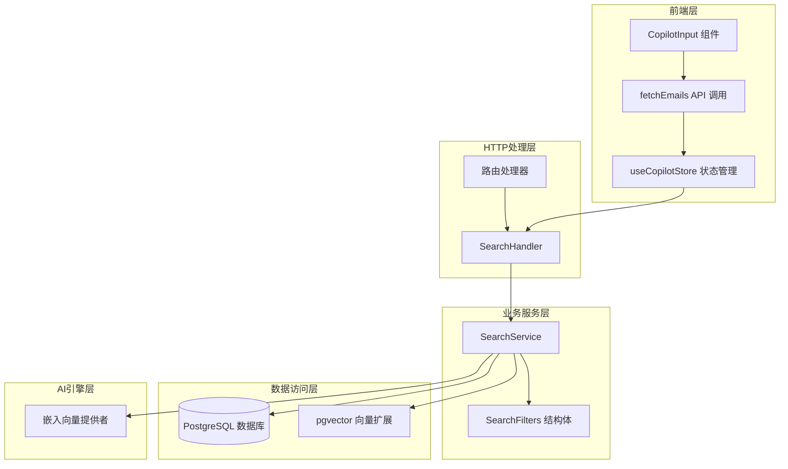
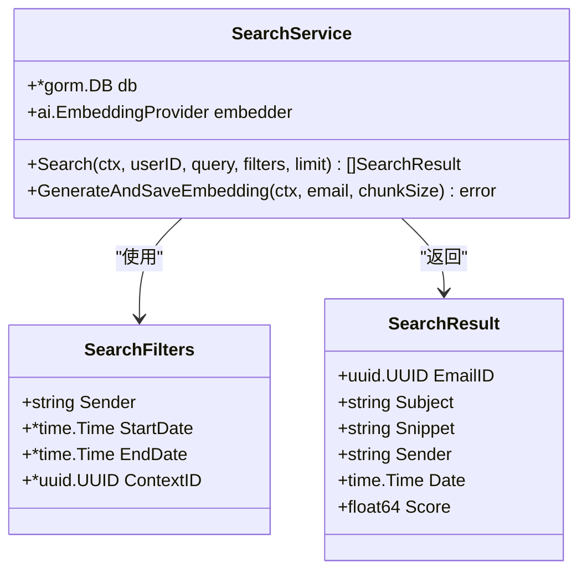
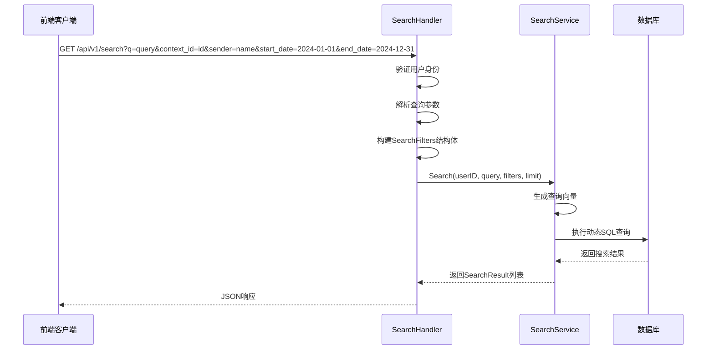
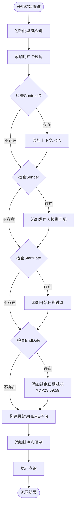
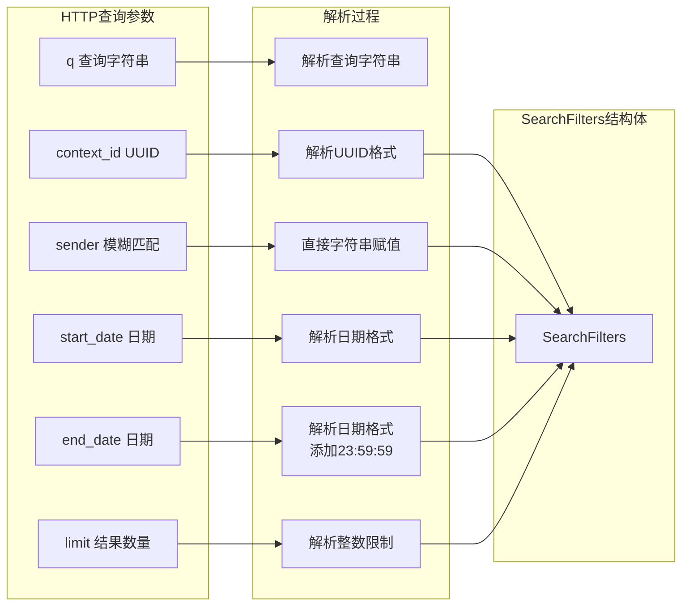
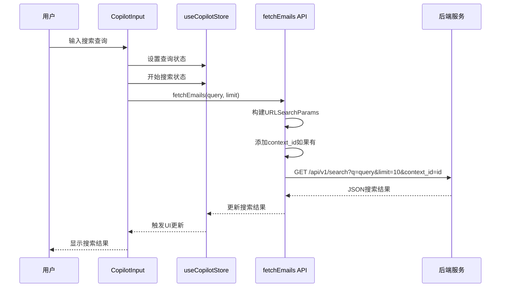
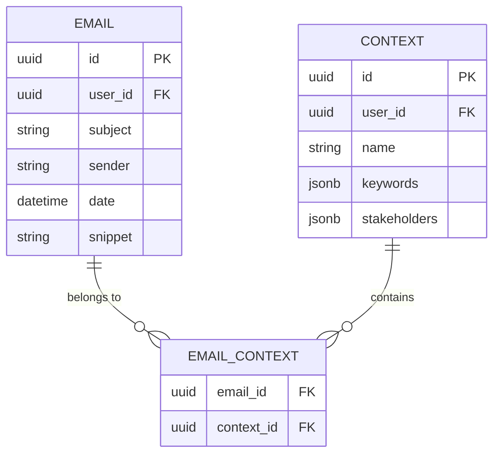
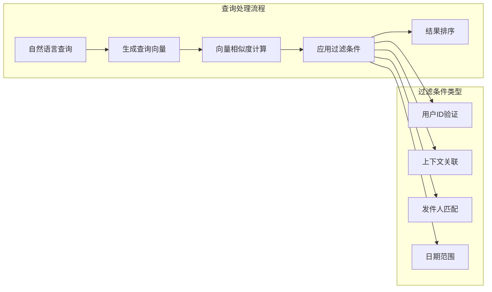
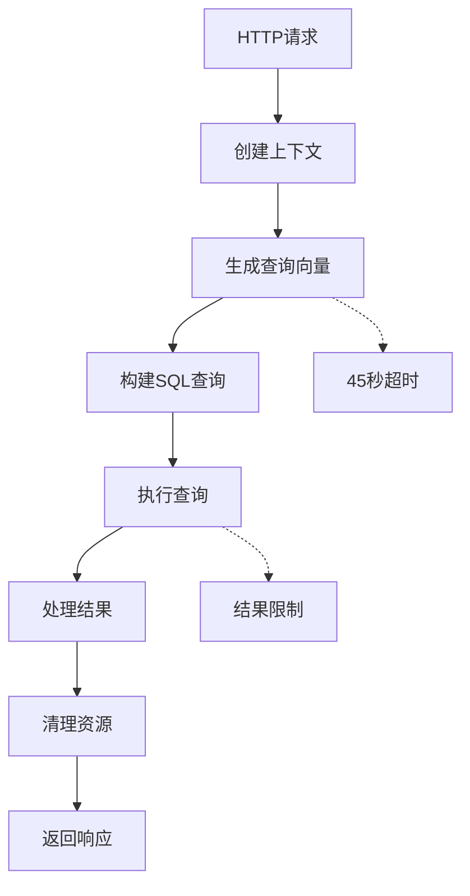

# 搜索过滤与排序

<cite>
**本文档引用的文件**
- [backend/internal/service/search.go](file://backend/internal/service/search.go)
- [backend/internal/handler/search.go](file://backend/internal/handler/search.go)
- [backend/internal/model/email.go](file://backend/internal/model/email.go)
- [backend/internal/model/context.go](file://backend/internal/model/context.go)
- [frontend/src/components/copilot/CopilotInput.tsx](file://frontend/src/components/copilot/CopilotInput.tsx)
- [frontend/src/lib/api/emails.ts](file://frontend/src/lib/api/emails.ts)
- [frontend/src/lib/api.ts](file://frontend/src/lib/api.ts)
- [frontend/src/store/useCopilotStore.ts](file://frontend/src/store/useCopilotStore.ts)
- [backend/internal/router/routes.go](file://backend/internal/router/routes.go)
- [backend/internal/service/search_test.go](file://backend/internal/service/search_test.go)
- [frontend/tests/e2e/search.spec.ts](file://frontend/tests/e2e/search.spec.ts)
</cite>

## 目录
1. [简介](#简介)
2. [系统架构概览](#系统架构概览)
3. [核心组件分析](#核心组件分析)
4. [动态WHERE子句构建机制](#动态where子句构建机制)
5. [过滤参数解析流程](#过滤参数解析流程)
6. [前端API调用实现](#前端api调用实现)
7. [高级功能特性](#高级功能特性)
8. [性能优化策略](#性能优化策略)
9. [故障排除指南](#故障排除指南)
10. [最佳实践建议](#最佳实践建议)

## 简介

EchoMind的搜索过滤与排序功能是一个高度集成的语义搜索系统，它将传统的SQL过滤条件与现代的向量搜索引擎相结合，为用户提供强大而灵活的邮件搜索能力。该系统的核心优势在于能够同时支持语义相似性搜索和精确的结构化过滤，使用户可以通过自然语言查询结合多种过滤条件来快速定位所需的邮件内容。

## 系统架构概览

EchoMind的搜索系统采用分层架构设计，主要由以下层次组成：



**图表来源**
- [backend/internal/handler/search.go](file://backend/internal/handler/search.go#L16-L30)
- [backend/internal/service/search.go](file://backend/internal/service/search.go#L17-L26)
- [frontend/src/components/copilot/CopilotInput.tsx](file://frontend/src/components/copilot/CopilotInput.tsx#L1-L132)

## 核心组件分析

### SearchService 核心服务

`SearchService`是整个搜索系统的核心，负责执行语义搜索和应用各种过滤条件。



**图表来源**
- [backend/internal/service/search.go](file://backend/internal/service/search.go#L17-L43)

### SearchHandler HTTP处理器

`SearchHandler`负责处理HTTP请求，解析查询参数并将它们转换为内部数据结构。



**图表来源**
- [backend/internal/handler/search.go](file://backend/internal/handler/search.go#L32-L127)

**章节来源**
- [backend/internal/service/search.go](file://backend/internal/service/search.go#L45-L105)
- [backend/internal/handler/search.go](file://backend/internal/handler/search.go#L32-L127)

## 动态WHERE子句构建机制

EchoMind的`SearchService.Search`方法实现了智能的动态SQL构建，根据提供的过滤条件自动组合WHERE子句。

### 用户ID验证机制

系统首先确保每个查询都绑定到特定的用户上下文：

```sql
-- 基础WHERE子句：确保只查询当前用户的邮件
WHERE e.user_id = ?
```

### 上下文ID关联

当提供`ContextID`时，系统会自动添加JOIN操作来关联邮件和上下文：

```sql
-- 当有上下文ID时的SQL结构
SELECT ...
FROM email_embeddings ee
JOIN emails e ON e.id = ee.email_id
JOIN email_contexts ec ON e.id = ec.email_id
WHERE e.user_id = ? AND ec.context_id = ?
```

### 发件人模糊匹配（ILIKE）

发件人字段使用不区分大小写的模糊匹配：

```sql
-- 发件人模糊匹配的WHERE子句
WHERE e.sender ILIKE ?
-- 参数格式：%"发件人名称"%（例如："%"boss%"%"）
```

### 日期范围过滤

日期范围过滤包含特殊的结束日期处理：

```sql
-- 开始日期过滤
WHERE e.date >= ?

-- 结束日期过滤（包含完整一天）
WHERE e.date <= ?
-- 实际处理：添加23:59:59时间以包含完整日期
```

### 动态SQL构建流程



**图表来源**
- [backend/internal/service/search.go](file://backend/internal/service/search.go#L69-L98)

**章节来源**
- [backend/internal/service/search.go](file://backend/internal/service/search.go#L69-L98)

## 过滤参数解析流程

### HTTP查询参数到Go结构体的转换

`SearchHandler`中的过滤参数解析过程展示了完整的类型安全转换：



**图表来源**
- [backend/internal/handler/search.go](file://backend/internal/handler/search.go#L58-L84)

### 参数验证和错误处理

系统实现了完善的参数验证机制：

| 参数类型 | 验证规则 | 错误处理 |
|---------|---------|---------|
| `context_id` | UUID格式验证 | 记录警告日志，忽略无效值 |
| `start_date` | `YYYY-MM-DD`格式 | 记录警告日志，忽略无效值 |
| `end_date` | `YYYY-MM-DD`格式 | 添加23:59:59，记录警告日志 |
| `limit` | 1-100范围 | 默认值10，记录日志 |

**章节来源**
- [backend/internal/handler/search.go](file://backend/internal/handler/search.go#L58-L84)

## 前端API调用实现

### CopilotInput 组件的API集成

前端的`CopilotInput`组件通过`fetchEmails` API调用实现搜索功能：



**图表来源**
- [frontend/src/components/copilot/CopilotInput.tsx](file://frontend/src/components/copilot/CopilotInput.tsx#L39-L74)

### API参数传递机制

前端通过URLSearchParams对象构建查询参数：

```typescript
// 基础参数构建
const params = new URLSearchParams({
    q: query,
    limit: '10'
});

// 可选的上下文参数
if (activeContextId) {
    params.append('context_id', activeContextId);
}

// 发送请求
const response = await fetch(`/api/v1/search?${params.toString()}`, {
    method: 'GET',
    headers: {
        'Content-Type': 'application/json',
        'Authorization': `Bearer ${token}`,
    },
});
```

### 响应数据结构

搜索结果遵循统一的数据格式：

| 字段名 | 类型 | 描述 |
|-------|------|------|
| `query` | string | 原始搜索查询 |
| `results` | SearchResult[] | 搜索结果数组 |
| `count` | number | 结果总数 |

**章节来源**
- [frontend/src/components/copilot/CopilotInput.tsx](file://frontend/src/components/copilot/CopilotInput.tsx#L46-L69)
- [frontend/src/lib/api.ts](file://frontend/src/lib/api.ts#L63-L69)

## 高级功能特性

### 上下文关联搜索

系统支持基于邮件上下文的智能搜索，这是EchoMind的独特优势：



**图表来源**
- [backend/internal/model/context.go](file://backend/internal/model/context.go#L25-L29)

### 语义相似性搜索

结合向量搜索和传统过滤的优势：



**图表来源**
- [backend/internal/service/search.go](file://backend/internal/service/search.go#L45-L105)

### 时间范围处理优化

系统对日期范围进行了特殊优化，确保包含完整的结束日期：

```go
// 结束日期处理：添加23:59:59以包含完整天
if endDateStr := c.Query("end_date"); endDateStr != "" {
    if t, err := time.Parse(time.DateOnly, endDateStr); err == nil {
        t = t.Add(24*time.Hour - time.Nanosecond) // 包含完整一天
        filters.EndDate = &t
    }
}
```

**章节来源**
- [backend/internal/handler/search.go](file://backend/internal/handler/search.go#L76-L81)

## 性能优化策略

### 向量索引优化

系统利用pgvector的高效向量索引：

```sql
-- 向量距离计算（余弦相似度）
1 - (ee.vector <=> ?) as score
```

### 查询缓存机制

虽然当前实现没有显式的查询缓存，但系统通过以下方式优化性能：

1. **批量嵌入生成**：使用`EmbedBatch`减少API调用次数
2. **连接池管理**：GORM的内置连接池
3. **索引优化**：为常用查询字段建立索引

### 内存管理



**图表来源**
- [backend/internal/service/search.go](file://backend/internal/service/search.go#L130-L132)

**章节来源**
- [backend/internal/service/search.go](file://backend/internal/service/search.go#L130-L132)

## 故障排除指南

### 常见问题诊断

| 问题症状 | 可能原因 | 解决方案 |
|---------|---------|---------|
| 搜索结果为空 | 过于严格的过滤条件 | 检查过滤参数，尝试放宽条件 |
| 性能缓慢 | 缺少适当的索引 | 确保email_embeddings表有向量索引 |
| 向量生成失败 | AI服务不可用 | 检查嵌入提供者配置 |
| UUID格式错误 | 上下文ID格式不正确 | 验证UUID格式和权限 |

### 调试技巧

1. **启用详细日志**：
```go
h.logger.Info("Search request",
    logger.Any("userID", userID),
    logger.String("query", query),
    logger.Any("filters", filters),
    logger.Int("limit", limit),
)
```

2. **监控查询性能**：
```go
duration := time.Since(start)
h.logger.Info("Search completed",
    logger.Duration("duration", duration),
)
```

3. **验证数据库连接**：
```sql
-- 检查向量扩展是否可用
CREATE EXTENSION IF NOT EXISTS vector;

-- 验证表结构
\d+ email_embeddings
```

**章节来源**
- [backend/internal/handler/search.go](file://backend/internal/handler/search.go#L93-L120)

## 最佳实践建议

### 添加新过滤条件

要添加新的过滤条件，需要修改多个组件：

1. **更新SearchFilters结构体**：
```go
type SearchFilters struct {
    // ... 现有字段
    NewField string // 新增字段
}
```

2. **修改Handler解析逻辑**：
```go
if newFieldStr := c.Query("new_field"); newFieldStr != "" {
    filters.NewField = newFieldStr
}
```

3. **更新Search方法的SQL构建**：
```go
if filters.NewField != "" {
    whereClauses = append(whereClauses, "e.new_field = ?")
    args = append(args, filters.NewField)
}
```

### 查询优先级管理

系统按照以下优先级处理过滤条件：

1. **必需条件**：用户ID验证（始终应用）
2. **强过滤**：上下文ID关联（影响JOIN操作）
3. **弱过滤**：发件人匹配（影响WHERE子句）
4. **范围过滤**：日期范围（影响WHERE子句）

### 调试复杂过滤逻辑

对于复杂的过滤组合，建议：

1. **打印生成的SQL**：在开发环境中输出最终SQL语句
2. **分步测试**：逐个添加过滤条件进行测试
3. **边界条件验证**：测试空值、边界日期等特殊情况
4. **性能监控**：观察不同过滤组合的查询性能

### 安全考虑

1. **输入验证**：所有外部输入都应经过验证
2. **SQL注入防护**：使用GORM的参数化查询
3. **权限控制**：确保用户只能访问自己的数据
4. **速率限制**：防止滥用搜索API

**章节来源**
- [backend/internal/service/search.go](file://backend/internal/service/search.go#L38-L43)
- [backend/internal/handler/search.go](file://backend/internal/handler/search.go#L58-L84)