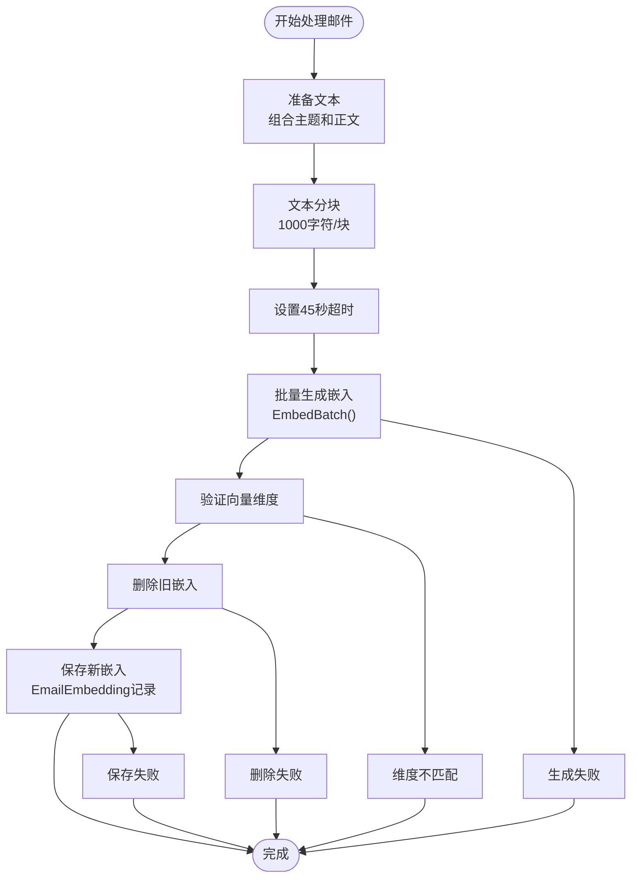

# 语义搜索

<cite>
**本文档引用的文件**
- [search.go](file://backend/internal/handler/search.go)
- [search.go](file://backend/internal/service/search.go)
- [embedding.go](file://backend/internal/model/embedding.go)
- [email.go](file://backend/internal/model/email.go)
- [provider.go](file://backend/pkg/ai/provider.go)
- [openai/provider.go](file://backend/pkg/ai/openai/provider.go)
- [gemini/provider.go](file://backend/pkg/ai/gemini/provider.go)
- [CopilotInput.tsx](file://frontend/src/components/copilot/CopilotInput.tsx)
- [001_update_vector_dimensions.sql](file://backend/migrations/001_update_vector_dimensions.sql)
- [analyze.go](file://backend/internal/tasks/analyze.go)
- [search_test.go](file://backend/internal/service/search_test.go)
- [search_clustering.go](file://backend/internal/service/search_clustering.go) - *新增：搜索聚类服务*
- [search_summary.go](file://backend/internal/service/search_summary.go) - *新增：AI摘要生成服务*
- [SearchEnhancementSettings.tsx](file://frontend/src/components/copilot/SearchEnhancementSettings.tsx) - *新增：搜索增强设置组件*
- [SearchClusterView.tsx](file://frontend/src/components/copilot/SearchClusterView.tsx) - *新增：聚类视图组件*
- [SearchSummaryCard.tsx](file://frontend/src/components/copilot/SearchSummaryCard.tsx) - *新增：摘要卡片组件*
</cite>

## 更新摘要
**变更内容**
- 新增了搜索聚类功能的详细说明，包括按发件人、时间、主题的聚类算法
- 增加了AI驱动的搜索摘要生成功能，使用AI提供商生成结构化摘要
- 更新了前端交互部分，描述了SearchEnhancementSettings组件的新UI控件
- 扩展了核心组件分析，包含search_clustering.go和search_summary.go服务的实现细节
- 更新了前端API调用示例，展示如何启用搜索增强功能

## 目录
1. [简介](#简介)
2. [系统架构概览](#系统架构概览)
3. [核心组件分析](#核心组件分析)
4. [向量嵌入生成与存储](#向量嵌入生成与存储)
5. [语义搜索实现](#语义搜索实现)
6. [前端交互](#前端交互)
7. [数据库设计](#数据库设计)
8. [性能优化策略](#性能优化策略)
9. [故障排除指南](#故障排除指南)
10. [扩展与集成](#扩展与集成)

## 简介

EchoMind的语义搜索功能是一个基于向量嵌入的高级搜索系统，能够理解用户查询的语义含义并在电子邮件数据库中找到最相关的匹配。该系统结合了现代AI提供商（如OpenAI和Google Gemini）的嵌入能力，使用PostgreSQL的pgvector扩展进行高效的向量相似度搜索。

### 核心特性

- **语义理解**：通过向量嵌入理解查询和内容的语义关系
- **多提供商支持**：兼容OpenAI、Google Gemini等多种AI提供商
- **混合过滤**：结合向量相似度和传统SQL过滤条件
- **实时搜索**：毫秒级响应时间的高效搜索体验
- **可扩展性**：支持动态向量维度和多种索引策略
- **搜索增强**：新增AI摘要生成和多维度搜索聚类功能
- **智能排序**：支持按发件人、时间、主题等维度智能分组

## 系统架构概览


**图表来源**
- [search.go](file://backend/internal/handler/search.go#L32-L178)
- [search.go](file://backend/internal/service/search.go#L17-L293)
- [search_clustering.go](file://backend/internal/service/search_clustering.go#L1-L316)
- [search_summary.go](file://backend/internal/service/search_summary.go#L1-L226)

## 核心组件分析

### SearchHandler - 搜索请求处理器

`SearchHandler`是搜索功能的入口点，负责接收HTTP请求、验证参数并调用搜索服务。新增了对搜索增强功能的支持，包括聚类和摘要生成。


**节来源**
- [search.go](file://backend/internal/handler/search.go#L32-L178)

#### 关键方法

1. **Search()** - 主要搜索方法，处理查询转换和结果返回
2. **ClusterResults()** - 对搜索结果进行聚类分组
3. **GenerateSummary()** - 生成搜索结果的AI摘要

### SearchService - 搜索业务逻辑

`SearchService`实现了核心的搜索算法，包括向量生成、SQL查询构建和结果处理。

**节来源**
- [search.go](file://backend/internal/service/search.go#L17-L293)

#### 关键方法

1. **Search()** - 主要搜索方法，处理查询转换和结果返回
2. **GenerateAndSaveEmbedding()** - 生成并保存邮件的向量嵌入

### SearchClusteringService - 搜索聚类服务

`SearchClusteringService`实现了搜索结果的智能聚类功能，支持按发件人、时间、主题等维度进行分组。

**节来源**
- [search_clustering.go](file://backend/internal/service/search_clustering.go#L55-L316)

#### 聚类类型

| 聚类类型 | 描述 | 实现方法 |
|----------|------|----------|
| 按发件人 | 按邮件发件人进行分组 | `clusterBySender()` |
| 按时间 | 按时间周期（今天、本周、本月等）分组 | `clusterByTime()` |
| 按主题 | 基于邮件主题和内容的关键词提取进行分组 | `clusterByTopic()` |

#### 关键方法

1. **ClusterResults()** - 根据指定类型对搜索结果进行聚类
2. **clusterBySender()** - 按发件人聚类，统计每个发件人的邮件数量
3. **clusterByTime()** - 按时间聚类，将邮件分为今天、本周、本月和更早四个时间段
4. **clusterByTopic()** - 按主题聚类，通过关键词提取实现主题分组
5. **extractKeywords()** - 从邮件内容中提取关键词，用于主题聚类

### SearchSummaryService - 搜索摘要服务

`SearchSummaryService`利用AI提供商生成搜索结果的智能摘要，提供对搜索结果的高层次理解。

**节来源**
- [search_summary.go](file://backend/internal/service/search_summary.go#L11-L226)

#### 摘要内容

| 摘要字段 | 描述 | 数据来源 |
|----------|------|----------|
| 自然语言总结 | 一句话概括搜索结果 | AI提供商生成 |
| 关键主题 | 搜索结果中的主要话题 | 从邮件主题中提取 |
| 重要联系人 | 频繁出现的发件人 | 统计发件人频率 |
| 紧急邮件数 | 标记为紧急的邮件数量 | 邮件元数据分析 |

#### 关键方法

1. **GenerateSummary()** - 调用AI提供商生成结构化摘要
2. **buildSummaryPrompt()** - 构建发送给AI提供商的提示词
3. **parseSummaryResponse()** - 解析AI响应并提取结构化数据
4. **GenerateQuickSummary()** - 生成快速摘要作为AI失败时的备选方案

## 向量嵌入生成与存储

### 嵌入生成流程



**图表来源**
- [search.go](file://backend/internal/service/search.go#L231-L293)
- [analyze.go](file://backend/internal/tasks/analyze.go#L173-L181)

### AI提供商接口

系统支持多个AI提供商，通过统一的`EmbeddingProvider`接口实现：

| 提供商 | 默认维度 | 特点 |
|--------|----------|------|
| OpenAI | 1536 | 高质量语义表示，支持多种模型 |
| Google Gemini | 768 | 轻量级，适合移动设备 |
| SiliconFlow | 1024 | 平衡质量和性能 |

**节来源**
- [provider.go](file://backend/pkg/ai/provider.go#L24-L34)
- [openai/provider.go](file://backend/pkg/ai/openai/provider.go#L228-L272)
- [gemini/provider.go](file://backend/pkg/ai/gemini/provider.go#L281-L312)

## 语义搜索实现

### SQL查询构建逻辑

SearchService使用精心构建的SQL查询来实现高效的向量搜索：

```sql
SELECT
    e.id as email_id,
    e.subject,
    ee.content as snippet,
    e.sender,
    e.date,
    1 - (ee.vector <=> ?) as score
FROM email_embeddings ee
JOIN emails e ON e.id = ee.email_id
WHERE e.user_id = ?
  AND (context_id filter)
  AND (sender filter)
  AND (date filter)
ORDER BY ee.vector <=> ? LIMIT ?
```

### 查询参数动态构建

系统根据提供的过滤器动态构建查询条件：

| 过滤器类型 | 条件表达式 | 示例 |
|------------|------------|------|
| 用户ID | `e.user_id = ?` | 限制到当前用户 |
| 上下文ID | `ec.context_id = ?` | 限定特定上下文 |
| 发件人 | `e.sender ILIKE ?` | 模糊匹配发件人 |
| 日期范围 | `e.date BETWEEN ? AND ?` | 时间区间过滤 |

**节来源**
- [search.go](file://backend/internal/service/search.go#L154-L175)

### 向量距离计算

系统使用余弦相似度计算向量间的相似度：


**图表来源**
- [search.go](file://backend/internal/service/search.go#L148-L149)

### 搜索增强参数

新增的搜索增强功能通过查询参数控制：

| 参数 | 类型 | 描述 | 默认值 |
|------|------|------|--------|
| enable_clustering | boolean | 是否启用搜索结果聚类 | false |
| cluster_type | string | 聚类类型（sender/time/topic） | sender |
| enable_summary | boolean | 是否生成AI摘要 | false |

**节来源**
- [search.go](file://backend/internal/handler/search.go#L106-L109)

## 前端交互

### CopilotInput组件

前端的`CopilotInput`组件提供了直观的搜索界面，支持智能切换搜索模式和搜索增强设置：


**图表来源**
- [CopilotInput.tsx](file://frontend/src/components/copilot/CopilotInput.tsx#L24-L184)

### SearchEnhancementSettings组件

`SearchEnhancementSettings`组件提供了搜索增强功能的UI控件，允许用户配置聚类和摘要选项：

```typescript
// 搜索增强设置组件
export function SearchEnhancementSettings({ className }: SearchEnhancementSettingsProps) {
  const { 
    enableClustering,
    enableSummary,
    clusterType,
    setEnableClustering,
    setEnableSummary,
    setClusterType,
  } = useCopilotStore();

  return (
    <div className="bg-white border border-slate-200 rounded-lg p-4 shadow-sm">
      {/* AI摘要开关 */}
      <label className="flex items-center justify-between">
        <div className="flex items-center gap-2">
          <Sparkles className="w-4 h-4 text-indigo-500" />
          <span>AI摘要</span>
        </div>
        <button onClick={() => setEnableSummary(!enableSummary)}>
          <span className={enableSummary ? "translate-x-5" : "translate-x-0.5"} />
        </button>
      </label>

      {/* 聚类开关 */}
      <label className="flex items-center justify-between">
        <div className="flex items-center gap-2">
          <GitBranch className="w-4 h-4 text-purple-500" />
          <span>搜索聚类</span>
        </div>
        <button onClick={() => setEnableClustering(!enableClustering)}>
          <span className={enableClustering ? "translate-x-5" : "translate-x-0.5"} />
        </button>
      </label>

      {/* 聚类类型选择 */}
      {enableClustering && (
        <div className="pl-6 pt-2 border-l-2 border-purple-200">
          <p>聚类类型:</p>
          <div className="grid grid-cols-3 gap-2">
            <button onClick={() => setClusterType('sender')} className={clusterType === 'sender' ? "bg-blue-50" : ""}>
              按发件人
            </button>
            <button onClick={() => setClusterType('time')} className={clusterType === 'time' ? "bg-green-50" : ""}>
              按时间
            </button>
            <button onClick={() => setClusterType('topic')} className={clusterType === 'topic' ? "bg-purple-50" : ""}>
              按主题
            </button>
          </div>
        </div>
      )}
    </div>
  );
}
```

**节来源**
- [SearchEnhancementSettings.tsx](file://frontend/src/components/copilot/SearchEnhancementSettings.tsx#L1-L121)

### API调用实现

前端通过标准的fetch API调用搜索服务，并支持搜索增强功能：

```typescript
// 关键参数构建
const params = new URLSearchParams({
    q: query,
    limit: '10'
});
if (activeContextId) {
    params.append('context_id', activeContextId);
}

// 添加搜索增强参数
if (enableClustering) {
    params.append('enable_clustering', 'true');
    params.append('cluster_type', clusterType);
}
if (enableSummary) {
    params.append('enable_summary', 'true');
}

// 执行搜索请求
const response = await fetch(`/api/v1/search?${params.toString()}`, {
    method: 'GET',
    headers: {
        'Content-Type': 'application/json',
        'Authorization': `Bearer ${token}`,
    },
});

// 处理增强搜索数据
const data: SearchResponse = await response.json();
setSearchResults(data.results || []);

// 处理聚类结果
if (data.clusters) {
    setClusters(data.clusters);
}

// 处理AI摘要
if (data.summary) {
    setSummary(data.summary);
}
```

**节来源**
- [CopilotInput.tsx](file://frontend/src/components/copilot/CopilotInput.tsx#L59-L101)
- [CopilotResults.tsx](file://frontend/src/components/copilot/CopilotResults.tsx#L95-L100)

### CopilotResults组件

`CopilotResults`组件负责展示搜索结果，支持多种视图模式：


**节来源**
- [CopilotResults.tsx](file://frontend/src/components/copilot/CopilotResults.tsx#L43-L140)

## 数据库设计

### 核心数据模型


**图表来源**
- [email.go](file://backend/internal/model/email.go#L11-L36)
- [embedding.go](file://backend/internal/model/embedding.go#L10-L24)

### 向量维度管理

系统支持动态向量维度，适应不同AI提供商的需求：

| 维度 | 提供商 | 用途 |
|------|--------|------|
| 768 | Google Gemini | 轻量级语义表示 |
| 1024 | SiliconFlow | 平衡性能和质量 |
| 1536 | OpenAI | 最高质量语义表示 |

**节来源**
- [001_update_vector_dimensions.sql](file://backend/migrations/001_update_vector_dimensions.sql#L17-L24)

## 性能优化策略

### 索引策略

系统采用多种索引策略以优化搜索性能：

```sql
-- IVFFLAT索引（小到中等数据集）
CREATE INDEX email_embeddings_vector_idx
ON email_embeddings
USING ivfflat (vector vector_l2_ops)
WITH (lists = 100);

-- HNSW索引（大数据集）
CREATE INDEX email_embeddings_hnsw_idx
ON email_embeddings
USING hnsw (vector vector_cosine_ops)
WITH (m = 16, ef_construction = 64);
```

### 批量处理优化

- **45秒超时**：防止长时间运行的嵌入生成任务
- **文本分块**：默认1000字符/块，平衡精度和性能
- **并发控制**：合理设置并发请求数量

### 缓存策略

- **向量缓存**：避免重复生成相同的向量
- **查询结果缓存**：缓存热门查询的结果
- **元数据缓存**：缓存向量维度等元信息

### 聚类优化

- **预计算**：对常用聚类类型进行预计算
- **增量更新**：只对新增邮件进行聚类更新
- **缓存聚类结果**：避免重复聚类计算

## 故障排除指南

### 常见问题及解决方案

| 问题 | 原因 | 解决方案 |
|------|------|----------|
| 向量维度不匹配 | AI提供商变更 | 执行数据库迁移脚本 |
| 搜索性能差 | 缺少向量索引 | 创建适当的向量索引 |
| 嵌入生成失败 | API配额耗尽 | 检查AI提供商配额 |
| 内存不足 | 批量处理过大 | 减少批处理大小 |
| AI摘要生成失败 | 提示词配置错误 | 检查AI提供商的提示词配置 |
| 聚类结果不准确 | 关键词提取算法问题 | 调整stop words列表 |

### 数据库迁移

当需要更新向量维度时，系统提供了自动化迁移脚本：

```bash
# 推荐方法：使用Makefile
make migrate-db
make stop-apps
make run-backend
make reindex
```

**节来源**
- [001_update_vector_dimensions.sql](file://backend/migrations/001_update_vector_dimensions.sql#L1-L79)

## 扩展与集成

### 添加新的AI提供商

要集成新的AI提供商，需要实现`EmbeddingProvider`接口：

```go
type EmbeddingProvider interface {
    Embed(ctx context.Context, text string) ([]float32, error)
    EmbedBatch(ctx context.Context, texts []string) ([][]float32, error)
    GetDimensions() int
}
```

### 集成其他向量数据库

虽然系统主要使用pgvector，但可以通过修改底层存储抽象层来支持其他向量数据库：


### 自定义搜索算法

系统支持多种搜索算法的插拔：

- **余弦相似度**：默认算法
- **欧几里得距离**：适用于某些场景
- **内积搜索**：快速近似搜索

### 监控和指标

建议添加以下监控指标：

- 搜索响应时间
- 向量生成成功率
- 搜索准确率
- API提供商使用情况
- 聚类计算耗时
- AI摘要生成成功率

通过这些详细的分析和文档，开发者可以深入理解EchoMind语义搜索功能的技术实现，并根据需要进行定制和扩展。