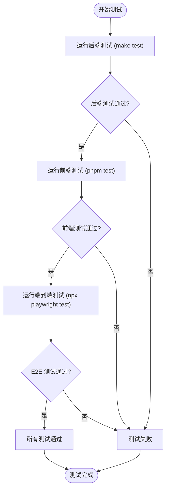
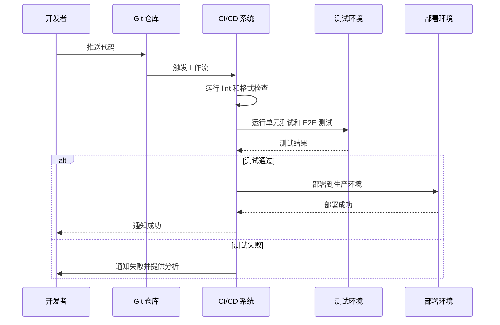

# 贡献指南

<cite>
**本文档中引用的文件**  
- [CONTRIBUTING.md](file://CONTRIBUTING.md)
- [README.md](file://README.md)
- [Makefile](file://Makefile)
- [scripts/ci.sh](file://scripts/ci.sh)
- [scripts/CI_README.md](file://scripts/CI_README.md)
- [scripts/dev.sh](file://scripts/dev.sh)
- [backend/configs/config.example.yaml](file://backend/configs/config.example.yaml)
- [frontend/package.json](file://frontend/package.json)
- [backend/go.mod](file://backend/go.mod)
- [frontend/playwright.config.ts](file://frontend/playwright.config.ts)
</cite>

## 目录
1. [简介](#简介)
2. [开发环境设置](#开发环境设置)
3. [代码风格规范](#代码风格规范)
4. [测试流程](#测试流程)
5. [提交信息约定](#提交信息约定)
6. [拉取请求工作流程](#拉取请求工作流程)
7. [Make 命令详解](#make-命令详解)
8. [CI/CD 流程](#cicd-流程)
9. [版本发布流程](#版本发布流程)
10. [故障排除](#故障排除)

## 简介

欢迎为 EchoMind 项目贡献代码！本指南旨在为开发者提供全面的指导，涵盖开发环境设置、代码风格规范、测试流程、提交信息约定和拉取请求工作流程。通过遵循本指南，贡献者可以顺利地进行开发、测试和代码提交。

EchoMind 是一个智能、上下文感知的助手，通过与您的数字生活（从电子邮件开始）集成，创建一个可搜索且智能的知识库。它帮助您保持组织性，即时查找信息，并从您的通信中获得洞察。

**Section sources**
- [README.md](file://README.md#L1-L175)

## 开发环境设置

要开始为 EchoMind 贡献代码，首先需要设置本地开发环境。以下是详细的步骤：

### 先决条件

确保已安装以下工具：
- [Go](https://golang.org/doc/install)（版本 1.22+）
- [Node.js](https://nodejs.org/en/download/)（版本 18+）和 [pnpm](https://pnpm.io/installation)
- [Docker](https://docs.docker.com/get-docker/) 和 [Docker Compose](https://docs.docker.com/compose/install/)
- [make](https://www.gnu.org/software/make/)

### 安装与设置

1. **克隆仓库**
   ```bash
   git clone https://github.com/your-username/echomind.git
   cd echomind
   ```
   （注意：请将 `your-username` 替换为实际的仓库所有者用户名。）

2. **配置环境变量**
   复制示例配置文件并更新为您的凭据（例如，OpenAI API 密钥、数据库密码）。
   ```bash
   cp backend/configs/config.example.yaml backend/configs/config.yaml
   cp backend/configs/logger.example.yaml backend/configs/logger.yaml
   ```
   - 编辑 `backend/configs/config.yaml` 以填写所需的密钥。

3. **启动后端服务**
   此命令在 Docker 容器中启动所需的数据库（Postgres、Redis）。
   ```bash
   make dev-db
   ```
   然后，运行数据库迁移：
   ```bash
   make db-init
   ```
   最后，启动后端服务器：
   ```bash
   make run-be
   ```
   后端 API 将在 `http://localhost:8080` 上可用。

4. **启动前端应用**
   在新终端中，导航到 `frontend` 目录，安装依赖并启动开发服务器。
   ```bash
   cd frontend
   pnpm install
   pnpm dev
   ```
   前端应用将在 `http://localhost:3000` 上可访问。

**Section sources**
- [README.md](file://README.md#L45-L97)
- [CONTRIBUTING.md](file://CONTRIBUTING.md#L7-L10)
- [backend/configs/config.example.yaml](file://backend/configs/config.example.yaml#L1-L180)

## 代码风格规范

为了保持代码库的一致性和可读性，EchoMind 项目遵循以下代码风格规范。

### Go 语言规范

- 遵循 [Effective Go](https://golang.org/doc/effective_go) 指南。
- 使用 `testify` 进行断言。
- 代码格式化使用 `go fmt` 和 `goimports`。
- 使用 `golangci-lint` 进行代码检查。

### 前端规范

- 使用 React 函数组件和 Hooks。
- 使用 TypeScript（严格模式）。
- 所有用户界面组件应遵循 shadcn/ui 模式。
- 状态管理使用 Zustand。
- 避免对核心库使用默认导出，以简化重构。

### 国际化 (i18n)

所有面向用户的文本必须进行本地化，使用 `t('key')` 函数。

**Section sources**
- [CONTRIBUTING.md](file://CONTRIBUTING.md#L50-L53)
- [frontend/package.json](file://frontend/package.json#L1-L54)
- [backend/go.mod](file://backend/go.mod#L1-L113)

## 测试流程

EchoMind 项目包含单元测试和端到端（E2E）测试，以确保代码质量和功能正确性。

### 后端测试

运行后端测试：
```bash
make test
```
这将运行所有后端单元测试。确保所有测试通过，且数据库模型与生产环境的 Postgres 和测试环境的 SQLite 兼容。

### 前端测试

运行前端测试：
```bash
cd frontend
pnpm test
```
这将运行所有前端测试。此外，可以运行类型检查：
```bash
pnpm type-check
```

### 端到端测试

端到端测试使用 Playwright 框架。测试文件位于 `frontend/tests/e2e/` 目录下。

运行 E2E 测试：
```bash
cd frontend
npx playwright test
```



**Diagram sources**
- [Makefile](file://Makefile#L388-L411)
- [frontend/package.json](file://frontend/package.json#L11)
- [frontend/playwright.config.ts](file://frontend/playwright.config.ts#L1-L28)

**Section sources**
- [CONTRIBUTING.md](file://CONTRIBUTING.md#L23-L25)
- [README.md](file://README.md#L100-L111)
- [frontend/tests/e2e/auth-flow.spec.ts](file://frontend/tests/e2e/auth-flow.spec.ts#L1-L162)

## 提交信息约定

我们遵循 [Conventional Commits](https://www.conventionalcommits.org/) 规范。提交信息格式如下：
```
<类型>(<范围>): <主题>
```

### 提交类型

- `feat`: 新功能
- `fix`: 修复 bug
- `docs`: 文档更新
- `refactor`: 代码重构
- `test`: 添加或修改测试
- `chore`: 构建过程或辅助工具的变动
- `perf`: 性能优化
- `ci`: CI/CD 配置更改

### 示例

```
feat(auth): add user registration validation
fix(api): resolve null pointer in user service
docs(readme): update installation instructions
```

**Section sources**
- [CONTRIBUTING.md](file://CONTRIBUTING.md#L14-L17)

## 拉取请求工作流程

为了确保代码质量和可维护性，请遵循以下拉取请求工作流程。

### PR 准则

- 保持 PR 小而专注。每个 PR 应包含一个逻辑功能或 bug 修复。
- 确保所有 CI/CD 检查通过。PR 中有失败检查的将被阻止合并。
- 在提交 PR 之前，确保本地测试通过。

### PR 流程

1. 从 `main` 分支创建新分支。
2. 在分支上进行开发和测试。
3. 提交符合约定的提交信息。
4. 推送分支到远程仓库。
5. 创建拉取请求，描述更改的目的和影响。
6. 等待 CI/CD 检查通过和代码审查。
7. 根据反馈进行修改。
8. 合并 PR。

**Section sources**
- [CONTRIBUTING.md](file://CONTRIBUTING.md#L18-L19)

## Make 命令详解

Makefile 提供了多种命令来简化开发和部署流程。

### 快速开始

```bash
make init          # 初始化项目（安装依赖）
make dev           # 启动所有服务（基础设施 + 应用）
make doctor        # 检查系统要求和健康状况
```

### 开发生命周期

```bash
make reload        # 仅重启应用（后端、工作器、前端）
make restart       # 重启所有内容（包括 Docker）
make stop          # 停止所有内容
make stop-apps     # 仅停止应用
make clean         # 清理构建产物和日志
```

### 质量保证

```bash
make test          # 运行后端测试
make test-fe       # 运行前端测试
make test-coverage # 运行测试并生成覆盖率报告
make lint          # 后端代码检查
make lint-fe       # 前端代码检查
make format        # 格式化所有代码
```

### 数据库操作

```bash
make db-init      # 初始化数据库模式
make migrate-db   # 迁移数据库（用于向量维度）
make backup-db    # 备份数据库到文件
make restore-db   # 从备份恢复数据库
```

**Section sources**
- [Makefile](file://Makefile#L1-L542)

## CI/CD 流程

EchoMind 使用 GitHub Actions 进行 CI/CD，确保代码质量和自动化部署。

### CI/CD 监控

项目包含一个强大的 CI/CD 监控工具，帮助您跟踪构建状态、分析失败并获得可操作的见解。

#### 快速开始

```bash
# 设置别名以便日常使用
echo 'alias ci="./scripts/ci.sh"' >> ~/.zshrc && source ~/.zshrc

# 基本用法
ci                 # 当前状态
ci watch           # 监视实时工作流
ci history         # 查看历史
ci analyze         # 深度分析
ci interactive     # 交互式菜单
```

### CI/CD 特性

- **健壮的错误处理**: 优雅的故障恢复
- **快速性能**: 优化的数据获取
- **智能错误分析**: 自动模式检测
- **修复建议**: 可操作的推荐
- **成功率跟踪**: CI/CD 健康监控



**Diagram sources**
- [scripts/ci.sh](file://scripts/ci.sh#L1-L442)
- [scripts/CI_README.md](file://scripts/CI_README.md#L1-L332)

**Section sources**
- [README.md](file://README.md#L114-L131)
- [scripts/CI_README.md](file://scripts/CI_README.md#L1-L332)

## 版本发布流程

我们使用语义化版本控制（SemVer）：`v主版本.次版本.修订版本`。

### 发布前检查清单

在创建 git 标签之前，您必须更新以下文件中的版本号：
1. `Makefile`（VERSION 变量）
2. `backend/cmd/main.go`（Version 常量）
3. `frontend/package.json`（version 字段）

### 发布流程

1. 更新文件。
2. 提交：`chore: bump version to vX.Y.Z`。
3. 标签：`git tag -a vX.Y.Z -m "Release vX.Y.Z"`。
4. 推送标签：`git push origin vX.Y.Z`。

**Section sources**
- [CONTRIBUTING.md](file://CONTRIBUTING.md#L36-L47)

## 故障排除

### 常见问题

1. **"GitHub CLI 未认证"**
   ```bash
   gh auth login
   ```

2. **"缺少必需的依赖"**
   ```bash
   brew install gh jq
   ```

3. **"未找到 CI/CD 运行"**
   - 推送提交以触发工作流
   - 检查仓库权限

### 调试模式

```bash
# 启用详细输出
set -x
./scripts/ci.sh
set +x
```

**Section sources**
- [scripts/CI_README.md](file://scripts/CI_README.md#L183-L206)