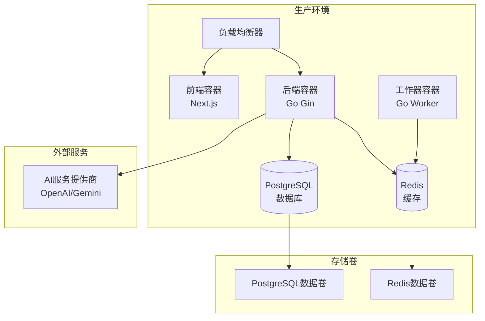
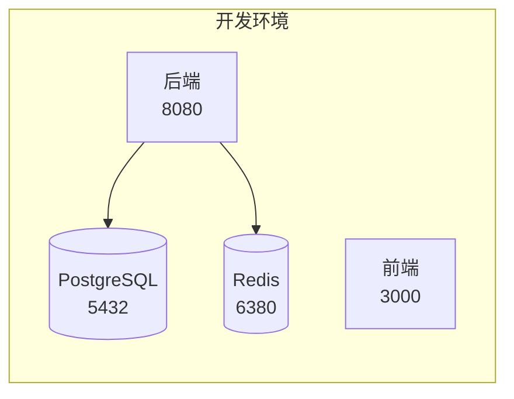
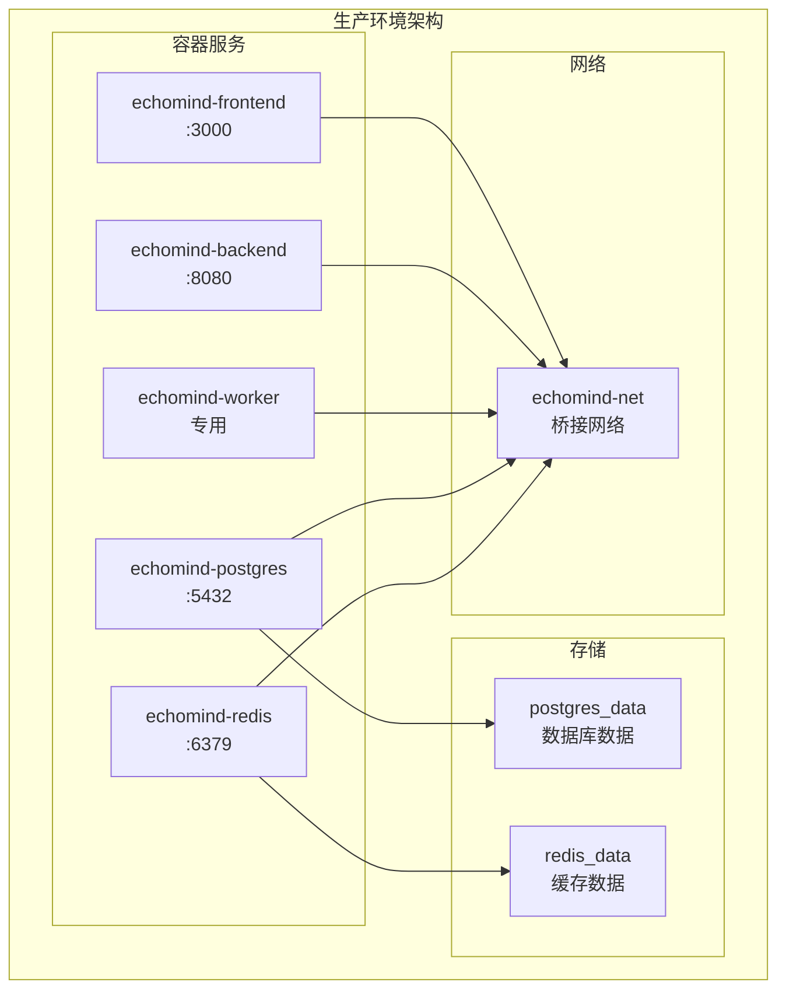
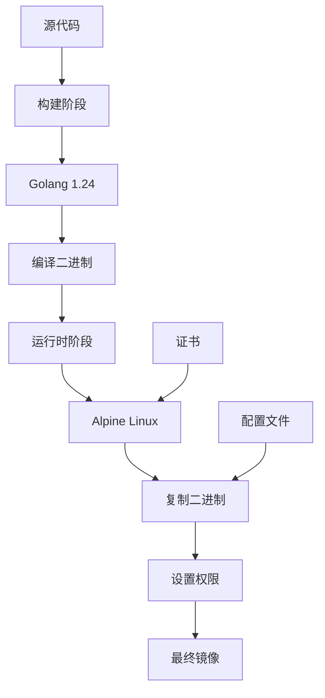
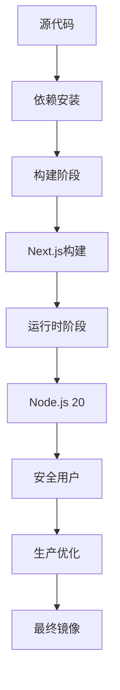
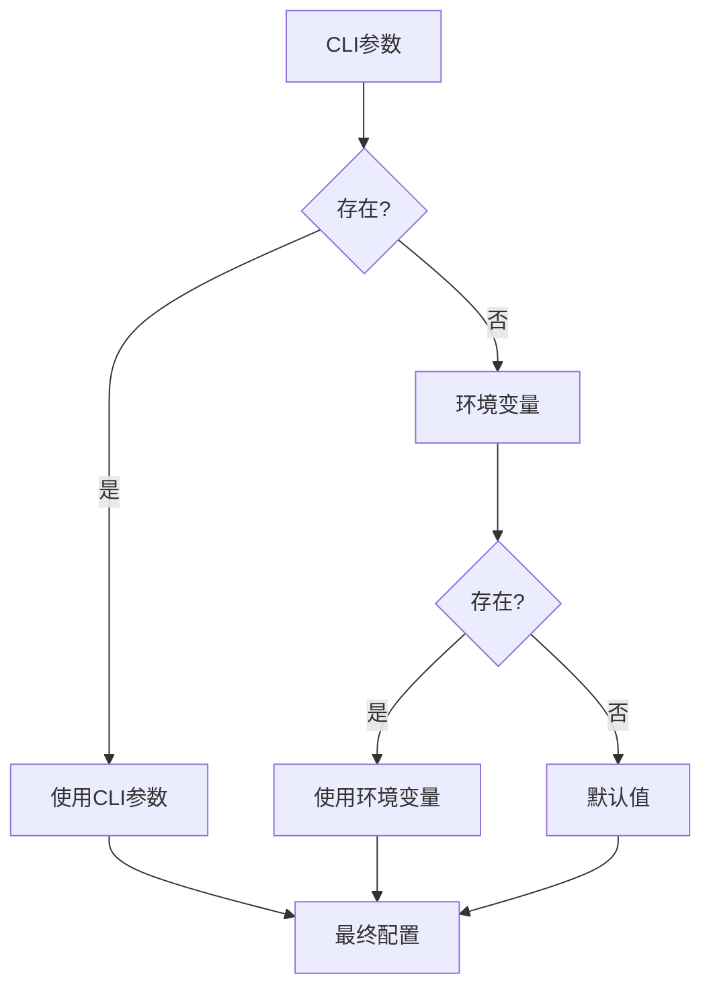
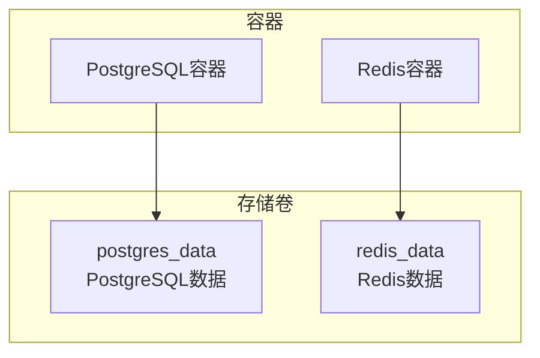
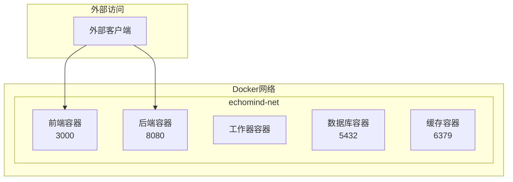
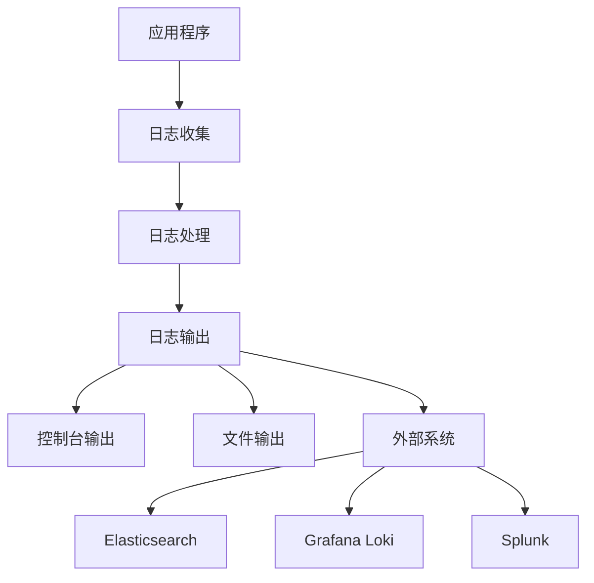

# 部署

<cite>
**本文档中引用的文件**
- [deploy/docker-compose.yml](file://deploy/docker-compose.yml)
- [deploy/docker-compose.prod.yml](file://deploy/docker-compose.prod.yml)
- [deploy/deploy.sh](file://deploy/deploy.sh)
- [Makefile](file://Makefile)
- [backend/Dockerfile](file://backend/Dockerfile)
- [frontend/Dockerfile](file://frontend/Dockerfile)
- [backend/configs/config.example.yaml](file://backend/configs/config.example.yaml)
- [backend/configs/logger.example.yaml](file://backend/configs/logger.example.yaml)
- [scripts/dev.sh](file://scripts/dev.sh)
- [README.md](file://README.md)
</cite>

## 目录
1. [概述](#概述)
2. [系统要求](#系统要求)
3. [开发环境部署](#开发环境部署)
4. [生产环境部署](#生产环境部署)
5. [Docker镜像构建](#docker镜像构建)
6. [环境变量管理](#环境变量管理)
7. [持久化存储配置](#持久化存储配置)
8. [网络配置](#网络配置)
9. [监控与日志](#监控与日志)
10. [故障排除](#故障排除)

## 概述

EchoMind是一个基于微服务架构的智能邮件助手应用，采用前后端分离的设计。本部署文档详细介绍了从开发环境到生产环境的完整部署流程，包括Docker容器编排、环境变量配置、持久化存储和网络配置等关键生产考量。

### 架构概览



**图表来源**
- [deploy/docker-compose.prod.yml](file://deploy/docker-compose.prod.yml#L1-L73)

## 系统要求

### 最低硬件要求

| 组件 | 最低配置 | 推荐配置 |
|------|----------|----------|
| CPU | 2核心 | 4核心+ |
| 内存 | 4GB | 8GB+ |
| 存储 | 20GB可用空间 | 50GB+ |
| 网络 | 10Mbps上行 | 100Mbps+ |

### 软件依赖

| 工具 | 版本要求 | 安装方式 |
|------|----------|----------|
| Docker | 20.10+ | 官方安装包 |
| Docker Compose | v2.0+ | Docker内置 |
| Git | 2.25+ | 包管理器 |
| Make | 4.0+ | 包管理器 |

**章节来源**
- [README.md](file://README.md#L46-L56)

## 开发环境部署

开发环境主要用于本地开发和测试，提供了快速启动和调试功能。

### 快速启动

使用Makefile的一键启动命令：

```bash
# 初始化项目
make init

# 启动完整开发环境
make dev
```

### 开发环境组件

开发环境使用本地Docker Compose配置，包含以下服务：



**图表来源**
- [deploy/docker-compose.yml](file://deploy/docker-compose.yml#L1-L22)

### 开发环境配置

开发环境使用默认配置，适合本地开发：

| 服务 | 端口 | 数据库 | 用户名 | 密码 |
|------|------|--------|--------|------|
| PostgreSQL | 5432 | echomind_db | user | password |
| Redis | 6380 | - | - | - |

**章节来源**
- [deploy/docker-compose.yml](file://deploy/docker-compose.yml#L2-L22)

## 生产环境部署

生产环境部署使用独立的Docker Compose配置，提供了更好的安全性和性能优化。

### 部署前准备

1. **克隆仓库**
```bash
git clone https://github.com/your-username/echomind.git
cd echomind
```

2. **创建配置文件**
```bash
# 复制配置模板
cp backend/configs/config.example.yaml backend/configs/config.yaml
cp backend/configs/logger.example.yaml backend/configs/logger.yaml
```

3. **编辑配置文件**
```bash
# 编辑后端配置
nano backend/configs/config.yaml
# 编辑日志配置
nano backend/configs/logger.yaml
```

### 生产环境配置

生产环境使用专门的配置文件，包含以下关键配置：

| 配置项 | 描述 | 默认值 | 生产环境建议 |
|--------|------|--------|-------------|
| 数据库DSN | 数据库连接字符串 | - | 使用环境变量 |
| JWT密钥 | 令牌签名密钥 | - | 强随机密钥 |
| 加密密钥 | 数据加密密钥 | - | 64字符十六进制 |
| AI API密钥 | AI服务密钥 | - | 各服务商密钥 |

### 部署流程

#### 方法一：使用部署脚本

```bash
# 执行部署脚本
./deploy/deploy.sh <repo_owner> <db_password>
```

#### 方法二：手动部署

```bash
# 导出环境变量
export REPO_OWNER=your-username
export DB_PASSWORD=your-strong-password

# 拉取最新镜像
docker compose -f deploy/docker-compose.prod.yml pull

# 启动服务
docker compose -f deploy/docker-compose.prod.yml up -d
```

### 生产环境架构



**图表来源**
- [deploy/docker-compose.prod.yml](file://deploy/docker-compose.prod.yml#L1-L73)

**章节来源**
- [deploy/deploy.sh](file://deploy/deploy.sh#L1-L27)
- [deploy/docker-compose.prod.yml](file://deploy/docker-compose.prod.yml#L1-L73)

## Docker镜像构建

EchoMind使用多阶段Docker构建，确保最终镜像的最小化和安全性。

### 后端镜像构建

后端使用Alpine Linux基础镜像，实现了零依赖的静态二进制文件：



**图表来源**
- [backend/Dockerfile](file://backend/Dockerfile#L1-L39)

#### 构建特性

| 特性 | 描述 | 优势 |
|------|------|------|
| 多阶段构建 | 分离构建和运行时 | 减小镜像大小 |
| 静态编译 | CGO_ENABLED=0 | 无外部依赖 |
| 最小基础镜像 | Alpine Linux | 安全性高 |
| 证书支持 | 包含CA证书 | 支持HTTPS |

### 前端镜像构建

前端使用Next.js官方镜像，支持现代Web技术栈：



**图表来源**
- [frontend/Dockerfile](file://frontend/Dockerfile#L1-L64)

#### 构建优化

| 优化项 | 实现方式 | 效果 |
|--------|----------|------|
| 层缓存 | 分阶段构建 | 加速重复构建 |
| 依赖锁定 | 锁文件检测 | 确保一致性 |
| 安全用户 | 非root运行 | 提升安全性 |
| 输出追踪 | Next.js特性 | 减小镜像大小 |

**章节来源**
- [backend/Dockerfile](file://backend/Dockerfile#L1-L39)
- [frontend/Dockerfile](file://frontend/Dockerfile#L1-L64)

## 环境变量管理

EchoMind使用分层的环境变量管理系统，确保配置的安全性和灵活性。

### 关键环境变量

| 变量名 | 用途 | 示例值 | 必需 |
|--------|------|--------|------|
| REPO_OWNER | Docker镜像仓库所有者 | hrygo | 是 |
| DB_PASSWORD | 数据库密码 | strong-password | 是 |
| CONFIG_PATH | 配置文件路径 | configs/config.yaml | 否 |
| PRODUCTION | 生产模式标志 | true | 否 |

### 配置优先级



### 安全配置实践

#### 敏感信息保护

1. **数据库连接**
```yaml
database:
  dsn: "host=postgres user=echomind password=${DB_PASSWORD} dbname=echomind_db port=5432 sslmode=disable"
```

2. **JWT密钥**
```yaml
server:
  jwt:
    secret: "${JWT_SECRET}"
    expiration_hours: 72
```

3. **加密密钥**
```yaml
security:
  encryption_key: "${ENCRYPTION_KEY}"
```

#### AI服务配置

```yaml
ai:
  providers:
    openai_small:
      settings:
        api_key: "${OPENAI_API_KEY}"
    gemini_flash:
      settings:
        api_key: "${GEMINI_API_KEY}"
```

**章节来源**
- [deploy/deploy.sh](file://deploy/deploy.sh#L5-L18)
- [deploy/docker-compose.prod.yml](file://deploy/docker-compose.prod.yml#L8-L11)

## 持久化存储配置

EchoMind使用Docker卷进行数据持久化，确保数据在容器重启后不丢失。

### 存储架构



### 数据持久化策略

| 服务 | 卷名称 | 挂载点 | 备份策略 |
|------|--------|--------|----------|
| PostgreSQL | postgres_data | /var/lib/postgresql/data | 定期SQL备份 |
| Redis | redis_data | /data | RDB快照备份 |

### 存储配置详解

#### PostgreSQL存储

```yaml
services:
  postgres:
    volumes:
      - postgres_data:/var/lib/postgresql/data
```

**配置特性：**
- 使用RDB持久化
- 支持WAL日志
- 自动数据压缩

#### Redis存储

```yaml
services:
  redis:
    command: redis-server --appendonly yes
    volumes:
      - redis_data:/data
```

**配置特性：**
- AOF持久化启用
- 内存优化配置
- 自动备份机制

### 备份与恢复

#### 数据库备份

```bash
# 创建备份
make backup-db

# 恢复备份
make restore-db BACKUP_FILE=backup_20231125_120000.sql
```

#### 存储监控

```bash
# 检查存储使用情况
docker volume ls
docker system df
```

**章节来源**
- [deploy/docker-compose.prod.yml](file://deploy/docker-compose.prod.yml#L51-L62)

## 网络配置

EchoMind使用Docker桥接网络实现服务间通信，同时提供外部访问接口。

### 网络拓扑



### 端口映射配置

| 服务 | 容器端口 | 主机端口 | 协议 | 用途 |
|------|----------|----------|------|------|
| 前端 | 3000 | 3000 | HTTP | Web界面 |
| 后端 | 8080 | 8080 | HTTP | API服务 |
| 数据库 | 5432 | 5432 | TCP | 数据库连接 |
| 缓存 | 6379 | 6380 | TCP | Redis连接 |

### 网络安全配置

#### 网络隔离

```yaml
networks:
  echomind-net:
    driver: bridge
```

**安全特性：**
- 服务间隔离
- 端口访问控制
- 网络命名空间

#### 访问控制

```yaml
services:
  server:
    ports:
      - "8080:8080"  # 仅内部访问
    networks:
      - echomind-net
```

### 负载均衡配置

对于生产环境，建议使用外部负载均衡器：

```yaml
# nginx.conf 示例
upstream echomind_backend {
    server echomind-server:8080;
}

upstream echomind_frontend {
    server echomind-frontend:3000;
}
```

**章节来源**
- [deploy/docker-compose.prod.yml](file://deploy/docker-compose.prod.yml#L66-L68)

## 监控与日志

EchoMind提供了完善的监控和日志系统，支持实时监控和问题诊断。

### 日志架构



### 日志配置

#### 基础日志配置

```yaml
level: INFO
production: true
output:
  file:
    enabled: true
    path: "logs/backend.log"
    max_size: 500
    max_age: 30
    max_backups: 7
    compress: true
```

#### 生产环境优化

```yaml
level: INFO
production: true
sampling:
  enabled: true
  rate: 1000
providers:
  - name: "elasticsearch"
    type: "elasticsearch"
    enabled: true
    settings:
      url: "http://localhost:9200"
      index: "echomind-logs"
```

### 监控指标

| 指标类型 | 监控内容 | 收集方式 |
|----------|----------|----------|
| 应用指标 | 响应时间、错误率 | 内置健康检查 |
| 系统指标 | CPU、内存、磁盘 | Docker统计 |
| 业务指标 | 用户活跃度、API调用 | 应用埋点 |

### 健康检查

```bash
# 检查服务状态
make health-check

# 查看服务状态
make status

# 实时查看日志
make watch-logs
```

### 性能监控

```bash
# 性能分析
make profile

# 启动性能监控
go tool pprof cpu.prof
```

**章节来源**
- [backend/configs/logger.example.yaml](file://backend/configs/logger.example.yaml#L1-L109)
- [Makefile](file://Makefile#L455-L496)

## 故障排除

### 常见问题解决

#### 1. 容器启动失败

**症状：** 容器无法正常启动
**排查步骤：**
```bash
# 查看容器状态
docker ps -a

# 查看容器日志
docker logs echomind-server

# 检查资源使用
docker stats
```

**解决方案：**
- 检查端口占用：`lsof -i:8080`
- 检查磁盘空间：`df -h`
- 检查内存使用：`free -h`

#### 2. 数据库连接问题

**症状：** 后端服务无法连接数据库
**排查步骤：**
```bash
# 检查数据库容器状态
docker exec echomind-postgres pg_isready

# 测试数据库连接
docker exec echomind-postgres psql -U echomind -d echomind_db -c "SELECT 1;"
```

**解决方案：**
- 检查数据库密码配置
- 验证网络连通性
- 确认数据库初始化完成

#### 3. 前端访问问题

**症状：** 前端页面无法加载
**排查步骤：**
```bash
# 检查前端容器状态
docker logs echomind-frontend

# 测试API连接
curl http://localhost:8080/health
```

**解决方案：**
- 检查端口映射配置
- 验证CORS设置
- 检查代理配置

### 性能优化

#### 数据库优化

```sql
-- 优化查询性能
CREATE INDEX CONCURRENTLY idx_email_user ON emails(user_id);
CREATE INDEX CONCURRENTLY idx_embedding_vector ON emails USING ivfflat (embedding vector_cosine_ops);
```

#### 缓存优化

```yaml
redis:
  command: redis-server --maxmemory 1gb --maxmemory-policy allkeys-lru
```

#### 应用优化

```yaml
server:
  environment: production
  jwt:
    expiration_hours: 24
```

### 备份策略

#### 自动备份脚本

```bash
#!/bin/bash
# 自动备份脚本
BACKUP_DIR="/backup/echomind"
DATE=$(date +%Y%m%d_%H%M%S)

# 创建备份目录
mkdir -p $BACKUP_DIR

# 数据库备份
docker exec echomind-postgres pg_dump -U echomind echomind_db > $BACKUP_DIR/db_$DATE.sql

# Redis备份
docker exec echomind-redis redis-cli BGSAVE

# 压缩备份
tar -czf $BACKUP_DIR/echomind_backup_$DATE.tar.gz $BACKUP_DIR/*
```

### 监控告警

#### 关键指标监控

```bash
# 系统监控脚本
#!/bin/bash
while true; do
    # CPU使用率
    CPU_USAGE=$(top -bn1 | grep "Cpu(s)" | awk '{print $2}' | cut -d'%' -f1)
    
    # 内存使用率
    MEM_USAGE=$(free | grep Mem | awk '{printf("%.1f", $3/$2 * 100.0)}')
    
    # 存储使用率
    DISK_USAGE=$(df -h / | awk 'NR==2 {print $5}' | cut -d'%' -f1)
    
    # 发送告警
    if [[ $CPU_USAGE -gt 80 || $MEM_USAGE -gt 85 || $DISK_USAGE -gt 90 ]]; then
        echo "High resource usage detected: CPU=$CPU_USAGE%, MEM=$MEM_USAGE%, DISK=$DISK_USAGE%"
    fi
    
    sleep 60
done
```

**章节来源**
- [Makefile](file://Makefile#L143-L183)
- [scripts/dev.sh](file://scripts/dev.sh#L24-L55)

## 结论

EchoMind的部署方案提供了从开发到生产的完整解决方案。通过合理的容器编排、环境变量管理和监控配置，可以确保应用在各种环境下稳定运行。

### 部署最佳实践

1. **环境隔离**：使用不同的配置文件区分开发、测试和生产环境
2. **安全配置**：妥善保管敏感信息，使用环境变量而非硬编码
3. **监控告警**：建立完善的监控体系，及时发现和解决问题
4. **备份策略**：制定定期备份计划，确保数据安全
5. **性能优化**：根据实际负载调整资源配置和优化参数

### 后续步骤

- 配置CI/CD流水线自动化部署
- 设置监控和告警系统
- 制定应急响应预案
- 进行压力测试和性能调优

通过遵循本部署指南，您可以成功将EchoMind部署到生产环境，为用户提供稳定可靠的智能邮件助手服务。