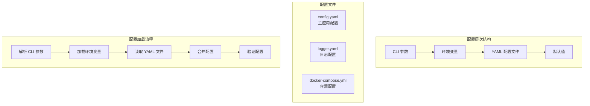
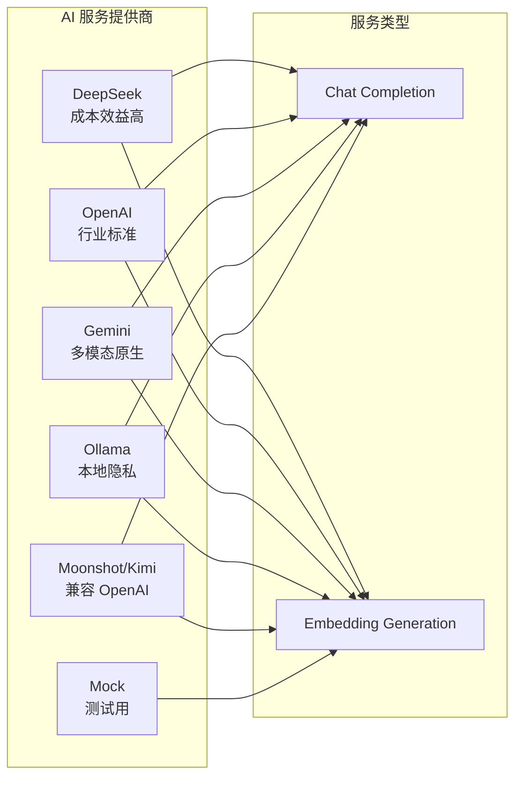
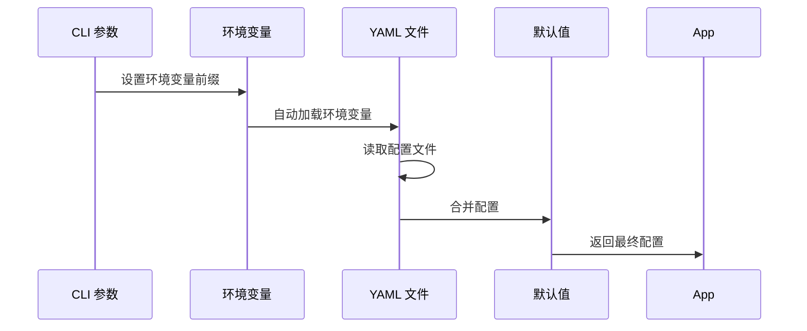
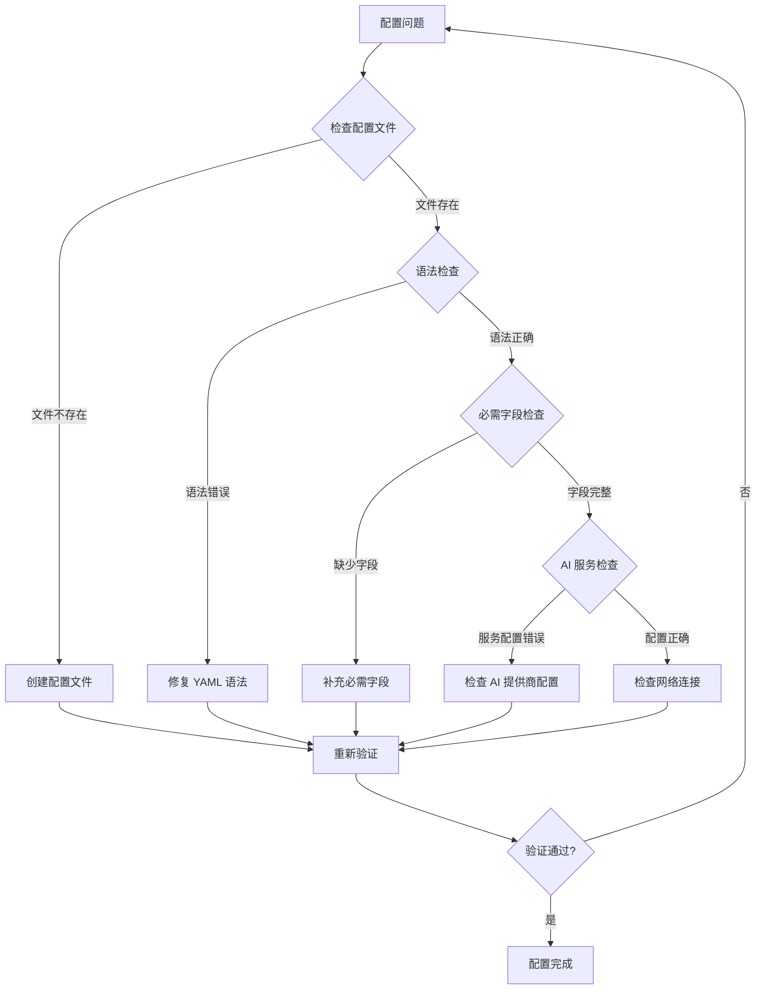

# EchoMind 配置指南

<cite>
**本文档中引用的文件**
- [config.example.yaml](file://backend/configs/config.example.yaml)
- [logger.example.yaml](file://backend/configs/logger.example.yaml)
- [app_config.go](file://backend/configs/app_config.go)
- [loader.go](file://backend/pkg/config/loader.go)
- [Makefile](file://Makefile)
- [docker-compose.yml](file://deploy/docker-compose.yml)
- [docker-compose.prod.yml](file://deploy/docker-compose.prod.yml)
- [validate_config.sh](file://backend/configs/validate_config.sh)
- [logger.yaml](file://backend/configs/logger.yaml)
- [main.go](file://backend/cmd/main.go)
- [cli.go](file://backend/internal/app/cli.go)
</cite>

## 目录
1. [简介](#简介)
2. [配置文件架构](#配置文件架构)
3. [主配置文件详解](#主配置文件详解)
4. [日志配置](#日志配置)
5. [环境变量配置](#环境变量配置)
6. [配置加载机制](#配置加载机制)
7. [不同环境配置示例](#不同环境配置示例)
8. [Makefile 配置管理](#makefile-配置管理)
9. [Docker Compose 配置](#docker-compose-配置)
10. [配置验证与故障排除](#配置验证与故障排除)
11. [最佳实践](#最佳实践)

## 简介

EchoMind 是一个智能的上下文感知助手，集成了电子邮件同步、语义搜索、AI驱动的草稿生成功能等核心特性。本指南详细说明了如何配置 EchoMind 的各个组件，包括服务器设置、数据库连接、Redis 配置、AI 服务提供商集成以及安全密钥管理。

EchoMind 采用模块化的配置系统，支持多种部署环境（开发、测试、生产），并通过环境变量提供灵活的配置覆盖机制。

## 配置文件架构

EchoMind 的配置系统采用分层设计，主要包含以下配置文件：



**图表来源**
- [loader.go](file://backend/pkg/config/loader.go#L11-L37)
- [cli.go](file://backend/internal/app/cli.go#L14-L44)

**章节来源**
- [app_config.go](file://backend/configs/app_config.go#L1-L66)
- [loader.go](file://backend/pkg/config/loader.go#L1-L38)

## 主配置文件详解

### 服务器配置 (Server)

服务器配置控制 EchoMind 后端服务的基本设置：

| 参数 | 类型 | 默认值 | 描述 |
|------|------|--------|------|
| `port` | string | "8080" | 服务监听端口 |
| `environment` | string | "development" | 运行环境：development/production |
| `jwt.secret` | string | - | JWT 认证密钥 |
| `jwt.expiration_hours` | int | 72 | JWT 令牌过期时间（小时） |

**重要提示：**
- 开发环境推荐使用随机生成的 JWT 密钥
- 生产环境必须使用强密钥，建议长度至少 32 字符
- JWT 密钥应保密，不要硬编码在代码中

### 数据库配置 (Database)

数据库配置用于连接 PostgreSQL 数据库：

| 参数 | 类型 | 默认值 | 描述 |
|------|------|--------|------|
| `dsn` | string | - | PostgreSQL 连接字符串 |

**连接字符串格式：**
```
host=localhost user=user password=password dbname=echomind_db port=5432 sslmode=disable
```

**生产环境建议：**
- 启用 SSL 连接 (`sslmode=require`)
- 使用专用数据库用户
- 配置适当的连接池大小

### 安全配置 (Security)

安全配置包含加密密钥设置：

| 参数 | 类型 | 默认值 | 描述 |
|------|------|--------|------|
| `encryption_key` | string | - | 64字符十六进制加密密钥 |

**密钥生成建议：**
```bash
# 生成64字符十六进制密钥
openssl rand -hex 32
```

### Redis 配置 (Redis)

Redis 配置用于缓存和消息队列：

| 参数 | 类型 | 默认值 | 描述 |
|------|------|--------|------|
| `addr` | string | "localhost:6380" | Redis 服务器地址 |
| `password` | string | "" | Redis 密码（可选） |
| `db` | int | 0 | 数据库编号 |

### 工作进程配置 (Worker)

工作进程配置控制后台任务处理：

| 参数 | 类型 | 默认值 | 描述 |
|------|------|--------|------|
| `concurrency` | int | 10 | 并发工作进程数量 |

### AI 服务配置 (AI)

AI 服务配置是最复杂的部分，包含多个子配置项：

#### 服务路由配置

| 参数 | 类型 | 默认值 | 描述 |
|------|------|--------|------|
| `active_services.chat` | string | - | 活跃聊天服务提供商 |
| `active_services.embedding` | string | - | 活跃嵌入服务提供商 |

#### 提供商注册表

EchoMind 支持多种 AI 服务提供商：



**图表来源**
- [config.example.yaml](file://backend/configs/config.example.yaml#L45-L110)

#### 提示词模板配置

AI 服务使用预定义的提示词模板：

| 模板类型 | 功能描述 |
|----------|----------|
| `summary` | 邮件摘要生成 |
| `classify` | 邮件分类 |
| `sentiment` | 情感分析 |
| `draft_reply` | 回复草稿生成 |

**章节来源**
- [config.example.yaml](file://backend/configs/config.example.yaml#L1-L180)
- [app_config.go](file://backend/configs/app_config.go#L3-L66)

## 日志配置

EchoMind 提供了企业级的日志配置系统，支持多种输出方式和日志级别。

### 基础配置

| 参数 | 类型 | 默认值 | 描述 |
|------|------|--------|------|
| `level` | string | "INFO" | 日志级别：DEBUG/INFO/WARN/ERROR/FATAL |
| `production` | bool | false | 是否为生产模式 |

### 输出配置

#### 文件输出

| 参数 | 类型 | 默认值 | 描述 |
|------|------|--------|------|
| `enabled` | bool | true | 是否启用文件输出 |
| `path` | string | "${LOG_FILE_PATH:logs/backend.log}" | 日志文件路径 |
| `max_size` | int | 100 | 最大文件大小（MB） |
| `max_age` | int | 7 | 最大保留天数 |
| `max_backups` | int | 3 | 备份文件数量 |
| `compress` | bool | true | 是否压缩备份 |

#### 控制台输出

| 参数 | 类型 | 默认值 | 描述 |
|------|------|--------|------|
| `enabled` | bool | true | 是否启用控制台输出 |
| `format` | string | "console" | 输出格式：console/json |
| `color` | bool | true | 是否启用彩色输出 |

### 上下文配置

自动提取的上下文字段：
- `trace_id`: 请求追踪 ID
- `user_id`: 用户标识
- `org_id`: 组织标识
- `session_id`: 会话标识
- `request_id`: 请求 ID

全局固定字段：
- `service`: 服务名称（"echomind"）
- `version`: 版本号
- `environment`: 环境类型
- `vector_dimensions`: 向量维度
- `architecture`: 架构名称
- `vector_management`: 向量管理策略

### 采样配置

生产环境建议启用日志采样以控制性能：

| 参数 | 类型 | 默认值 | 描述 |
|------|------|--------|------|
| `enabled` | bool | false | 是否启用采样 |
| `rate` | int | 100 | 每秒最大日志数 |
| `burst` | int | 10 | 突发缓冲 |
| `levels` | []string | [DEBUG, INFO] | 需要采样的级别 |

### 企业级日志提供者

EchoMind 支持多种企业级日志收集系统：

#### Elasticsearch 配置
- URL: Elasticsearch 服务地址
- Index: 索引名称
- Batch Size: 批量大小
- 认证信息（可选）

#### Grafana Loki 配置
- URL: Loki 服务地址
- Batch Size: 批量大小
- 标签配置

#### Splunk 配置
- URL: Splunk HEC 地址
- Token: HEC 令牌
- Index: 索引名称
- Source: 数据源标识

**章节来源**
- [logger.example.yaml](file://backend/configs/logger.example.yaml#L1-L109)
- [logger.yaml](file://backend/configs/logger.yaml#L1-L108)

## 环境变量配置

EchoMind 支持通过环境变量覆盖配置文件中的设置，提供了灵活的部署配置选项。

### 配置优先级

环境变量配置具有最高优先级，按以下顺序覆盖：
1. CLI 参数
2. 环境变量
3. YAML 配置文件
4. 默认值

### 主要环境变量

#### 应用配置

| 变量名 | 来源 | 描述 |
|--------|------|------|
| `ECHOMIND_SERVER_PORT` | 环境变量 | 服务器端口 |
| `ECHOMIND_SERVER_ENVIRONMENT` | 环境变量 | 运行环境 |
| `ECHOMIND_DATABASE_DSN` | 环境变量 | 数据库连接字符串 |
| `ECHOMIND_REDIS_ADDR` | 环境变量 | Redis 地址 |
| `ECHOMIND_SECURITY_ENCRYPTION_KEY` | 环境变量 | 加密密钥 |

#### 日志配置

| 变量名 | 来源 | 描述 |
|--------|------|------|
| `LOG_LEVEL` | 环境变量 | 日志级别 |
| `LOG_PRODUCTION` | 环境变量 | 生产模式标志 |
| `LOG_FILE_PATH` | 环境变量 | 日志文件路径 |
| `LOG_CONSOLE_FORMAT` | 环境变量 | 控制台输出格式 |
| `LOG_CONSOLE_COLOR` | 环境变量 | 控制台颜色输出 |

#### AI 服务配置

| 变量名 | 来源 | 描述 |
|--------|------|------|
| `ECHOMIND_AI_PROVIDERS_*` | 环境变量 | AI 提供商配置 |

### 环境变量命名规则

EchoMind 使用 Viper 库进行配置管理，遵循以下命名规则：

- 配置层级通过下划线分隔：`server_port` → `ECHOMIND_SERVER_PORT`
- 支持嵌套结构的扁平化表示
- 自动转换环境变量键名

**章节来源**
- [loader.go](file://backend/pkg/config/loader.go#L12-L18)
- [cli.go](file://backend/internal/app/cli.go#L14-L44)

## 配置加载机制

EchoMind 使用 Viper 库实现统一的配置加载机制，支持多种配置源的合并和优先级管理。

### 配置加载流程



**图表来源**
- [loader.go](file://backend/pkg/config/loader.go#L11-L37)

### 配置结构映射

EchoMind 使用结构标签将 YAML 配置映射到 Go 结构体：

```go
type Config struct {
    Server   ServerConfig   `mapstructure:"server"`
    Database DatabaseConfig `mapstructure:"database"`
    Redis    RedisConfig    `mapstructure:"redis"`
    AI       AIConfig       `mapstructure:"ai"`
    Security SecurityConfig `mapstructure:"security"`
    Worker   WorkerConfig   `mapstructure:"worker"`
}
```

### 环境变量替换机制

EchoMind 支持在 YAML 配置中使用环境变量：

```yaml
# 支持的语法：${VAR:default_value}
path: "${LOG_FILE_PATH:logs/backend.log}"
```

**章节来源**
- [loader.go](file://backend/pkg/config/loader.go#L1-L38)
- [app_config.go](file://backend/configs/app_config.go#L1-L66)

## 不同环境配置示例

### 开发环境配置

开发环境配置注重调试便利性和快速迭代：

```yaml
# config.yaml (开发环境)
server:
  port: 8080
  environment: development
  jwt:
    secret: "dev-jwt-secret-keep-it-safe"
    expiration_hours: 24

database:
  dsn: "host=localhost user=dev_user password=dev_password dbname=echomind_dev port=5432 sslmode=disable"

security:
  encryption_key: "0123456789abcdef0123456789abcdef0123456789abcdef0123456789abcdef"

redis:
  addr: "localhost:6380"
  password: ""
  db: 0

ai:
  active_services:
    chat: "mock"
    embedding: "mock"
  providers:
    mock:
      protocol: "mock"
      settings:
        embedding_dimensions: 1024

worker:
  concurrency: 5
```

### 生产环境配置

生产环境配置强调安全性、性能和可靠性：

```yaml
# config.yaml (生产环境)
server:
  port: 8080
  environment: production
  jwt:
    secret: "${JWT_SECRET}"
    expiration_hours: 72

database:
  dsn: "${DATABASE_DSN}"

security:
  encryption_key: "${ENCRYPTION_KEY}"

redis:
  addr: "${REDIS_ADDR}"
  password: "${REDIS_PASSWORD}"
  db: 0

ai:
  active_services:
    chat: "openai_small"
    embedding: "openai_small"
  providers:
    openai_small:
      protocol: "openai"
      settings:
        api_key: "${OPENAI_API_KEY}"
        model: "gpt-4o-mini"
        embedding_model: "text-embedding-3-small"
        embedding_dimensions: 1536

worker:
  concurrency: 10
```

### Docker 环境配置

Docker 环境使用环境变量进行配置：

```yaml
# config.yaml (Docker)
server:
  port: 8080
  environment: production
  jwt:
    secret: "${JWT_SECRET}"
    expiration_hours: 72

database:
  dsn: "host=postgres user=echomind password=${DB_PASSWORD} dbname=echomind_db port=5432 sslmode=disable"

redis:
  addr: "redis:6379"
  password: ""
  db: 0
```

**章节来源**
- [config.example.yaml](file://backend/configs/config.example.yaml#L1-L180)
- [docker-compose.prod.yml](file://deploy/docker-compose.prod.yml#L1-L73)

## Makefile 配置管理

EchoMind 提供了完整的 Makefile 来简化配置管理和服务启动。

### 基本配置命令

| 命令 | 功能 | 示例 |
|------|------|------|
| `make init` | 初始化项目 | 安装依赖，创建目录 |
| `make dev` | 启动开发环境 | 启动所有服务 |
| `make doctor` | 健康检查 | 检查系统要求 |
| `make clean` | 清理构建 | 删除构建产物和日志 |

### 环境配置

```bash
# 设置环境变量
export ENVIRONMENT=production
export CONFIG_FILE=backend/configs/config.yaml

# 使用特定配置启动
make dev ENVIRONMENT=staging
make run-backend CONFIG_FILE=config.yaml
```

### 数据库配置

| 命令 | 功能 | 描述 |
|------|------|------|
| `make db-init` | 初始化数据库 | 创建表结构 |
| `make migrate-db` | 数据库迁移 | 更新向量维度 |
| `make backup-db` | 数据库备份 | 创建 SQL 备份 |
| `make restore-db` | 数据库恢复 | 从备份恢复 |

### 日志管理

```bash
# 查看日志
make logs
make logs SERVICE=backend
make watch-logs

# 清理日志
make clean-logs
```

### 服务管理

```bash
# 启动服务
make run-backend
make run-worker
make run-frontend

# 重启服务
make reload
make restart

# 停止服务
make stop
make stop-apps
make stop-infra
```

**章节来源**
- [Makefile](file://Makefile#L1-L542)

## Docker Compose 配置

EchoMind 提供了两套 Docker Compose 配置，分别用于开发和生产环境。

### 开发环境 Docker Compose

开发环境使用本地文件挂载，便于代码热重载：

```yaml
services:
  db:
    image: pgvector/pgvector:pg16
    restart: always
    environment:
      POSTGRES_DB: ${POSTGRES_DB:-echomind_db}
      POSTGRES_USER: ${POSTGRES_USER:-user}
      POSTGRES_PASSWORD: ${POSTGRES_PASSWORD:-password}
    ports:
      - "5432:5432"
    volumes:
      - db-data:/var/lib/postgresql/data

  redis:
    image: m.daocloud.io/docker.io/redis:7.2.5-alpine3.20
    restart: always
    ports:
      - "6380:6379"

volumes:
  db-data:
```

### 生产环境 Docker Compose

生产环境使用预构建镜像，支持水平扩展：

```yaml
services:
  server:
    image: ghcr.io/${REPO_OWNER}/echomind-backend:latest
    container_name: echomind-server
    restart: always
    ports:
      - "8080:8080"
    environment:
      - ECHOMIND_DATABASE_DSN=host=postgres user=echomind password=${DB_PASSWORD} dbname=echomind_db port=5432 sslmode=disable
      - ECHOMIND_REDIS_ADDR=redis:6379
    depends_on:
      - postgres
      - redis
    networks:
      - echomind-net

  postgres:
    image: postgres:15-alpine
    container_name: echomind-postgres
    restart: always
    environment:
      POSTGRES_USER: echomind
      POSTGRES_PASSWORD: ${DB_PASSWORD}
      POSTGRES_DB: echomind_db
    volumes:
      - postgres_data:/var/lib/postgresql/data
    networks:
      - echomind-net

  redis:
    image: redis:7-alpine
    container_name: echomind-redis
    restart: always
    command: redis-server --appendonly yes
    volumes:
      - redis_data:/data
    networks:
      - echomind-net
```

### 网络和存储配置

```yaml
networks:
  echomind-net:
    driver: bridge

volumes:
  postgres_data:
  redis_data:
```

**章节来源**
- [docker-compose.yml](file://deploy/docker-compose.yml#L1-L22)
- [docker-compose.prod.yml](file://deploy/docker-compose.prod.yml#L1-L73)

## 配置验证与故障排除

EchoMind 提供了配置验证脚本来帮助检测配置问题。

### 配置验证脚本

验证脚本检查以下内容：

1. **文件存在性检查**
   - 配置文件是否存在
   - YAML 语法是否正确

2. **敏感数据检查**
   - 检测示例密钥和占位符
   - 警告潜在的安全风险

3. **必需字段检查**
   - 服务器端口
   - JWT 密钥
   - 加密密钥
   - 数据库连接
   - AI 服务配置

4. **AI 服务配置检查**
   - 活跃服务提供商
   - 嵌入维度一致性
   - API 密钥配置

### 使用方法

```bash
# 基本验证
./backend/configs/validate_config.sh

# 指定配置文件
./backend/configs/validate_config.sh my-config.yaml

# 验证示例配置
./backend/configs/validate_config.sh config.example.yaml
```

### 常见配置问题

#### 1. 敏感数据警告
```
⚠️  警告: 发现可能的敏感数据 (包含 'dummy-jwt-secret')
💡 提示: 请确保这是你的私有配置文件，不是示例文件
```

**解决方案：**
- 替换示例密钥为真实值
- 使用环境变量存储敏感信息
- 确保配置文件不在版本控制中

#### 2. 必需字段缺失
```
❌ 缺少必需字段:
   - server.jwt.secret
   - security.encryption_key
```

**解决方案：**
- 检查配置文件语法
- 确保所有必需字段都已配置
- 使用配置验证脚本

#### 3. 嵌入维度不匹配
```
⚠️  警告: 发现不同的嵌入维度配置，确保数据库schema匹配
```

**解决方案：**
- 确保所有 AI 提供商使用相同的嵌入维度
- 运行数据库迁移更新向量维度
- 重新初始化数据库

### 故障排除流程



**章节来源**
- [validate_config.sh](file://backend/configs/validate_config.sh#L1-L141)

## 最佳实践

### 安全配置

1. **密钥管理**
   - 使用强随机密钥
   - 定期轮换密钥
   - 使用环境变量存储敏感信息
   - 不要将密钥提交到版本控制

2. **数据库安全**
   - 启用 SSL 连接
   - 使用专用数据库用户
   - 配置防火墙规则
   - 定期备份数据库

3. **网络安全**
   - 使用 HTTPS
   - 配置 CORS 策略
   - 限制 API 访问权限
   - 监控异常访问

### 性能优化

1. **数据库优化**
   - 配置合适的连接池大小
   - 启用查询计划缓存
   - 定期维护索引
   - 监控慢查询

2. **Redis 优化**
   - 配置内存淘汰策略
   - 启用持久化
   - 监控内存使用
   - 配置集群模式

3. **AI 服务优化**
   - 选择合适的模型
   - 配置请求超时
   - 实现重试机制
   - 监控 API 调用频率

### 监控和日志

1. **日志管理**
   - 配置适当的日志级别
   - 启用结构化日志
   - 设置日志轮转
   - 集成日志监控系统

2. **性能监控**
   - 监控响应时间
   - 跟踪资源使用
   - 设置告警阈值
   - 分析性能趋势

### 部署策略

1. **环境分离**
   - 开发、测试、生产环境隔离
   - 使用不同的配置文件
   - 实施变更管理流程
   - 进行充分的测试

2. **容器化部署**
   - 使用官方镜像
   - 配置健康检查
   - 设置资源限制
   - 实现滚动更新

3. **备份和恢复**
   - 定期备份数据
   - 测试恢复流程
   - 监控备份状态
   - 制定灾难恢复计划

### 开发环境配置

1. **本地开发**
   - 使用 Docker Compose
   - 配置热重载
   - 设置断点调试
   - 使用测试数据

2. **代码质量**
   - 运行代码检查
   - 执行单元测试
   - 进行集成测试
   - 代码审查

3. **持续集成**
   - 配置 CI/CD 管道
   - 自动化测试
   - 代码覆盖率检查
   - 安全扫描

通过遵循这些最佳实践，您可以确保 EchoMind 系统的安全性、可靠性和高性能运行。定期审查和更新配置，以适应业务需求的变化和技术的发展。