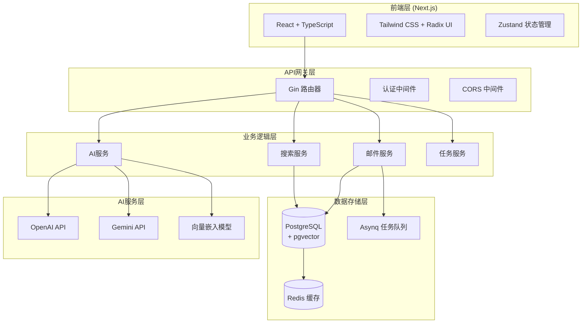
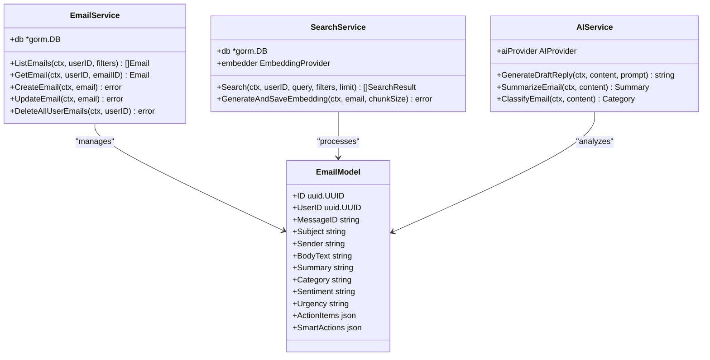
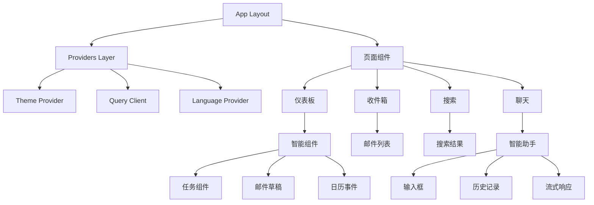
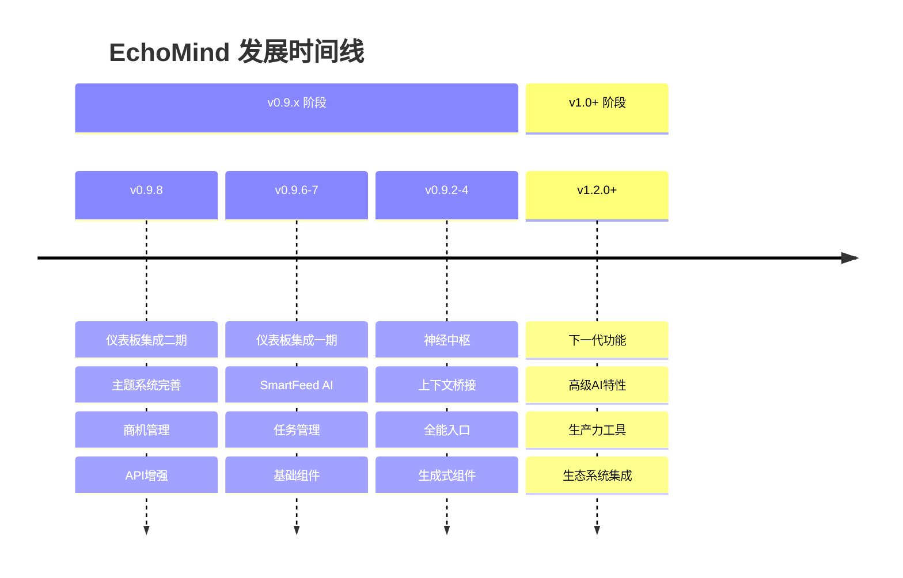

# 项目概述

<cite>
**本文档引用的文件**
- [README.md](file://README.md)
- [README.zh.md](file://README.zh.md)
- [backend/go.mod](file://backend/go.mod)
- [frontend/package.json](file://frontend/package.json)
- [backend/cmd/main.go](file://backend/cmd/main.go)
- [backend/configs/config.example.yaml](file://backend/configs/config.example.yaml)
- [backend/internal/model/email.go](file://backend/internal/model/email.go)
- [backend/internal/service/email.go](file://backend/internal/service/email.go)
- [backend/internal/service/search.go](file://backend/internal/service/search.go)
- [backend/internal/service/ai_draft.go](file://backend/internal/service/ai_draft.go)
- [frontend/src/app/layout.tsx](file://frontend/src/app/layout.tsx)
- [frontend/src/lib/api.ts](file://frontend/src/lib/api.ts)
- [CHANGELOG.md](file://CHANGELOG.md)
- [Makefile](file://Makefile)
</cite>

## 目录
1. [项目简介](#项目简介)
2. [核心愿景与价值主张](#核心愿景与价值主张)
3. [技术架构概览](#技术架构概览)
4. [核心功能特性](#核心功能特性)
5. [系统架构详解](#系统架构详解)
6. [技术栈深度解析](#技术栈深度解析)
7. [项目状态与发展历程](#项目状态与发展历程)
8. [部署与配置指南](#部署与配置指南)
9. [性能特征与优化](#性能特征与优化)
10. [总结](#总结)

## 项目简介

EchoMind是一个革命性的智能情境感知个人助理平台，旨在成为用户数字生活的智能神经中枢。该项目通过深度整合电子邮件系统，构建了一个可搜索的、智能化的知识库，帮助用户从海量信息中提取价值，实现从"信息噪音"到"决策智慧"的转变。

EchoMind不仅仅是一个邮件客户端，更是一个全方位的个人生产力助手。它能够自动同步用户的电子邮件，通过先进的AI技术对内容进行深度分析，提供语义搜索、智能草稿生成、情境理解等核心功能，真正实现了"您的个人首席参谋"这一愿景。

**章节来源**
- [README.md](file://README.md#L1-L175)
- [README.zh.md](file://README.zh.md#L1-L176)

## 核心愿景与价值主张

### 智能神经接口理念

EchoMind的核心理念是成为用户与数字世界之间的智能神经接口。这个概念体现在以下几个方面：

1. **情境感知能力**：系统能够理解用户的上下文需求，提供相关性强的信息和服务
2. **知识库构建**：通过持续的邮件同步和AI分析，构建个性化的智能知识库
3. **主动洞察提供**：不仅仅是被动响应，而是主动发现用户可能感兴趣的信息
4. **决策支持**：将复杂的信息转化为可操作的决策建议

### 核心价值主张

- **信息过载解决方案**：帮助用户从每天处理的数百封邮件中快速定位重要信息
- **智能生产力提升**：通过AI辅助功能提高工作效率，减少重复性劳动
- **知识管理优化**：建立个人知识体系，实现信息的长期价值挖掘
- **跨平台智能整合**：统一管理分散在各个平台的信息资源

## 技术架构概览

EchoMind采用现代化的全栈架构设计，前后端分离，各司其职又紧密协作：



**图表来源**
- [backend/cmd/main.go](file://backend/cmd/main.go#L1-L137)
- [frontend/src/app/layout.tsx](file://frontend/src/app/layout.tsx#L1-L42)

**章节来源**
- [backend/go.mod](file://backend/go.mod#L1-L113)
- [frontend/package.json](file://frontend/package.json#L1-L54)

## 核心功能特性

### 1. 智能邮件同步系统

EchoMind通过IMAP协议实现与各种邮件服务商的无缝连接，支持：

- **多账户管理**：同时连接多个邮箱账户
- **实时同步**：增量同步机制，及时获取新邮件
- **安全加密**：密码加密存储，保障账户安全
- **断线重连**：智能重试机制，确保同步稳定性

### 2. 高级语义搜索引擎

基于pgvector的向量搜索引擎，提供超越传统关键词匹配的智能搜索：

- **语义理解**：理解查询意图，返回最相关的结果
- **上下文关联**：考虑邮件间的关联关系
- **多维度过滤**：支持按发件人、时间范围、邮件分类等条件筛选
- **实时反馈**：搜索结果包含相关性评分

### 3. AI驱动的邮件草稿生成

利用先进的大语言模型，提供智能的邮件回复生成功能：

- **上下文感知**：基于当前邮件内容和历史交流生成回复
- **风格适配**：根据用户习惯调整回复风格
- **智能建议**：提供多种回复选项供选择
- **多轮对话**：支持复杂的邮件往来场景

### 4. 数据洞察与智能分析

系统内置多种数据分析功能：

- **风险识别**：自动识别潜在的业务风险
- **机会挖掘**：发现有价值的商业机会
- **趋势分析**：基于历史数据预测未来趋势
- **智能摘要**：自动生成邮件内容摘要

**章节来源**
- [backend/internal/model/email.go](file://backend/internal/model/email.go#L1-L37)
- [backend/internal/service/search.go](file://backend/internal/service/search.go#L1-L171)
- [backend/internal/service/ai_draft.go](file://backend/internal/service/ai_draft.go#L1-L20)

## 系统架构详解

### 后端架构设计

后端采用分层架构模式，确保代码的可维护性和扩展性：



**图表来源**
- [backend/internal/service/email.go](file://backend/internal/service/email.go#L1-L126)
- [backend/internal/service/search.go](file://backend/internal/service/search.go#L1-L171)

### 前端架构设计

前端采用现代React架构，结合TypeScript提供强类型支持：



**图表来源**
- [frontend/src/app/layout.tsx](file://frontend/src/app/layout.tsx#L1-L42)
- [frontend/src/lib/api.ts](file://frontend/src/lib/api.ts#L1-L72)

**章节来源**
- [backend/internal/service/email.go](file://backend/internal/service/email.go#L1-L126)
- [frontend/src/app/layout.tsx](file://frontend/src/app/layout.tsx#L1-L42)

## 技术栈深度解析

### 后端核心技术栈

#### Go语言生态系统
- **Gin Web框架**：高性能HTTP Web框架，提供RESTful API支持
- **GORM ORM**：功能强大的对象关系映射，简化数据库操作
- **Asynq任务队列**：分布式任务处理，支持延迟任务和重试机制

#### 数据存储技术
- **PostgreSQL + pgvector**：支持向量相似性搜索的数据库
- **Redis缓存**：提供高速缓存和会话管理
- **向量数据库**：专门用于存储和检索高维向量数据

#### AI集成技术
- **OpenAI API**：提供强大的语言理解和生成能力
- **Gemini API**：Google的多模态AI模型
- **自定义AI提供商接口**：支持多种AI服务提供商

### 前端核心技术栈

#### Next.js框架
- **React 19**：最新的React版本，提供更好的性能和开发体验
- **TypeScript**：提供强类型支持，提高代码质量
- **Server-Side Rendering**：优化SEO和首屏加载速度

#### 用户界面技术
- **Tailwind CSS**：实用优先的CSS框架，快速构建响应式界面
- **Radix UI**：可访问性优先的组件库
- **Zustand状态管理**：轻量级状态管理方案

#### 开发工具链
- **ESLint**：代码质量检查
- **Jest**：单元测试框架
- **Playwright**：端到端测试

**章节来源**
- [backend/go.mod](file://backend/go.mod#L1-L113)
- [frontend/package.json](file://frontend/package.json#L1-L54)

## 项目状态与发展历程

### 当前版本状态

EchoMind目前处于快速发展阶段，最新稳定版本为v0.9.8，项目展现了强劲的发展势头：

#### 版本里程碑
- **v1.1.0 (企业级)**：引入规约化向量架构和企业级日志框架
- **v0.9.8 (仪表板集成二期)**：完整主题系统、商机管理和增强的API集成
- **v0.9.6-7 (仪表板集成一期)**：SmartFeed AI功能、任务管理和基础组件
- **v0.9.2-4 (神经中枢)**：上下文桥梁、全能入口、生成式UI组件

### 技术演进路径

项目按照清晰的功能导向阶段进行开发：



**图表来源**
- [CHANGELOG.md](file://CHANGELOG.md#L1-L174)

### 项目成熟度评估

- **代码质量**：持续的代码审查和测试覆盖率达到较高水平
- **架构稳定性**：成熟的分层架构，良好的模块化设计
- **性能表现**：经过优化的向量搜索和缓存机制
- **可扩展性**：插件化的AI提供商架构，易于扩展

**章节来源**
- [CHANGELOG.md](file://CHANGELOG.md#L1-L174)
- [Makefile](file://Makefile#L1-L200)

## 部署与配置指南

### 开发环境搭建

EchoMind提供了完整的开发环境配置和自动化工具：

#### 系统要求
- **Go**：版本1.22+
- **Node.js**：版本18+
- **Docker**：用于容器化部署
- **pnpm**：包管理器

#### 快速启动流程

```bash
# 1. 克隆项目
git clone https://github.com/your-username/echomind.git
cd echomind

# 2. 配置环境变量
cp backend/configs/config.example.yaml backend/configs/config.yaml
cp backend/configs/logger.example.yaml backend/configs/logger.yaml

# 3. 启动数据库服务
make dev-db

# 4. 初始化数据库
make db-init

# 5. 启动后端服务
make run-be

# 6. 启动前端服务
cd frontend
pnpm install
pnpm dev
```

### 生产环境部署

项目支持Docker Compose进行生产环境部署：

```bash
# 使用生产配置启动
docker-compose -f deploy/docker-compose.prod.yml up -d

# 或使用Makefile命令
make prod
```

### 配置管理

系统采用分层配置管理：

- **环境变量**：敏感配置通过环境变量管理
- **配置文件**：YAML格式的详细配置文件
- **默认值**：合理的默认配置，降低初始设置难度

**章节来源**
- [README.md](file://README.md#L46-L175)
- [Makefile](file://Makefile#L1-L200)

## 性能特征与优化

### 搜索性能优化

EchoMind在搜索性能方面进行了多项优化：

#### 向量搜索优化
- **HNSW索引**：使用Hierarchical Navigable Small World算法
- **批量处理**：支持批量向量生成和查询
- **内存缓存**：热门查询结果的内存缓存

#### 数据库优化
- **连接池**：优化数据库连接管理
- **索引策略**：针对向量搜索的特殊索引设计
- **查询优化**：SQL查询的精细化优化

### 并发处理能力

系统支持高并发请求处理：

- **异步任务队列**：使用Asynq处理耗时任务
- **连接池管理**：数据库和HTTP连接池优化
- **负载均衡**：支持多实例部署

### 内存与存储优化

- **向量压缩**：合理的向量维度配置
- **缓存策略**：多层缓存架构
- **垃圾回收**：定期清理无用数据

**章节来源**
- [backend/internal/service/search.go](file://backend/internal/service/search.go#L1-L171)

## 总结

EchoMind代表了下一代个人助理软件的发展方向，通过技术创新解决了现代人在信息爆炸时代面临的根本挑战。项目不仅在技术架构上采用了最先进的解决方案，更在用户体验上体现了深度的人工智能理解。

### 技术创新点

1. **向量搜索技术**：将传统的关键词搜索升级为语义理解搜索
2. **上下文感知**：通过智能上下文管理提供个性化服务
3. **多模态AI集成**：支持多种AI服务提供商，提供灵活的AI能力
4. **全栈架构**：前后端分离，各司其职，确保系统的可维护性

### 应用价值

EchoMind不仅仅是一个技术项目，更是解决实际问题的实用工具。它帮助用户：
- 从海量信息中快速定位有价值的内容
- 通过AI辅助提高工作效率
- 建立个人知识管理体系
- 实现真正的智能生产力

### 发展前景

随着人工智能技术的不断发展，EchoMind将继续演进，为用户提供更加智能、更加个性化的服务。项目的开源性质也为社区贡献和技术发展提供了广阔的空间。

对于初学者而言，EchoMind展示了现代全栈开发的最佳实践；对于经验丰富的开发者，它提供了深入研究AI集成、向量搜索等前沿技术的机会。无论技术水平如何，EchoMind都为每个人提供了一个理解未来智能助手发展方向的窗口。