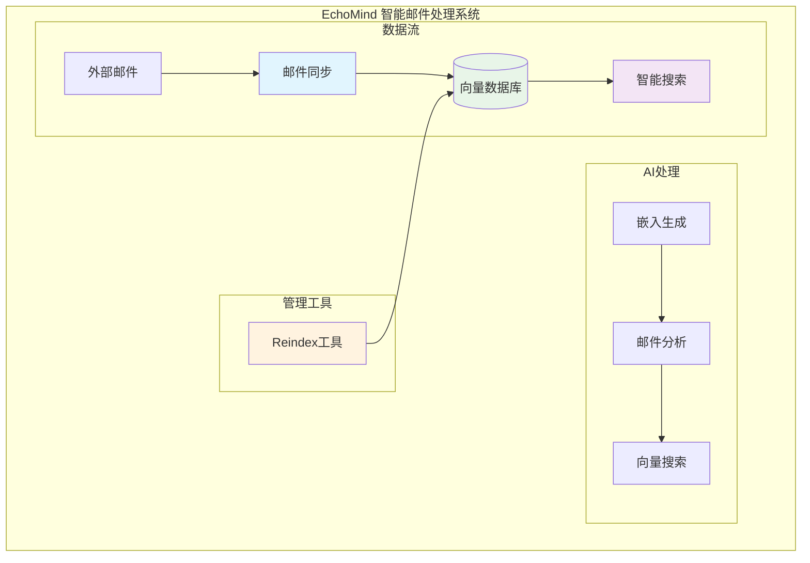
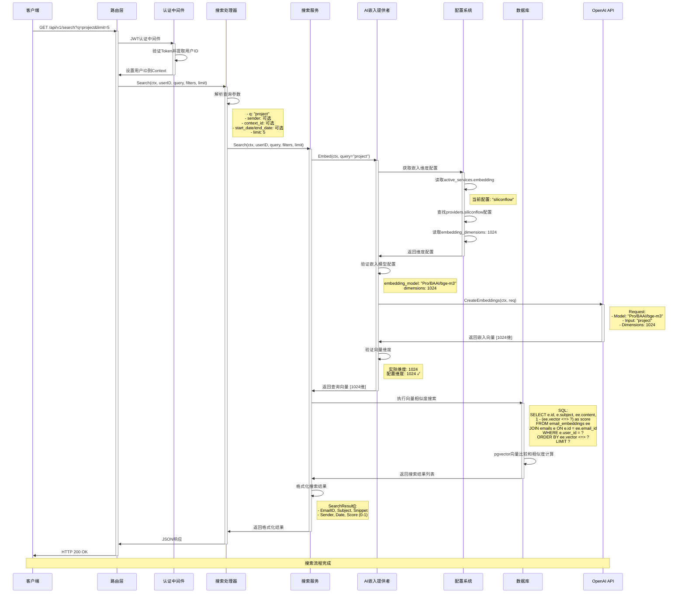
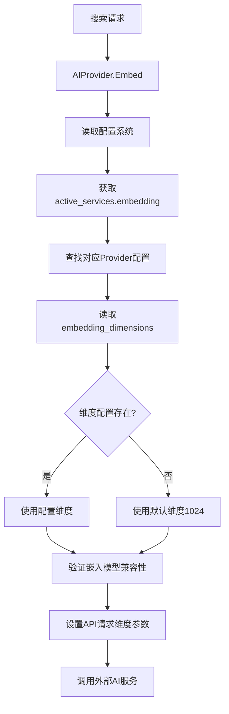
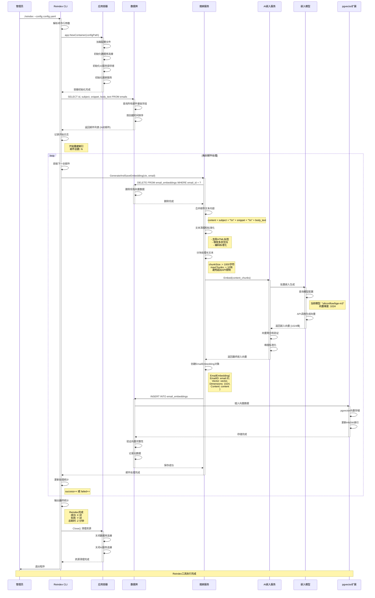
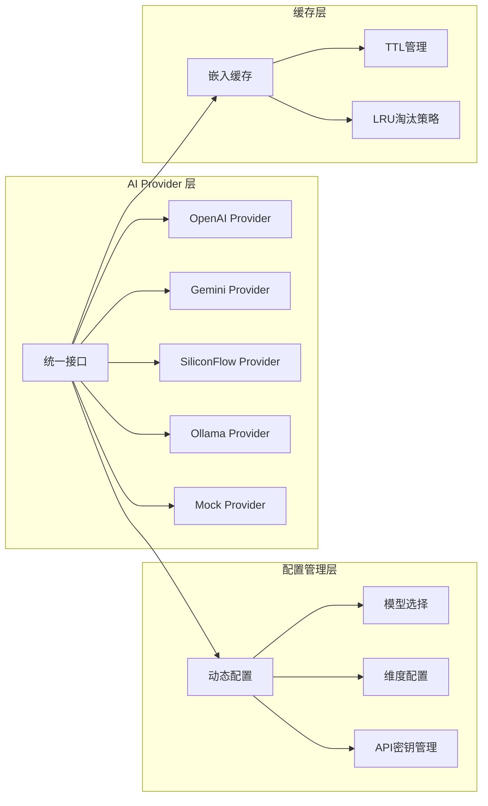
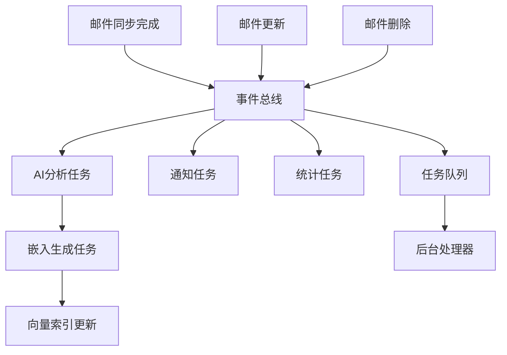
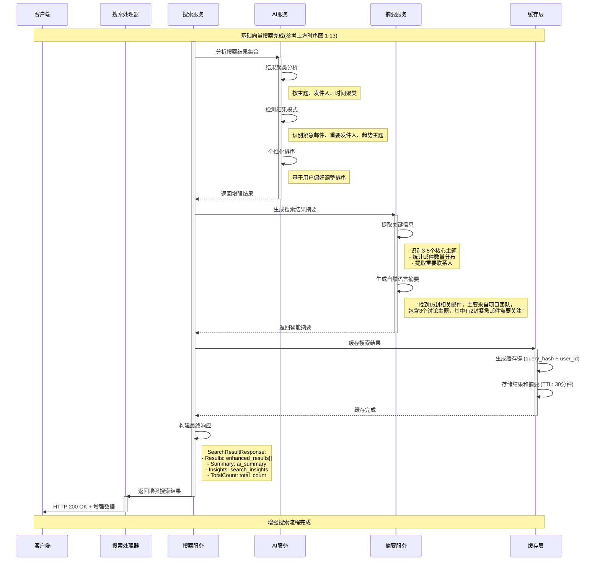
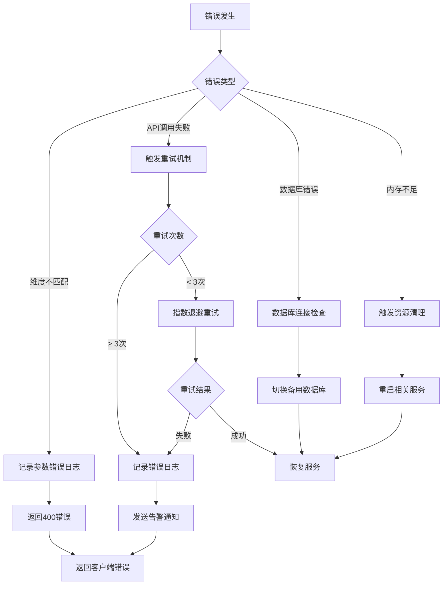

# EchoMind 邮件处理系统时序图

## 📋 目录

### 一、系统概览
- [1.1 核心流程说明](#11-核心流程说明)
- [1.2 共享技术栈](#12-共享技术栈)

### 二、核心业务流程
- [2.1 邮件搜索流程](#21-邮件搜索流程)
  - [2.1.1 搜索流程时序图](#211-搜索流程时序图)
  - [2.1.2 关键组件详细说明](#212-关键组件详细说明)
- [2.2 邮件同步流程](#22-邮件同步流程)
  - [2.2.1 同步流程时序图](#221-同步流程时序图)
  - [2.2.2 同步流程关键组件](#222-同步流程关键组件)
- [2.3 Reindex工具流程](#23-reindex工具流程)
  - [2.3.1 Reindex工具时序图](#231-reindex工具时序图)
  - [2.3.2 Reindex工具关键特性](#232-reindex工具关键特性)

### 三、技术架构组件
- [3.1 向量嵌入处理流程](#31-向量嵌入处理流程)
- [3.2 AI Provider架构](#32-ai-provider架构)
- [3.3 数据库模式设计](#33-数据库模式设计)
- [3.4 事件驱动架构](#34-事件驱动架构)

### 四、系统增强方案
- [4.1 当前搜索流程分析](#41-当前搜索流程分析)
- [4.2 增强搜索流程时序图](#42-增强搜索流程时序图)
- [4.3 建议实施的搜索增强功能](#43-建议实施的搜索增强功能)

### 五、监控与运维
- [5.1 关键性能指标 (KPIs)](#51-关键性能指标-kpis)
- [5.2 错误处理流程](#52-错误处理流程)
- [5.3 运维最佳实践](#53-运维最佳实践)

---

## 一、系统概览

EchoMind是一个基于AI的智能邮件处理系统，主要由三个核心流程组成：



### 1.1 核心流程说明

| 流程 | 功能描述 | 触发方式 | 主要输出 |
|------|----------|----------|----------|
| **邮件搜索** | 基于AI的智能邮件检索 | 用户搜索请求 | 相关邮件列表及AI分析 |
| **邮件同步** | 从邮箱服务器获取新邮件 | 定时/手动同步 | 邮件数据 + 向量嵌入 |
| **Reindex工具** | 重建现有邮件的向量索引 | 管理员执行 | 更新的向量数据库 |

### 1.2 共享技术栈

- **向量数据库**: PostgreSQL + pgvector
- **AI嵌入**: 多Provider支持 (OpenAI, Gemini, SiliconFlow等)
- **异步处理**: Asynq任务队列
- **事件驱动**: 事件总线架构
- **缓存**: Redis (建议实施)

---

## 二、核心业务流程

### 2.1 邮件搜索流程

邮件搜索是系统的核心用户接口，提供基于AI的语义搜索功能，支持自然语言查询和智能结果排序。

#### 2.1.1 搜索流程时序图



#### 2.1.2 关键组件详细说明

##### 2.1.2.1 AI嵌入维度配置系统



##### 2.1.2.2 AI Provider配置映射表

| Provider | 嵌入模型 | 配置维度 | 模型原生维度 | 处理方式 |
|----------|----------|----------|--------------|----------|
| **siliconflow** | Pro/BAAI/bge-m3 | 1024 | 1024 | 直接使用 |
| **openai_small** | text-embedding-3-small | 1536 | 1536 | 直接使用 |
| **gemini_flash** | text-embedding-004 | 768 | 768 | 直接使用 |
| **local_ollama** | nomic-embed-text | 768 | 768 | 直接使用 |
| **mock** | - | 1024 | 1024 | 模拟生成 |

##### 2.1.2.3 向量维度验证机制

```go
// backend/internal/model/embedding.go:41-69
func (e *EmailEmbedding) validateAndConvertVector(tx *gorm.DB) error {
    vectorSlice := e.Vector.Slice()
    actualDimensions := len(vectorSlice)
    e.Dimensions = actualDimensions

    maxDimensions := 1536 // OpenAI最大标准维度

    // 超过最大维度则截断
    if actualDimensions > maxDimensions {
        truncatedSlice := vectorSlice[:maxDimensions]
        e.Vector = pgvector.NewVector(truncatedSlice)
        e.Dimensions = maxDimensions
    }

    // 小于最大维度则用零填充
    if actualDimensions < maxDimensions {
        paddedVector := make([]float32, maxDimensions)
        copy(paddedVector, vectorSlice)
        e.Vector = pgvector.NewVector(paddedVector)
    }

    return nil
}
```

##### 2.1.2.4 数据库搜索算法

**核心SQL查询**:
```sql
SELECT
    e.id as email_id,
    e.subject,
    ee.content as snippet,
    e.sender,
    e.date,
    1 - (ee.vector <=> ?) as score  -- 向量相似度计算
FROM email_embeddings ee
JOIN emails e ON e.id = ee.email_id
WHERE e.user_id = ?
ORDER BY ee.vector <=> ?  -- 按距离排序
LIMIT ?
```

**搜索步骤**:
1. **距离计算**: 使用 pgvector 的 `<=>` 操作符计算欧几里得距离
2. **相似度转换**: `1 - 距离` 得到相似度分数 (0-1之间，1为最相似)
3. **排序优化**: 使用 HNSW 索引加速近似最近邻搜索
4. **用户过滤**: 应用用户权限和结果数量限制

---

### 2.2 邮件同步流程

邮件同步流程负责从用户的邮箱服务器获取新邮件，进行AI分析处理，并生成向量嵌入以支持搜索功能。采用事件驱动的异步架构。

#### 2.2.1 同步流程时序图

```mermaid
sequenceDiagram
    participant Client as 客户端
    participant SyncHandler as 同步处理器
    participant SyncService as 同步服务
    participant EmailAccount as 邮箱账户
    participant IMAPConnector as IMAP连接器
    participant IMAPServer as IMAP服务器
    participant DB as 数据库
    participant EventBus as 事件总线
    participant TaskQueue as 任务队列
    participant AIService as AI服务
    participant EmbeddingService as 嵌入服务

    %% 1. 同步请求
    Client->>SyncHandler: POST /api/v1/sync/emails
    activate SyncHandler
    SyncHandler->>SyncService: SyncEmails(ctx, userID, teamID, orgID)
    activate SyncService

    %% 2. 获取邮箱配置
    SyncService->>EmailAccount: 获取用户邮箱配置
    activate EmailAccount
    EmailAccount->>EmailAccount: 读取账户信息
    Note right of EmailAccount: IMAP服务器、加密密码等
    EmailAccount->>SyncService: 返回账户配置
    deactivate EmailAccount

    %% 3. 建立IMAP连接
    SyncService->>IMAPConnector: NewConnector(account)
    activate IMAPConnector
    IMAPConnector->>IMAPConnector: 解密密码
    IMAPConnector->>IMAPServer: 建立TLS连接
    activate IMAPServer
    IMAPConnector->>IMAPServer: IMAP登录
    IMAPServer-->>IMAPConnector: 登录成功
    deactivate IMAPServer
    IMAPConnector->>SyncService: 连接就绪
    deactivate IMAPConnector

    %% 4. 获取邮件数据
    SyncService->>IMAPConnector: FetchEmails(lastSyncTime)
    activate IMAPConnector
    IMAPConnector->>IMAPServer: SELECT INBOX
    IMAPConnector->>IMAPServer: SEARCH SINCE lastSyncTime
    IMAPServer-->>IMAPConnector: 返回邮件UID列表
    IMAPConnector->>IMAPConnector: 获取最新10封邮件
    IMAPConnector->>IMAPConnector: 提取元数据和正文
    Note right of IMAPConnector: 提取主题、发件人、日期<br/>Message-ID、正文(TEXT/HTML)
    IMAPConnector->>SyncService: 返回邮件数据
    deactivate IMAPConnector

    %% 5. 邮件存储和事件发布
    loop 每封邮件处理
        SyncService->>DB: 检查Message-ID是否存在
        alt 邮件不存在
            SyncService->>DB: INSERT INTO emails
            activate DB
            DB->>DB: 保存邮件基础信息
            DB-->>SyncService: 保存成功
            deactivate DB

            %% 发布同步事件
            SyncService->>EventBus: Publish(EmailSyncedEvent)
            activate EventBus
            EventBus->>EventBus: 触发事件监听器

            %% 创建AI分析任务
            EventBus->>TaskQueue: Enqueue(EmailAnalyzeTask)
            activate TaskQueue
            TaskQueue->>TaskQueue: 添加到异步队列
            TaskQueue-->>EventBus: 任务已入队
            deactivate TaskQueue
            deactivate EventBus
        else 邮件已存在
            SyncService->>SyncService: 跳过重复邮件
        end
    end

    %% 6. 更新同步状态
    SyncService->>EmailAccount: 更新LastSyncAt
    activate EmailAccount
    EmailAccount->>EmailAccount: 记录最后同步时间
    EmailAccount-->>SyncService: 更新完成
    deactivate EmailAccount

    SyncService->>SyncHandler: 同步完成
    deactivate SyncService
    SyncHandler->>Client: HTTP 200 OK
    deactivate SyncHandler

    Note over Client,EmbeddingService: 同步请求完成，后台任务继续处理

    %% 7. 异步AI分析流程
    Note over TaskQueue,AIService: 后台异步处理流程
    TaskQueue->>AIService: HandleEmailAnalyzeTask
    activate AIService

    %% 垃圾邮件检测
    AIService->>AIService: SpamDetection(rules)
    Note right of AIService: 基于规则检测垃圾邮件<br/>- 发件人黑名单<br/>- 可疑关键词<br/>- 发送频率异常

    %% AI分析处理
    AIService->>AIService: 生成邮件摘要
    AIService->>AIService: 分类和情感分析
    AIService->>AIService: 紧急程度评估
    AIService->>AIService: 智能上下文匹配
    AIService->>AIService: 提取待办事项

    %% 更新分析结果
    AIService->>DB: UPDATE emails SET ai_analysis
    activate DB
    DB-->>AIService: 更新成功
    deactivate DB

    %% 生成向量嵌入
    AIService->>EmbeddingService: GenerateEmbedding(email_content)
    activate EmbeddingService
    EmbeddingService->>EmbeddingService: 文本分块处理
    EmbeddingService->>EmbeddingService: 调用AI嵌入API
    EmbeddingService->>EmbeddingService: 向量维度验证和转换

    %% 保存向量嵌入
    EmbeddingService->>DB: INSERT INTO email_embeddings
    activate DB
    DB->>DB: pgvector向量存储和索引更新
    DB-->>EmbeddingService: 嵌入保存成功
    deactivate DB
    EmbeddingService-->>AIService: 嵌入生成完成
    deactivate EmbeddingService

    AIService->>TaskQueue: 标记任务完成
    deactivate AIService
    deactivate TaskQueue

    Note over Client,EmbeddingService: 完整邮件同步和AI处理流程完成
```

#### 2.2.2 同步流程关键组件

##### 2.2.2.1 IMAP连接器配置

| 配置项 | 说明 | 示例 |
|--------|------|------|
| **Server** | IMAP服务器地址 | "imap.gmail.com:993" |
| **Username** | 邮箱地址 | "user@gmail.com" |
| **Password** | 加密存储的密码 | AES-256加密 |
| **LastSyncAt** | 最后同步时间 | 2025-01-15 10:30:00 |
| **SyncLimit** | 同步邮件数量限制 | 默认10封 |

##### 2.2.2.2 同步过滤规则

```go
// 同步过滤逻辑
func shouldSyncEmail(email *Email, lastSync time.Time) bool {
    return email.Date.After(lastSync) &&           // 时间过滤
           !isDuplicate(email.MessageID) &&         // 重复检测
           !isSpam(email.Sender, email.Subject) &&  // 垃圾邮件过滤
           email.BodyText != ""                     // 内容非空
}
```

##### 2.2.2.3 AI分析维度

| 分析类型 | 功能说明 | 输出格式 | 应用场景 |
|----------|----------|----------|----------|
| **摘要生成** | 提取邮件核心内容 | 50-100字摘要 | 快速浏览 |
| **分类** | 邮件类别识别 | work/personal/newsletter等 | 自动分类 |
| **情感分析** | 情感倾向判断 | positive/neutral/negative | 情绪追踪 |
| **紧急度** | 重要性评估 | high/medium/low | 优先级处理 |
| **智能上下文** | 关联项目/客户 | project_context/client_context | 业务关联 |

---

### 2.3 Reindex工具流程

Reindex工具用于重建现有邮件的向量嵌入，主要应用场景：
- 更新AI嵌入模型后重新生成向量
- 修复损坏或不完整的向量数据
- 调整向量维度配置
- 系统迁移后的数据重建

#### 2.3.1 Reindex工具时序图



#### 2.3.2 Reindex工具关键特性

##### 2.3.2.1 性能优化策略

| 优化项 | 说明 | 效果 |
|--------|------|------|
| **批量查询** | 一次查询所有邮件基础字段 | 减少数据库往返次数 |
| **文本分块** | 长邮件分块处理避免API限制 | 提高处理成功率 |
| **连接池** | 复用数据库和AI服务连接 | 降低连接开销 |
| **进度追踪** | 实时记录处理进度 | 便于监控和调试 |

##### 2.3.2.2 错误处理机制

```go
// 错误处理逻辑
func (cli *ReindexCLI) processEmail(email *model.Email) error {
    defer func() {
        if r := recover(); r != nil {
            cli.Logger.Error("邮件处理异常",
                logger.String("email_id", email.ID.String()),
                logger.Any("panic", r))
            cli.failed++
        }
    }()

    if err := cli.SearchService.GenerateAndSaveEmbedding(ctx, email); err != nil {
        cli.Logger.Warn("邮件重建失败",
            logger.String("email_id", email.ID.String()),
            logger.Error(err))
        cli.failed++
        return err
    }

    cli.success++
    return nil
}
```

##### 2.3.2.3 配置参数说明

| 参数 | 默认值 | 说明 | 影响 |
|------|--------|------|------|
| **ChunkSize** | 1000 | 文本分块大小(字符) | API调用稳定性 |
| **MaxChunks** | 10 | 最大分块数量 | 处理效果和成本 |
| **BatchSize** | 50 | 批量处理大小(预留) | 未来性能优化 |
| **LogLevel** | info | 日志记录级别 | 调试便利性 |

##### 2.3.2.4 数据完整性保障

- **事务处理**: 每封邮件的嵌入更新使用独立事务
- **向量验证**: 检查向量维度和数值范围
- **索引维护**: 自动更新pgvector索引
- **备份保护**: 删除旧嵌入前保存备份

---

## 三、技术架构组件

### 3.1 向量嵌入处理流程

```go
// 标准嵌入生成流程
func (s *EmbeddingService) GenerateEmbedding(content string) ([]float32, error) {
    // 1. 文本预处理和分块
    chunks := s.chunkText(content, MaxChunkSize)

    // 2. 批量生成嵌入
    embeddings := make([][]float32, len(chunks))
    for i, chunk := range chunks {
        embeddings[i] = s.aiProvider.Embed(chunk)
    }

    // 3. 聚合多块嵌入
    finalEmbedding := s.aggregateEmbeddings(embeddings)

    // 4. 维度验证和标准化
    return s.validateAndNormalizeVector(finalEmbedding)
}
```

### 3.2 AI Provider架构



### 3.3 数据库模式设计

```sql
-- 邮件主表
CREATE TABLE emails (
    id UUID PRIMARY KEY DEFAULT gen_random_uuid(),
    user_id UUID NOT NULL,
    subject TEXT,
    body_text TEXT,
    sender TEXT,
    date TIMESTAMP WITH TIME ZONE,
    message_id TEXT UNIQUE,
    ai_analysis JSONB,  -- AI分析结果
    created_at TIMESTAMP WITH TIME ZONE DEFAULT NOW(),
    updated_at TIMESTAMP WITH TIME ZONE DEFAULT NOW()
);

-- 向量嵌入表
CREATE TABLE email_embeddings (
    id UUID PRIMARY KEY DEFAULT gen_random_uuid(),
    email_id UUID NOT NULL REFERENCES emails(id) ON DELETE CASCADE,
    content TEXT NOT NULL,        -- 用于嵌入的文本内容
    vector vector(1536),          -- pgvector向量
    dimensions INTEGER NOT NULL,  -- 实际维度
    model_version TEXT,           -- 嵌入模型版本
    created_at TIMESTAMP WITH TIME ZONE DEFAULT NOW()
);

-- 向量索引
CREATE INDEX idx_email_embeddings_vector ON email_embeddings
USING hnsw (vector vector_cosine_ops);

-- 用户索引
CREATE INDEX idx_emails_user_id ON emails(user_id);
CREATE INDEX idx_email_embeddings_email_id ON email_embeddings(email_id);
```

### 3.4 事件驱动架构



---

## 四、系统增强方案

### 4.1 当前搜索流程分析

基于代码分析，当前搜索流程相对简单，仅包含向量相似度搜索，缺少后处理环节。以下是建议的增强流程：

### 4.2 增强搜索流程时序图



### 4.3 建议实施的搜索增强功能

#### 4.3.1 结果聚类分析
- **主题聚类**: 按邮件内容相似性分组
- **发件人聚类**: 按发件人/部门分组显示
- **时间聚类**: 按时间周期(今天/本周/本月)分组

#### 4.3.2 智能摘要服务

```go
type SearchSummary struct {
    TotalCount       int                    `json:"total_count"`
    KeyTopics        []string              `json:"key_topics"`
    ImportantPeople  []PersonSummary       `json:"important_people"`
    UrgentCount      int                   `json:"urgent_count"`
    TimeDistribution map[string]int       `json:"time_distribution"`
    NaturalSummary   string                `json:"natural_summary"`
}

type PersonSummary struct {
    Name   string `json:"name"`
    Email  string `json:"email"`
    Count  int    `json:"count"`
    Urgent int    `json:"urgent"`
}
```

#### 4.3.3 个性化搜索
- **用户偏好学习**: 记录用户点击和查看模式
- **发件人权重**: 重要联系人优先显示
- **时间权重**: 近期邮件适当提权
- **上下文相关**: 基于用户当前工作内容调整

#### 4.3.4 性能优化
- **搜索结果缓存**: 相同查询30分钟内返回缓存
- **预取相关数据**: 提前加载邮件完整内容
- **分页优化**: 实现高效的游标分页
- **搜索建议**: 基于历史记录提供搜索建议

---

## 五、监控与运维

### 5.1 关键性能指标 (KPIs)

| 指标类型 | 指标名称 | 正常范围 | 告警阈值 |
|----------|----------|----------|----------|
| **性能** | 搜索响应时间 | < 1秒 | > 2秒警告, > 5秒严重 |
| **性能** | 嵌入生成延迟 | < 500ms | > 1秒警告, > 2秒严重 |
| **质量** | 搜索准确率 | > 85% | < 80%警告 |
| **可靠性** | API调用成功率 | > 95% | < 90%警告 |
| **可靠性** | 系统可用性 | > 99.5% | < 99%警告 |

### 5.2 错误处理流程



### 5.3 运维最佳实践

#### 5.3.1 定期维护任务
- **向量索引重建**: 每周一次索引优化
- **缓存清理**: 每日清理过期缓存
- **日志归档**: 每月归档和压缩日志
- **数据备份**: 每日增量备份，每周全量备份

#### 5.3.2 监控告警设置
- **系统资源**: CPU、内存、磁盘使用率
- **数据库性能**: 查询响应时间、连接数
- **AI服务**: API调用成功率、响应延迟
- **业务指标**: 搜索量、同步成功率、用户活跃度

通过这些增强，EchoMind将从一个基础的邮件搜索系统升级为智能化的信息发现和处理平台。