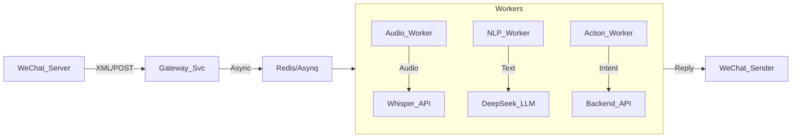

# 📱 Design Spec: EchoMind v0.8.0 "WeChat Connect"

> **Code Name**: The Portable Brain
> **Target Version**: v0.8.0
> **Status**: **Approved Spec**
> **Core Philosophy**: "Lazy Intelligence" (懒人智能) — Zero Friction, High Context.

---

## 1. 愿景与叙事 (Vision & Narrative)

v0.8.0 不是为了让用户在微信里“工作”，而是为了**把用户从电脑前解放出来**。
微信端的交互逻辑遵循 **"Fire and Forget" (发射即忘)** 原则。

### 🌤️ A Day in the Life (用户故事)

*   **08:30 (Commute)**: 手机震动。EchoMind 推送 **"Morning Briefing"**。你扫了一眼：3 个待办，1 个紧急风险。你不需要回复，心里有数了。
*   **10:00 (Meeting)**: 会议间隙，你突然想到一个绝佳的点子。你拿起手机，按住说话：*"记一下，把首页的 CTA 按钮改成动态呼吸效果，下周一设计评审时提出来。"* **(Thought Catcher)**。
*   **14:00 (Focus Time)**: 微信收到一条复杂的合作咨询。你直接转发给 EchoMind：*"查一下我们之前和这家公司的历史报价，然后拟一个委婉的拒绝回复，说我们产能满了。"* **(RAG + Draft)**。
*   **16:00 (Chaos)**: 下属问："老板，下周二下午 3 点能开会吗？" 你把这句话转发给 EchoMind。EchoMind 秒回：*"冲突预警 (有财务会)。建议回复：周三上午 10 点或周二 4 点半后。"* 你点击 **[复制建议]** 发送。 **(Calendar Gatekeeper)**。
*   **20:00 (Vacation)**: 你在度假。EchoMind 拦截了 50 封邮件，只有一封此时突破静音发出红色警报：*"大客户 CEO 发邮件说要解约"*。你点击卡片下的 **[ 📞 预约明天电话 ]**。 **(One-Touch Decision)**。

---

## 2. 核心功能规格 (Functional Specifications)

### 2.1 🎙️ The Voice Commander (语音指挥官)
**定义**: 利用微信原生语音能力，结合 OpenAI Whisper，实现高精度自然语言交互。

*   **交互流程**:
    1.  用户发送语音 (支持中英混杂、方言)。
    2.  EchoMind 抓取 `MediaID`，下载音频。
    3.  调用 **Whisper API** 转录为文本。
    4.  **Intent Classification (意图识别)**:
        *   `INTENT_SEARCH`: "查一下..." -> 调用 RAG -> 返回文本摘要。
        *   `INTENT_DRAFT`: "回复说..." -> 生成草稿 -> 返回确认卡片。
        *   `INTENT_TASK`: "提醒我..." -> 创建 Task -> 返回 "已记录"。
        *   `INTENT_READ`: "读一下这封信" -> TTS 生成语音 -> 发送 MP3 给用户。

### 2.2 🗓️ The Calendar Gatekeeper (日程守门人)
**定义**: 智能冲突检测与自动协商代理。

*   **触发方式**:
    *   用户转发包含时间的文本/图片给公众号。
    *   用户直接询问："明天下午我有空吗？"
*   **智能逻辑**:
    1.  **NER (实体识别)**: 提取时间槽 (e.g., "Next Tuesday 3 PM").
    2.  **Conflict Check**: 查询用户日历 (Google/Outlook/Internal DB)。
    3.  **Slot Finding**: 如果冲突，向后寻找最近的 2 个空闲 30min+ 时间槽。
    4.  **Response Gen**: 生成符合用户口吻的回复建议。
*   **Output**: 
    > 🚫 **冲突**: 财务汇报 (14:30-16:00)
    > ✅ **建议回复**: "周二下午不行，周三上午10点方便吗？"

### 2.3 🧠 The Thought Catcher (灵感捕手)
**定义**: 极速的 Memo 录入入口。

*   **特点**: 不只是记录文字，还进行**结构化处理**。
*   **Example**:
    *   Input: "记得下周给王总寄合同。"
    *   Processing: 提取 `Action: 寄合同`, `Person: 王总`, `Due: Next Week`。
    *   Output: "已创建任务 [寄合同 - 王总] 📅 下周一 09:00。"
*   **Sync**: 同步至 Web 端 Dashboard 的 "Tasks" 区域。

### 2.4 ⚡ One-Touch Decision (一键决策)
**定义**: 将复杂邮件转化为简单的二元选项。

*   **场景**: 审批、会议邀请、简单确认。
*   **UI (Template Message)**:
    ```text
    【审批请求】Q4 营销预算
    申请人：Alice
    金额：¥500,000 (超预算 10%)
    风险：高
    ----------------
    [ 🟢 批准 ]  [ 🔴 驳回 ] [ 💬 稍后处理 ]
    ```
*   **Action**: 点击按钮直接调用 API 完成操作，并在微信内反馈 "✅ 已批准"。

---

## 3. 微信公众号菜单架构 (Menu Map)

```text
+----------------+----------------+----------------+
|  🚀 今日概览   |   🧠 第二大脑  |    ⚙️ 我的     |
+----------------+----------------+----------------+
| 📰 晨报 (Brief)| 🔍 搜邮件      | 🔗 账号绑定    |
| 📋 待办 (Tasks)| 🎙️ 记灵感      | 🔕 免打扰模式  |
| 🗓️ 日程 (Cal)  | 📇 查人脉      | 🆘 常用指令    |
+----------------+----------------+----------------+
```

---

## 4. 技术架构与挑战 (Technical Architecture)

### 4.1 消息处理管道 (Pipeline)


### 4.2 会话状态管理 (Session State)
由于微信交互是无状态的，我们需要在 Redis 中维护 FSM (有限状态机)。
*   **Key**: `wx_session:{openid}`
*   **TTL**: 5 minutes
*   **States**:
    *   `IDLE`: 空闲。
    *   `AWAIT_SEARCH_QUERY`: 用户点击了“搜邮件”，等待输入关键词。
    *   `AWAIT_REPLY_CONFIRM`: AI 生成了草稿，等待用户确认发送。

### 4.3 账号安全 (Security)
*   **Binding**: 采用 **QRCode Scenarios (带参二维码)**。
    1.  Web 端生成带 `uuid` 的二维码。
    2.  用户微信扫码。
    3.  微信回调 Server，Server 将 `openid` 与 `uuid` (User ID) 绑定。
*   **Verify**: 每次请求校验 `openid` 是否存在于绑定表。

---

## 5. 实施路线图 (Implementation Roadmap)

### Phase 1: 基础设施 (v0.8.0-alpha)
*   [ ] 申请微信服务号 (Service Account)，配置服务器 URL。
*   [ ] 实现 `WeChatGateway` (接收 XML，验证签名)。
*   [ ] 实现 `AccountBinding` (二维码绑定逻辑)。

### Phase 2: 核心交互 (v0.8.0-beta)
*   [ ] 集成 Whisper API 处理语音。
*   [ ] 实现 LLM Intent Router (意图分类器)。
*   [ ] 开发 "Morning Briefing" 推送 Job。

### Phase 3: 高级智能 (v0.8.0-RC)
*   [ ] 集成日历 API (Calendar Gatekeeper)。
*   [ ] 实现 RAG Search 的微信端适配 (精简输出)。
*   [ ] 压力测试与 Token 成本优化。