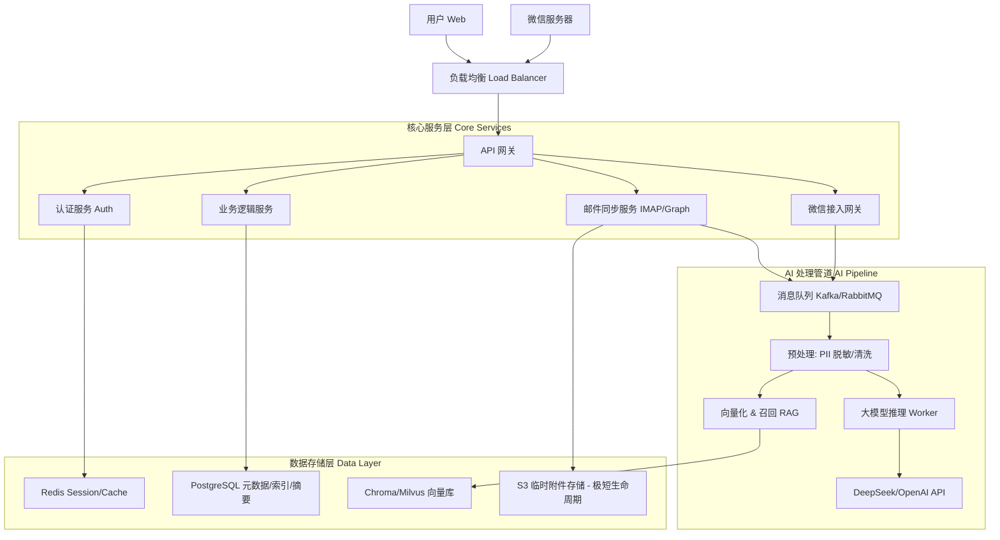

# 🛠️ 系统设计文档 - EchoMind

## 1. 系统架构概览 (Cloud-Native SaaS)

EchoMind 采用微服务架构，部署于云端（AWS/GCP/阿里云），为用户提供 24/7 的邮件智能分析服务。

---

## 2. 核心模块详细设计

### 2.1 邮件同步引擎 (Mail Sync Engine)
这是系统的“心脏”，负责与全球各种邮件服务器通信。

*   **技术选型**：Go (Goroutines 高并发优势)。
*   **连接管理**：
    *   维护一个持久化的 IMAP 连接池（IDLE 模式），实现新邮件实时推送。
    *   针对不支持 IDLE 的邮箱，采用自适应轮询策略（活跃时间高频，夜间低频）。
*   **数据结构 (Database Schema)**：
    *   `Emails`: 仅存储 `Message-ID`, `Subject`, `From`, `To`, `Date` 以及 `Summary` (AI 生成的摘要)。
    *   **隐私策略**：**不存储 `Body` 原文**。查看详情时实时透传。
    *   `Threads`: 维护邮件会话关系树。

### 2.4 微信连接模块 (WeChat Connect - v0.8.0+)
**定位**: EchoMind 的移动端对话式操作系统 (Conversational OS)，不仅仅是通知通道，更是核心交互终端。

*   **消息接收与路由**: 
    *   处理微信 XML 回调，验证签名。
    *   基于 **Redis FSM (有限状态机)** 维护用户会话状态，支持多轮对话 (e.g., "帮我约会" -> "约什么时间?").
*   **语音指挥官 (Voice Commander)**:
    *   **高精度转录**: 接收语音媒体 (AMR/MP3)，转发至 **OpenAI Whisper** 模型进行识别，确保中英文混合和专业术语的准确率。
    *   **意图识别**: 识别 `Draft` (起草), `Search` (查询), `Schedule` (日程) 等意图。
*   **懒人智能推送 (Lazy Intelligence Push)**:
    *   **一键决策**: 利用微信模板消息推送审批/决策卡片，用户点击按钮直接触发后端 API (`[批准]`/`[驳回]`)。
    *   **晨报推送**: 每日定时生成个性化简报 (Briefing Image/Text)。
*   **身份绑定**: 采用带参二维码机制，实现 Web 端与微信端的安全绑定。

### 2.5 AI 分析管道 (The Pipeline)
采用异步事件驱动架构，确保邮件同步不被耗时的 AI 推理阻塞。

1.  **Ingestion (摄入)**：IMAP 服务拉取新邮件元数据 -> 推送 Event 到 MQ。
2.  **Sanitization (脱敏)**：Worker 消费消息 -> 正则/NLP 识别 PII -> 内存中脱敏。
3.  **Analysis (分析)**：
    *   **Task A (摘要)**：调用 LLM 生成 TL;DR。
    *   **Task B (意图)**：分类为 (Report, Request, FYI, Spam)。
    *   **Task C (实体)**：提取 Deadline, Action Items。
4.  **Persist (存储)**：将结构化结果写入 PostgreSQL，将语义向量写入 VectorDB。

### 2.3 搜索引擎 (Semantic Search)
*   不再是简单的关键词匹配。
*   支持自然语言提问：“上个月张总关于预算说了什么？”
*   实现：基于 Embedding 的向量搜索 + 关键词混合检索 (Hybrid Search)。

### 2.6 用户界面：神经中枢 (Neural Interface - v0.7.0+)
**核心理念**: 从 "Client" (客户端) 进化为 "Surface" (智能画布)。不再是简单的邮件列表，而是基于 **RAG** 的生成式交互界面。

#### A. 布局架构 (Fluid Canvas Layout)
采用 **Source-Canvas-Detail** 三栏流体布局：

1.  **左侧栏: 上下文管理器 (Context Manager)**
    *   **不再是文件夹**: 摒弃传统的 Inbox/Sent 结构。
    *   **关注点 (Attention Scopes)**:
        *   **Smart Clusters**: 自动聚合 "待回复", "高风险", "跟进中"。
        *   **User Contexts**: 用户定义的项目/人脉上下文 (e.g., "A轮融资", "VIP 客户")。勾选不同 Context，主屏 AI 的回答范围随之改变。
    *   **源数据 (Sources)**: 包含附件文档、提取的电子表格。

2.  **主画布: 智能中枢 (Intelligence Canvas)**
    这是用户停留时间最长的区域，分为两种核心模式：
    *   **模式 1: 晨报模式 (The Briefing - Passive)**
        *   **类比**: Notion Dashboard / 动态报纸。
        *   **内容**: 根据用户角色（高管/销售/经理）自动渲染不同的 **"Briefing Templates"**。
            *   *Executive*: 风险摘要 + 决策卡片。
            *   *Dealmaker*: 机会雷达 + 沉睡客户唤醒。
        *   **操作**: 每个卡片带有一键操作 (`[批准]`, `[草拟回复]`)。
    *   **模式 2: 工作室模式 (The Studio - Active)**
        *   **类比**: NotebookLM / Perplexity。
        *   **交互**: 
            *   **流式问答**: "上周关于预算的讨论结论是什么？" -> AI 实时生成回答。
            *   **动态组件**: 提问涉及时间时渲染日历组件，涉及人脉时渲染关系图谱。
            *   **精准引用**: 所有 AI 生成的观点均带有 `[1]` 脚注。

3.  **右侧栏: 事实锚点 (Grounding Panel)**
    *   **交互**: 点击主画布中的 `[1]` 引用，右侧滑出。
    *   **内容**: 展示原始邮件线程或文档片段，并高亮 AI 引用的具体段落。
    *   **价值**: 消除 AI 幻觉，提供 "Trust but Verify" 的能力。

#### B. 生成式 UI 组件 (Generative Widgets)
系统根据**意图识别 (Intent Classification)** 动态渲染组件，而非死板的表单。

| 意图 (Intent) | 渲染组件 (Widget) | 交互描述 |
| :--- | :--- | :--- |
| `scheduling` | **Calendar Grid** | 可交互的时间槽选择器，点击生成会议邀请。 |
| `relationship` | **Network Graph** | 力导向图，展示联系人之间的亲密度与互动历史。 |
| `decision` | **Approval Card** | 大号的 `[批准]` / `[驳回]` 按钮，附带风险分析摘要。 |
| `draft` | **Rich Editor** | 预填充好草稿的富文本编辑器，支持 AI 润色。 |

### 2.7 移动端体验：随身第二大脑 (Mobile Experience - v0.8.0+)
**核心理念**: **"Lazy Intelligence" (懒人智能)**。零摩擦，高上下文，能够不打字就不打字。

#### A. 语音交互 (Voice Commander)
*   **场景**: 开车、行走、灵感闪现。
*   **交互**: 
    *   用户发送语音: "帮我查一下上周五王总发的关于合同的邮件。"
    *   EchoMind (Whisper + RAG): "王总在周五的邮件确认了合同金额为 50 万，但要求修改付款条款。" (支持语音回复 + 文字卡片)。
*   **灵感捕手 (Thought Catcher)**: "提醒我下周一跟进设计图" -> 自动同步至 Web 端 Tasks 列表。

#### B. 智能协同 (Intelligent Collaboration)
*   **日程守门人 (Calendar Gatekeeper)**:
    *   用户转发聊天记录: "明天下午三点有空吗？"
    *   EchoMind: "❌ 冲突 (财务会)。✅ 建议: 明天上午 10:00 或下午 4:30。"
    *   操作: 用户点击 `[复制建议]`。
*   **一键决策 (One-Touch Decision)**:
    *   推送卡片: [审批请求: 预算超支 10%]
    *   交互: 直接点击 `[ 🟢 批准 ]` 或 `[ 🔴 驳回 (AI 拟稿) ]`，无需打开 App。

#### D. 微信公众号 (WeChat Companion) - "随身助理"
*   **主动推送 (Push Notification)**：
    *   **目的**: 通过微信即时触达用户，传递关键信息，无需打开邮件客户端。
    *   **设计**: 模板消息卡片，包含 "今日决策日报"、"风险预警" 等，点击直达详情。
    *   **核心元素**: 标题、摘要、时间、查看详情链接、快捷操作按钮。
*   **语音指令 (Voice AI)**：
    *   **目的**: 驾车/移动场景下的免手操作。
    *   **设计**: 用户发送语音，系统返回 "文字 + 语音" 回复。
    *   **场景**: "查一下未读邮件" -> 播放摘要；"提醒我回电话" -> 创建任务。
*   **指令交互 (Command & Control)**：
    *   **目的**: 允许用户通过微信快速处理任务或获取信息。
    *   **设计**: 任务卡片下方操作按钮（[批准]/[拒绝]/[稍后提醒]）。
    *   **核心元素**: 任务卡片、操作按钮。

---

## 3. 安全架构设计

### 3.1 零信任数据保护
*   **传输加密**：强制 TLS 1.2+。
*   **静态加密 (At Rest)**：
    *   数据库卷加密。
    *   敏感字段（如 OAuth Token, 邮箱密码）使用应用级加密（AES-GCM），密钥由 KMS 管理。
*   **内存即焚**：邮件正文在内存中 AI 分析完成后立即 GC，不落盘。

### 3.2 认证与鉴权
*   **用户认证**：JWT (JSON Web Token)。
*   **邮箱授权**：
    *   **OAuth2** (推荐)：只保存 Access/Refresh Token，不保存密码。
    *   **App Password**：对于仅支持密码的邮箱，强制要求使用应用专用密码，并加密存储。

---

## 4. 技术栈推荐

*   **Backend**: Go (Gin/Chi) - 高性能，适合 IO 密集型（IMAP）。
*   **Frontend**: React (Next.js) + Tailwind CSS - 构建现代 SaaS 界面。
*   **Database**: PostgreSQL (主库) + Redis (缓存/队列) + Chroma (向量)。
*   **Infrastructure**: Docker + Kubernetes (k8s) - 方便扩缩容。
*   **AI Model**: DeepSeek-V3 (高性价比) 或 GPT-4o-mini (快速推理)。

---

## 5. 关键挑战与解决方案

| 挑战 | 解决方案 |
| :--- | :--- |
| **IMAP 兼容性地狱** | 建立“邮箱适配层”，针对 Gmail, Outlook, QQ, 163 维护不同的解析规则和 Quirks 模式。 |
| **大邮件/附件处理** | 仅下载正文 (Text/HTML)，跳过大附件；或按需流式下载附件进行 OCR 分析。 |
| **AI 成本控制** | 采用“三级过滤漏斗” (规则 -> 小模型 -> 大模型)。 |
| **实时性** | IMAP IDLE + WebHook 推送。 |

---

## 6. 核心交互逻辑详述 (Detailed Specifications)

### 6.1 任务与邮件双向联动机制
*   **任务完成联动 (Smart Prompt)**:
    *   当用户在 EchoMind 标记任务完成时，Web 端弹出 Toast 提示：“是否归档原邮件？”
    *   支持用户设置“不再询问，默认归档”。
*   **外部操作独立 (Data Independence)**:
    *   用户在外部邮箱客户端（Outlook/Gmail）对邮件的删除、归档、移动操作，**不影响** EchoMind 中已生成的任务状态。任务数据独立维护。
*   **用户反馈循环 (Feedback Loop)**:
    *   当用户修改 AI 自动提取的任务字段（如截止时间、任务标题）时，系统保留 `(AI_Original, User_Modified)` 数据对。
    *   界面显示“已人工校准”标记。数据用于后续模型微调。

### 6.2 微信集成与账号体系
*   **绑定流程 (Web First)**:
    *   Web 端生成绑定二维码 -> 用户微信扫码 -> 公众号推送确认卡片 -> 用户点击确认 -> 绑定成功。
*   **多邮箱管理 (Primary Context)**:
    *   Web 端设置“主邮箱”。微信端默认展示主邮箱的日报和任务。
    *   支持指令（如 `switch work`）或菜单切换上下文。
    *   **风险预警例外**：任何邮箱的高风险邮件均会实时推送，不受当前上下文限制。

### 6.3 AI 触发与隐私架构
*   **智能分析漏斗 (3-Stage Funnel)**:
    1.  **规则层 (Go)**: 过滤黑名单、系统通知 (`no-reply`)、垃圾邮件。
    2.  **分类层 (Small Model)**: 快速识别邮件意图（重要 vs 普通通知）。
    3.  **深度层 (LLM)**: 仅对“重要”邮件进行深度推理（摘要、任务提取、情绪分析）。
*   **零信任隐私存储 (Dataless Architecture)**:
    *   **正文不落盘**: 数据库仅存储元数据 (`Subject`, `From`, `Date`) 和 AI 生成的结构化数据。
    *   **实时透传**: 用户查看详情时，后端实时从邮件服务器拉取正文。
*   **附件策略 (Metadata First)**:
    *   默认仅记录附件元数据。
    *   仅在 AI 分析判断需要（如“见附件合同”）时临时下载分析并立即删除。
    *   用户点击附件时实时下载/转发。