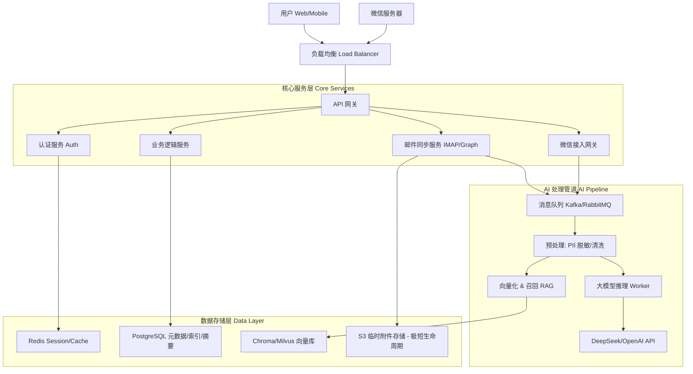

# 🛠️ 系统设计文档 - EchoMind

## 1. 系统架构概览 (Cloud-Native SaaS)

EchoMind 采用微服务架构，部署于云端（AWS/GCP/阿里云），为用户提供 24/7 的邮件智能分析服务。

---

## 2. 核心模块详细设计

### 2.1 邮件同步引擎 (Mail Sync Engine)
这是系统的“心脏”，负责与全球各种邮件服务器通信。

*   **技术选型**：Go (Goroutines 高并发优势)。
*   **连接管理**：
    *   维护一个持久化的 IMAP 连接池（IDLE 模式），实现新邮件实时推送。
    *   针对不支持 IDLE 的邮箱，采用自适应轮询策略（活跃时间高频，夜间低频）。
*   **数据结构 (Database Schema)**：
    *   `Emails`: 仅存储 `Message-ID`, `Subject`, `From`, `To`, `Date` 以及 `Summary` (AI 生成的摘要)。
    *   **隐私策略**：**不存储 `Body` 原文**。查看详情时实时透传。
    *   `Threads`: 维护邮件会话关系树。

### 2.4 微信集成模块 (WeChat Integration)
*   **消息接收**：处理微信回调 XML，验证签名。
*   **身份绑定**：通过 Web 端扫码绑定，建立 `OpenID` <-> `UserID` 映射。
*   **意图路由**：
    *   文本消息 -> AI Pipeline (意图识别: 是查询邮件? 还是闲聊?)。
    *   菜单点击 -> 调用业务 API 返回预设报表。
*   **模板消息**：对接微信模板消息接口，用于发送“日报提醒”和“风险预警”。

### 2.5 AI 分析管道 (The Pipeline)
采用异步事件驱动架构，确保邮件同步不被耗时的 AI 推理阻塞。

1.  **Ingestion (摄入)**：IMAP 服务拉取新邮件元数据 -> 推送 Event 到 MQ。
2.  **Sanitization (脱敏)**：Worker 消费消息 -> 正则/NLP 识别 PII -> 内存中脱敏。
3.  **Analysis (分析)**：
    *   **Task A (摘要)**：调用 LLM 生成 TL;DR。
    *   **Task B (意图)**：分类为 (Report, Request, FYI, Spam)。
    *   **Task C (实体)**：提取 Deadline, Action Items。
4.  **Persist (存储)**：将结构化结果写入 PostgreSQL，将语义向量写入 VectorDB。

### 2.3 搜索引擎 (Semantic Search)
*   不再是简单的关键词匹配。
*   支持自然语言提问：“上个月张总关于预算说了什么？”
*   实现：基于 Embedding 的向量搜索 + 关键词混合检索 (Hybrid Search)。

### 2.6 用户界面：双视图模式 (UI: Dual-View Modes)

#### A. 高管视图 (Executive View) - "晨报模式"
*   **每日决策日报 (Daily Digest)**：
    *   **目的**: 为高管提供高度聚合的每日决策信息，避免信息过载。
    *   **设计**: 卡片式布局，突出今日关键进展、待决策事项和风险预警。交互简洁，数据可视化。
    *   **核心元素**: 风险卡片 (红/黄警示)、重要趋势图表、简报列表。
*   **人脉价值看板**：
    *   **目的**: 帮助高管快速评估关键业务关系健康度。
    *   **设计**: 关系网络图或列表，通过颜色深浅、大小变化直观展示活跃度。
    *   **核心元素**: 关键联系人、互动频率、流失预警。

#### B. 管理者视图 (Manager View) - "控制台模式"
*   **任务提取 (Action Items)**：
    *   **目的**: 自动化任务管理，减少手动录入，确保任务不遗漏。
    *   **设计**: 类看板或列表形式，每个任务卡片可点击进入邮件原文。支持拖拽、标记完成。
    *   **核心元素**: 任务标题、截止日期、来源邮件链接、状态。
*   **智能跟进 (Smart Follow-up)**：
    *   **目的**: 帮助管理者追踪已发邮件的回复状态，及时提醒。
    *   **设计**: 列表展示，显示“等待回复”、“已回复”等状态，高亮逾期未回复项。
    *   **核心元素**: 发送时间、收件人、原邮件标题、等待时长。
*   **辅助写作 (AI Compose)**：
    *   **目的**: 提升回复效率，提供基于上下文的智能回复建议。
    *   **设计**: 在邮件详情页的回复框内集成 AI 建议按钮，一键生成草稿。
    *   **核心元素**: 建议回复类型（同意/拒绝/追问）、草稿内容。

#### C. 销售/投资视图 (Dealmaker View) - "雷达模式"
*   **意图雷达 (Intent Radar)**：
    *   **目的**：为销售/BD/投资人快速识别邮件中的潜在机会信号，如购买意向、合作需求、会议邀请等。
    *   **设计**：仪表盘中央显示高价值意图的聚合卡片，可点击查看详情。用颜色、图标区分意图类型。
    *   **核心元素**：意图类型（`购买`、`合作`、`会议`）、相关联系人、邮件片段预览、发现时间。
*   **关系热度图 (Relationship Heatmap)**：
    *   **目的**：可视化展示与重要联系人的互动频率和状态，帮助识别潜在的冷淡关系或活跃机会。
    *   **设计**：以联系人为节点的网络图或列表，通过颜色/大小变化直观展示活跃度。支持时间范围筛选。
    *   **核心元素**：联系人头像、姓名、公司、最近互动时间、互动频率（如近7天邮件数）、冷淡/活跃状态标记、推荐行动。
*   **时间线旅程 (Timeline)**：
    *   **目的**：以联系人为中心，聚合所有相关邮件、会议、附件，形成完整的交互历史，便于快速回顾沟通上下文。
    *   **设计**：按时间倒序排列的卡片流，每张卡片代表一次交互事件（邮件、会议），包含摘要、关键实体和快速入口到原文。
    *   **核心元素**：事件类型、日期、摘要/标题、关联邮件/附件链接、参与人。

#### D. 微信公众号 (WeChat Companion) - "随身助理"
*   **主动推送 (Push Notification)**：
    *   **目的**: 通过微信即时触达用户，传递关键信息，无需打开邮件客户端。
    *   **设计**: 模板消息卡片，包含 "今日决策日报"、"风险预警" 等，点击直达详情。
    *   **核心元素**: 标题、摘要、时间、查看详情链接、快捷操作按钮。
*   **指令交互 (Command & Control)**：
    *   **目的**: 允许用户通过微信快速处理任务或获取信息。
    *   **设计**: 任务卡片下方操作按钮（[批准]/[拒绝]/[稍后提醒]），或文本指令查询。
    *   **核心元素**: 任务卡片、操作按钮、文本输入框。
*   **对话式检索 (Chat Interface)**：
    *   **目的**: 提供更自然的邮件检索方式。
    *   **设计**: 类似 AI 助手的对话界面，支持自然语言提问。
    *   **核心元素**: 聊天输入框、AI 回复、邮件摘要和链接。

---

## 3. 安全架构设计

### 3.1 零信任数据保护
*   **传输加密**：强制 TLS 1.2+。
*   **静态加密 (At Rest)**：
    *   数据库卷加密。
    *   敏感字段（如 OAuth Token, 邮箱密码）使用应用级加密（AES-GCM），密钥由 KMS 管理。
*   **内存即焚**：邮件正文在内存中 AI 分析完成后立即 GC，不落盘。

### 3.2 认证与鉴权
*   **用户认证**：JWT (JSON Web Token)。
*   **邮箱授权**：
    *   **OAuth2** (推荐)：只保存 Access/Refresh Token，不保存密码。
    *   **App Password**：对于仅支持密码的邮箱，强制要求使用应用专用密码，并加密存储。

---

## 4. 技术栈推荐

*   **Backend**: Go (Gin/Chi) - 高性能，适合 IO 密集型（IMAP）。
*   **Frontend**: React (Next.js) + Tailwind CSS - 构建现代 SaaS 界面。
*   **Database**: PostgreSQL (主库) + Redis (缓存/队列) + Chroma (向量)。
*   **Infrastructure**: Docker + Kubernetes (k8s) - 方便扩缩容。
*   **AI Model**: DeepSeek-V3 (高性价比) 或 GPT-4o-mini (快速推理)。

---

## 5. 关键挑战与解决方案

| 挑战 | 解决方案 |
| :--- | :--- |
| **IMAP 兼容性地狱** | 建立“邮箱适配层”，针对 Gmail, Outlook, QQ, 163 维护不同的解析规则和 Quirks 模式。 |
| **大邮件/附件处理** | 仅下载正文 (Text/HTML)，跳过大附件；或按需流式下载附件进行 OCR 分析。 |
| **AI 成本控制** | 采用“三级过滤漏斗” (规则 -> 小模型 -> 大模型)。 |
| **实时性** | IMAP IDLE + WebHook 推送。 |

---

## 6. 核心交互逻辑详述 (Detailed Specifications)

### 6.1 任务与邮件双向联动机制
*   **任务完成联动 (Smart Prompt)**:
    *   当用户在 EchoMind 标记任务完成时，Web 端弹出 Toast 提示：“是否归档原邮件？”
    *   支持用户设置“不再询问，默认归档”。
*   **外部操作独立 (Data Independence)**:
    *   用户在外部邮箱客户端（Outlook/Gmail）对邮件的删除、归档、移动操作，**不影响** EchoMind 中已生成的任务状态。任务数据独立维护。
*   **用户反馈循环 (Feedback Loop)**:
    *   当用户修改 AI 自动提取的任务字段（如截止时间、任务标题）时，系统保留 `(AI_Original, User_Modified)` 数据对。
    *   界面显示“已人工校准”标记。数据用于后续模型微调。

### 6.2 微信集成与账号体系
*   **绑定流程 (Web First)**:
    *   Web 端生成绑定二维码 -> 用户微信扫码 -> 公众号推送确认卡片 -> 用户点击确认 -> 绑定成功。
*   **多邮箱管理 (Primary Context)**:
    *   Web 端设置“主邮箱”。微信端默认展示主邮箱的日报和任务。
    *   支持指令（如 `switch work`）或菜单切换上下文。
    *   **风险预警例外**：任何邮箱的高风险邮件均会实时推送，不受当前上下文限制。

### 6.3 AI 触发与隐私架构
*   **智能分析漏斗 (3-Stage Funnel)**:
    1.  **规则层 (Go)**: 过滤黑名单、系统通知 (`no-reply`)、垃圾邮件。
    2.  **分类层 (Small Model)**: 快速识别邮件意图（重要 vs 普通通知）。
    3.  **深度层 (LLM)**: 仅对“重要”邮件进行深度推理（摘要、任务提取、情绪分析）。
*   **零信任隐私存储 (Dataless Architecture)**:
    *   **正文不落盘**: 数据库仅存储元数据 (`Subject`, `From`, `Date`) 和 AI 生成的结构化数据。
    *   **实时透传**: 用户查看详情时，后端实时从邮件服务器拉取正文。
*   **附件策略 (Metadata First)**:
    *   默认仅记录附件元数据。
    *   仅在 AI 分析判断需要（如“见附件合同”）时临时下载分析并立即删除。
    *   用户点击附件时实时下载/转发。