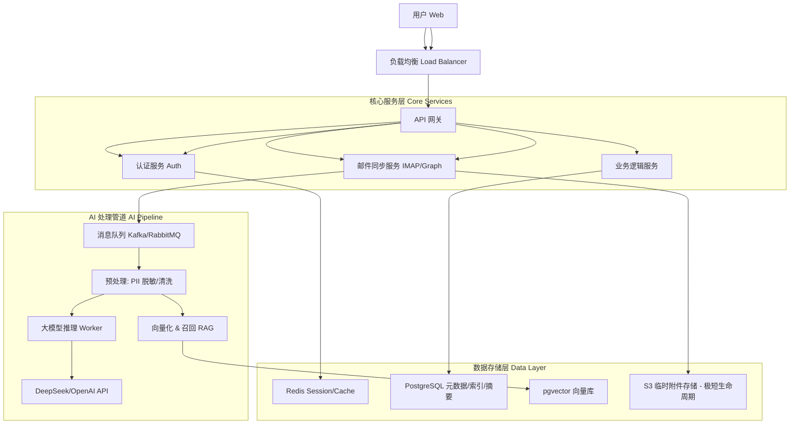

# 📚 EchoMind: 统一产品与技术架构文档

> **版本**: 2.1 | **状态**: 规划中
> **摘要**: 本文档是 EchoMind 系统的统一设计纲领，旨在整合产品理念、工程文化、系统架构、前后端设计、以及开发实施计划，为所有团队成员提供一个清晰、协同的单一事实来源 (Single Source of Truth)。

---

## 1. 产品理念与核心原则 (Vision & Principles)

EchoMind 的核心是打造一个**个人智能神经中枢 (Personal Neural Interface)**，将用户从繁杂的数字信息（尤其是邮件）中解放出来。我们遵循以下设计原则：

1.  **零摩擦体验 (Zero-Friction)**:
    *   **引导式 (Guided)**: 通过向导 (Wizard) 模式帮助新用户无缝完成初始化设置。
    *   **智能预设 (Smart Defaults)**: 自动推断邮箱配置，极大降低技术门槛。
    *   **懒人智能 (Lazy Intelligence)**: 能够在不打字、少操作的情况下完成任务，如一键决策、语音指令。

2.  **沉浸式与即时反馈 (Immersive & Real-time)**:
    *   强化登录与引导页面的视觉体验，建立专业、科技的品牌感。
    *   所有操作都应有即时反馈（如内联验证、Toast 通知），摒弃干扰性的原生弹窗。

3.  **智能画布 (Intelligence Canvas)**:
    *   从传统的“客户端 (Client)”演变为智能“画布 (Surface)”，将信息流重组成动态的、可交互的智能仪表盘。

4.  **本地优先与隐私 (Local-First & Privacy)**:
    *   支持离线模式，确保用户数据的所有权。支持本地 LLM 推理，最大化隐私保护。

---

## 2. 工程文化与开发规范 (Engineering Culture & Standards)

我们采用业界最佳实践来保证代码质量、协作效率和项目可维护性。

### 2.1 Monorepo 工程结构
采用 Monorepo 模式管理代码，确保前后端、文档和脚本的协同。

```text
/echomind
├── .github/                 # [最佳实践] GitHub Actions CI/CD
├── backend/                 # Go 后端服务
├── docs/                    # [最佳实践] 项目文档中心
├── frontend/                # Next.js 前端应用
├── deploy/                  # 部署与基础设施脚本
├── scripts/                 # 工具脚本
├── Makefile                 # [最佳实践] 统一任务入口
└── CONTRIBUTING.md          # [最佳实践] 贡献与开发规约
```

### 2.2 开发工作流
*   **测试驱动开发 (TDD)**: 核心业务逻辑须遵循 TDD 流程。
*   **版本控制**:
    *   **提交 (Commits)**: 遵循 **Conventional Commits** 规范 (`feat:`, `fix:`, `docs:` 等)。
    *   **发布 (Releases)**: 采用语义化版本号 (`vX.Y.Z`) 进行独立的功能发布。

### 2.3 自动化 (CI/CD)
通过 GitHub Actions 实现持续集成与部署。
*   **CI (持续集成)**: 自动执行代码格式化、静态检查 (`Lint`)、单元测试 (`go test`, `jest`)。
*   **CD (持续部署)**: 在 `main` 分支合并后，自动构建 Docker 镜像并推送到容器仓库 (GHCR)，随后触发生产环境的更新脚本。

---

## 3. 系统总体架构与可观测性

EchoMind 采用云原生微服务架构，为用户提供 24/7 的高可用智能服务。

### 3.1 高层架构图



### 3.2 技术栈概览

*   **Backend**: Go (Gin)
*   **Frontend**: React (Next.js) + Tailwind CSS
*   **Database**: PostgreSQL + pgvector (向量), Redis (缓存/队列)
*   **Infrastructure**: Docker + Kubernetes (k8s)
*   **AI Model**: DeepSeek-V3 / GPT-4o-mini

### 3.3 可观测性 (Observability)
*   **结构化日志 (Structured Logging)**: 使用 `Zap` 库，每条日志包含 `request_id`, `user_id`, `duration` 等关键字段。
*   **健康检查 (Health Checks)**: `GET /api/v1/health` 接口用于检查数据库等下游服务的连通性。
*   **核心指标 (Metrics)**: 通过日志记录关键操作延迟，如搜索、Embedding API 调用等。

---

## 4. 后端架构详解 (Detailed Backend Architecture)

### 4.1 Web 框架与核心库
*   **Web Framework**: `Gin` - 高性能 Web 框架。
*   **Configuration**: `Viper` - 支持 YAML 与环境变量，实现灵活配置。
*   **ORM**: `GORM` - 与 PostgreSQL 交互。

### 4.2 邮件同步引擎 (Mail Sync Engine)
*   **技术**: Go (Goroutines 高并发优势)。
*   **连接**: 维护 IMAP IDLE 连接池实现新邮件实时推送，对不支持的邮箱采用自适应轮询。
*   **数据与隐私**: **不存储邮件正文**。仅存储元数据和 AI 生成的摘要。查看详情时实时从用户邮箱服务器拉取。
*   **垃圾邮件过滤**: 内置基于规则的过滤器 (`internal/spam`)，在 AI 处理前预筛邮件。

### 4.3 AI 分析管道 (AI Pipeline)
*   **架构**: 采用**异步事件驱动**模式，确保邮件同步不被 AI 推理阻塞。
*   **异步任务系统**: `Asynq` (基于 Redis)，用于处理所有耗时的 AI 分析任务。
*   **AI 引擎设计**:
    *   **设计模式**: 采用**适配器 (Adapter)** 和**工厂 (Factory)** 模式，轻松切换不同 AI 服务商。
    *   **核心接口**: `pkg/ai/AIProvider` 定义了 `Summarize`, `Classify`, `StreamChat` 等标准方法。
    *   **RAG 支持**: 使用 OpenAI `text-embedding-3-small` 模型生成向量，存储于 `pgvector`。
    *   **流式响应 (Streaming)**: 基于 **SSE (Server-Sent Events)** 实现大语言模型回复的实时文本流。

### 4.4 安全架构 (Security)
*   **零信任数据保护**:
    *   **传输加密**: 强制 TLS 1.2+。
    *   **静态加密**: 数据库卷加密，敏感字段（OAuth Token）应用级加密。
    *   **内存即焚**: 邮件正文在内存中处理，不落盘。
*   **认证与鉴权**:
    *   **用户认证**: JWT。
    *   **邮箱授权**: 优先 OAuth2，对仅支持密码的邮箱，强制使用应用专用密码并加密存储。

---

## 5. 数据层架构 (Data Layer Architecture)

### 5.1 PostgreSQL 规范
*   **命名约定**: 表和字段均采用 `snake_case`。
*   **主键 (ID)**: 优先使用 `UUID`。
*   **核心实体**:
    *   `emails`: 存储邮件元数据、摘要、情感、紧急度等 AI洞察。
    *   `contacts`: 存储联系人信息及互动频率等统计数据。
    *   `users`, `organizations`, `teams`: 用于多租户体系。
    *   **向量存储**: 使用 `pgvector` 扩展，将向量数据与元数据存储在同一数据库中，简化架构。

### 5.2 Redis 键空间规范
*   `asynq:{queue}`: Asynq 任务队列。
*   `echomind:cache:{key}`: 通用业务缓存。

---

## 6. 多租户架构 (Multi-Tenancy Architecture)

系统支持多租户，允许用户创建和管理组织 (Organization) 与团队 (Team)。

*   **数据模型**:
    *   `Organization`: 最高层级单元，拥有资源和成员。
    *   `OrganizationMember`: 关联用户与组织，定义角色（Owner, Admin, Member）。
    *   `Team`: 组织内的子单元。
*   **资源所有权**: 资源（如 `EmailAccount`）通过 `UserID`, `TeamID`, 或 `OrganizationID` 区分归属。
*   **上下文切换**: 前端通过 HTTP Header `X-Organization-ID` 传递当前组织上下文，后端据此进行数据隔离。

---

## 7. 前端与客户端架构 (Frontend & Client Architecture)

### 7.1 客户端策略
采用 **"Desktop First (桌面优先)"** 策略。
*   **Web (核心)**: 全功能 Next.js 应用，提供复杂数据可视化与任务管理。
*   **Desktop App (规划)**: 基于 Tauri/Electron 的原生应用，支持离线模式和全局快捷键。

### 7.2 认证与新手引导 (Authentication & Onboarding)
*   **统一认证模块 (`/auth`)**: 左右分栏布局，`LoginForm` / `RegisterForm` 无刷新切换。
*   **新手引导向导 (`/onboarding`)**: 多步骤向导，包含**角色选择**和**智能邮箱连接**。`detectProvider` 函数将根据邮箱后缀自动匹配 `mail_providers.ts` 中的预设，简化配置。

### 7.3 主界面：智能中枢 (Main Interface: Intelligence Canvas)
*   **布局架构**: 采用 **Source-Canvas-Detail** 三栏流体布局。
*   **生成式 UI 组件**: 根据用户意图动态渲染，如 `Calendar Grid` (日程安排)、`Network Graph` (人脉关系) 等。

### 7.4 设置中心 (Settings Center)
*   **结构**: 使用 Radix UI `Tabs` 组件重构，分栏管理个人资料、邮箱连接、通知等。

### 7.5 桌面端深度集成 (Desktop Integration)
*   **全局快捷键**: `Cmd+K` 唤醒 Copilot。
*   **离线优先**: 主要数据本地存储，断网可用。

---

## 8. 开发与集成 (Development & Integration)

### 8.1 API 接口
*   **核心约定**: 详细 API 文档请参考: `docs/api.md`。
*   **关键接口**:

| Method  | Endpoint                   | 用途                               |
| :------ | :------------------------- | :--------------------------------- |
| `POST`  | `/api/v1/auth/login`       | 用户登录 (返回 `user.has_account`) |
| `POST`  | `/api/v1/settings/account` | 保存/更新邮箱连接                  |
| `PATCH` | `/api/v1/users/me`         | 更新用户信息 (如 `role`)           |

### 8.2 测试策略
*   **单元测试 (Jest)**: 测试前端工具函数 (`detectProvider`) 和表单验证逻辑。
*   **E2E 测试 (Playwright)**:
    *   `auth-flow.spec.ts`: 验证登录/注册/重定向流程。
    *   `onboarding-flow.spec.ts`: 模拟新用户从注册到进入主页的全过程。

---

## 9. (附录) 开发任务清单 (Appendix: Development Task List)
 