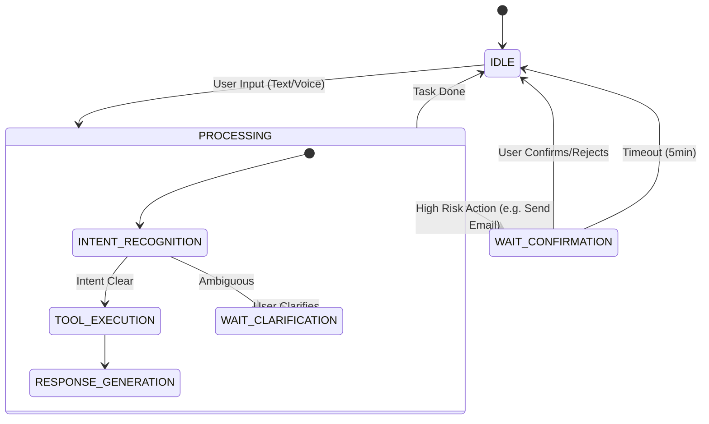

# 📐 WeChat OS 详细设计

> **版本**: v1.0 | **状态**: 规划中

## 1. 数据库设计 (Schema Design)

### 1.1 `users` 表更新
```sql
ALTER TABLE users 
ADD COLUMN wechat_openid VARCHAR(64),
ADD COLUMN wechat_unionid VARCHAR(64),
ADD COLUMN wechat_config JSONB DEFAULT '{}';

CREATE UNIQUE INDEX idx_users_wechat_openid ON users(wechat_openid);
```

`wechat_config` JSON 结构示例:
```json
{
  "morning_briefing_enabled": true,
  "morning_briefing_time": "08:00",
  "decision_push_enabled": true
}
```

### 1.2 `wechat_interactions` 表 (新建)
用于记录交互历史，辅助上下文理解。
```sql
CREATE TABLE wechat_interactions (
    id UUID PRIMARY KEY DEFAULT gen_random_uuid(),
    user_id UUID REFERENCES users(id),
    open_id VARCHAR(64) NOT NULL,
    msg_type VARCHAR(20) NOT NULL, -- 'text', 'voice', 'event', 'response'
    content TEXT, -- 用户输入或系统回复
    media_id VARCHAR(128), -- 语音/图片 ID
    intent VARCHAR(50), -- 识别出的意图 (e.g., 'query_email')
    created_at TIMESTAMP WITH TIME ZONE DEFAULT NOW()
);
```

## 2. API 接口设计

### 2.1 微信回调接口
*   **Path**: `POST /api/v1/wechat/callback`
*   **Auth**: Signature verification (WeChat standard)
*   **Request**: XML (Standard WeChat Message)
*   **Response**: XML (Passive Reply) or empty string (if async reply)

### 2.2 账号绑定接口 (Web 端)
*   **Path**: `GET /api/v1/wechat/qrcode`
*   **Response**:
    ```json
    {
      "ticket": "gQHi8DwAAAAAAAAAAS5odHRwOi8vd2VpeGluLnFxLmNvbS9xLzAy...",
      "expire_seconds": 600,
      "url": "http://weixin.qq.com/q/..."
    }
    ```
*   **Logic**: 调用微信 `qrcode/create` 接口生成带参数二维码 (`scene_str = user_id`).

### 2.3 绑定状态轮询 (Web 端)
*   **Path**: `GET /api/v1/wechat/bind-status`
*   **Response**: `{"bound": true, "nickname": "..."}`

## 3. 业务流程详解

### 3.1 语音指令处理流程 (Voice Command)
1.  **Receive**: `WeChatHandler` 收到 `MsgType=voice`。
2.  **Transcribe**: 
    *   若 XML 包含 `Recognition`，直接使用。
    *   否则，下载 AMR -> 转换 MP3 -> Whisper API -> Text。
3.  **Context Load**: 从 Redis 读取 `echomind:fsm:{openid}` 获取当前状态和历史上下文 (Last 5 turns)。
4.  **Intent Analysis (LLM)**:
    *   Input: `User Text` + `Context` + `Tools Definition`
    *   Output: `Tool Call` (e.g., `search_emails(query="from Alice", limit=1)`)
5.  **Execution**: 执行 `EmailService.Search(...)`。
6.  **Response Generation**:
    *   将搜索结果喂给 LLM，生成自然语言回复。
    *   若结果太长，生成“卡片消息”链接到 Web 端。
7.  **Send**: 调用 `CustomMessage.Send` 发送回复。

### 3.2 晨间简报生成流程 (Morning Briefing)
1.  **Trigger**: Cron Job (每天 08:00)。
2.  **Select Users**: 查询 `users` 表中 `wechat_config.morning_briefing_enabled = true` 的用户。
3.  **Data Gathering**:
    *   `CalendarService.GetTodayEvents(user_id)`
    *   `EmailService.GetUnreadHighPriority(user_id, since="last_night")`
    *   `TaskService.GetDueToday(user_id)`
4.  **Summarization**: LLM 生成简报文本 (Markdown/Text)。
5.  **Push**: 发送微信模板消息 / 客服消息。

## 4. 状态机 (FSM) 状态转移图



## 5. 错误处理
*   **识别失败**: 回复“抱歉，我没听清，请再说一遍。”
*   **服务超时**: 微信要求 5s 内响应。若处理超时，先回复空串（避免重试），然后通过客服接口异步推送结果。
*   **未绑定**: 若收到未绑定 OpenID 的消息，回复“请先在 EchoMind 网页端扫描二维码绑定账号。”
